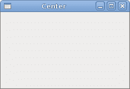
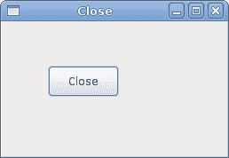
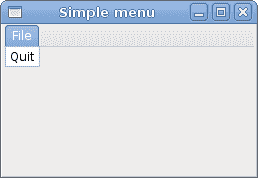
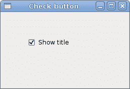
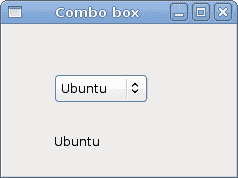

# FreeBASIC GTK 教程

> 原文： [http://zetcode.com/gui/fbgtk/](http://zetcode.com/gui/fbgtk/)

这是 FreeBASIC GTK 教程。 在本教程中，我们将使用 FreeBASIC 语言在 GTK 库中创建图形用户界面。 本教程适合初学者。 一旦了解了基础知识并且知道如何一起使用 GTK 和 FreeBASIC，您就可以继续从 [GTK+ 教程](/tutorials/gtktutorial/)中学习 GTK 库。

FreeBASIC 与与 GTK 一起使用的其他语言不同。 没有像 PyGTK 或 GTK# 这样的绑定。 在 FreeBASIC 中，我们直接在程序中调用 C 代码。 这样，FreeBASIC 与 C 语言紧密相连。

## FreeBASIC

FreeBASIC 是一种流行的 BASIC（初学者的通用符号指令代码）编译器。 它于 2004 年出现，受到 QuickBASIC 和 C 语言的影响。 FreeBASIC 是一个免费的开源 32 位 BASIC 编译器。 为了完全支持许多 C 库，添加了许多功能，如指针，预处理器，宏，而其他 BASIC 编译器中找不到这些功能。

## GTK

GTK 是用于创建图形用户界面的库。 该库是用 C 编程语言创建的。 GTK 库也称为 GIMP 工具包。 最初，该库是在开发 GIMP 图像处理程序时创建的。 从那时起，GTK 成为 Linux 和 BSD Unix 下最受欢迎的工具包之一。 如今，开源世界中的大多数 GUI 软件都是在 Qt 或 GTK 中创建的。 存在用于 C++ ，Python，Perl，Java，C# 和其他编程语言的语言绑定。

## 第一个例子

在我们的第一个代码示例中，我们将在屏幕上居中放置一个小窗口。

```basic
' ZetCode FreeBASIC GTK tutorial
'
' This program centers a window on 
' the screen
'
' author Jan Bodnar
' last modified July 2010
' website www.zetcode.com

#include once "gtk/gtk.bi"

#define NULL 0

Dim As GtkWidget Ptr win

gtk_init(NULL, NULL)

win = gtk_window_new(GTK_WINDOW_TOPLEVEL)
gtk_window_set_title(GTK_WINDOW(win), "Center")
gtk_widget_set_size_request(win, 250, 150)
gtk_window_set_position(GTK_WINDOW(win), GTK_WIN_POS_CENTER)

g_signal_connect(G_OBJECT(win), "destroy", _
    G_CALLBACK (@gtk_main_quit), NULL)

gtk_widget_show(win)
gtk_main()

END 0

```

此代码在屏幕上使窗口居中。 它是 FreeBASIC 和 C 代码的混合体。

```basic
#include once "gtk/gtk.bi"

```

这是从 FreeBASIC 运行 GTK 代码所需的头文件。

```basic
#define NULL 0

```

FreeBASIC 中没有内置的`NULL`值。 为了更类似于 GTK C 代码，我们定义了一个`NULL`值。

```basic
Dim As GtkWidget Ptr win

```

我们声明一个指向`GtkWidget`的指针。

```basic
gtk_init(NULL, NULL)

```

我们启动 GTK 库。

```basic
win = gtk_window_new(GTK_WINDOW_TOPLEVEL)

```

我们创建一个`GtkWidget`窗口。 窗口类型为`GTK_WINDOW_TOPLEVEL`。 顶层窗口具有标题栏和边框。 它们由窗口管理器管理。

```basic
gtk_window_set_title(GTK_WINDOW(win), "Center")
gtk_widget_set_size_request(win, 250, 150)
gtk_window_set_position(GTK_WINDOW(win), GTK_WIN_POS_CENTER)

```

这三行为窗口设置标题，调整窗口大小并将其放置在屏幕中央。

```basic
g_signal_connect(G_OBJECT(win), "destroy", _
    G_CALLBACK (@gtk_main_quit), NULL)

```

如果单击 x 标记，或按 `Alt + F4` 终止应用，则会发出破坏信号。 默认情况下，该窗口不对销毁信号做出反应。 我们必须通过将`destroy`信号连接到`gtk_main_quit()`函数来显式终止应用。 有两个重要角色。 下划线和`@`字符。 下划线是 FreeBASIC 中的换行符。 如果代码行超过一行，则必须使用它。 `@`字符为我们提供了`gtk_main_quit()`函数的地址。 在 C 语言中，函数名称是函数的地址。 在 FreeBASIC 中并非如此，这就是我们使用@字符的原因。

```basic
gtk_widget_show(win)

```

该窗口已在内存中创建。 现在我们使用`gtk_widget_show`功能在屏幕上显示窗口。

```basic
gtk_main()

```

我们进入应用的主循环。 从这一点开始，应用就坐下来等待事件发生。

```basic
END 0

```

我们完成了 FreeBASIC 代码。

```basic
$ fbc simple.bas
$ ./simple

```

我们编译并运行该示例。



图：简单 example

## 关闭按钮

在第二个示例中，我们在窗口上放置一个按钮小部件。 首先，我们在窗口上放置一个固定的容器，然后在该容器上放置按钮。 单击该按钮将终止该应用。

```basic
' ZetCode FreeBASIC GTK tutorial
'
' In this example, we place a close
' button on the window. Clicking on the
' button will terminate the application.
'
' author Jan Bodnar
' last modified July 2010
' website www.zetcode.com

#include once "gtk/gtk.bi"

#define NULL 0

Dim As GtkWidget Ptr win
Dim As GtkWidget Ptr fixed
Dim As GtkWidget Ptr button

gtk_init(NULL, NULL)

win = gtk_window_new(GTK_WINDOW_TOPLEVEL)
gtk_window_set_title(GTK_WINDOW(win), "Close")
gtk_widget_set_size_request(win, 250, 150)
gtk_window_set_position(GTK_WINDOW(win), GTK_WIN_POS_CENTER)

g_signal_connect(G_OBJECT(win), "destroy", _
    G_CALLBACK (@gtk_main_quit), NULL)

fixed = gtk_fixed_new()
gtk_container_add(GTK_CONTAINER(win), fixed)

button = gtk_button_new_with_label("Close")
gtk_widget_set_size_request(button, 80, 35)

gtk_fixed_put(GTK_FIXED(fixed), button, 50, 50)

g_signal_connect(G_OBJECT(button), "clicked", _
    G_CALLBACK (@gtk_main_quit), NULL)

gtk_widget_show_all(win)

gtk_main()

END 0

```

这是关闭按钮示例的源代码。

```basic
Dim As GtkWidget Ptr win
Dim As GtkWidget Ptr fixed
Dim As GtkWidget Ptr button

```

我们声明三个变量。 一个用于顶层窗口，它是 GUI 应用的基本框架。 一个用于容器。 容器是一种特殊的小部件。 它是不可见的。 其唯一目的是包含其他小部件。 在我们的例子中，是按钮小部件。

```basic
fixed = gtk_fixed_new()
gtk_container_add(GTK_CONTAINER(win), fixed)

```

这两行创建一个容器小部件，并将其放置在窗口小部件内。

```basic
button = gtk_button_new_with_label("Close")
gtk_widget_set_size_request(button, 80, 35)

```

我们创建一个按钮小部件，并将其设置为`80x35`像素。

```basic
gtk_fixed_put(GTK_FIXED(fixed), button, 50, 50)

```

我们在`x = 50`，`y = 50`坐标处将一个按钮放入容器。 这称为绝对定位。 它适合于小示例，但在更复杂的程序中，我们使用布局管理器。

```basic
g_signal_connect(G_OBJECT(button), "clicked", _
    G_CALLBACK (@gtk_main_quit), NULL)

```

当我们点击按钮时，发出点击的信号。 `g_signal_connect()`函数将回调（在我们的情况下为内置`gtk_main_quit()`函数）连接到按钮小部件发出的`clicked`信号。

```basic
gtk_widget_show_all(win)

```

我们创建了三个小部件。 我们可以在每个窗口上调用`gtk_widget_show()`，或者在窗口小部件上调用`gtk_widget_show_all()`，该窗口小部件一步显示所有三个小部件。



Figure: Close button

## 显示图像

在以下示例中，我们在窗口上显示图像。

```basic
' ZetCode FreeBASIC GTK tutorial
'
' This example shows an image on 
' the window
'
' author Jan Bodnar
' last modified July 2010
' website www.zetcode.com

#include once "gtk/gtk.bi"
#include once "gtk/gdk.bi"

#define NULL 0

Dim As GtkWidget Ptr win
Dim As GtkWidget Ptr image

gtk_init(NULL, NULL)

win = gtk_window_new(GTK_WINDOW_TOPLEVEL)
gtk_window_set_title(GTK_WINDOW(win), "Red Rock")
gtk_window_set_position(GTK_WINDOW(win), GTK_WIN_POS_CENTER)

g_signal_connect(G_OBJECT(win), "destroy", _
    G_CALLBACK (@gtk_main_quit), NULL)

gtk_window_set_resizable(GTK_WINDOW(win), FALSE)
gtk_container_set_border_width(GTK_CONTAINER(win), 2)

image = gtk_image_new_from_file("redrock.png")
gtk_container_add(GTK_CONTAINER(win), image)

gtk_widget_show_all(win)

gtk_main()

END 0

```

我们在窗口上显示图像。

```basic
Dim As GtkWidget Ptr win
Dim As GtkWidget Ptr image

```

在此示例中，我们只有两个小部件。 窗口小部件和图像小部件。

```basic
gtk_window_set_resizable(GTK_WINDOW(win), FALSE)

```

窗口无法调整大小。 请注意，我们没有为窗口设置大小。 在这种情况下，窗口将自动适合图像的大小。

```basic
gtk_container_set_border_width(GTK_CONTAINER(win), 2)

```

我们在容器周围留出一些空白空间。

```basic
image = gtk_image_new_from_file("redrock.png")
gtk_container_add(GTK_CONTAINER(win), image)

```

我们从 PNG 文件创建图像小部件。 我们将图像放置在窗口上。 窗口本身就是一个简单的容器。 它可以只包含一个小部件。

## 简单菜单示例

在下一个代码示例中，我们将创建一个简单的菜单。

```basic
' ZetCode FreeBASIC GTK tutorial
'
' This example shows a simple menu
'
' author Jan Bodnar
' last modified July 2010
' website www.zetcode.com

#include once "gtk/gtk.bi"

#define NULL 0

Dim As GtkWidget Ptr win
Dim As GtkWidget Ptr vbox

Dim As GtkWidget Ptr menubar
Dim As GtkWidget Ptr fmenu
Dim As GtkWidget Ptr fmi
Dim As GtkWidget Ptr qmi

gtk_init(NULL, NULL)

win = gtk_window_new(GTK_WINDOW_TOPLEVEL)
gtk_window_set_title(GTK_WINDOW(win), "Simple menu")
gtk_widget_set_size_request(win, 250, 150)
gtk_window_set_position(GTK_WINDOW(win), GTK_WIN_POS_CENTER)

g_signal_connect(G_OBJECT(win), "destroy", _
    G_CALLBACK (@gtk_main_quit), NULL)

vbox = gtk_vbox_new(FALSE, 0)
gtk_container_add(GTK_CONTAINER(win), vbox)

menubar = gtk_menu_bar_new()
fmenu = gtk_menu_new()

fmi = gtk_menu_item_new_with_label("File")
qmi = gtk_menu_item_new_with_label("Quit")

gtk_menu_item_set_submenu(GTK_MENU_ITEM(fmi), fmenu)
gtk_menu_shell_append(GTK_MENU_SHELL(fmenu), qmi)
gtk_menu_shell_append(GTK_MENU_SHELL(menubar), fmi)
gtk_box_pack_start(GTK_BOX(vbox), menubar, FALSE, FALSE, 0)

g_signal_connect(G_OBJECT(qmi), "activate", _
    G_CALLBACK(@gtk_main_quit), NULL)

gtk_widget_show_all(win)

gtk_main()

END 0

```

这些代码行创建一个简单的菜单。 它只有一个菜单项，选择该菜单项将终止应用。 创建菜单栏有点令人困惑。 我们必须记住，菜单栏和菜单都来自同一个窗口小部件，即菜单外壳。 菜单项仅是菜单的有效子项。 它们还用于实现子菜单。

```basic
Dim As GtkWidget Ptr win
Dim As GtkWidget Ptr vbox

Dim As GtkWidget Ptr menubar
Dim As GtkWidget Ptr fmenu
Dim As GtkWidget Ptr fmi
Dim As GtkWidget Ptr qmi

```

我们有六个小部件的六个变量。 一个小部件是一个垂直框，它将设置布局。 菜单栏是一个水平小部件，我们在其上放置菜单。 菜单包含菜单项，这些菜单项会执行某些操作。 就像保存文档或终止应用一样。

```basic
vbox = gtk_vbox_new(FALSE, 0)
gtk_container_add(GTK_CONTAINER(win), vbox)
gtk_box_pack_start(GTK_BOX(vbox), menubar, FALSE, FALSE, 3)

```

我们创建一个垂直框，使其成为顶层窗口的容器。 `gtk_vbox_new()`函数的第一个参数称为同质参数。 如果设置为`TRUE`，则一个框中的所有小部件都具有相等的空间分配。 我们不希望这样，因为菜单栏仅占用窗口的一小部分。 第二个参数是子项之间的空间。

```basic
menubar = gtk_menu_bar_new()
fmenu = gtk_menu_new()

```

在这段代码中，我们创建一个菜单栏和一个菜单。

```basic
fmi = gtk_menu_item_new_with_label("File")
qmi = gtk_menu_item_new_with_label("Quit")

```

创建两个菜单项。

```basic
gtk_menu_item_set_submenu(GTK_MENU_ITEM(fmi), fmenu)

```

此代码行实现了文件菜单。 逻辑是菜单栏是菜单外壳。 文件菜单也是菜单外壳。 这就是为什么我们将文件菜单视为子菜单或子外壳。

```basic
gtk_menu_shell_append(GTK_MENU_SHELL(fmenu), qmi)
gtk_menu_shell_append(GTK_MENU_SHELL(menubar), fmi)

```

菜单项通过调用`gtk_menu_shell_append()`功能实现。 菜单项将附加到菜单外壳。 在我们的情况下，退出菜单项被附加到文件菜单，并且文件菜单项也被附加到菜单栏。

```basic
gtk_box_pack_start(GTK_BOX(vbox), menubar, FALSE, FALSE, 0)

```

`gtk_box_pack_start()`函数调用将菜单栏添加到垂直框中。 第一个参数是容器，我们在其中放置子窗口小部件。 第二个参数是子窗口小部件。 第三个参数是`expand`参数。 扩展参数设置为`TRUE`的子代将占用垂直框的额外空间。 这些额外的空间将在它们之间平均分配。 我们不希望菜单栏占用任何额外的空间，因此我们将`expand`参数设置为`FALSE`。 如果将扩展设置为`FALSE`，则第四个参数无效。 最后一个参数是`padding`，它在子小部件之间增加了一些额外的空间。 我们不添加任何额外的空间。

```basic
g_signal_connect(G_OBJECT(qmi), "activate", _
    G_CALLBACK(@gtk_main_quit), NULL)

```

通过选择退出菜单项，我们终止了该应用。



图：简单菜单 example

## 输入信号

以下示例将说明我们如何对输入信号做出反应。 当我们使用鼠标指针进入小部件的区域时，将发出`enter`信号。

```basic
' ZetCode FreeBASIC GTK tutorial
'
' In this code example, we react to the
' enter signal by changing the background
' color of a button widget
'
' author Jan Bodnar
' last modified July 2010
' website www.zetcode.com

#include once "gtk/gtk.bi"

#define NULL 0

Dim As GtkWidget Ptr win
Dim As GtkWidget Ptr fixed
Dim As GtkWidget Ptr btn

Sub enter_button Cdecl (Byval widget As GtkWidget Ptr, _
    Byval dat As gpointer)

  Dim col As GdkColor

  col.red = 27000
  col.green = 30325
  col.blue = 34181
  gtk_widget_modify_bg(widget, GTK_STATE_PRELIGHT, @col)

End Sub

gtk_init(NULL, NULL)

win = gtk_window_new(GTK_WINDOW_TOPLEVEL)
gtk_window_set_title(GTK_WINDOW(win), "enter signal")
gtk_widget_set_size_request(win, 230, 150)
gtk_window_set_position(GTK_WINDOW(win), GTK_WIN_POS_CENTER)

g_signal_connect(G_OBJECT(win), "destroy", _
    G_CALLBACK (@gtk_main_quit), NULL)

fixed = gtk_fixed_new()
gtk_container_add(GTK_CONTAINER(win), fixed)

btn = gtk_button_new_with_label("Button")
gtk_widget_set_size_request(btn, 80, 35)
gtk_fixed_put(GTK_FIXED(fixed), btn, 50, 50)

g_signal_connect(G_OBJECT(btn), "enter", _
    G_CALLBACK(@enter_button), NULL)

gtk_widget_show_all(win)

gtk_main()

END 0

```

我们将按钮小部件放入固定的容器中。 当我们输入按钮小部件的区域时，将调用`enter_button()`子例程。 在子例程中，我们更改按钮的背景色。

```basic
Sub enter_button Cdecl (Byval widget As GtkWidget Ptr, _
    Byval dat As gpointer)
...
End Sub

```

这是`enter_button()`子例程，我们在其中对`enter`信号做出反应。 `Cdecl`关键字指定子例程的调用约定。 在此调用约定中，所有参数都以列出它们的相反顺序（即从右到左）传递。 对于我们而言，这并不重要。

```basic
Dim col As GdkColor

```

我们创建一个本地`GdkColor`变量。 它是用于描述 GTK 应用中的颜色的结构。

```basic
col.red = 27000
col.green = 30325
col.blue = 34181

```

在这里，我们设置颜色。

```basic
gtk_widget_modify_bg(widget, GTK_STATE_PRELIGHT, @col)

```

`gtk_widget_modify_bg()`设置处于特定状态的小部件的背景颜色。 在我们的情况下，状态为`GTK_STATE_PRELIGHT`，这是鼠标指针悬停在小部件上方时的状态。 第三个参数是指向颜色结构的指针。

```basic
g_signal_connect(G_OBJECT(btn), "enter", _
    G_CALLBACK(@enter_button), NULL)

```

在这里，我们将`enter_button()`子例程连接到按钮小部件发出的`enter`信号。

## 复选按钮示例

在下面的示例中，我们将一个检查按钮放入固定容器中。 我们将通过选中和取消选中复选按钮来显示和隐藏窗口的标题。

```basic
' ZetCode FreeBASIC GTK tutorial
'
' This example a check button widget
' toggles the title of the window
'
' author Jan Bodnar
' last modified July 2010
' website www.zetcode.com

#include once "gtk/gtk.bi"

#define NULL 0

Dim As GtkWidget Ptr win
Dim As GtkWidget Ptr cbtn
Dim As GtkWidget Ptr frame

Sub toggle_title Cdecl (Byval widget As GtkWidget Ptr, _
    Byval win As gpointer)

  If gtk_toggle_button_get_active(GTK_TOGGLE_BUTTON(widget)) Then
      gtk_window_set_title(win, "Check button")
  Else 
      gtk_window_set_title(win, "")
  End If
End Sub

gtk_init(NULL, NULL)

win = gtk_window_new(GTK_WINDOW_TOPLEVEL)
gtk_window_set_title(GTK_WINDOW(win), "Check button")
gtk_widget_set_size_request(win, 250, 150)
gtk_window_set_position(GTK_WINDOW(win), GTK_WIN_POS_CENTER)

g_signal_connect(G_OBJECT(win), "destroy", _
    G_CALLBACK (@gtk_main_quit), NULL)

frame = gtk_fixed_new()
gtk_container_add(GTK_CONTAINER(win), frame)

cbtn = gtk_check_button_new_with_label("Show title")
gtk_toggle_button_set_active(GTK_TOGGLE_BUTTON(cbtn), TRUE)
gtk_fixed_put(GTK_FIXED(frame), cbtn, 50, 50)

g_signal_connect(cbtn, "clicked", _
    G_CALLBACK(@toggle_title), cast(gpointer, win))

gtk_widget_show_all(win)

gtk_main()

END 0

```

这是检查按钮示例的代码。

```basic
Sub toggle_title Cdecl (Byval widget As GtkWidget Ptr, _
    Byval win As gpointer)

```

如果单击复选按钮，我们将调用`toggle_title()`函数。 在这种情况下，我们需要指向两个对象的指针。 我们需要一个指向检查按钮的指针来确定它是否被检查。 我们还需要指向窗口的指针来设置或取消设置其标题。

```basic
If gtk_toggle_button_get_active(GTK_TOGGLE_BUTTON(widget)) Then
    gtk_window_set_title(win, "Check button")
Else 
    gtk_window_set_title(win, "")

```

我们使用`gtk_toggle_button_get_active()`功能确定检查按钮的状态。 我们使用`gtk_window_set_title()`功能设置窗口的标题。

```basic
g_signal_connect(cbtn, "clicked", _
    G_CALLBACK(@toggle_title), cast(gpointer, win))

```

`g_signal_connect()`的最后一个参数通常是一些我们要传递给回调函数的数据。 这次，我们需要将另一个指针传递给窗口对象。 在这种情况下，我们需要进行铸造。 这是因为函数需要`gpointer`，并且窗口是`GtkWidget`类型。 FreeBASIC 有一个`case`关键字来进行转换。



图：复选按钮 example

## `ComboBox`示例

在 FreeBASIC GTK 教程的最后一个示例中，我们将展示组合框小部件。

```basic
' ZetCode FreeBASIC GTK tutorial
'
' In this example, we present the combo box
' widget
'
' author Jan Bodnar
' last modified July 2010
' website www.zetcode.com

#include once "gtk/gtk.bi"

#define NULL 0

Dim As GtkWidget Ptr win
Dim As GtkWidget Ptr combo
Dim As GtkWidget Ptr fixed
Dim As GtkWidget Ptr label

Sub combo_selected Cdecl (Byval widget As GtkWidget Ptr, _
    Byval win As gpointer)

  Dim As gchar Ptr text

  text =  gtk_combo_box_get_active_text(GTK_COMBO_BOX(widget))
  gtk_label_set_text(GTK_LABEL(win), text)
  g_free(text)
End Sub

gtk_init(NULL, NULL)

win = gtk_window_new(GTK_WINDOW_TOPLEVEL)
gtk_window_set_title(GTK_WINDOW(win), "Check button")
gtk_widget_set_size_request(win, 230, 150)
gtk_window_set_position(GTK_WINDOW(win), GTK_WIN_POS_CENTER)

g_signal_connect(G_OBJECT(win), "destroy", _
    G_CALLBACK (@gtk_main_quit), NULL)

fixed = gtk_fixed_new()

combo = gtk_combo_box_new_text()
gtk_combo_box_append_text(GTK_COMBO_BOX(combo), "Ubuntu")
gtk_combo_box_append_text(GTK_COMBO_BOX(combo), "Mandriva")
gtk_combo_box_append_text(GTK_COMBO_BOX(combo), "Fedora")
gtk_combo_box_append_text(GTK_COMBO_BOX(combo), "Mint")
gtk_combo_box_append_text(GTK_COMBO_BOX(combo), "Gentoo")
gtk_combo_box_append_text(GTK_COMBO_BOX(combo), "Debian")

gtk_fixed_put(GTK_FIXED(fixed), combo, 50, 50)
gtk_container_add(GTK_CONTAINER(win), fixed)

label = gtk_label_new("-")
gtk_fixed_put(GTK_FIXED(fixed), label, 50, 110)

g_signal_connect(G_OBJECT(combo), "changed", _
    G_CALLBACK(@combo_selected), cast(gpointer, label))

gtk_widget_show_all(win)

gtk_main()

END 0

```

我们有两个小部件：组合框和标签。 从组合框中选择的选项将显示在标签中。

```basic
Dim As gchar Ptr text

text =  gtk_combo_box_get_active_text(GTK_COMBO_BOX(widget))
gtk_label_set_text(GTK_LABEL(win), text)
g_free(text)

```

在这些行中，我们从组合框中检索文本并将其设置为标签。 我们使用指向`gchar`的指针。 它是`glib`库的基本类型，它是 GTK 库的基础。 我们释放从组合框中检索文本时创建的内存。

```basic
combo = gtk_combo_box_new_text()
gtk_combo_box_append_text(GTK_COMBO_BOX(combo), "Ubuntu")
gtk_combo_box_append_text(GTK_COMBO_BOX(combo), "Mandriva")
...

```

将创建组合框窗口小部件并填充数据。

```basic
label = gtk_label_new("-")
gtk_fixed_put(GTK_FIXED(fixed), label, 50, 110)

```

标签窗口小部件已创建并放入容器中。

```basic
g_signal_connect(G_OBJECT(combo), "changed", _
    G_CALLBACK(@combo_selected), cast(gpointer, label))

```

我们将`combo_selected()`功能插入到组合框的`changed`信号中。 我们再次进行铸造。



Figure: A combo box widget

这是 FreeBASIC GTK 教程。 我们有几个示例，这些示例说明了如何使用 FreeBASIC 语言和 GTK 库。 这些示例清楚地表明，我们混合使用 FreeBASIC 和 C 语言。 一旦知道如何将它们放在一起，就可以进行 GTK 编程。 有关 GTK 库的更多信息，请参见。

[Tweet](https://twitter.com/share)