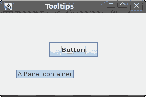
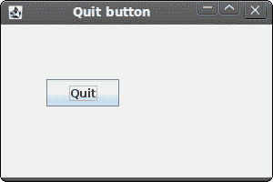

# Jython Swing 简介

> 原文： [http://zetcode.com/gui/jythonswing/introduction/](http://zetcode.com/gui/jythonswing/introduction/)

在 Jython Swing 教程的这一部分中，我们将介绍 Swing 工具包并使用 Jython 编程语言创建第一个程序。

本教程的目的是帮助您开始使用带有 Jython 语言的 Swing 工具包。 可以在此处下载本教程中使用的图像。 我使用了 Gnome 项目的 Tango 图标包中的一些图标。

## 关于

Swing 库是 Java 编程语言的官方 Java GUI 工具箱。 它用于使用 Java 创建图形用户界面。 Swing 是一个高级 GUI 工具箱。 它具有丰富的组件集。 从基本的按钮，标签，滚动条到高级的组件（例如树和表格）。 Swing 本身是用 Java 编写的。 Swing 也可用于其他语言。 例如 Jython，JRuby，Groovy 或 Scala。

Jython 是用 Java 编写的 Python 编程语言的实现。 Jython 可以导入任何 Java 类。

执行本教程中的示例有两种基本方法。 一种方法是安装 Python NetBeans 插件。 它还包含 Jython。 创建新的 Python 项目时，请确保选择 Jython 平台。

另一种方法是从 [jython.org](http://jython.org) 网站下载安装程序。

```py
$ java -jar jython_installer-2.5.2rc2.jar 

```

我们安装了 Jython。 您将经历一系列对话框。

```py
$ java -jar jython.jar simple.py

```

我们已经在选定目录中安装了 Jython。 在此目录中，我们将找到`jython.jar`文件，该文件用于执行 Jython 脚本。

```py
$ cat /usr/local/bin/jython 
#!/bin/bash

/home/vronskij/bin/jdk1.6.0_21/bin/java -jar /home/vronskij/bin/jython/jython.jar $1

```

（可选）我们可以创建一个 bash 文件，该文件将自动启动我们的 Jython 脚本。 然后，我们可以将`#!/usr/bin/local/jython`路径放入脚本。

## 简单的例子

在第一个示例中，我们将在屏幕上显示一个基本窗口。

```py
#!/usr/local/bin/jython
# -*- coding: utf-8 -*-

"""
ZetCode Jython Swing tutorial

This example shows a simple 
window on the screen.

author: Jan Bodnar
website: www.zetcode.com
last modified: November 2010
"""

from javax.swing import JFrame

class Example(JFrame):

    def __init__(self):
        super(Example, self).__init__()

        self.initUI()

    def initUI(self):

        self.setTitle("Simple")
        self.setSize(250, 200)
        self.setDefaultCloseOperation(JFrame.EXIT_ON_CLOSE)
        self.setLocationRelativeTo(None)
        self.setVisible(True)

if __name__ == '__main__':
    Example()

```

尽管这段代码很小，但是应用窗口可以做很多事情。 可以调整大小，最大化，最小化。 随之而来的所有复杂性对应用程序员都是隐藏的。

```py
from javax.swing import JFrame

```

我们导入一个`JFrame`类。 `JFrame`是带有标题和边框的顶层窗口。

```py
self.initUI()

```

我们将用户界面的创建委托给`initUI()`方法。

```py
self.setTitle("Simple")

```

我们使用`setTitle()`方法设置窗口的标题。

```py
self.setSize(250, 200)

```

我们设置窗口的大小。

```py
self.setDefaultCloseOperation(JFrame.EXIT_ON_CLOSE)

```

如果单击标题栏的关闭按钮，此方法可确保窗口终止。 默认情况下，没有任何反应。

```py
self.setLocationRelativeTo(None)

```

我们将窗口置于屏幕中央。

```py
self.setVisible(True)

```

最后，窗口显示在屏幕上。

## 工具提示

工具提示是一个小的矩形窗口，它提供有关对象的简短信息。 它通常是一个 GUI 组件。 它是应用帮助系统的一部分。

```py
#!/usr/local/bin/jython
# -*- coding: utf-8 -*-

"""
ZetCode Jython Swing tutorial

This code shows a tooltip on
a window and a button.

author: Jan Bodnar
website: www.zetcode.com
last modified: November 2010
"""

from javax.swing import JButton
from javax.swing import JFrame
from javax.swing import JPanel

class Example(JFrame):
    def __init__(self):
        super(Example, self).__init__()

        self.initUI()

    def initUI(self):

        panel = JPanel()
        self.getContentPane().add(panel)

        panel.setLayout(None)
        panel.setToolTipText("A Panel container")

        button = JButton("Button")
        button.setBounds(100, 60, 100, 30)
        button.setToolTipText("A button component")

        panel.add(button)

        self.setTitle("Tooltips")
        self.setSize(300, 200)
        self.setDefaultCloseOperation(JFrame.EXIT_ON_CLOSE)
        self.setLocationRelativeTo(None)
        self.setVisible(True)

if __name__ == '__main__':
    Example()

```

在示例中，我们为框架和按钮设置工具提示。

```py
panel = JPanel()
self.getContentPane().add(panel)

```

我们创建一个`JPanel`组件。 它是一个通用的轻量级容器。 `JFrame`有一个区域，您可以在其中放置名为内容窗格的组件。 我们将面板放入此窗格。

```py
panel.setLayout(None)

```

默认情况下，`JPanel`具有一个`FlowLayout`管理器。 布局管理器用于将小部件放置在容器上。 如果我们调用`setLayout(None)`，则可以绝对定位组件。 为此，我们使用`setBounds()`方法。

```py
panel.setToolTipText("A Panel container")

```

要启用工具提示，我们调用`setTooltipText()`方法。



图：工具提示

## 退出按钮

在本节的最后一个示例中，我们将创建一个退出按钮。 当我们按下此按钮时，应用终止。

```py
#!/usr/local/bin/jython
# -*- coding: utf-8 -*-

"""
ZetCode Jython Swing tutorial

This program creates a quit
button. When we press the button,
the application terminates.

author: Jan Bodnar
website: www.zetcode.com
last modified: November 2010
"""

from java.lang import System
from javax.swing import JButton
from javax.swing import JFrame
from javax.swing import JPanel

class Example(JFrame):
    def __init__(self):
        super(Example, self).__init__()

        self.initUI()

    def initUI(self):

        panel = JPanel()
        self.getContentPane().add(panel)

        panel.setLayout(None)

        qbutton = JButton("Quit", actionPerformed=self.onQuit)
        qbutton.setBounds(50, 60, 80, 30)

        panel.add(qbutton)

        self.setTitle("Quit button")
        self.setSize(300, 200)
        self.setDefaultCloseOperation(JFrame.EXIT_ON_CLOSE)
        self.setLocationRelativeTo(None)
        self.setVisible(True)

    def onQuit(self, e):
        System.exit(0)

if __name__ == '__main__':
    Example()

```

我们在窗口上放置一个`JButton`。 我们将向该按钮添加一个动作监听器。

```py
qbutton = JButton("Quit", actionPerformed=self.onQuit)
qbutton.setBounds(50, 60, 80, 30)

```

在这里，我们创建一个按钮。 我们通过调用`setBounds()`方法对其进行定位。 `actionPerformed`参数指定单击按钮时调用的方法。

```py
def onQuit(self, e):
    System.exit(0)

```

`onQuit() method`退出应用。



图：退出按钮

本节介绍了使用 Jython 语言的 Swing 工具包。