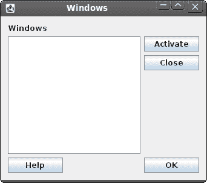

# Jython Swing 中的布局管理

> 原文： [http://zetcode.com/gui/jythonswing/layout/](http://zetcode.com/gui/jythonswing/layout/)

在 Jython Swing 编程教程的这一部分中，我们将介绍布局管理器。

在设计应用的 GUI 时，我们决定要使用哪些组件以及如何在应用中组织这些组件。 为了组织我们的组件，我们使用专门的不可见对象，称为布局管理器。 Swing 工具箱包含两种组件：容器和子组件。 容器将子项分组为合适的布局。 要创建布局，我们使用布局管理器。

## 绝对定位

在大多数情况下，程序员应使用布局管理器。 在某些情况下，我们可以使用绝对定位。 在绝对定位中，程序员以像素为单位指定每个小部件的位置和大小。 如果我们调整窗口大小，则小部件的大小和位置不会改变。 在各种平台上，应用看起来都不同，在 Linux 上看起来不错，在 Mac OS 上看起来不太正常。 在应用中更改字体可能会破坏布局。 如果将应用翻译成另一种语言，则必须重做布局。 对于所有这些问题，仅在有理由时才使用绝对定位。

```py
#!/usr/local/bin/jython
# -*- coding: utf-8 -*-

"""
ZetCode Jython Swing tutorial

In this program, we lay out widgets
using absolute positioning

author: Jan Bodnar
website: www.zetcode.com
last modified: November 2010
"""

from java.awt import Color
from javax.swing import ImageIcon
from javax.swing import JFrame
from javax.swing import JPanel
from javax.swing import JLabel

class Example(JFrame):

    def __init__(self):
        super(Example, self).__init__()

        self.initUI()

    def initUI(self):

        panel = JPanel()
        panel.setLayout(None)
        panel.setBackground(Color(66, 66, 66))
        self.getContentPane().add(panel)

        rot = ImageIcon("rotunda.jpg")
        rotLabel = JLabel(rot)
        rotLabel.setBounds(20, 20, rot.getIconWidth(), rot.getIconHeight())

        min = ImageIcon("mincol.jpg")
        minLabel = JLabel(min)
        minLabel.setBounds(40, 160, min.getIconWidth(), min.getIconHeight())

        bar = ImageIcon("bardejov.jpg")
        barLabel = JLabel(bar)
        barLabel.setBounds(170, 50, bar.getIconWidth(), bar.getIconHeight())

        panel.add(rotLabel)
        panel.add(minLabel)
        panel.add(barLabel)

        self.setTitle("Absolute")
        self.setDefaultCloseOperation(JFrame.EXIT_ON_CLOSE)
        self.setSize(350, 300)
        self.setLocationRelativeTo(None)
        self.setVisible(True)

if __name__ == '__main__':
    Example()

```

在此示例中，我们使用绝对定位显示了三幅图像。

```py
panel.setLayout(None)

```

Swing 中的容器已经具有默认的布局管理器。 `JPanel`具有`FlowLayout`管理器作为其默认布局管理器。 我们将`setLayout()`方法与无参数一起使用，以删除默认的布局管理器，而改用绝对定位。

```py
rot = ImageIcon("rotunda.jpg")
rotLabel = JLabel(rot)
rotLabel.setBounds(20, 20, rot.getIconWidth(), rot.getIconHeight())

```

我们创建一个`ImageIcon`对象。 我们将图标放入`JLabel`组件中以显示它。 然后，我们使用`setBounds()`方法将标签放置在面板上。 前两个参数是标签的 x，y 位置。 第 3 和第 4 个参数是图标的宽度和高度。

```py
panel.add(rotLabel)

```

我们将标签添加到面板容器中。


Figure: Absolute positioning

## 按钮示例

在下面的示例中，我们将在窗口的右下角放置两个按钮。

```py
#!/usr/local/bin/jython
# -*- coding: utf-8 -*-

"""
ZetCode Jython Swing tutorial

In this program, use box layouts
to position two buttons in the
bottom right corner of the window

author: Jan Bodnar
website: www.zetcode.com
last modified: November 2010
"""

from java.awt import Dimension

from javax.swing import JButton
from javax.swing import JFrame
from javax.swing import JPanel
from javax.swing import BoxLayout
from javax.swing import Box

class Example(JFrame):

    def __init__(self):
        super(Example, self).__init__()

        self.initUI()

    def initUI(self):

        basic = JPanel()
        basic.setLayout(BoxLayout(basic, BoxLayout.Y_AXIS))
        self.add(basic)

        basic.add(Box.createVerticalGlue())

        bottom = JPanel()
        bottom.setAlignmentX(1.0)
        bottom.setLayout(BoxLayout(bottom, BoxLayout.X_AXIS))

        okButton = JButton("OK")
        closeButton = JButton("Close")

        bottom.add(okButton)
        bottom.add(Box.createRigidArea(Dimension(5, 0)))
        bottom.add(closeButton)
        bottom.add(Box.createRigidArea(Dimension(15, 0)))

        basic.add(bottom)
        basic.add(Box.createRigidArea(Dimension(0, 15)))

        self.setTitle("Buttons")
        self.setDefaultCloseOperation(JFrame.EXIT_ON_CLOSE)
        self.setSize(300, 150)
        self.setLocationRelativeTo(None)
        self.setVisible(True)

if __name__ == '__main__':
    Example()

```

我们将创建两个面板。 基本面板具有垂直框布局。 底部面板有一个水平面板。 我们将在基础面板中放置一个底部面板。 我们将右对齐底部面板。 窗口顶部和底部面板之间的空间是可扩展的。 这是通过垂直胶水完成的。

```py
basic = JPanel()
basic.setLayout(BoxLayout(basic, BoxLayout.Y_AXIS))
...

bottom = JPanel()
...
bottom.setLayout(BoxLayout(bottom, BoxLayout.X_AXIS))

```

基本面板具有垂直框布局。 底部面板具有水平框布局。

```py
bottom.setAlignmentX(1.0)

```

底部面板右对齐。

```py
basic.add(Box.createVerticalGlue())

```

我们创建一个垂直胶水。 胶水是垂直可扩展的白色空间，它将带有按钮的水平框推到底部。

```py
okButton = JButton("OK")
closeButton = JButton("Close")

```

这是两个将进入窗口右下角的按钮。

```py
bottom.add(okButton)
bottom.add(Box.createRigidArea(Dimension(5, 0)))

```

我们将“确定”按钮放入水平框中。 我们在按钮旁边放置了一些刚性空间。 这样两个按钮之间会有一些空间。

```py
basic.add(Box.createRigidArea(Dimension(0, 15)))

```

我们在按钮和窗口的边框之间留出一些空间。


Figure: Buttons example

## Windows 示例

以下示例使用`GroupLayout`管理器创建 Windows 对话框。 该对话框来自 JDeveloper 应用。

`GroupLayout`管理器将布局的创建分为两个步骤。 第一步，我们沿着水平轴布置组件。 在第二步中，我们沿垂直轴布置组件。 这在布局管理器中是一个不寻常的想法，但效果很好。

有两种类型的安排：顺序安排和并行安排。 在两种布局中，我们都可以顺序或并行排列组件。 在水平布局中，一行组件称为顺序组。 一列组件称为并行组。 在垂直布局中，一列组件称为顺序组。 一排组件称为并行组。 您必须正确理解这些定义才能与`GroupLayout`管理器一起使用。

```py
#!/usr/local/bin/jython
# -*- coding: utf-8 -*-

"""
ZetCode Jython Swing tutorial

This code lays out components
using the GroupLayout manager

author: Jan Bodnar
website: www.zetcode.com
last modified: November 2010
"""

from java.awt import Dimension
from java.awt import Color

from javax.swing import JButton
from javax.swing import SwingConstants
from javax.swing import JFrame
from javax.swing import JLabel
from javax.swing import JTextArea
from javax.swing import BorderFactory
from javax.swing import GroupLayout

class Example(JFrame):

    def __init__(self):
        super(Example, self).__init__()

        self.initUI()

    def initUI(self):

        layout = GroupLayout(self.getContentPane())
        self.getContentPane().setLayout(layout)
        layout.setAutoCreateGaps(True)
        layout.setAutoCreateContainerGaps(True)

        self.setPreferredSize(Dimension(350, 300))

        windows = JLabel("Windows")
        area = JTextArea()
        area.setEditable(False)
        area.setBorder(BorderFactory.createLineBorder(Color.gray))
        activate = JButton("Activate")
        close = JButton("Close")
        help = JButton("Help")
        ok = JButton("OK")

        layout.setHorizontalGroup(layout.createSequentialGroup()
            .addGroup(layout.createParallelGroup()
                .addComponent(windows)
                .addComponent(area)
                .addComponent(help))
            .addGroup(layout.createParallelGroup()
                .addComponent(activate)
                .addComponent(close)
                .addComponent(ok))
        )

        layout.setVerticalGroup(layout.createSequentialGroup()
            .addComponent(windows)
            .addGroup(layout.createParallelGroup()
                .addComponent(area)
                .addGroup(layout.createSequentialGroup()
                    .addComponent(activate)
                    .addComponent(close)))
            .addGroup(layout.createParallelGroup()
                .addComponent(help)
                .addComponent(ok))
        )

        layout.linkSize(SwingConstants.HORIZONTAL, [ok, help, close, activate])

        self.pack()

        self.setTitle("Windows")
        self.setDefaultCloseOperation(JFrame.EXIT_ON_CLOSE)
        self.setLocationRelativeTo(None)
        self.setVisible(True)

if __name__ == '__main__':
    Example()

```

在上面的示例中，我们看到了`addComponent()`方法的链式调用。 这是可能的，因为`addComponent()`方法返回了调用它的组。 因此，我们不需要局部变量来保存组。 另请注意，代码已适当缩进以提高可读性。

```py
layout.setHorizontalGroup(layout.createSequentialGroup()
    .addGroup(layout.createParallelGroup()
        .addComponent(windows)
        .addComponent(area)
        .addComponent(help))
    .addGroup(layout.createParallelGroup()
        .addComponent(activate)
        .addComponent(close)
        .addComponent(ok))
)

```

第一步，我们有一个水平布局。 它由两组平行的三个部分组成。

```py
layout.setVerticalGroup(layout.createSequentialGroup()
    .addComponent(windows)
    .addGroup(layout.createParallelGroup()
        .addComponent(area)
        .addGroup(layout.createSequentialGroup()
            .addComponent(activate)
            .addComponent(close)))
    .addGroup(layout.createParallelGroup()
        .addComponent(help)
        .addComponent(ok))
)

```

垂直布局有点复杂。 首先，我们添加一个组件。 然后，我们添加一个包含单个组件的并行组和一个包含两个组件的顺序组。 最后，我们添加两个组件的并行组。

```py
layout.linkSize(SwingConstants.HORIZONTAL, [ok, help, close, activate])

```

此行使所有按钮的大小相同。 我们只需要设置它们的宽度，因为默认情况下它们的高度已经相同。



Figure: Windows example

查看示例的屏幕截图。 注意，可以将组件分为垂直和水平组件集。 例如，标签区域和“帮助”按钮组件可以形成垂直的组件组。 这正是`GroupLayout`管理器所做的。 它通过形成组件的垂直和水平组来布局组件。

在 Jython Swing 教程的这一部分中，我们提到了小部件的布局管理。