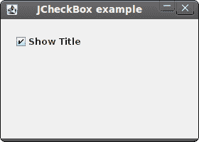
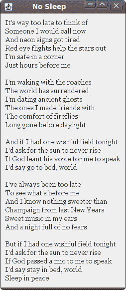
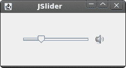
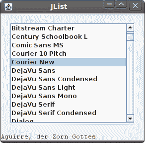

# Jython Swing 中的组件

> 原文： [http://zetcode.com/gui/jythonswing/components/](http://zetcode.com/gui/jythonswing/components/)

在 Jython Swing 编程教程的这一部分中，我们将介绍基本的 Swing 组件。

组件是 GUI 应用的基本构建块。 多年来，一些组件已成为所有 OS 平台上所有工具包中的标准组件。 例如，按钮，复选框或滚动条。 Swing 具有丰富的组件集，可满足大多数编程需求。 可以将更多专用组件创建为自定义组件。

## `JCheckBox`

`JCheckBox`是具有两种状态的组件：开和关。 开状态通过复选标记显示。 它用来表示一些布尔属性。 `JCheckBox`组件提供了一个带有文本标签的复选框。

```py
#!/usr/local/bin/jython
# -*- coding: utf-8 -*-

"""
ZetCode Jython Swing tutorial

This program uses JCheckBox
component to show/hide the title
of the window

author: Jan Bodnar
website: www.zetcode.com
last modified: November 2010
"""

from java.awt import Dimension
from javax.swing import Box
from javax.swing import BoxLayout
from javax.swing import JCheckBox
from javax.swing import JFrame

class Example(JFrame):

    def __init__(self):
        super(Example, self).__init__()

        self.initUI()

    def initUI(self):

        self.setLayout(BoxLayout(self.getContentPane(), BoxLayout.Y_AXIS))
        self.add(Box.createRigidArea(Dimension(15, 20)))

        cb = JCheckBox("Show Title", True, actionPerformed=self.onSelect)
        cb.setFocusable(False)
        self.add(cb)

        self.setTitle("JCheckBox example")
        self.setSize(280, 200)
        self.setResizable(False)
        self.setDefaultCloseOperation(JFrame.EXIT_ON_CLOSE)
        self.setLocationRelativeTo(None)
        self.setVisible(True)

    def onSelect(self, e):

        source = e.getSource()
        isSelected = source.isSelected()

        if isSelected:
            self.setTitle("JCheckBox example")
        else:
            self.setTitle("")

if __name__ == '__main__':
    Example()

```

在我们的示例中，我们在窗口上放置了一个复选框。 复选框显示/隐藏窗口的标题。

```py
self.setLayout(BoxLayout(self.getContentPane(), BoxLayout.Y_AXIS))
self.add(Box.createRigidArea(Dimension(15, 20)))

```

在此示例中，我们使用`BoxLayout`布局管理器。 我们在此处放置一些空间，以使复选框不太靠近角落。

```py
cb = JCheckBox("Show Title", True, actionPerformed=self.onSelect)

```

`JCheckBox`组件已创建。 构造器的第一个参数是其文本标签。 第二个参数是一个布尔值，指示初始选择状态。 如果为`True`，则选中该复选框。 第三个参数指定方法，当我们选中或取消选中复选框时将调用该方法。

```py
cb.setFocusable(False)

```

我们禁用复选框的焦点。 可以使用空格键选择或取消选择具有焦点的`JCheckBox`。

```py
source = e.getSource()
isSelected = source.isSelected()

if isSelected:
    self.setTitle("JCheckBox example")
else:
    self.setTitle("")

```

从事件对象，我们获得源组件。 在我们的例子中是一个复选框。 我们找出复选框的选择状态。 根据复选框的状态，我们显示或隐藏窗口的标题。



图：`JCheckBox`

## `JLabel`

`JLabel`组件用于显示文本，图像或两者。 没有用户交互。

```py
#!/usr/local/bin/jython
# -*- coding: utf-8 -*-

"""
ZetCode Jython Swing tutorial

This program uses JLabel component to
show lyrics of a song

author: Jan Bodnar
website: www.zetcode.com
last modified: November 2010
"""

from java.awt import BorderLayout
from java.awt import Font
from javax.swing import BorderFactory
from javax.swing import JFrame
from javax.swing import JLabel
from javax.swing import JPanel

class Example(JFrame):

    def __init__(self):
        super(Example, self).__init__()

        self.initUI()

    def initUI(self):

        lyrics =  """<html>It's way too late to think of<br>
        Someone I would call now<br>
        And neon signs got tired<br>
        Red eye flights help the stars out<br>
        I'm safe in a corner<br>
        Just hours before me<br>
        <br>
        I'm waking with the roaches<br>
        The world has surrendered<br>
        I'm dating ancient ghosts<br>
        The ones I made friends with<br>
        The comfort of fireflies<br>
        Long gone before daylight<br>
        <br>
        And if I had one wishful field tonight<br>
        I'd ask for the sun to never rise<br>
        If God leant his voice for me to speak<br>
        I'd say go to bed, world<br>
        <br>
        I've always been too late<br>
        To see what's before me<br>
        And I know nothing sweeter than<br>
        Champaign from last New Years<br>
        Sweet music in my ears<br>
        And a night full of no fears<br>
        <br>
        But if I had one wishful field tonight<br>
        I'd ask for the sun to never rise<br>
        If God passed a mic to me to speak<br>
        I'd say stay in bed, world<br>
        Sleep in peace</html>"""

        panel = JPanel()
        panel.setLayout(BorderLayout(10, 10))

        label = JLabel(lyrics)
        label.setFont(Font("Georgia", Font.PLAIN, 14))

        panel.add(label, BorderLayout.CENTER)
        panel.setBorder(BorderFactory.createEmptyBorder(10, 10, 10, 10))
        self.add(panel)
        self.pack()

        self.setTitle("No Sleep")
        self.setDefaultCloseOperation(JFrame.EXIT_ON_CLOSE)
        self.setLocationRelativeTo(None)
        self.setVisible(True)

if __name__ == '__main__':
    Example()

```

我们的示例在窗口中显示了歌曲的歌词。 我们可以在`JLabel`组件中使用 HTML 标签。 我们使用`<br>`标签来分隔行。

```py
lyrics =  """<html>It's way too late to think of<br>
Someone I would call now<br>
And neon signs got tired<br>
...

```

我们定义了多行文字。

```py
label = JLabel(lyrics)
label.setFont(Font("Georgia", Font.PLAIN, 14))

```

在这里，我们创建标签组件。 我们将其字体设置为 14 像素高的普通乔治亚州。

```py
panel.add(label, BorderLayout.CENTER)
panel.setBorder(BorderFactory.createEmptyBorder(10, 10, 10, 10))

```

我们将标签放在面板的中央。 我们在标签周围放置了 10px。



图：`JLabel`组件

## `JSlider`

`JSlider`是一个组件，使用户可以通过在有限的间隔内滑动旋钮来以图形方式选择一个值。 我们的示例将显示音量控制。

```py
#!/usr/local/bin/jython
# -*- coding: utf-8 -*-

"""
ZetCode Jython Swing tutorial

In this program we use the JSlider
component to create a volume control
user interface

author: Jan Bodnar
website: www.zetcode.com
last modified: November 2010
"""

from java.awt import BorderLayout
from java.awt import Dimension
from javax.swing import BorderFactory
from javax.swing import Box
from javax.swing import BoxLayout
from javax.swing import ImageIcon
from javax.swing import JFrame
from javax.swing import JLabel
from javax.swing import JPanel
from javax.swing import JSlider

class Example(JFrame):

    def __init__(self):
        super(Example, self).__init__()

        self.initUI()

    def initUI(self):

        self.mute = ImageIcon("mute.png")
        self.min = ImageIcon("min.png")
        self.med = ImageIcon("med.png")
        self.max = ImageIcon("max.png")

        panel = JPanel()
        panel.setLayout(BoxLayout(panel, BoxLayout.X_AXIS))
        panel.setBorder(BorderFactory.createEmptyBorder(40, 40, 40, 40))
        self.setLayout(BorderLayout())

        panel.add(Box.createHorizontalGlue())

        slider = JSlider(0, 150, 0, stateChanged=self.onSlide)
        slider.setPreferredSize(Dimension(150, 30))

        panel.add(slider)
        panel.add(Box.createRigidArea(Dimension(5, 0)))

        self.label = JLabel(self.mute, JLabel.CENTER)
        panel.add(self.label)
        panel.add(Box.createHorizontalGlue())
        self.add(panel, BorderLayout.CENTER)

        self.pack()

        self.setTitle("JSlider")
        self.setDefaultCloseOperation(JFrame.EXIT_ON_CLOSE)
        self.setLocationRelativeTo(None)
        self.setVisible(True)

    def onSlide(self, e):

        sender = e.getSource()

        value = sender.getValue()

        if value == 0:
            self.label.setIcon(self.mute)
        elif value > 0 and value <= 30:
            self.label.setIcon(self.min)
        elif value > 30 and value < 80:
            self.label.setIcon(self.med)
        else:
            self.label.setIcon(self.max)

if __name__ == '__main__':
    Example()

```

在代码示例中，我们显示了`JSlider`和`JLabel`。 通过拖动滑块，我们可以更改标签组件上的图标。 我们有四个代表声音各种状态的图像。

```py
self.mute = ImageIcon("mute.png")

```

在这里，我们创建一个图像图标。

```py
panel.setLayout(BoxLayout(panel, BoxLayout.X_AXIS))

```

面板组件具有水平`BoxLayout`。

```py
panel.setBorder(BorderFactory.createEmptyBorder(40, 40, 40, 40))

```

我们在面板周围创建 40px 的边框。

```py
panel.add(Box.createHorizontalGlue())

```

我们在左右两侧都放置了可调整大小的空间。 这是为了防止`JSlider`增长到不自然的大小。

```py
slider = JSlider(0, 150, 0, stateChanged=self.onSlide)

```

这是一个`JSlider`构造器。 参数为最小值，最大值和当前值。 当我们滑动滑块的旋钮时，将调用`onSlide()`方法。

```py
panel.add(Box.createRigidArea(Dimension(5, 0)))

```

我们在两个组件之间放置一个 5px 的刚性空间。 当滑块位于末端位置时，它们彼此之间过于靠近。

```py
self.label = JLabel(self.mute, JLabel.CENTER)

```

该行创建一个具有指定图像和水平对齐方式的`JLabel`实例。 默认情况下，标签在其显示区域中垂直居中。



图：`JSlider`组件

## `JToggleButton`

`JToggleButton`是具有两种状态的按钮。 已按下但未按下。 通过单击可以在这两种状态之间切换。 在某些情况下此功能非常合适。

```py
#!/usr/local/bin/jython
# -*- coding: utf-8 -*-

"""
ZetCode Jython Swing tutorial

This program uses toggle buttons to
change the background color of
a panel

author: Jan Bodnar
website: www.zetcode.com
last modified: November 2010
"""

from java.awt import Color
from java.awt import Dimension

from javax.swing import BorderFactory
from javax.swing import Box
from javax.swing import BoxLayout
from javax.swing import JFrame
from javax.swing import JPanel
from javax.swing import JToggleButton
from javax.swing.border import LineBorder

class Example(JFrame):

    def __init__(self):
        super(Example, self).__init__()

        self.initUI()

    def initUI(self):

        self.setPreferredSize(Dimension(280, 200))

        bottom = JPanel()
        bottom.setLayout(BoxLayout(bottom, BoxLayout.X_AXIS))
        bottom.setBorder(BorderFactory.createEmptyBorder(20, 20, 20, 20))

        leftPanel = JPanel()
        leftPanel.setLayout(BoxLayout(leftPanel, BoxLayout.Y_AXIS))

        redButton = JToggleButton("red", actionPerformed=self.onToggle)
        greenButton = JToggleButton("green", actionPerformed=self.onToggle)
        blueButton = JToggleButton("blue", actionPerformed=self.onToggle)

        blueButton.setMaximumSize(greenButton.getMaximumSize())
        redButton.setMaximumSize(greenButton.getMaximumSize())

        leftPanel.add(redButton)
        leftPanel.add(Box.createRigidArea(Dimension(25, 7)))
        leftPanel.add(greenButton)
        leftPanel.add(Box.createRigidArea(Dimension(25, 7)))
        leftPanel.add(blueButton)

        bottom.add(leftPanel)
        bottom.add(Box.createRigidArea(Dimension(20, 0)))

        self.display = JPanel()
        self.display.setPreferredSize(Dimension(110, 110))
        self.display.setBorder(LineBorder.createGrayLineBorder())
        self.display.setBackground(Color.black)

        bottom.add(self.display)
        self.add(bottom)

        self.pack()

        self.setTitle("JToggleButton")
        self.setResizable(False)
        self.setDefaultCloseOperation(JFrame.EXIT_ON_CLOSE)
        self.setLocationRelativeTo(None)
        self.setVisible(True)

    def onToggle(self, e):

        color = self.display.getBackground()
        red = color.getRed()
        green = color.getGreen()
        blue = color.getBlue()

        if e.getActionCommand() == "red":
            if red == 0:
                red = 255
            else:
                red = 0

        if e.getActionCommand() == "green":
            if green == 0:
                green = 255
            else:
                green = 0

        if e.getActionCommand() == "blue":
            if blue == 0:
                blue = 255
            else:
                blue = 0

        setCol = Color(red, green, blue)
        self.display.setBackground(setCol)

if __name__ == '__main__':
    Example()

```

在代码示例中，我们使用三个切换按钮来更改矩形组件的颜色。

```py
redButton = JToggleButton("red", actionPerformed=self.onToggle)

```

我们创建一个`JToggleButton`组件。 当我们单击该按钮时，将启动`onToggle()`方法。

```py
blueButton.setMaximumSize(greenButton.getMaximumSize())
redButton.setMaximumSize(greenButton.getMaximumSize())

```

我们使三个按钮的大小相等。

```py
color = self.display.getBackground()
red = color.getRed()
green = color.getGreen()
blue = color.getBlue()

```

我们确定显示背景颜色的当前红色，绿色，蓝色部分。

```py
if e.getActionCommand() == "red":
    if red == 0:
        red = 255
    else:
        red = 0

```

我们确定切换了哪个按钮，并相应地更新 RGB 值的颜色部分。

```py
setCol = Color(red, green, blue)
self.display.setBackground(setCol)

```

在此创建新的颜色，并将显示面板更新为新的颜色。


图：`JToggleButton`组件

## `JList`

`JList`是显示对象列表的组件。 它允许用户选择一项或多项。

```py
#!/usr/local/bin/jython
# -*- coding: utf-8 -*-

"""
ZetCode Jython Swing tutorial

This program shows all system fonts
in a JList component

author: Jan Bodnar
website: www.zetcode.com
last modified: November 2010
"""

from java.awt import BorderLayout
from java.awt import Dimension
from java.awt import Font
from java.awt import GraphicsEnvironment

from javax.swing import JFrame
from javax.swing import BorderFactory
from javax.swing import JScrollPane
from javax.swing import JPanel
from javax.swing import JLabel
from javax.swing import JList

class Example(JFrame):

    def __init__(self):
        super(Example, self).__init__()

        self.initUI()

    def initUI(self):

        panel = JPanel()
        panel.setLayout(BorderLayout())
        panel.setBorder(BorderFactory.createEmptyBorder(20, 20, 20, 20))

        ge = GraphicsEnvironment.getLocalGraphicsEnvironment()
        fonts = ge.getAvailableFontFamilyNames()

        list = JList(fonts, valueChanged=self.onChanged)

        pane = JScrollPane()
        pane.getViewport().add(list)
        pane.setPreferredSize(Dimension(250, 200))
        panel.add(pane)

        self.label = JLabel("Aguirre, der Zorn Gottes")
        self.label.setFont(Font("Serif", Font.PLAIN, 12))
        self.add(self.label, BorderLayout.SOUTH)

        self.add(panel)
        self.pack()

        self.setTitle("JList")
        self.setDefaultCloseOperation(JFrame.EXIT_ON_CLOSE)
        self.setLocationRelativeTo(None)
        self.setVisible(True)

    def onChanged(self, e):

        sender = e.getSource()

        if not e.getValueIsAdjusting():
            name = sender.getSelectedValue()
            font = Font(name, Font.PLAIN, 13)
            self.label.setFont(font)

if __name__ == '__main__':
    Example()

```

在我们的示例中，我们将显示`JList`和`JLabel`组件。 列表组件包含我们系统上所有可用字体系列名称的列表。 如果我们从列表中选择一项，则标签将以我们选择的字体显示。

```py
ge = GraphicsEnvironment.getLocalGraphicsEnvironment()
fonts = ge.getAvailableFontFamilyNames()

```

在这里，我们获得系统上所有可能的字体系列名称。

```py
list = JList(fonts, valueChanged=self.onChanged)

```

我们创建`JList`组件的实例。 如果我们从列表中选择一个选项，则会调用`onChanged()`方法。

```py
if not e.getValueIsAdjusting():

```

列表选择中的事件被分组。 我们收到选择和取消选择事件。 为了仅过滤选择事件，我们使用`getValueIsAdjusting()`方法。

```py
name = sender.getSelectedValue()
font = Font(name, Font.PLAIN, 13)
self.label.setFont(font)

```

我们得到所选项目并为标签设置新字体。

```py
pane = JScrollPane()
pane.getViewport().add(list)

```

默认情况下，`JList`组件不可滚动。 我们将列表放入`JScrollPane`以使其可滚动。



图：`JList`组件

在 Jython Swing 教程的这一部分中，我们介绍了几个 Swing 组件。