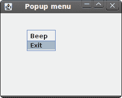

# Jython Swing 中的菜单和工具栏

> 原文： [http://zetcode.com/gui/jythonswing/menustoolbars/](http://zetcode.com/gui/jythonswing/menustoolbars/)

在 Jython Swing 编程教程的这一部分中，我们将使用菜单和工具栏。

菜单栏是 GUI 应用中最可见的部分之一。 它是位于各个菜单中的一组命令。 在控制台应用中，您必须记住所有这些神秘命令，在这里，我们将大多数命令分组为逻辑部分。 有公认的标准可以进一步减少学习新应用的时间。 菜单将我们可以在应用中使用的命令分组。 使用工具栏可以快速访问最常用的命令。

## 简单菜单

第一个示例将显示一个简单的菜单。

```
#!/usr/local/bin/jython
# -*- coding: utf-8 -*-

"""
ZetCode Jython Swing tutorial

This program creates a simple
menu.

author: Jan Bodnar
website: www.zetcode.com
last modified: November 2010
"""

from java.awt.event import KeyEvent
from java.lang import System
from javax.swing import ImageIcon
from javax.swing import JFrame
from javax.swing import JMenu
from javax.swing import JMenuBar
from javax.swing import JMenuItem

class Example(JFrame):

    def __init__(self):
        super(Example, self).__init__()

        self.initUI()

    def initUI(self):

        menubar = JMenuBar()
        icon = ImageIcon("exit.png")

        file = JMenu("File")
        file.setMnemonic(KeyEvent.VK_F)

        fileExit = JMenuItem("Exit", icon,
            actionPerformed=self.onSelect)
        fileExit.setMnemonic(KeyEvent.VK_C)
        fileExit.setToolTipText("Exit application")

        file.add(fileExit)

        menubar.add(file)

        self.setJMenuBar(menubar)

        self.setTitle("Simple menu")
        self.setDefaultCloseOperation(JFrame.EXIT_ON_CLOSE)
        self.setSize(250, 200)
        self.setLocationRelativeTo(None)
        self.setVisible(True)

    def onSelect(self, e):
        System.exit(0)

if __name__ == '__main__':
    Example()

```

我们的示例将显示一个菜单项。 通过选择退出菜单项，我们关闭应用。

```
menubar = JMenuBar()

```

在这里，我们创建一个菜单栏。

```
icon = ImageIcon("exit.png")

```

我们将在菜单项中显示一个图标。

```
file = JMenu("File")
file.setMnemonic(KeyEvent.VK_F)

```

我们创建一个菜单对象。 菜单是一个包含`JMenuItems`的弹出窗口。 菜单位于菜单栏上。 也可以通过键盘访问菜单。 要将菜单绑定到特定键，我们使用`setMnemonic()`方法。 在我们的情况下，可以使用 ALT + F 快捷方式打开菜单。

```
fileExit = JMenuItem("Exit", icon,
    actionPerformed=self.onSelect)
fileExit.setMnemonic(KeyEvent.VK_C)
fileExit.setToolTipText("Exit application")

```

在这里，我们创建一个`JMenuItem`。 菜单项是显示在所选菜单的弹出窗口中的对象。 我们还为菜单项和工具提示提供了快捷方式。

```
file.add(fileExit)

```

菜单项被添加到菜单中。

```
menubar.add(file)

```

菜单添加到菜单栏。


Figure: Simple menu

## 子菜单

子菜单是插入另一个菜单对象的菜单。 下一个示例对此进行了演示。

```
#!/usr/local/bin/jython
# -*- coding: utf-8 -*-

"""
ZetCode Jython Swing tutorial

This program creates a simple
submenu.

author: Jan Bodnar
website: www.zetcode.com
last modified: November 2010
"""

from java.lang import System
from java.awt.event import KeyEvent
from java.awt.event import ActionEvent
from javax.swing import JFrame
from javax.swing import JMenuBar
from javax.swing import JMenuItem
from javax.swing import JMenu
from javax.swing import ImageIcon
from javax.swing import KeyStroke

class Example(JFrame):

    def __init__(self):
        super(Example, self).__init__()

        self.initUI()

    def initUI(self):

        menubar = JMenuBar()

        iconNew = ImageIcon("new.png")
        iconOpen = ImageIcon("open.png")
        iconSave = ImageIcon("save.png")
        iconExit = ImageIcon("exit.png")

        file = JMenu("File")
        file.setMnemonic(KeyEvent.VK_F)

        imp = JMenu("Import")
        imp.setMnemonic(KeyEvent.VK_M)

        newsf = JMenuItem("Import newsfeed list...")
        bookm = JMenuItem("Import bookmarks...")
        mail = JMenuItem("Import mail...")

        imp.add(newsf)
        imp.add(bookm)
        imp.add(mail)

        fileNew = JMenuItem("New", iconNew)
        fileNew.setMnemonic(KeyEvent.VK_N)

        fileOpen = JMenuItem("Open", iconOpen)
        fileNew.setMnemonic(KeyEvent.VK_O)

        fileSave = JMenuItem("Save", iconSave)
        fileSave.setMnemonic(KeyEvent.VK_S)

        fileExit = JMenuItem("Exit", iconExit,
            actionPerformed=self.onSelect)
        fileExit.setMnemonic(KeyEvent.VK_C)
        fileExit.setToolTipText("Exit application")
        fileExit.setAccelerator(KeyStroke.getKeyStroke(KeyEvent.VK_W,
            ActionEvent.CTRL_MASK))

        file.add(fileNew)
        file.add(fileOpen)
        file.add(fileSave)
        file.addSeparator()
        file.add(imp)
        file.addSeparator()
        file.add(fileExit)

        menubar.add(file)

        self.setJMenuBar(menubar)

        self.setTitle("Submenu")
        self.setDefaultCloseOperation(JFrame.EXIT_ON_CLOSE)
        self.setSize(320, 220)
        self.setLocationRelativeTo(None)
        self.setVisible(True)

    def onSelect(self, e):
        System.exit(0)

if __name__ == '__main__':
    Example()

```

在示例中，文件菜单的子菜单中有三个选项。

```
imp = JMenu("Import")
...
file.add(imp)

```

子菜单与其他任何普通菜单一样。 它是用相同的方式创建的。 我们只需将菜单添加到现有菜单即可。

```
fileExit.setAccelerator(KeyStroke.getKeyStroke(KeyEvent.VK_W,
    ActionEvent.CTRL_MASK))

```

加速器是启动菜单项的快捷键。 在我们的情况下，通过按 `Ctrl + W` 关闭我们的应用。

```
file.addSeparator()

```

分隔符是一条水平线，用于在视觉上分隔菜单项。 这样，我们可以将项目分组到一些合理的位置。


Figure: Submenu

## 弹出菜单

在下一个示例中，我们创建一个弹出菜单。

```
#!/usr/local/bin/jython
# -*- coding: utf-8 -*-

"""
ZetCode Jython Swing tutorial

This program creates a popup menu.

author: Jan Bodnar
website: www.zetcode.com
last modified: November 2010
"""

from java.awt.event import MouseListener
from java.lang import System
from javax.swing import JFrame
from javax.swing import JMenuItem
from javax.swing import JPopupMenu

class Example(JFrame, MouseListener):

    def __init__(self):
        super(Example, self).__init__()

        self.initUI()

    def initUI(self):

        self.menu = JPopupMenu()
        menuItemBeep = JMenuItem("Beep", actionPerformed=self.onBeep)

        self.menu.add(menuItemBeep)

        menuItemClose = JMenuItem("Exit", actionPerformed=self.onExit)
        self.menu.add(menuItemClose);
        self.addMouseListener(self)

        self.setTitle("Popup menu")
        self.setDefaultCloseOperation(JFrame.EXIT_ON_CLOSE)
        self.setSize(250, 200)
        self.setLocationRelativeTo(None)
        self.setVisible(True)

    def mouseReleased(self, e):
        if e.getButton() == e.BUTTON3:
            self.menu.show(e.getComponent(), e.getX(), e.getY())

    def onExit(self, e):
        System.exit(0)

    def onBeep(self, e):
        toolkit = self.getToolkit()
        toolkit.beep()

if __name__ == '__main__':
    Example()

```

在我们的示例中，我们创建一个带有两个菜单项的弹出菜单。

```
self.menu = JPopupMenu()
menuItemBeep = JMenuItem("Beep", actionPerformed=self.onBeep)

```

我们创建一个弹出菜单和一个菜单项。

```
def mouseReleased(self, e):
    if e.getButton() == e.BUTTON3:
        self.menu.show(e.getComponent(), e.getX(), e.getY())

```

我们在鼠标单击的 x，y 坐标处显示弹出菜单窗口。



Figure: Popup menu

## 工具栏

菜单将我们可以在应用中使用的命令分组。 使用工具栏可以快速访问最常用的命令。 在 Swing 中，`JToolBar`类在应用中创建一个工具栏。

```
#!/usr/local/bin/jython
# -*- coding: utf-8 -*-

"""
ZetCode Jython Swing tutorial

In this program, we create a simple
toolbar.

author: Jan Bodnar
website: www.zetcode.com
last modified: November 2010
"""

from java.awt import BorderLayout
from java.lang import System
from javax.swing import ImageIcon
from javax.swing import JFrame
from javax.swing import JMenu
from javax.swing import JMenuBar
from javax.swing import JToolBar
from javax.swing import JButton

class Example(JFrame):

    def __init__(self):
        super(Example, self).__init__()

        self.initUI()

    def initUI(self):

        menubar = JMenuBar()
        file = JMenu("File")
        menubar.add(file)
        self.setJMenuBar(menubar)

        toolbar = JToolBar()

        icon = ImageIcon("exit.png")

        exitButton = JButton(icon, actionPerformed=self.onClick)
        toolbar.add(exitButton)

        self.add(toolbar, BorderLayout.NORTH)

        self.setTitle("Toolbar")
        self.setDefaultCloseOperation(JFrame.EXIT_ON_CLOSE)
        self.setSize(350, 250)
        self.setLocationRelativeTo(None)
        self.setVisible(True)

    def onClick(self, e):
        System.exit(0)

if __name__ == '__main__':
    Example()

```

该示例创建一个带有一个退出按钮的工具栏。

```
toolbar = JToolBar()

```

工具栏已创建。

```
exitButton = JButton(icon, actionPerformed=self.onClick)
toolbar.add(exitButton)

```

我们创建一个按钮并将其添加到工具栏。

```
self.add(toolbar, BorderLayout.NORTH)

```

工具栏位于`BorderLayout`管理器的北部。


Figure: Toolbar

在 Jython Swing 教程的这一部分中，我们提到了菜单和工具栏。