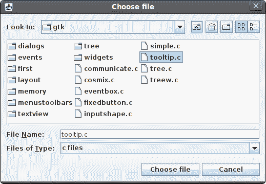

# Jython Swing 中的对话框

> 原文： [http://zetcode.com/gui/jythonswing/dialogs/](http://zetcode.com/gui/jythonswing/dialogs/)

在 Jython Swing 编程教程的这一部分中，我们将使用对话框。

对话框窗口或对话框是大多数现代 GUI 应用程序必不可少的部分。 对话被定义为两个或更多人之间的对话。 在计算机应用程序中，对话框是一个窗口，用于与应用程序“对话”。 对话框用于输入数据，修改数据，更改应用程序设置等。对话框是用户与计算机程序之间进行通信的重要手段。

## 留言框

消息框是方便的对话框，可向应用程序的用户提供消息。 该消息由文本和图像数据组成。

```
#!/usr/local/bin/jython
# -*- coding: utf-8 -*-

"""
ZetCode Jython Swing tutorial

In this program, we show various
message boxes.

author: Jan Bodnar
website: www.zetcode.com
last modified: November 2010
"""

from java.awt import GridLayout
from javax.swing import JButton
from javax.swing import JFrame
from javax.swing import JOptionPane
from javax.swing import JPanel

class Example(JFrame):

    def __init__(self):
        super(Example, self).__init__()

        self.initUI()

    def initUI(self):

        self.panel = JPanel()
        self.panel.setLayout(GridLayout(2, 2))

        error = JButton("Error", actionPerformed=self.onError)
        warning = JButton("Warning", actionPerformed=self.onWarning)
        question = JButton("Question", actionPerformed=self.onQuestion)
        inform = JButton("Information", actionPerformed=self.onInform)

        self.panel.add(error)
        self.panel.add(warning)
        self.panel.add(question)
        self.panel.add(inform)

        self.add(self.panel)

        self.setTitle("Message boxes")
        self.setSize(300, 200)
        self.setDefaultCloseOperation(JFrame.EXIT_ON_CLOSE)
        self.setLocationRelativeTo(None)
        self.setVisible(True)

    def onError(self, e):
        JOptionPane.showMessageDialog(self.panel, "Could not open file",
            "Error", JOptionPane.ERROR_MESSAGE)

    def onWarning(self, e):
        JOptionPane.showMessageDialog(self.panel, "A deprecated call",
            "Warning", JOptionPane.WARNING_MESSAGE)

    def onQuestion(self, e):
        JOptionPane.showMessageDialog(self.panel, "Are you sure to quit?",
            "Question", JOptionPane.QUESTION_MESSAGE)

    def onInform(self, e):
        JOptionPane.showMessageDialog(self.panel, "Download completed",
            "Information", JOptionPane.INFORMATION_MESSAGE)

if __name__ == '__main__':
    Example()

```

我们使用`GridLayout`管理器来设置四个按钮的网格。 每个按钮显示一个不同的消息框。

```
def onError(self, e):
    JOptionPane.showMessageDialog(self.panel, "Could not open file",
        "Error", JOptionPane.ERROR_MESSAGE)

```

如果按下错误按钮，则会显示错误对话框。 我们使用`showMessageDialog()`方法在屏幕上显示对话框。 此方法的第一个参数是显示对话框的框架。 第二个参数是要显示的消息。 第三个参数是对话框的标题。 最后一个参数是消息类型。 默认图标由消息类型决定。 在本例中，错误对话框的消息类型为`ERROR_MESSAGE`。


Figure: Error message dialog

## JColorChooser

`JColorChooser`是用于选择颜色的标准对话框。

```
#!/usr/local/bin/jython
# -*- coding: utf-8 -*-

"""
ZetCode Jython Swing tutorial

In this program, we use the
JColorChooser to change the color
of a panel.

author: Jan Bodnar
website: www.zetcode.com
last modified: November 2010
"""

from java.awt import BorderLayout
from java.awt import Color
from javax.swing import BorderFactory
from javax.swing import JColorChooser
from javax.swing import JButton
from javax.swing import JToolBar
from javax.swing import JPanel
from javax.swing import JFrame

class Example(JFrame):

    def __init__(self):
        super(Example, self).__init__()

        self.initUI()

    def initUI(self):

        self.panel = JPanel()
        self.panel.setLayout(BorderLayout())

        toolbar = JToolBar()
        openb = JButton("Choose color", actionPerformed=self.onClick)

        toolbar.add(openb)

        self.display = JPanel()
        self.display.setBackground(Color.WHITE)

        self.panel.setBorder(BorderFactory.createEmptyBorder(30, 50, 30, 50))
        self.panel.add(self.display)
        self.add(self.panel)

        self.add(toolbar, BorderLayout.NORTH)

        self.setTitle("Color chooser")
        self.setSize(300, 250)
        self.setDefaultCloseOperation(JFrame.EXIT_ON_CLOSE)
        self.setLocationRelativeTo(None)
        self.setVisible(True)

    def onClick(self, e):

        clr = JColorChooser()
        color = clr.showDialog(self.panel, "Choose Color", Color.white)
        self.display.setBackground(color)

if __name__ == '__main__':
    Example()

```

在示例中，窗口中央有一个白色面板。 我们将通过从颜色选择器对话框中选择一种颜色来更改面板的背景色。

```
clr = JColorChooser()
color = clr.showDialog(self.panel, "Choose Color", Color.white)
self.display.setBackground(color)

```

此代码显示一个颜色选择器对话框。 `showDialog()`方法返回所选的颜色值。 我们将显示面板的背景更改为新选择的颜色。


Figure: ColorDialog

## JFileChooser

`JFileChooser`对话框允许用户从文件系统中选择一个文件。

```
#!/usr/local/bin/jython
# -*- coding: utf-8 -*-

"""
ZetCode Jython Swing tutorial

In this program, we use the
JFileChooser to select a file from
a filesystem.

author: Jan Bodnar
website: www.zetcode.com
last modified: November 2010
"""

from java.awt import BorderLayout

from javax.swing import BorderFactory
from javax.swing import JFileChooser
from javax.swing import JTextArea
from javax.swing import JScrollPane
from javax.swing import JButton
from javax.swing import JToolBar
from javax.swing import JPanel
from javax.swing import JFrame
from javax.swing.filechooser import FileNameExtensionFilter

class Example(JFrame):

    def __init__(self):
        super(Example, self).__init__()

        self.initUI()

    def initUI(self):

        self.panel = JPanel()
        self.panel.setLayout(BorderLayout())

        toolbar = JToolBar()
        openb = JButton("Choose file", actionPerformed=self.onClick)

        toolbar.add(openb)

        self.area = JTextArea()
        self.area.setBorder(BorderFactory.createEmptyBorder(10, 10, 10, 10))

        pane = JScrollPane()
        pane.getViewport().add(self.area)

        self.panel.setBorder(BorderFactory.createEmptyBorder(10, 10, 10, 10))
        self.panel.add(pane)
        self.add(self.panel)

        self.add(toolbar, BorderLayout.NORTH)

        self.setTitle("File chooser")
        self.setSize(300, 250)
        self.setDefaultCloseOperation(JFrame.EXIT_ON_CLOSE)
        self.setLocationRelativeTo(None)
        self.setVisible(True)

    def onClick(self, e):

        chooseFile = JFileChooser()
        filter = FileNameExtensionFilter("c files", ["c"])
        chooseFile.addChoosableFileFilter(filter)

        ret = chooseFile.showDialog(self.panel, "Choose file")

        if ret == JFileChooser.APPROVE_OPTION:
            file = chooseFile.getSelectedFile()
            text = self.readFile(file)
            self.area.setText(text)

    def readFile(self, file):
        filename = file.getCanonicalPath()
        f = open(filename, "r")
        text = f.read()
        return text

if __name__ == '__main__':
    Example()

```

在我们的代码示例中，我们使用`JFileChooser`对话框选择一个 C 文件并将其内容显示在`JTextArea`中。

```
self.area = JTextArea()

```

这是`JTextArea`，我们将在其中显示所选文件的内容。

```
chooseFile = JFileChooser()
filter = FileNameExtensionFilter("c files", ["c"])
chooseFile.addChoosableFileFilter(filter)

```

我们创建`JFileChooser`对话框的实例。 我们创建一个仅显示 C 文件的过滤器。

```
ret = chooseFile.showDialog(self.panel, "Choose file")

```

对话框显示在屏幕上。 我们得到了返回值。

```
if ret == JFileChooser.APPROVE_OPTION:
    file = chooseFile.getSelectedFile()
    text = self.readFile(file)
    self.area.setText(text)

```

如果用户选择了文件，我们将获得文件名。 阅读其内容并将文本设置为文本区域组件。

```
def readFile(self, file):
    filename = file.getCanonicalPath()
    f = open(filename, "r")
    text = f.read()
    return text

```

此代码从文件中读取文本。 `getCanonicalPath()`返回绝对文件名。



Figure: JFileChooser

在 Jython Swing 教程的这一部分中，我们使用了对话框窗口。