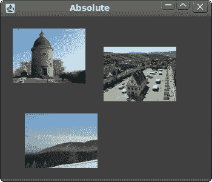

# JRuby Swing 中的布局管理

> 原文： [http://zetcode.com/gui/jrubyswing/layout/](http://zetcode.com/gui/jrubyswing/layout/)

在 JRuby Swing 编程教程的这一部分中，我们将介绍布局管理器。

在设计应用程序的 GUI 时，我们决定要使用哪些组件以及如何在应用程序中组织这些组件。 为了组织我们的组件，我们使用专门的不可见对象，称为布局管理器。 Swing 工具箱包含两种组件。 容器和儿童。 容器将孩子分组为合适的布局。 要创建布局，我们使用布局管理器。

## 绝对定位

在大多数情况下，程序员应使用布局管理器。 在某些情况下，我们可以使用绝对定位。 在绝对定位中，程序员以像素为单位指定每个组件的位置和大小。 如果调整窗口大小，则组件的大小和位置不会更改。 在各种平台上，应用程序看起来都不同，在 Linux 上看起来不错，在 Mac OS 上看起来不太正常。 在应用程序中更改字体可能会破坏布局。 如果将应用程序翻译成另一种语言，则必须重做布局。 对于所有这些问题，仅在有理由时才使用绝对定位。

```
#!/usr/local/bin/jruby

# ZetCode JRuby Swing tutorial
#
# In this program, we lay out three images
# using absolute positioning.
#
# author: Jan Bodnar
# website: www.zetcode.com
# last modified: December 2010

include Java

import java.awt.Color
import javax.swing.ImageIcon
import javax.swing.JLabel
import javax.swing.JPanel
import javax.swing.JFrame

class Example < JFrame

  def initialize
      super "Absolute"

      self.initUI
  end

  def initUI

      panel = JPanel.new
      panel.setLayout nil
      panel.setBackground Color.new 66, 66, 66
      self.getContentPane.add panel

      rot = ImageIcon.new "rotunda.jpg"
      rotLabel = JLabel.new rot
      rotLabel.setBounds 20, 20, rot.getIconWidth, rot.getIconHeight

      min = ImageIcon.new "mincol.jpg"
      minLabel = JLabel.new min
      minLabel.setBounds 40, 160, min.getIconWidth, min.getIconHeight

      bar = ImageIcon.new "bardejov.jpg"
      barLabel = JLabel.new bar
      barLabel.setBounds 170, 50, bar.getIconWidth, bar.getIconHeight

      panel.add rotLabel
      panel.add minLabel
      panel.add barLabel

      self.setDefaultCloseOperation JFrame::EXIT_ON_CLOSE
      self.setSize 350, 300
      self.setLocationRelativeTo nil
      self.setVisible true
  end

end

Example.new

```

在此示例中，我们使用绝对定位显示了三幅图像。

```
panel.setLayout nil

```

Swing 中的容器已经具有默认的布局管理器。 `JPanel`具有`FlowLayout`管理器作为其默认布局管理器。 我们将`setLayout`方法与`nil`参数一起使用，以删除默认的布局管理器，而改用绝对定位。

```
rot = ImageIcon.new "rotunda.jpg"
rotLabel = JLabel.new rot
rotLabel.setBounds 20, 20, rot.getIconWidth, rot.getIconHeight

```

我们创建一个`ImageIcon`对象。 我们将图标放入`JLabel`组件中以显示它。 然后，我们使用`setBounds`方法将标签放置在面板上。 前两个参数是标签的 x，y 位置。 第 3 和第 4 个参数是图标的宽度和高度。

```
panel.add rotLabel

```

我们将标签添加到面板容器中。



Figure: Absolute positioning

## 按钮示例

在下面的示例中，我们将在窗口的右下角放置两个按钮。

```
#!/usr/local/bin/jruby

# ZetCode JRuby Swing tutorial
#
# In this program, we use the BoxLayout
# manager to position two buttons in the
# bottom right corner of the window.
#
# author: Jan Bodnar
# website: www.zetcode.com
# last modified: December 2010

include Java

import java.awt.Dimension
import javax.swing.JButton
import javax.swing.JPanel
import javax.swing.JFrame
import javax.swing.BoxLayout
import javax.swing.Box

class Example < JFrame

  def initialize
      super "Buttons"

      self.initUI
  end

  def initUI

      basic = JPanel.new
      basic.setLayout BoxLayout.new basic, BoxLayout::Y_AXIS
      self.add basic

      basic.add Box.createVerticalGlue

      bottom = JPanel.new
      bottom.setLayout BoxLayout.new bottom, BoxLayout::X_AXIS
      bottom.setAlignmentX 1.0

      okButton = JButton.new "OK"
      closeButton = JButton.new "Close"

      bottom.add okButton
      bottom.add Box.createRigidArea Dimension.new 5, 0
      bottom.add closeButton
      bottom.add Box.createRigidArea Dimension.new 15, 0

      basic.add bottom
      basic.add Box.createRigidArea Dimension.new 0, 15

      self.setDefaultCloseOperation JFrame::EXIT_ON_CLOSE
      self.setSize 300, 200
      self.setLocationRelativeTo nil
      self.setVisible true
  end

end

Example.new

```

我们将创建两个面板。 基本面板具有垂直框布局。 底部面板有一个水平面板。 我们将在基础面板中放置一个底部面板。 我们将右对齐底部面板。 窗口顶部和底部面板之间的空间是可扩展的。 这是通过垂直胶水完成的。

```
basic = JPanel.new
basic.setLayout BoxLayout.new basic, BoxLayout::Y_AXIS
...
bottom = JPanel.new
bottom.setLayout BoxLayout.new bottom, BoxLayout::X_AXIS

```

基本面板具有垂直框布局。 底部面板具有水平框布局。

```
bottom.setAlignmentX 1.0

```

底部面板右对齐。

```
basic.add Box.createVerticalGlue

```

我们创建一个垂直胶水。 胶水是垂直可扩展的白色空间，它将带有按钮的水平框推到底部。

```
okButton = JButton.new "OK"
closeButton = JButton.new "Close"

```

这是两个将进入窗口右下角的按钮。

```
bottom.add okButton
bottom.add Box.createRigidArea Dimension.new 5, 0

```

我们将“确定”按钮放入水平框中。 我们在按钮旁边放置了一些刚性空间。 这样两个按钮之间会有一些空间。

```
basic.add Box.createRigidArea Dimension.new 0, 15

```

我们在按钮和窗口的边框之间留出一些空间。


Figure: Buttons example

## Windows 示例

以下示例使用`GroupLayout`管理器创建 Windows 对话框。 该对话框来自 JDeveloper 应用程序。

`GroupLayout`管理器将布局的创建分为两个步骤。 第一步，我们沿着水平轴布置组件。 在第二步中，我们沿垂直轴布置组件。 这在布局管理器中是一个不寻常的想法，但效果很好。

有两种类型的安排：顺序安排和并行安排。 在两种布局中，我们都可以顺序或并行排列组件。 在水平布局中，一行组件称为顺序组。 一列组件称为并行组。 在垂直布局中，一列组件称为顺序组。 一排组件称为并行组。 您必须正确理解这些定义才能与`GroupLayout`管理器一起使用。

```
#!/usr/local/bin/jruby

# ZetCode JRuby Swing tutorial
#
# In this program, GroupLayout
# manager to create a Windows 
# example.
#
# author: Jan Bodnar
# website: www.zetcode.com
# last modified: December 2010

include Java

import java.awt.Dimension
import java.awt.Color
import javax.swing.JButton
import javax.swing.SwingConstants
import javax.swing.JFrame
import javax.swing.JLabel
import javax.swing.JTextArea
import javax.swing.BorderFactory
import javax.swing.GroupLayout

class Example < JFrame

  def initialize
      super "Windows"

      self.initUI
  end

  def initUI

      layout = GroupLayout.new self.getContentPane
      self.getContentPane.setLayout layout
      layout.setAutoCreateGaps true
      layout.setAutoCreateContainerGaps true

      self.setPreferredSize Dimension.new 350, 300

      windows = JLabel.new "Windows"
      area = JTextArea.new 
      area.setEditable false
      area.setBorder BorderFactory.createLineBorder Color.gray
      activateButton = JButton.new "Activate"
      closeButton = JButton.new "Close"
      helpButton = JButton.new "Help"
      okButton = JButton.new "OK"

      sg = layout.createSequentialGroup
      pg1 = layout.createParallelGroup
      pg2 = layout.createParallelGroup
      pg1.addComponent windows
      pg1.addComponent area
      pg1.addComponent helpButton
      sg.addGroup pg1
      pg2.addComponent activateButton
      pg2.addComponent closeButton      
      pg2.addComponent okButton
      sg.addGroup pg2
      layout.setHorizontalGroup sg

      sg1 = layout.createSequentialGroup
      sg2 = layout.createSequentialGroup
      pg1 = layout.createParallelGroup
      pg2 = layout.createParallelGroup      
      sg1.addComponent windows
      pg1.addComponent area
      sg2.addComponent activateButton
      sg2.addComponent closeButton
      pg1.addGroup sg2
      sg1.addGroup pg1
      pg2.addComponent helpButton
      pg2.addComponent okButton
      sg1.addGroup pg2
      layout.setVerticalGroup sg1

      layout.linkSize SwingConstants::HORIZONTAL, 
          okButton, helpButton, closeButton, activateButton

      self.pack

      self.setDefaultCloseOperation JFrame::EXIT_ON_CLOSE
      self.setLocationRelativeTo nil
      self.setVisible true
  end

end

Example.new

```

我们使用`GroupLayout`管理器创建由六个组件组成的布局。 组件组沿两个轴形成。

```
sg = layout.createSequentialGroup
pg1 = layout.createParallelGroup
pg2 = layout.createParallelGroup
pg1.addComponent windows
pg1.addComponent area
pg1.addComponent helpButton
sg.addGroup pg1
pg2.addComponent activateButton
pg2.addComponent closeButton      
pg2.addComponent okButton
sg.addGroup pg2
layout.setHorizontalGroup sg

```

第一步，我们有一个水平布局。 它由两组平行的三个部分组成。

```
sg1 = layout.createSequentialGroup
sg2 = layout.createSequentialGroup
pg1 = layout.createParallelGroup
pg2 = layout.createParallelGroup      
sg1.addComponent windows
pg1.addComponent area
sg2.addComponent activateButton
sg2.addComponent closeButton
pg1.addGroup sg2
sg1.addGroup pg1
pg2.addComponent helpButton
pg2.addComponent okButton
sg1.addGroup pg2
layout.setVerticalGroup sg1

```

垂直布局有点复杂。 首先，我们添加一个组件。 然后，我们添加一个包含单个组件的并行组和一个包含两个组件的顺序组。 最后，我们添加两个组件的并行组。

```
layout.linkSize SwingConstants::HORIZONTAL, 
    okButton, helpButton, closeButton, activateButton

```

此代码使所有按钮的大小相同。 我们只需要设置它们的宽度，因为默认情况下它们的高度已经相同。


Figure: Windows example

查看示例的屏幕截图。 注意，可以将组件分为垂直和水平组件集。 例如，标签，区域和“帮助”按钮组件可以形成垂直的组件组。 这正是`GroupLayout`管理器所做的。 它通过形成组件的垂直和水平组来布局组件。

在 JRuby Swing 教程的这一部分中，我们提到了组件的布局管理。