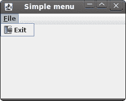
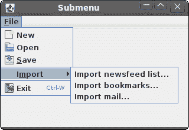
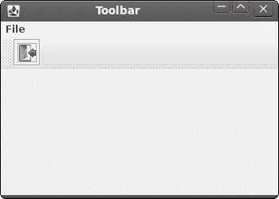

# 菜单和工具栏

> 原文： [http://zetcode.com/gui/jrubyswing/menustoolbars/](http://zetcode.com/gui/jrubyswing/menustoolbars/)

在 JRuby Swing 编程教程的这一部分中，我们将使用菜单和工具栏。

菜单栏是 GUI 应用中最可见的部分之一。 它是位于各个菜单中的一组命令。 在控制台应用中，您必须记住所有这些神秘命令，在这里，我们将大多数命令分组为逻辑部分。 有公认的标准可以进一步减少学习新应用的时间。 菜单将我们可以在应用中使用的命令分组。 使用工具栏可以快速访问最常用的命令。

## 简单菜单

第一个示例将显示一个简单的菜单。

```
#!/usr/local/bin/jruby

# ZetCode JRuby Swing tutorial
#
# This program creates a simple
# menu.
#
# author: Jan Bodnar
# website: www.zetcode.com
# last modified: December 2010

include Java

import java.awt.event.KeyEvent
import javax.swing.JButton
import javax.swing.JFrame
import javax.swing.JMenuBar
import javax.swing.JMenuItem
import javax.swing.JMenu
import javax.swing.ImageIcon
import java.lang.System

class Example < JFrame

    def initialize
        super "Simple menu"

        self.initUI
    end

    def initUI

        menubar = JMenuBar.new
        icon = ImageIcon.new "exit.png"

        fileMenu = JMenu.new "File"
        fileMenu.setMnemonic KeyEvent::VK_F

        itemExit = JMenuItem.new "Exit", icon
        itemExit.addActionListener do |e|
            System.exit 0
        end

        itemExit.setMnemonic KeyEvent::VK_C
        itemExit.setToolTipText "Exit application"

        fileMenu.add itemExit

        menubar.add fileMenu

        self.setJMenuBar menubar  

        self.setDefaultCloseOperation JFrame::EXIT_ON_CLOSE
        self.setSize 250, 200
        self.setLocationRelativeTo nil
        self.setVisible true
    end
end

Example.new

```

我们的示例将显示一个菜单项。 通过选择退出菜单项，我们关闭应用。

```
menubar = JMenuBar.new

```

在这里，我们创建一个菜单栏。

```
icon = ImageIcon.new "exit.png"

```

我们将在菜单项中显示一个图标。

```
fileMenu = JMenu.new "File"
fileMenu.setMnemonic KeyEvent::VK_F

```

我们创建一个菜单对象。 菜单是包含`JMenuItem`的弹出窗口。 菜单位于菜单栏上。 也可以通过键盘访问菜单。 要将菜单绑定到特定键，我们使用`setMnemonic`方法。 在我们的情况下，可以使用`ALT + F`快捷方式打开菜单。

```
itemExit = JMenuItem.new "Close", icon
itemExit.addActionListener do |e|
    System.exit 0
end

```

在这里，我们创建一个`JMenuItem`。 菜单项是显示在所选菜单的弹出窗口中的对象。 我们还为菜单项和工具提示提供了快捷方式。

```
fileMenu.add itemExit

```

菜单项被添加到菜单中。

```
menubar.add fileMenu

```

菜单添加到菜单栏。



Figure: Simple menu

## 子菜单

子菜单是插入另一个菜单对象的菜单。 下一个示例对此进行了演示。

```
#!/usr/local/bin/jruby

# ZetCode JRuby Swing tutorial
#
# This program creates a 
# submenu.
#
# author: Jan Bodnar
# website: www.zetcode.com
# last modified: December 2010

include Java

import java.awt.event.KeyEvent
import java.awt.event.ActionEvent
import javax.swing.JFrame
import javax.swing.ImageIcon
import javax.swing.JMenuBar
import javax.swing.JMenu
import javax.swing.JMenuItem
import javax.swing.KeyStroke
import java.lang.System

class Example < JFrame

    def initialize
        super "Submenu"

        self.initUI
    end

    def initUI

        menubar = JMenuBar.new

        iconNew = ImageIcon.new "new.png"
        iconOpen = ImageIcon.new "open.png"
        iconSave = ImageIcon.new "save.png"
        iconExit = ImageIcon.new "exit.png"

        fileMenu = JMenu.new "File"
        fileMenu.setMnemonic KeyEvent::VK_F

        imp = JMenu.new "Import"
        imp.setMnemonic KeyEvent::VK_M

        newsf = JMenuItem.new "Import newsfeed list..."
        bookm = JMenuItem.new "Import bookmarks..."
        mail = JMenuItem.new "Import mail..."

        imp.add newsf
        imp.add bookm
        imp.add mail

        fileNew = JMenuItem.new "New", iconNew
        fileNew.setMnemonic KeyEvent::VK_N

        fileOpen = JMenuItem.new "Open", iconOpen
        fileNew.setMnemonic KeyEvent::VK_O

        fileSave = JMenuItem.new "Save", iconSave
        fileSave.setMnemonic KeyEvent::VK_S

        fileExit = JMenuItem.new "Exit", iconExit
        fileExit.addActionListener do |e|
            System.exit 0
        end

        fileExit.setMnemonic KeyEvent::VK_C
        fileExit.setToolTipText "Exit application"
        fileExit.setAccelerator KeyStroke.getKeyStroke KeyEvent::VK_W,
            ActionEvent::CTRL_MASK

        fileMenu.add fileNew
        fileMenu.add fileOpen
        fileMenu.add fileSave
        fileMenu.addSeparator
        fileMenu.add imp
        fileMenu.addSeparator
        fileMenu.add fileExit

        menubar.add fileMenu

        self.setJMenuBar menubar

        self.setDefaultCloseOperation JFrame::EXIT_ON_CLOSE
        self.setSize 320, 220
        self.setLocationRelativeTo nil
        self.setVisible true
    end   
end

Example.new

```

在示例中，文件菜单的子菜单中有三个选项。

```
imp = JMenu.new "Import"
...
fileMenu.add imp

```

子菜单与其他任何普通菜单一样。 它是用相同的方式创建的。 我们只需将菜单添加到现有菜单即可。

```
fileExit.setAccelerator KeyStroke.getKeyStroke KeyEvent::VK_W,
            ActionEvent::CTRL_MASK

```

加速器是启动菜单项的快捷键。 在我们的情况下，通过按 `Ctrl + W` 关闭我们的应用。

```
fileMenu.addSeparator

```

分隔符是一条水平线，用于在视觉上分隔菜单项。 这样，我们可以将项目分组到一些合理的位置。



Figure: Submenu

## 弹出菜单

在下一个示例中，我们创建一个弹出菜单。

```
#!/usr/local/bin/jruby

# ZetCode JRuby Swing tutorial
#
# This program creates a 
# popup menu.
#
# author: Jan Bodnar
# website: www.zetcode.com
# last modified: December 2010

include Java

import java.awt.event.MouseAdapter
import javax.swing.JFrame
import javax.swing.JPopupMenu
import javax.swing.JMenuItem
import java.lang.System

class MouseAction < MouseAdapter

    def mouseReleased e
        source = e.source
        menu = source.getMenu

        if e.getButton == e.button
            menu.show e.getComponent, e.getX, e.getY
        end
    end  
end    

class Example < JFrame

    def initialize
        super "Popup menu"

        self.initUI
    end

    def initUI

        @menu = JPopupMenu.new
        menuItemBeep = JMenuItem.new "Beep" 
        menuItemBeep.addActionListener do |e|
            toolkit = getToolkit
            toolkit.beep              
        end
        @menu.add menuItemBeep

        menuItemExit = JMenuItem.new "Exit" 
        menuItemExit.addActionListener do |e|
            System.exit 0    
        end 

        @menu.add menuItemExit
        self.addMouseListener MouseAction.new

        self.setDefaultCloseOperation JFrame::EXIT_ON_CLOSE
        self.setSize 250, 200
        self.setLocationRelativeTo nil
        self.setVisible true
    end

    def getMenu
        @menu
    end    
end

Example.new

```

在我们的示例中，我们创建一个带有两个菜单项的弹出菜单。

```
@menu = JPopupMenu.new
menuItemBeep = JMenuItem.new "Beep"

```

我们创建一个弹出菜单和一个菜单项。

```
self.addMouseListener MouseAction.new

```

我们将鼠标监听器添加到`Example`类。 鼠标监听器是`MouseAction`用户定义的类，该类继承自`MouseAdapter`。 这是一个便利类，可实现所有五个必需的方法。 方法为空。 除了实现所有五个方法之外，我们仅实现所需的方法。

```
class MouseAction < MouseAdapter

    def mouseReleased e
...

```

在我们的`MouseAction`类中，我们实现了`mouseReleased`方法。

```
if e.getButton == e.button:
    menu.show e.getComponent, e.getX, e.getY
end

```

我们在鼠标单击的 x，y 坐标处显示弹出菜单窗口。


Figure: Popup menu

## 工具栏

菜单将我们可以在应用中使用的命令分组。 使用工具栏可以快速访问最常用的命令。 在 Swing 中，`JToolBar`类在应用中创建一个工具栏。

```
#!/usr/local/bin/jruby

# ZetCode JRuby Swing tutorial
#
# This program creates a 
# toolbar.
#
# author: Jan Bodnar
# website: www.zetcode.com
# last modified: December 2010

include Java

import java.awt.BorderLayout
import javax.swing.JFrame
import javax.swing.ImageIcon
import javax.swing.JButton
import javax.swing.JMenuBar
import javax.swing.JMenu
import javax.swing.JToolBar
import java.lang.System

class Example < JFrame

    def initialize
        super "Toolbar"

        self.initUI
    end

    def initUI

        menubar = JMenuBar.new
        fileMenu = JMenu.new "File"
        menubar.add fileMenu

        toolbar = JToolBar.new

        iconExit = ImageIcon.new "exit2.png"

        exitButton = JButton.new iconExit
        exitButton.addActionListener do |e|
            System.exit 0  
        end

        toolbar.add exitButton

        self.add toolbar, BorderLayout::NORTH

        self.setJMenuBar menubar

        self.setDefaultCloseOperation JFrame::EXIT_ON_CLOSE
        self.setSize 350, 250
        self.setLocationRelativeTo nil
        self.setVisible true
    end       
end

Example.new

```

该示例创建一个带有一个退出按钮的工具栏。

```
toolbar = JToolBar.new

```

工具栏已创建。

```
exitButton = JButton.new iconExit
...
toolbar.add exitButton

```

我们创建一个按钮并将其添加到工具栏。

```
self.add toolbar, BorderLayout::NORTH

```

工具栏位于`BorderLayout`管理器的北部。 `BorderLayout`管理器是`JFrame`容器的默认布局管理器。



Figure: Toolbar

在 JRuby Swing 教程的这一部分中，我们提到了菜单和工具栏。