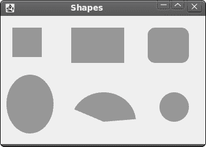
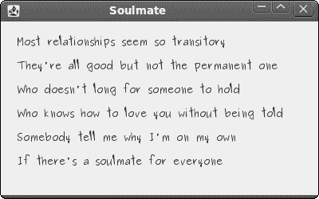

# 在 JRuby Swing 中绘图

> 原文： [http://zetcode.com/gui/jrubyswing/painting/](http://zetcode.com/gui/jrubyswing/painting/)

在 JRuby Swing 编程教程的这一部分中，我们将进行绘图。

我们使用绘图来创建图表，自定义组件或创建游戏。 要进行绘图，我们使用 Swing 工具包提供的绘图 API。 绘图是在`paintComponent`方法中完成的。 在绘图过程中，我们使用`Graphics2D`对象。 它是一个图形上下文，允许应用绘制到组件上。 它是渲染二维形状，文本和图像的基础类。

## 色彩

颜色是代表红色，绿色和蓝色（RGB）强度值的组合的对象。 我们使用`Color`类在 Swing 中处理颜色。

```
#!/usr/local/bin/jruby

# ZetCode JRuby Swing tutorial
# 
# In this example we draw nine rectangles
# filled with nine different colors.
# 
# author: Jan Bodnar
# website: www.zetcode.com
# last modified: December 2010

include Java

import java.awt.Color
import javax.swing.JFrame
import javax.swing.JPanel

class Canvas < JPanel

    def paintComponent g

        self.drawColorRectangles g

    end

    def drawColorRectangles g

        g.setColor Color.new 125, 167, 116
        g.fillRect 10, 15, 90, 60

        g.setColor Color.new 42, 179, 231
        g.fillRect 130, 15, 90, 60

        g.setColor Color.new 70, 67, 123
        g.fillRect 250, 15, 90, 60

        g.setColor Color.new 130, 100, 84
        g.fillRect 10, 105, 90, 60

        g.setColor Color.new 252, 211, 61
        g.fillRect 130, 105, 90, 60

        g.setColor Color.new 241, 98, 69
        g.fillRect 250, 105, 90, 60

        g.setColor Color.new 217, 146, 54
        g.fillRect 10, 195, 90, 60

        g.setColor Color.new 63, 121, 186
        g.fillRect 130, 195, 90, 60

        g.setColor Color.new 31, 21, 1
        g.fillRect 250, 195, 90, 60

    end
end    

class Example < JFrame

    def initialize
        super "Colors"

        self.initUI
    end

    def initUI

        canvas = Canvas.new
        self.getContentPane.add canvas

        self.setDefaultCloseOperation JFrame::EXIT_ON_CLOSE
        self.setSize 360, 300
        self.setLocationRelativeTo nil
        self.setVisible true
    end
end

Example.new

```

在代码示例中，我们绘制了九个矩形，并用不同的颜色值填充它们。

```
def paintComponent g

```

在大多数情况下，自定义绘图是在`paintComponent`中完成的。 `g`参数是图形上下文。 我们称此对象为绘图操作。

```
g.setColor Color.new 125, 167, 116

```

我们将上下文的当前颜色设置为指定的颜色。 使用此图形上下文的所有后续图形操作均使用此指定的颜色。

```
g.fillRect 10, 15, 90, 60

```

我们使用上面指定的颜色值填充位于 x = 10，y = 15 且宽度= 90 和高度= 60 的矩形。


Figure: Colours

## 形状

Swing 绘图 API 可以绘制各种形状。 以下编程代码示例将显示其中的一些。

```
#!/usr/local/bin/jruby

# ZetCode JRuby Swing tutorial
# 
# This example draws simple shapes
# on a panel.
# 
# author: Jan Bodnar
# website: www.zetcode.com
# last modified: December 2010

include Java

import java.awt.Color
import java.awt.RenderingHints
import java.awt.geom.Ellipse2D
import javax.swing.JFrame
import javax.swing.JPanel

class Canvas < JPanel

    def paintComponent g

        self.drawShapes g      
    end  

    def drawShapes g

        g.setColor Color.new 150, 150, 150

        rh = RenderingHints.new RenderingHints::KEY_ANTIALIASING,
             RenderingHints::VALUE_ANTIALIAS_ON

        rh.put RenderingHints::KEY_RENDERING,
               RenderingHints::VALUE_RENDER_QUALITY

        g.setRenderingHints rh

        g.fillRect 20, 20, 50, 50
        g.fillRect 120, 20, 90, 60
        g.fillRoundRect 250, 20, 70, 60, 25, 25

        g.fill Ellipse2D::Double.new 10, 100, 80, 100
        g.fillArc 120, 130, 110, 100, 5, 150
        g.fillOval 270, 130, 50, 50

    end
end    

class Example < JFrame

    def initialize
        super "Shapes"

        self.initUI
    end

    def initUI

        canvas = Canvas.new
        self.getContentPane.add canvas

        self.setDefaultCloseOperation JFrame::EXIT_ON_CLOSE
        self.setSize 350, 250
        self.setLocationRelativeTo nil
        self.setVisible true
    end
end

Example.new

```

在此代码示例中，我们在窗口上绘制了六个不同的形状。 正方形，矩形，圆角矩形，椭圆形，弧形和椭圆形。 我们不会绘制形状的轮廓，但是会用灰色填充形状的内部空间。

```
rh = RenderingHints.new RenderingHints::KEY_ANTIALIASING,
      RenderingHints::VALUE_ANTIALIAS_ON

```

借助渲染提示，我们可以控制绘图的质量。 在上面的代码中，我们实现了抗锯齿。 使用抗锯齿，形状更平滑。

```
g.setColor Color.new 150, 150, 150

```

我们将以某种灰色绘图。

```
g.fillRect 20, 20, 50, 50
g.fillRect 120, 20, 90, 60
g.fillRoundRect 250, 20, 70, 60, 25, 25

```

在这里，我们绘制一个矩形，一个正方形和一个圆角矩形。 这些方法中的前四个参数是 x，y 坐标以及宽度和高度。 `fillRoundRect`的最后两个参数是四个角处圆弧的水平和垂直直径。

```
g.fill Ellipse2D::Double.new 10, 100, 80, 100
g.fillArc 120, 130, 110, 100, 5, 150
g.fillOval 270, 130, 50, 50

```

这三条线绘制一个椭圆，一个弧形和一个椭圆形。



Figure: Shapes

## 透明矩形

透明性是指能够透视材料的质量。 了解透明度的最简单方法是想象一块玻璃或水。 从技术上讲，光线可以穿过玻璃，这样我们就可以看到玻璃后面的物体。

在计算机图形学中，我们可以使用 alpha 合成来实现透明效果。 Alpha 合成是将图像与背景组合以创建部分透明外观的过程。 合成过程使用 Alpha 通道。 （wikipedia.org，answers.com）

```
#!/usr/local/bin/jruby

# ZetCode JRuby Swing tutorial
# 
# This program draws ten
# rectangles with different
# levels of transparency.
# 
# author: Jan Bodnar
# website: www.zetcode.com
# last modified: December 2010

include Java

import java.awt.Color
import java.awt.AlphaComposite
import javax.swing.JFrame
import javax.swing.JPanel

class Canvas < JPanel

    def paintComponent g

        g.setColor Color::BLUE

        for i in 1..10 do
            g.setComposite AlphaComposite.getInstance AlphaComposite::SRC_OVER,
                                                        i * 0.1
            g.fillRect 50 * i, 20, 40, 40
        end

    end
end    

class Example < JFrame

    def initialize
        super "Transparent rectangles"

        self.initUI
    end

    def initUI

        canvas = Canvas.new
        self.getContentPane.add canvas

        self.setDefaultCloseOperation JFrame::EXIT_ON_CLOSE
        self.setSize 590, 120
        self.setLocationRelativeTo nil
        self.setVisible true
    end
end

Example.new

```

在示例中，我们将绘制十个具有不同透明度级别的矩形。

```
g.setComposite AlphaComposite.getInstance AlphaComposite::SRC_OVER,
                                                        i * 0.1

```

`AlphaComposite`类实现基本的 alpha 合成规则。


Figure: Transparent rectangles

## 甜甜圈形状

在下面的示例中，我们通过旋转一堆椭圆来创建复杂的形状。 仿射变换由零个或多个线性变换（旋转，缩放或剪切）和平移（移位）组成。 `AffineTransform`是 Swing 中用于执行仿射变换的类。

```
#!/usr/local/bin/jruby

# ZetCode JRuby Swing tutorial
# 
# In this code example, we create
# a Donut shape.
# 
# author: Jan Bodnar
# website: www.zetcode.com
# last modified: December 2010

include Java

import java.awt.BasicStroke
import java.awt.Color
import java.awt.RenderingHints
import java.awt.geom.AffineTransform
import java.awt.geom.Ellipse2D
import javax.swing.JFrame
import javax.swing.JPanel

class Canvas < JPanel

    def paintComponent g

        self.drawDonut g

    end

    def drawDonut g

        rh = RenderingHints.new RenderingHints::KEY_ANTIALIASING,
             RenderingHints::VALUE_ANTIALIAS_ON

        rh.put RenderingHints::KEY_RENDERING,
               RenderingHints::VALUE_RENDER_QUALITY

        g.setRenderingHints rh

        size = self.getSize
        w = size.getWidth
        h = size.getHeight

        e = Ellipse2D::Double.new 0, 0, 80, 130
        g.setStroke BasicStroke.new 1
        g.setColor Color.gray

        deg = 0

        72.times do
            at = AffineTransform.getTranslateInstance w / 2, h / 2
            at.rotate deg/180.0 * Math::PI 
            g.draw at.createTransformedShape e
            deg += 5
        end

    end
end    

class Example < JFrame

    def initialize
        super "Donut"

        self.initUI
    end

    def initUI

        canvas = Canvas.new
        self.getContentPane.add canvas

        self.setDefaultCloseOperation JFrame::EXIT_ON_CLOSE
        self.setSize 350, 320
        self.setLocationRelativeTo nil
        self.setVisible true
    end
end

Example.new

```

在此示例中，我们创建一个甜甜圈。 形状类似于曲奇，因此得名“甜甜圈”。 甜甜圈在窗口中居中。

```
size = self.getSize
w = size.getWidth
h = size.getHeight

```

在这里，我们确定窗口的宽度和高度。 我们需要这些值来使甜甜圈形状居中。

```
e = Ellipse2D::Double.new 0, 0, 80, 130

```

我们创建一个椭圆形。 我们将旋转此椭圆以创建甜甜圈形状。

```
g.setStroke BasicStroke.new 1
g.setColor Color.gray

```

我们为形状的轮廓设置笔触和颜色。

```
deg = 0

72.times do

```

我们绘制一个椭圆对象 72 次。 每次，我们再将椭圆旋转 5 度。 这将创建我们的甜甜圈形状。

```
at = AffineTransform.getTranslateInstance w / 2, h / 2
at.rotate deg/180.0 * Math::PI 
g.draw at.createTransformedShape e

```

在`AffineTransform`类的帮助下，我们将图形转换到窗口的中心。 然后我们进行旋转。 `createTransformedShape`方法会将这些仿射变换应用于椭圆。 然后使用`draw`方法绘制变换后的椭圆。 `rotate`方法以弧度表示角度，因此我们以度为单位计算弧度。

## 绘制文字

在最后一个示例中，我们将在窗口上绘制文本。

```
#!/usr/local/bin/jruby

# ZetCode JRuby Swing tutorial
# 
# In this example we draw lyrics of a 
# song on the window panel.
# 
# author: Jan Bodnar
# website: www.zetcode.com
# last modified: December 2010

include Java

import java.awt.Color
import java.awt.Font
import java.awt.RenderingHints
import java.awt.geom.Ellipse2D
import javax.swing.JFrame
import javax.swing.JPanel

class Canvas < JPanel

    def paintComponent g

        self.drawLyrics g
    end

    def drawLyrics g

        rh = RenderingHints.new RenderingHints::KEY_ANTIALIASING,
            RenderingHints::VALUE_ANTIALIAS_ON

        rh.put RenderingHints::KEY_RENDERING,
               RenderingHints::VALUE_RENDER_QUALITY

        g.setRenderingHints rh

        g.setFont Font.new "Purisa", Font::PLAIN, 13

        g.drawString "Most relationships seem so transitory", 20, 30
        g.drawString "They're all good but not the permanent one", 20, 60
        g.drawString "Who doesn't long for someone to hold", 20, 90
        g.drawString "Who knows how to love you without being told", 20, 120
        g.drawString "Somebody tell me why I'm on my own", 20, 150
        g.drawString "If there's a soulmate for everyone", 20, 180

    end
end    

class Example < JFrame

    def initialize
        super "Soulmate"

        initUI
    end

    def initUI

        canvas = Canvas.new
        self.getContentPane.add canvas

        self.setDefaultCloseOperation JFrame::EXIT_ON_CLOSE
        self.setSize 400, 250
        self.setLocationRelativeTo nil
        self.setVisible true
    end
end

Example.new

```

我们在窗口上画一首歌的歌词。

```
rh = RenderingHints.new RenderingHints::KEY_TEXT_ANTIALIASING,
    RenderingHints::VALUE_TEXT_ANTIALIAS_ON

g.setRenderingHints rh

```

我们在画上应用文字抗锯齿。

```
g.setFont Font.new "Purisa", Font::PLAIN, 13

```

我们指定字体名称，样式和磅值，并在其中绘制歌词。

```
g.drawString "Most relationships seem so transitory", 20, 30

```

`drawString`方法绘制文本。



Figure: Drawing text

在 JRuby Swing 编程教程的这一部分中，我们做了一些绘图。