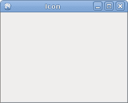
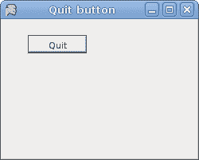

# Visual Basic Winforms 简介

> 原文： [http://zetcode.com/gui/vbwinforms/introduction/](http://zetcode.com/gui/vbwinforms/introduction/)

在 Visual Basic Winforms 编程教程的这一部分中，我们将介绍 Winforms 库并使用 Visual Basic 编程语言创建第一个程序。

本教程的目的是使您开始使用 Winforms 和 Visual Basic。 可以在此处下载本教程中使用的图像。 我使用了 Gnome 项目的探戈图标包中的一些图标。

## 关于

Windows 窗体是图形用户界面应用程序编程接口（API），包含在 Microsoft .NET Framework 中。 截至 2008 年 5 月 13 日，Mono 的 System.Windows.Forms 2.0 已完成 API。 简而言之，Winforms 是一个用于创建 GUI 应用程序的库。

Mono 是一个跨平台的开源.NET 开发框架。 它是.NET 兼容的工具集，其中包括 C# 编译器，Visual Basic 编译器，公共语言运行时，ADO.NET，ASP.NET 和 Winforms 库。

```
vbnc -r:/usr/lib/mono/2.0/System.Windows.Forms.dll quitbutton.vb

```

上面的命令显示了如何编译 quitbutton 示例。 mono VB 编译器的`-r`参数加载 Winforms 程序集。 这是一个动态库。 该命令显示了 Ubuntu 系统上 DLL 库的路径。

## 使窗口居中

在第二个示例中，我们将窗口置于屏幕中央。

```
' ZetCode Mono Visual Basic Winforms tutorial
'
' This program centers a window
' on the screen
'
' author jan bodnar
' last modified May 2009
' website www.zetcode.com

Imports System.Windows.Forms
Imports System.Drawing

Public Class WinVBApp
    Inherits Form

    Public Sub New

       Me.Text = "Center"
       Me.Size = New Size(250, 200)
       Me.CenterToScreen

    End Sub

   Public Shared Sub Main
        Application.Run(New WinVBApp)
   End Sub

End Class

```

此代码示例在屏幕中央显示一个小窗口。

```
Imports System.Windows.Forms
Imports System.Drawing

```

`Imports`关键字导入我们将在应用程序中使用的必需品类型。

```
Public Class WinVBApp
    Inherits Form

```

在 Winforms 中，任何窗口或对话框都是窗体。 该控件是一个基本容器，其目的是显示其他子控件。 我们的课程继承于一种形式。 这样，它本身就成为一种形式。

```
Public Sub New
...
End Sub

```

在构造函数中，我们设置了应用程序。

```
Me.Text = "Center"

```

在这里，我们为表格设置标题。

```
Me.Size = New Size(250, 200)

```

我们为表单设置大小。

```
Me.CenterToScreen

```

此代码行使屏幕上的窗口居中。

```
Public Shared Sub Main
    Application.Run(New WinVBApp)
End Sub

```

我们运行示例。

## 图标

Mono 在西班牙语中意为猴子。 如果我们不为应用程序提供图标，则默认情况下，我们的头是猴子。 下一个示例显示如何更改此设置。

```
' ZetCode Mono Visual Basic Winforms tutorial
'
' This program shows an icon in the
' title bar
'
' author jan bodnar
' last modified May 2009
' website www.zetcode.com

Imports System.Windows.Forms
Imports System.Drawing

Public Class WinVBApp
    Inherits Form

    Public Sub New

       Me.Text = "Icon"
       Me.Size = New Size(250, 200)

       Try 
           Icon = New Icon("web.ico")
       Catch e As Exception
           Console.WriteLine(e.Message)
           Environment.Exit(1)
       End Try

       Me.CenterToScreen

    End Sub

    Public Shared Sub Main
        Application.Run(New WinVBApp)
    End Sub

End Class

```

该代码示例在窗体的左上角显示一个图标。 表单的图标是代表任务栏中表单的图片以及为表单的控制框显示的图标。

```
Try 
    Icon = New Icon("web.ico")
Catch e As Exception
    Console.WriteLine(e.Message)
    Environment.Exit(1)
End Try

```

最好将所有输入输出工作放在 Try / Catch 关键字之间。 web.ico 文件必须在当前工作目录中可用。 这是我们执行（./icon.exe）应用程序的目录。



Figure: Icon

## 退出按钮

在本节的最后一个示例中，我们将创建一个退出按钮。 当我们按下此按钮时，应用程序终止。

```
' ZetCode Mono Visual Basic Winforms tutorial
'
' This program creates a quit
' button. When we press the button,
' the application terminates. 
'
' author jan bodnar
' last modified May 2009
' website www.zetcode.com

Imports System.Windows.Forms
Imports System.Drawing

Public Class WinVBApp
    Inherits Form

    Public Sub New

       Me.Text = "Quit button"
       Me.Size = New Size(250, 200)

       Me.InitUI

       Me.CenterToScreen

    End Sub

    Private Sub InitUI

        Dim button As New Button

        button.Location = New Point(30, 20)
        button.Text = "Quit"
        button.Parent = Me

        AddHandler button.Click, AddressOf Me.OnClick

        Me.CenterToScreen

    End Sub

    Private Sub OnClick(ByVal sender As Object, ByVal e As EventArgs)
       Me.Close
    End Sub

    Public Shared Sub Main
        Application.Run(New WinVBApp)
    End Sub

End Class

```

我们使用`Button`。 这是一个非常常见的小部件。 它是一个矩形，通常显示一个文本标签。

```
Me.InitUI

```

我们将用户界面的创建委托给`InitUI`方法。

```
Dim button As New Button

button.Location = New Point(30, 20)
button.Text = "Quit"
button.Parent = Me

```

我们创建按钮小部件。 我们将其放置在表单上。 为其提供标签，并将其放入表单容器中。

```
AddHandler button.Click, AddressOf Me.OnClick

```

当我们单击按钮时，将触发`Click`事件。 我们使用`OnClick`方法对此事件做出反应。

```
Private Sub OnClick(ByVal sender As Object, ByVal e As EventArgs)
    Me.Close
End Sub

```

`OnClick`方法终止应用程序。



Figure: Quit button

本节介绍了使用 Visual Basic 语言的 Winforms 库。