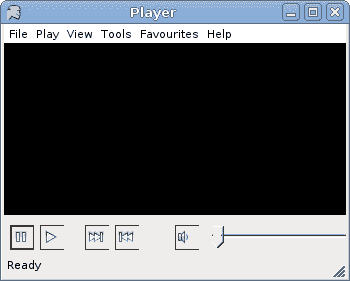

# 布局管理

> 原文： [http://zetcode.com/gui/vbwinforms/layout/](http://zetcode.com/gui/vbwinforms/layout/)

Mono Winforms 教程继续进行控件的布局管理。 在将控件放置在其父容器上之后，我们必须确保它们的布局正确。

## `Anchor`

控件的`Anchor`属性确定如何使用其父控件调整其大小。 锚是海洋世界中的一个术语。 当船锚掉入水中时，船就固定在某个地方。 Winforms 控件也是如此。

Winforms 中的每个控件都可以具有以下`AnchorStyles`值之一：

*   `TOP`
*   `LEFT`
*   `RIGHT`
*   `BOTTOM`

注意，控件不限于一个值。 他们可以使用`|`取这些值的任何组合。 运算符。

## 基本`Anchor`示例

下面的示例显示一个非常基本的示例，演示`Anchor`属性。

```vb
' ZetCode Mono Visual Basic Winforms tutorial
'
' This program demonstrates the Anchor property
'
' author jan bodnar
' last modified May 2009
' website www.zetcode.com

Imports System.Windows.Forms
Imports System.Drawing

Public Class WinVBApp
    Inherits Form

    Public Sub New

       Me.Text = "Check menu item"
       Me.Size = New Size(380, 220)

       Me.InitUI

       Me.CenterToScreen

    End Sub

    Private Sub InitUI

        Me.Text = "Anchor"
        Size = New Size(210, 210)

        Dim btn1 As New Button
        btn1.Text = "Button"
        btn1.Parent = Me
        btn1.Location = New Point(30, 30)

        Dim btn2 As New Button
        btn2.Text = "Button"
        btn2.Parent = Me
        btn2.Location = New Point(30, 80)
        btn2.Anchor = AnchorStyles.Right

        Me.CenterToScreen

    End Sub

    Public Shared Sub Main
        Application.Run(New WinVBApp)
    End Sub

End Class

```

这是一个非常基本的代码示例，清楚地显示了`Anchor`属性的含义。 我们在表单上有两个按钮。 第一个按钮具有默认的`AnchorStyles`值，即`AnchorStyles.Left`。 第二个按钮已显式设置`AnchorStyles.Right`。

```vb
btn2.Anchor = AnchorStyles.Right

```

我们将第二个按钮的`Anchor`属性明确设置为 AnchorStyles。 正确的价值。

现在看看以下两个图像。 左边的是开始时显示的应用。 调整大小后，右侧显示相同的应用。 第一个按钮与表单的左边界和上边界保持距离。 第二个按钮与表单的右边框保持距离。 但是它在垂直方向上没有保持任何距离。


图：调整大小前后

## `Dock`

`Dock`属性允许我们将控件粘贴到父窗体或控件的特定边缘。

以下是可能的`DockStyle`值。

*   `TOP`
*   `LEFT`
*   `RIGHT`
*   `BOTTOM`
*   `FILL`
*   `NONE`

## 编辑器骨架

以下代码示例演示了正在使用的`Dock`属性。

```vb
' ZetCode Mono Visual Basic Winforms tutorial
'
' This program demonstrates the Dock property
'
' author jan bodnar
' last modified May 2009
' website www.zetcode.com

Imports System.Windows.Forms
Imports System.Drawing

Public Class WinVBApp
    Inherits Form

    Public Sub New

       Me.Text = "Editor"
       Me.Size = New Size(220, 170)

       Me.InitUI

       Me.CenterToScreen

    End Sub

    Private Sub InitUI

        Dim mainMenu As New MainMenu
        Dim file As MenuItem = mainMenu.MenuItems.Add("&File")
        file.MenuItems.Add(New MenuItem("E&xit", _
                 New EventHandler(AddressOf Me.OnExit), Shortcut.CtrlX))

        Menu = mainMenu

        Dim tb As New TextBox
        tb.Parent = Me
        tb.Dock = DockStyle.Fill
        tb.Multiline = True

        Dim sb As New StatusBar
        sb.Parent = Me
        sb.Text = "Ready"

    End Sub

    Private Sub OnExit(ByVal sender As Object, ByVal e As EventArgs)
        Me.Close
    End Sub

    Public Shared Sub Main
        Application.Run(New WinVBApp)
    End Sub

End Class

```

我们显示一个菜单栏和一个状态栏。 其余区域由`TextBox`控件占用。

```vb
Dim tb As New TextBox
tb.Parent = Me

```

在这里，我们创建`TextBox`控件。 `Form`容器被设置为文本框的父级。

```vb
tb.Dock = DockStyle.Fill

```

此代码行使`TextBox`控件占用了表单容器内的剩余空间。


图：编辑器骨架

## 固定按钮

下一个示例显示了位于窗体右下角的两个按钮。

```vb
' ZetCode Mono Visual Basic Winforms tutorial
'
' This program positions two buttons
' in the bottom right corner of
' the window
'
' author jan bodnar
' last modified May 2009
' website www.zetcode.com

Imports System.Windows.Forms
Imports System.Drawing

Public Class WinVBApp
    Inherits Form

    Private Const WIDTH = 250
    Private Const HEIGHT = 150
    Private Const BUTTONS_SPACE = 15
    Private Const PANEL_SPACE = 8
    Private Const CLOSE_SPACE = 10

    Public Sub New

       Me.Text = "Buttons"
       Me.Size = New Size(WIDTH, HEIGHT)

       Me.InitUI

       Me.CenterToScreen

    End Sub

    Private Sub InitUI

        Dim ok As New Button

        Dim panelHeight As New Integer = ok.Height + PANEL_SPACE

        Dim panel As New Panel
        panel.Height = panelHeight
        panel.Dock = DockStyle.Bottom
        panel.Parent = Me

        Dim x As Integer = ok.Width * 2 + BUTTONS_SPACE
        Dim y As Integer = (panelHeight - ok.Height) / 2

        ok.Text = "Ok"
        ok.Parent = panel
        ok.Location = New Point(WIDTH-x, y)
        ok.Anchor = AnchorStyles.Right

        Dim close As New Button

        x = close.Width

        close.Text = "Close"
        close.Parent = panel
        close.Location = New Point(WIDTH-x-CLOSE_SPACE, y)
        close.Anchor = AnchorStyles.Right

    End Sub

    Private Sub OnExit(ByVal sender As Object, ByVal e As EventArgs)
        Me.Close
    End Sub

    Public Shared Sub Main
        Application.Run(New WinVBApp)
    End Sub

End Class

```

该示例在对话框的右下角显示确定，关闭按钮，这在对话框窗口中很常见。

```vb
Private Const WIDTH = 250
Private Const HEIGHT = 150

```

`WIDTH`和`HEIGHT`变量确定应用窗口的宽度和高度。

```vb
Private Const BUTTONS_SPACE = 15
Private Const PANEL_SPACE = 8
Private Const CLOSE_SPACE = 10

```

`BUTTONS_SPACE`是“确定”和“关闭”按钮之间的空间。 `PANEL_SPACE`是面板和表单底部之间的空间。 最后，`CLOSE_SPACE`变量设置“关闭”按钮和表单右边框之间的间隔。

```vb
Dim panelHeight As New Integer = ok.Height + PANEL_SPACE

```

在这里，我们计算面板的高度。 面板的高度基于“确定”按钮的高度。 并且我们添加了一些额外的空间，以使按钮不会太靠近边框。

```vb
Dim panel As New Panel
panel.Height = panelHeight
panel.Dock = DockStyle.Bottom
panel.Parent = Me

```

在这里，我们创建和管理`Panel`控件。 在此示例中，它用作按钮的容器。 它被粘贴到表单的底部边框。 然后将按钮放置在面板内。

```vb
ok.Text = "Ok"
ok.Parent = panel
ok.Location = New Point(WIDTH-x, y)
ok.Anchor = AnchorStyles.Right

```

“确定”按钮的父级设置为面板控件。 计算位置。 并且`Anchor`属性设置为右侧。 另一个按钮的创建类似。


图：固定按钮

## 播放器骨架

本部分最后的示例显示了一个更复杂的示例。 它是音乐播放器的骨架。

```vb
' ZetCode Mono Visual Basic Winforms tutorial
'
' This program creates a skeleton of 
' a music player.
'
' author jan bodnar
' last modified June 2009
' website www.zetcode.com

Imports System.Windows.Forms
Imports System.Drawing

Public Class WinVBApp
    Inherits Form

    Public Sub New

       Me.Text = "Player"
       Me.Size = New Size(350, 280)

       Me.InitUI

       Me.CenterToScreen

    End Sub

    Private Sub InitUI

        Dim mainMenu As New MainMenu
        Dim file As MenuItem = mainMenu.MenuItems.Add("&File")
        Dim playm As MenuItem = mainMenu.MenuItems.Add("&Play")
        Dim view As MenuItem = mainMenu.MenuItems.Add("&View")

        Dim tools As MenuItem = mainMenu.MenuItems.Add("&Tools")
        Dim favourites As MenuItem = mainMenu.MenuItems.Add("&Favourites")
        Dim help As MenuItem = mainMenu.MenuItems.Add("&Help")
        file.MenuItems.Add(New MenuItem("E&xit", _
                 New EventHandler(AddressOf Me.OnExit), Shortcut.CtrlX))

        Menu = mainMenu

        Dim panel As New Panel
        panel.Parent = Me
        panel.BackColor = Color.Black
        panel.Dock = DockStyle.Fill

        Dim buttonPanel As New Panel
        buttonPanel.Parent = Me
        buttonPanel.Height = 40
        buttonPanel.Dock = DockStyle.Bottom

        Dim pause As New Button
        pause.FlatStyle = FlatStyle.Popup
        pause.Parent = buttonPanel
        pause.Location = New Point(5, 10)
        pause.Size = New Size(25, 25)
        pause.Image = New Bitmap("pause.png")

        Dim play As New Button
        play.FlatStyle = FlatStyle.Popup
        play.Parent = buttonPanel
        play.Location = New Point(35, 10)
        play.Size = New Size(25, 25)
        play.Image = New Bitmap("play.png")

        Dim forward As New Button
        forward.FlatStyle = FlatStyle.Popup
        forward.Parent = buttonPanel
        forward.Location = New Point(80, 10)
        forward.Size = New Size(25, 25)
        forward.Image = New Bitmap("forward.png")

        Dim backward As New Button
        backward.FlatStyle = FlatStyle.Popup
        backward.Parent = buttonPanel
        backward.Location = New Point(110, 10)
        backward.Size = New Size(25, 25)
        backward.Image = New Bitmap("backward.png")

        Dim tb As = New TrackBar
        tb.Parent = buttonPanel
        tb.TickStyle = TickStyle.None
        tb.Size = New Size(150, 25)
        tb.Location = New Point(200, 10)
        tb.Anchor = AnchorStyles.Right

        Dim audio As New Button
        audio.FlatStyle = FlatStyle.Popup
        audio.Parent = buttonPanel
        audio.Size = New Size(25, 25)
        audio.Image = New Bitmap("audio.png")
        audio.Location = New Point(170, 10)
        audio.Anchor = AnchorStyles.Right

        Dim sb As New StatusBar
        sb.Parent = Me
        sb.Text = "Ready"

        Me.CenterToScreen

    End Sub

    Private Sub OnExit(ByVal sender As Object, ByVal e As EventArgs)
        Me.Close  
    End Sub

    Public Shared Sub Main
        Application.Run(New WinVBApp)
    End Sub

End Class

```

这是一个更复杂的示例，它同时显示了`Dock`和`Anchor`属性。

```vb
Dim mainMenu As New MainMenu
Dim file As MenuItem = mainMenu.MenuItems.Add("&File")
...
Menu = mainMenu

```

在这里，我们创建菜单栏。

```vb
Dim panel As New Panel
panel.Parent = Me
panel.BackColor = Color.Black
panel.Dock = DockStyle.Fill

```

这是黑色的面板，占据了菜单栏，状态栏和控制面板剩余的所有剩余空间。

```vb
Dim buttonPanel As New Panel
buttonPanel.Parent = Me
buttonPanel.Height = 40
buttonPanel.Dock = DockStyle.Bottom

```

这是控制面板。 它的父级是表单容器。 它被粘贴到表格的底部。 高度为 40 像素。 在此控制面板内部，我们放置了所有按钮和轨迹仪。

```vb
Dim pause As New Button
pause.FlatStyle = FlatStyle.Popup
pause.Parent = buttonPanel
pause.Location = New Point(5, 10)
pause.Size = New Size(25, 25)
pause.Image = New Bitmap("pause.png")

```

暂停按钮是具有默认`Anchor`属性值的四个按钮之一。 该按钮的样式设置为平面，因为它看起来更好。 我们在按钮上放置一个位图。

```vb
tb.Anchor = AnchorStyles.Right
...
audio.Anchor = AnchorStyles.Right

```

最后两个控件固定在右侧。



图：播放器骨架

Mono Visual Basic Winforms 教程的这一部分是关于控件的布局管理的。 我们实践了 Winforms 库提供的各种可能性。