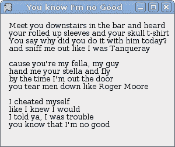
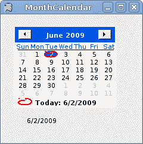
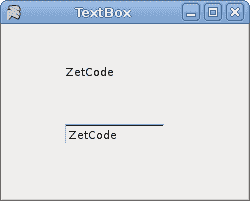

# 基本控制

> 原文： [http://zetcode.com/gui/vbwinforms/controls/](http://zetcode.com/gui/vbwinforms/controls/)

Visual Basic Winforms 编程教程的这一部分将介绍基本控件。

Winforms 控件是应用程序的基本构建块。 Winforms 具有广泛的各种控件。 按钮，复选框，滑块，列表框等。程序员完成工作所需的一切。 在本教程的这一部分中，我们将描述几个有用的控件。

## 标签控制

`Label`是用于显示文本或图像的简单控件。 它没有得到关注。

```
' ZetCode Mono Visual Basic Winforms tutorial
'
' This program shows lyrics of a song
'
' author jan bodnar
' last modified May 2009
' website www.zetcode.com

Imports System.Windows.Forms
Imports System.Drawing

Public Class WinVBApp
    Inherits Form

    Dim lyrics As String = "Meet you downstairs in the bar and heard" & vbNewLine & _
"your rolled up sleeves and your skull t-shirt" & vbNewLine & _
"You say why did you do it with him today?" & vbNewLine & _
"and sniff me out like I was Tanqueray" & vbNewLine & _
"" & vbNewLine & _
"cause you're my fella, my guy" & vbNewLine & _
"hand me your stella and fly" & vbNewLine & _
"by the time I'm out the door" & vbNewLine & _
"you tear men down like Roger Moore" & vbNewLine & _
"" & vbNewLine & _
"I cheated myself" & vbNewLine & _
"like I knew I would" & vbNewLine & _
"I told ya, I was trouble" & vbNewLine & _
"you know that I'm no good"

    Public Sub New()

       Me.Text = "You know I'm no Good"
       Me.Size = New Size(300, 250)

       Me.InitUI

       Me.CenterToScreen

    End Sub

    Private Sub InitUI

        Dim font As New Font("Serif", 10)

        Dim label As New Label
        label.Parent = Me
        label.Text = lyrics
        label.Font = font
        label.Location = New Point(10, 10)
        label.Size = New Size (290, 290)

    End Sub

    Public Shared Sub Main
        Application.Run(New WinVBApp)
    End Sub

End Class

```

在我们的示例中，我们在标签控件中显示歌曲的歌词。

```
 Dim lyrics As String = "Meet you downstairs in the bar and heard" & vbNewLine & _
"your rolled up sleeves and your skull t-shirt" & vbNewLine & _ 
...

```

我们定义了多行文字。 与 C# ，Python 或 Ruby 不同，没有简单的结构可以用 Visual Basic 语言创建多行文本。 若要在 Visual Basic 中创建多行文本，我们使用`vbNewLine`打印常量，`+`串联字符和`_`行终止字符。

```
Dim label As New Label

```

`Label`控件已创建。

```
label.Text = lyrics

```

我们为标签设置文本。

```
Dim font As New Font("Serif", 10)
...
label.Font = font

```

标签文本的字体设置为 Serif，10px。



Figure: Label

## 复选框

`CheckBox`是具有两个状态的控件：开和关。 它是带有标签或图像的盒子。 如果选中了 CheckBox，则在方框中用勾号表示。 CheckBox 可用于在启动时显示/隐藏启动屏幕，切换工具栏的可见性等。

```
' ZetCode Mono Visual Basic Winforms tutorial
'
' This program toggles the title of the
' window with the CheckBox control
'
' author jan bodnar
' last modified May 2009
' website www.zetcode.com

Imports System.Windows.Forms
Imports System.Drawing

Public Class WinVBApp
    Inherits Form

    Public Sub New

       Me.Text = "CheckBox"
       Me.Size = New Size(220, 170)

       Me.InitUI

       Me.CenterToScreen

    End Sub

    Private Sub InitUI

        Dim cb As New CheckBox
        cb.Parent = Me
        cb.Location = New Point(30, 30)
        cb.Text = "Show Title"
        cb.Checked = True

        AddHandler cb.CheckedChanged, AddressOf Me.OnChanged

    End Sub

    Private Sub OnChanged(ByVal sender As Object, ByVal e As EventArgs)

        If sender.Checked
            Text = "CheckBox"
        Else 
            Text = ""
        End If

    End Sub

    Public Shared Sub Main
        Application.Run(New WinVBApp)
    End Sub

End Class

```

我们的代码示例根据窗口的状态显示或隐藏窗口的标题。

```
Dim cb As New CheckBox

```

`CheckBox`控件已创建。

```
cb.Text = "Show Title"
cb.Checked = True

```

当应用程序启动时，我们显示标题。 然后将`CheckBox`控件设置为选中状态。

```
AddHandler cb.CheckedChanged, AddressOf Me.OnChanged

```

当我们单击`CheckBox`控件时，将触发`CheckedChanged`事件。 我们用`OnChanged`方法对这个特定事件做出反应。

```
If sender.Checked
    Text = "CheckBox"
Else 
    Text = ""
End If

```

在这里，我们切换窗口的标题。


Figure: CheckBox

## 组合框

`ComboBox`是一个组合了按钮或可编辑字段和下拉列表的控件。 用户可以从下拉列表中选择一个值，该列表应用户的要求出现。 如果使组合框可编辑，则组合框将包含一个可编辑字段，用户可以在其中输入值。

```
' ZetCode Mono Visual Basic Winforms tutorial
'
' In this program, we use the ComboBox
' control to select an option. 
' The selected option is shown in the
' Label component.
'
' author jan bodnar
' last modified May 2009
' website www.zetcode.com

Imports System.Windows.Forms
Imports System.Drawing

Public Class WinVBApp
    Inherits Form

    Private Dim label As Label

    Public Sub New

       Me.Text = "ComboBox"
       Me.Size = New Size(240, 240)

       Me.InitUI

       Me.CenterToScreen

    End Sub

    Private Sub InitUI

        Dim cb As New ComboBox
        cb.Parent = Me
        cb.Location = New Point(50, 30)

        cb.Items.AddRange(New Object() {"Ubuntu", _
            "Mandriva", _
            "Red Hat", _
            "Fedora", _
            "Gentoo"}) 

        label = New Label
        label.Location = New Point(50, 140)
        label.Parent = Me
        label.Text = "..."

        AddHandler cb.SelectionChangeCommitted, AddressOf Me.OnChanged

    End Sub

    Private Sub OnChanged(ByVal sender As Object, ByVal e As EventArgs)

        label.Text = sender.Text

    End Sub

    Public Shared Sub Main
        Application.Run(New WinVBApp)
    End Sub

End Class

```

我们的代码编程示例显示了一个包含五个项目的组合框。 所选项目显示在标签控件中。

```
Dim cb As New ComboBox

```

`ComboBox`控件已创建。

```
cb.Items.AddRange(New Object() {"Ubuntu", _
    "Mandriva", _
    "Red Hat", _
    "Fedora", _
    "Gentoo"}) 

```

`ComboBox`控件中充满了项目。

```
AddHandler cb.SelectionChangeCommitted, AddressOf Me.OnChanged

```

如果我们从组合框中选择一个项目，则会触发`SelectionChangeCommitted`事件。

```
Private Sub OnChanged(ByVal sender As Object, ByVal e As EventArgs)

    label.Text = sender.Text

End Sub

```

在这里，将从组合框中选择的文本复制到标签。


Figure: ComboBox

## 月历

在下一个示例中，我们将显示`MonthCalendar`控件。 MonthCalendar 控件允许用户使用视觉显示选择日期。

```
' ZetCode Mono Visual Basic Winforms tutorial
'
' In this program, we use the MonthCalendar
' control to select a date.
' The selected date is shown in the
' Label control.
'
' author jan bodnar
' last modified May 2009
' website www.zetcode.com

Imports System.Windows.Forms
Imports System.Drawing

Public Class WinVBApp
    Inherits Form

    Private Dim label As Label

    Public Sub New

       Me.Text = "MonthCalendar"
       Me.Size = New Size(240, 240)

       Me.InitUI

       Me.CenterToScreen

    End Sub

    Private Sub InitUI

        Dim calendar As New MonthCalendar
        calendar.Parent = Me
        calendar.Location = New Point(20, 20)

        label = New Label
        label.Location = New Point(40, 170)
        label.Parent = Me
        Dim dt As DateTime = calendar.SelectionStart
        label.Text = dt.Month & "/" & dt.Day & "/" & dt.Year

        AddHandler calendar.DateSelected, AddressOf Me.OnSel

    End Sub

    Private Sub OnSel(ByVal sender As Object, ByVal e As DateRangeEventArgs)

        Dim dt As DateTime = sender.SelectionStart
        label.Text = dt.Month & "/" & dt.Day & "/" & dt.Year

    End Sub

    Public Shared Sub Main
        Application.Run(New WinVBApp)
    End Sub

End Class

```

在示例中，我们显示了`MonthCalendar`和`Label`。 后者显示当前选择的日期。

```
Private Sub OnSel(ByVal sender As Object, ByVal e As DateRangeEventArgs)

    Dim dt As DateTime = sender.SelectionStart
    label.Text = dt.Month & "/" & dt.Day & "/" & dt.Year

End Sub

```

当我们从`MonthCalendar`中选择一个日期时，就会调用`OnSel`方法。 `SelectionStart`属性获取所选日期范围的开始日期。



Figure: MonthCalendar

## 文本框

`TextBox`控件用于显示或接受某些文本。 文本可以是单行或多行。 此控件还可以进行密码屏蔽。

```
' ZetCode Mono Visual Basic Winforms tutorial
'
' This program demonstrates the 
' TextBox control. Text entered in the TextBox
' control is shown in a Label control.
'
' author jan bodnar
' last modified May 2009
' website www.zetcode.com

Imports System.Windows.Forms
Imports System.Drawing

Public Class WinVBApp
    Inherits Form

    Private Dim label As Label

    Public Sub New

       Me.Text = "TextBox"
       Me.Size = New Size(250, 200)

       Me.InitUI

       Me.CenterToScreen

    End Sub

    Private Sub InitUI

        label = New Label
        label.Parent = Me
        label.Text = "..."
        label.Location = New Point(60, 40)
        label.AutoSize = True

        Dim tbox As New TextBox
        tbox.Parent = Me
        tbox.Location = New Point(60, 100)

        AddHandler tbox.KeyUp, AddressOf Me.OnKeyUp

    End Sub

    Private Sub OnKeyUp(ByVal sender As Object, ByVal e As KeyEventArgs)

        Me.label.Text = sender.Text

    End Sub

    Public Shared Sub Main
        Application.Run(New WinVBApp)
    End Sub

End Class

```

本示例显示一个文本框和一个标签。 我们在文本框中键入的文本将立即显示在标签控件中。

```
label = New Label
...
label.AutoSize = True

```

`Label`控件已创建。 `AutoSize`属性确保`Label`增长以显示文本。

```
Dim tbox As New TextBox
...
AddHandler tbox.KeyUp, AddressOf Me.OnKeyUp

```

我们插入`KeyUp`事件。 释放密钥时，将调用`OnKeyUp`方法。

```
Private Sub OnKeyUp(ByVal sender As Object, ByVal e As KeyEventArgs)

    Me.label.Text = sender.Text

End Sub

```

在`OnKeyUp`方法中，我们使用文本框控件中的文本更新了标签控件。



Figure: TextBox

我们已经完成了 Visual Basic Winforms 教程的这一章，专门讨论基本控件。