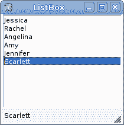
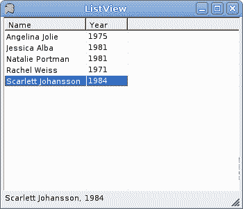
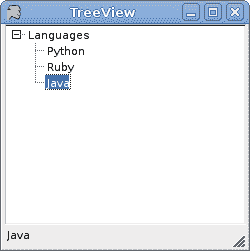

# 进阶控制

> 原文： [http://zetcode.com/gui/vbwinforms/advanced/](http://zetcode.com/gui/vbwinforms/advanced/)

在 Visual Basic Winforms 教程的这一部分中，我们介绍一些更高级的控件。 即`ListBox`，`ListView`和`TreeView`控件。

## 列表框控件

`ListBox`控件用于显示项目列表。 用户可以通过单击选择一个或多个项目。

```
' ZetCode Mono Visual Basic Winforms tutorial
'
' This program shows how to use
' the ListBox control. Item selected from 
' the ListBox is shown in the statusbar.
'
' author jan bodnar
' last modified May 2009
' website www.zetcode.com

Imports System.Windows.Forms
Imports System.Drawing

Public Class WinVBApp
    Inherits Form

    Private sb As StatusBar 

    Public Sub New

       Me.Text = "ListBox"
       Me.Size = New Size(210, 210)

       Me.InitUI

       Me.CenterToScreen

    End Sub

    Private Sub InitUI

        Dim lb As New ListBox
        lb.Parent = Me
        lb.Items.Add("Jessica")
        lb.Items.Add("Rachel")
        lb.Items.Add("Angelina")
        lb.Items.Add("Amy")
        lb.Items.Add("Jennifer")
        lb.Items.Add("Scarlett")

        lb.Dock = DockStyle.Fill

        sb = New StatusBar
        sb.Parent = Me

        AddHandler lb.SelectedIndexChanged, AddressOf Me.OnChanged

    End Sub

    Private Sub OnChanged(ByVal sender As Object, ByVal e As EventArgs)
        sb.Text = sender.SelectedItem
    End Sub

    Public Shared Sub Main
        Application.Run(New WinVBApp)
    End Sub

End Class

```

我们的示例显示了一个具有六个名称的列表框。 所选项目显示在状态栏中。

```
Dim lb As New ListBox
lb.Parent = Me

```

`ListBox`控件已创建。

```
lb.Items.Add("Jessica")

```

这就是我们向`ListBox`控件添加新项目的方式。 该控件具有`Items`属性。 该属性是对列表框中项目列表的引用。 使用此参考，我们可以添加，删除或获取列表框中的项目数。

```
AddHandler lb.SelectedIndexChanged, AddressOf Me.OnChanged

```

当我们选择一个项目时，会触发`SelectedIndexChanged`事件。

```
sb.Text = sender.SelectedItem

```

在`OnChanged`方法内部，我们将所选文本设置为状态栏。



Figure: ListBox

## 列表显示

`ListView`控件用于显示项目集合。 它是比`ListBox`控件更复杂的控件。 它可以在各种视图中显示数据，主要用于在多列视图中显示数据。

```
' ZetCode Mono Visual Basic Winforms tutorial
'
' This program shows how to use
' the ListView control. Item selected from 
' the ListView is shown in the statusbar.
'
' author jan bodnar
' last modified May 2009
' website www.zetcode.com

Imports System.Windows.Forms
Imports System.Drawing
Imports System.Collections.Generic

Public Class Actress

    Public Dim m_name As String
    Public Dim m_year As Integer

    Public Sub New(ByVal name As String, ByVal year As Integer)
        Me.m_name = name
        Me.m_year = year
    End Sub

End Class

Public Class WinVBApp
    Inherits Form

    Private Dim sb As StatusBar 
    Private Dim lv As ListView

    Public Sub New

       Me.Text = "ListView"
       Me.Size = New Size(350, 300)

       Me.InitUI

       Me.CenterToScreen

    End Sub

    Private Sub InitUI

        Dim actresses As New List(Of Actress)

        actresses.Add(New Actress("Jessica Alba", 1981))
        actresses.Add(New Actress("Angelina Jolie", 1975))
        actresses.Add(New Actress("Natalie Portman", 1981))
        actresses.Add(New Actress("Rachel Weiss", 1971))
        actresses.Add(New Actress("Scarlett Johansson", 1984))

        Dim name As New ColumnHeader
        name.Text = "Name"
        name.Width = -1
        Dim year As New ColumnHeader
        year.Text = "Year"

        Me.SuspendLayout

        lv = New ListView
        lv.Parent = Me
        lv.FullRowSelect = True
        lv.GridLines = True
        lv.AllowColumnReorder = True
        lv.Sorting = SortOrder.Ascending
        lv.Columns.AddRange(New ColumnHeader() {name, year})

        For Each act As Actress In actresses
            Dim item As New ListViewItem
            item.Text = act.m_name
            item.SubItems.Add(act.m_year.ToString())
            lv.Items.Add(item)
        Next

        lv.Dock = DockStyle.Fill

        sb = New StatusBar
        sb.Parent = Me
        lv.View = View.Details

        Me.ResumeLayout

        AddHandler lv.Click, AddressOf Me.OnChanged
        AddHandler lv.ColumnClick, AddressOf Me.OnColumnClick

    End Sub

    Private Sub OnChanged(ByVal sender As Object, ByVal e As EventArgs)

        Dim name As String = lv.SelectedItems(0).SubItems(0).Text
        Dim born As String = lv.SelectedItems(0).SubItems(1).Text
        sb.Text = name & ", " & born

    End Sub

    Private Sub OnColumnClick(ByVal sender As Object, _
                    ByVal e As ColumnClickEventArgs)

        If sender.Sorting = SortOrder.Ascending
            sender.Sorting = SortOrder.Descending
        Else 
            sender.Sorting = SortOrder.Ascending
        End If

    End Sub

    Public Shared Sub Main
        Application.Run(New WinVBApp)
    End Sub

End Class

```

在我们的示例中，我们有一个包含两列的列表视图。 在第一列中，我们显示女演员的名字。 在第二个他们的出生日期。 数据存储在`List`集合中。 通过选择一行，一行中的数据将显示在状态栏中。 另外，通过单击列标题，可以对数据进行排序。

```
Public Class Actress
    ...
End Class

```

我们使用`Actress`类存储数据。

```
Dim actresses As New List(Of Actress)

actresses.Add(New Actress("Jessica Alba", 1981))
actresses.Add(New Actress("Angelina Jolie", 1975))
...

```

我们创建项目并在项目中填充项目。

```
Dim name As New ColumnHeader
name.Text = "Name"
name.Width = -1

```

对于列表视图中的每一列，我们创建一个`ColumnHeader`。 通过将`Width`设置为-1，列的宽度等于列中最长的项目。

```
lv = New ListView
lv.Parent = Me

```

创建一个`ListView`控件。

```
lv.FullRowSelect = True
lv.GridLines = True
lv.AllowColumnReorder = True
lv.Sorting = SortOrder.Ascending

```

在这里，我们设置控件的四个属性。 该代码行支持全行选择，显示网格线，通过拖动列对列进行重新排序并以升序对数据进行排序。

```
lv.Columns.AddRange(New ColumnHeader() {name, year})

```

在这里，我们将两个`ColumnHeader`添加到`ListView`控件中。

```
For Each act As Actress In actresses
    Dim item As New ListViewItem
    item.Text = act.m_name
    item.SubItems.Add(act.m_year.ToString())
    lv.Items.Add(item)
Next

```

此循环填充 listview 控件。 每行都作为`ListViewItem`类添加到列表视图。

```
lv.View = View.Details

```

`ListView`控件可以具有不同的视图。 不同的视图以不同的方式显示数据。

```
Dim name As String = lv.SelectedItems(0).SubItems(0).Text
Dim born As String = lv.SelectedItems(0).SubItems(1).Text 
sb.Text = name & ", " & born

```

在`OnChanged`方法内部，我们从选定的行中获取数据并将其显示在状态栏上。

```
If sender.Sorting = SortOrder.Ascending
    sender.Sorting = SortOrder.Descending
Else 
    sender.Sorting = SortOrder.Ascending
End If

```

在这里，我们切换列的排序顺序。



Figure: ListView

## 树视图

`TreeView`控件显示项目的分层集合。 此控件中的每个项目都由`TreeNode`对象表示。

```
' ZetCode Mono Visual Basic Winforms tutorial
'
' This program shows how to use
' the ListBox control. Item selected from 
' the ListBox is shown in the statusbar.
'
' author jan bodnar
' last modified May 2009
' website www.zetcode.com

Imports System.Windows.Forms
Imports System.Drawing

Public Class WinVBApp
    Inherits Form

    Private Dim sb As StatusBar 
    Private Dim WithEvents tv As TreeView

    Public Sub New

       Me.Text = "TreeView"
       Me.Size = New Size(250, 250)

       Me.InitUI

       Me.CenterToScreen

    End Sub

    Private Sub InitUI

        tv = New TreeView

        Dim root As New TreeNode
        root.Text = "Languages"

        Dim child1 As New TreeNode
        child1.Text = "Python"

        Dim child2 As New TreeNode
        child2.Text = "Ruby"

        Dim child3 As New TreeNode
        child3.Text = "Java"

        root.Nodes.AddRange(New TreeNode() {child1, child2, child3})

        tv.Parent = Me
        tv.Nodes.Add(root)
        tv.Dock = DockStyle.Fill

        sb = New StatusBar
        sb.Parent = Me

    End Sub

    Private Sub OnSelected(ByVal sender As Object, _
            ByVal e As TreeViewEventArgs) Handles tv.AfterSelect
        sb.Text = e.Node.Text
    End Sub

    Public Shared Sub Main
        Application.Run(New WinVBApp)
    End Sub

End Class

```

这是`TreeView`控件的非常简单的演示。 我们有一个根项目和三个孩子。

```
tv = New TreeView

```

我们创建`TreeView`控件。

```
Dim root As New TreeNode
root.Text = "Languages"
...
tv.Nodes.Add(root)

```

在这里，我们创建一个根节点。

```
Dim child1 As New TreeNode
child1.Text = "Python"

```

子节点以类似的方式创建。

```
root.Nodes.AddRange(New TreeNode() {child1, child2, child3})

```

子节点插入到根节点的`Nodes`属性中。

```
Private Sub OnSelected(ByVal sender As Object, _
        ByVal e As TreeViewEventArgs) Handles tv.AfterSelect
    sb.Text = e.Node.Text
End Sub

```

处理事件的另一种方法是使用`Handles`关键字。



Figure: TreeView

在 Visual Basic Winforms 教程的这一部分中，我们介绍了 Winforms 库中提供的三个高级控件。