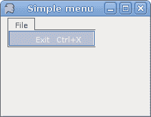
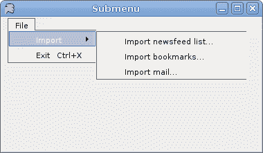
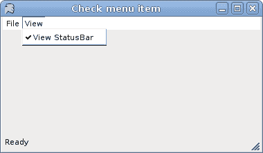
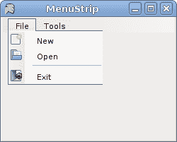
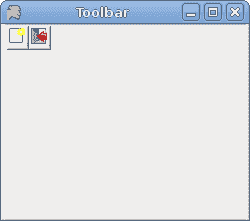

# 菜单和工具栏

> 原文： [http://zetcode.com/gui/vbwinforms/menustoolbars/](http://zetcode.com/gui/vbwinforms/menustoolbars/)

在 Visual Basic Winforms 教程的这一部分中，我们将讨论菜单和工具栏。

菜单栏是 GUI 应用程序中最可见的部分之一。 它是位于各个菜单中的一组命令。 在控制台应用程序中，您必须记住所有这些神秘命令，在这里，我们将大多数命令分组为逻辑部分。 有公认的标准可以进一步减少学习新应用程序的时间。

## 简单菜单

在第一个示例中，我们创建一个简单的菜单。

```
' ZetCode Mono Visual Basic Winforms tutorial
'
' This program shows a simple
' menu. It has one action, which
' will terminate the program, when
' selected. 
'
' author jan bodnar
' last modified May 2009
' website www.zetcode.com

Imports System.Windows.Forms
Imports System.Drawing

Public Class WinVBApp
    Inherits Form

    Public Sub New

       Me.Text = "Simple menu"
       Me.Size = New Size(220, 170)

       Me.InitUI

       Me.CenterToScreen

    End Sub

    Private Sub InitUI

        Dim ms As New MenuStrip
        ms.Parent = Me

        Dim fileItem As New ToolStripMenuItem("&File")    
        Dim exitItem As New ToolStripMenuItem("&Exit", Nothing, _
            New EventHandler(AddressOf OnExit))

        exitItem.ShortcutKeys = Keys.Control Or Keys.X
        fileItem.DropDownItems.Add(exitItem)

        ms.Items.Add(fileItem)
        MainMenuStrip = ms

    End Sub

    Private Sub OnExit(ByVal sender As Object, ByVal e As EventArgs)
        Me.Close
    End Sub

    Public Shared Sub Main
        Application.Run(New WinVBApp)
    End Sub

End Class 

```

在我们的示例中，我们有一个菜单栏和一个菜单。 菜单内有一个菜单项。 如果选择菜单项，则应用程序关闭。

注意如何关闭应用程序。 我们可以使用 `Ctrl` + `X` 快捷方式或按 `Alt` ， `F` ， `E` 键关闭它 。

```
Dim ms As New MenuStrip

```

`MenuStrip`为我们的表单创建一个菜单系统。 我们将`ToolStripMenuItem`对象添加到 MenuStrip 中，这些对象代表菜单结构中的各个菜单命令。 每个`ToolStripMenuItem`可以是您的应用程序的命令，也可以是其他子菜单项的父菜单。

```
Dim fileItem As New ToolStripMenuItem("&File")         

```

在这里，我们创建一个文件菜单。

```
Dim exitItem As New ToolStripMenuItem("&Exit", Nothing, _
    New EventHandler(AddressOf OnExit)) 

```

此行创建退出菜单项。

```
exitItem.ShortcutKeys = Keys.Control Or Keys.X

```

我们提供了退出菜单项的快捷方式。

```
fileItem.DropDownItems.Add(exitItem)

```

退出菜单项将添加到菜单对象的下拉项中。

```
ms.Items.Add(fileItem)          

```

在这里，我们将菜单对象添加到菜单栏中。

```
MainMenuStrip = ms

```

`MenuStrip`已插入表格。



Figure: Simple menu

## 子菜单

每个菜单项也可以有一个子菜单。 这样，我们可以将类似的命令分组。 例如，我们可以将隐藏/显示各种工具栏（例如个人栏，地址栏，状态栏或导航栏）的命令放置在称为工具栏的子菜单中。

```
' ZetCode Mono Visual Basic Winforms tutorial
'
' This program creates a submenu
'
' author jan bodnar
' last modified May 2009
' website www.zetcode.com

Imports System.Windows.Forms
Imports System.Drawing

Public Class WinVBApp
    Inherits Form

    Public Sub New

       Me.Text = "Submenu"
       Me.Size = New Size(380, 220)

       Me.InitUI

       Me.CenterToScreen

    End Sub

    Private Sub InitUI

        Dim ms As New MenuStrip
        ms.Parent = Me

        Dim fileItem As New ToolStripMenuItem("&File")    
        Dim exitItem As New ToolStripMenuItem("&Exit", Nothing, _
            New EventHandler(AddressOf OnExit))

        exitItem.ShortcutKeys = Keys.Control Or Keys.X

        Dim import As New ToolStripMenuItem
        import.Text = "Import"

        Dim temp As New ToolStripMenuItem
        temp.Text = "Import newsfeed list..."
        import.DropDownItems.Add(temp)

        temp = New ToolStripMenuItem
        temp.Text = "Import bookmarks..."
        import.DropDownItems.Add(temp)

        temp = New ToolStripMenuItem
        temp.Text = "Import mail..."

        import.DropDownItems.Add(temp)
        fileItem.DropDownItems.Add(import)
        fileItem.DropDownItems.Add(exitItem)

        ms.Items.Add(fileItem)
        Me.MainMenuStrip = ms

    End Sub

    Private Sub OnExit(ByVal sender As Object, ByVal e As EventArgs)
        Me.Close
    End Sub

    Public Shared Sub Main
        Application.Run(New WinVBApp)
    End Sub

End Class

```

在此示例中，我们创建一个子菜单。 子菜单导入具有三个菜单项。

```
Dim import As New ToolStripMenuItem
import.Text = "Import"

```

`ToolStripMenuItem`可以是菜单或菜单项。 在这里它将作为子菜单。

```
Dim temp As New ToolStripMenuItem
temp.Text = "Import newsfeed list..."
import.DropDownItems.Add(temp)

```

在这里，我们创建一个菜单项并将其添加到“导入”子菜单。



Figure: Submenu

## 检查菜单项

下一个代码示例演示如何创建选中的菜单项。

```
' ZetCode Mono Visual Basic Winforms tutorial
'
' This program creates a checked
' menu
'
' author jan bodnar
' last modified May 2009
' website www.zetcode.com

Imports System.Windows.Forms
Imports System.Drawing

Public Class WinVBApp
    Inherits Form

    Dim sb As Statusbar

    Public Sub New

       Me.Text = "Check menu item"
       Me.Size = New Size(380, 220)

       Me.InitUI

       Me.CenterToScreen

    End Sub

    Private Sub InitUI

        sb = New StatusBar
        sb.Parent = Me
        sb.Text = "Ready"

        Dim mainMenu As New MainMenu

        Dim file As MenuItem = mainMenu.MenuItems.Add("&File")
        file.MenuItems.Add(New MenuItem("E&xit", _
            New EventHandler(AddressOf OnExit), Shortcut.CtrlX))

        Dim view As MenuItem = mainMenu.MenuItems.Add("&View")
        Dim viewStatusBar As New MenuItem("View StatusBar")
        viewStatusBar.Checked = True
        view.MenuItems.Add(viewStatusBar)

        Me.Menu = mainMenu

        AddHandler viewStatusBar.Click, AddressOf Me.ToggleStatusBar

    End Sub

    Private Sub ToggleStatusBar(ByVal sender As Object, ByVal e As EventArgs) 

        Dim check As Boolean = sender.Checked

        If check 
            sb.Visible = False
            sender.Checked = False
        Else 
            sb.Visible = True
            sender.Checked = True
        End If

    End Sub

    Private Sub OnExit(ByVal sender As Object, ByVal e As EventArgs)
        Me.Close
    End Sub

    Public Shared Sub Main
        Application.Run(New WinVBApp)
    End Sub

End Class

```

我们有两个菜单。 文件和查看。 “查看”菜单具有一个菜单项，用于切换状态栏的可见性。

```
Dim mainMenu As New MainMenu

```

在此示例中，我们使用`MainMenu`控件。 要创建菜单栏，我们可以使用`MainMenu`或`MenuStrip`控件。 后者具有一些附加功能。

```
viewStatusBar.Checked = True

```

默认情况下会选中此菜单项，因为状态栏从应用程序的开始就可见。

```
Dim check As Boolean = sender.Checked

If check 
    sb.Visible = False
    sender.Checked = False
Else 
    sb.Visible = True
    sender.Checked = True
End If

```

我们确定菜单项是否被选中。 我们根据`check`值显示和隐藏状态栏和复选标记。



Figure: Check menu item

## 图像，分隔符

我们将进一步增强对`MenuStrip`控件的了解。 我们将创建一个带有图像的菜单项，并显示如何使用分隔符将其分开。

```
' ZetCode Mono Visual Basic Winforms tutorial
'
' This program shows how to add images and
' separators to menu items
'
' author jan bodnar
' last modified May 2009
' website www.zetcode.com

Imports System.Windows.Forms
Imports System.Drawing

Public Class WinVBApp
    Inherits Form

    Public Sub New

       Me.Text = "MenuStrip"
       Me.Size = New Size(250, 200)

       Me.InitUI

       Me.CenterToScreen

    End Sub

    Private Sub InitUI

        Dim menuStrip As New MenuStrip

        Dim titem1 As New ToolStripMenuItem("File")
        menuStrip.Items.Add(titem1)

        Dim titem2 As New ToolStripMenuItem("Tools")
        menuStrip.Items.Add(titem2)

        Dim subm1 As New ToolStripMenuItem("New")  
        subm1.Image = Image.FromFile("new.png")
        titem1.DropDownItems.Add(subm1)

        Dim subm2 As New ToolStripMenuItem("Open") 
        subm2.Image = Image.FromFile("open.png")
        titem1.DropDownItems.Add(subm2)

        titem1.DropDownItems.Add(New ToolStripSeparator)

        Dim subm3 As New ToolStripMenuItem("Exit")
        subm3.Image = Image.FromFile("exit.png")
        titem1.DropDownItems.Add(subm3)

        AddHandler subm3.Click, AddressOf Me.OnExit

        Controls.Add(menuStrip)

        MainMenuStrip = menuStrip

    End Sub

    Private Sub OnExit(ByVal sender As Object, ByVal e As EventArgs)
        Me.Close
    End Sub

    Public Shared Sub Main
        Application.Run(New WinVBApp)
    End Sub

End Class

```

我们的代码示例中有两个菜单。 文件和工具。 在文件中，我们有三个带有图像的菜单项。 我们还有一个分隔符。 在此示例中，PNG 图像必须位于当前工作目录中。

```
Dim subm1 As New ToolStripMenuItem("New")  
subm1.Image = Image.FromFile("new.png")
titem1.DropDownItems.Add(subm1)

```

在这里，我们创建第一个菜单项。 要将图像添加到项目，我们将`Image`属性设置为图像。 我们使用静态`FromFile`方法从指定的文件创建一个 Image。

```
titem1.DropDownItems.Add(New ToolStripSeparator)

```

在这里，我们向“文件”菜单添加分隔符。



Figure: Images and separator

## 工具栏

菜单将我们可以在应用程序中使用的所有命令分组。 使用工具栏可以快速访问最常用的命令。 `ToolBar`控件用于显示`ToolBarButton`控件。 我们可以通过创建`ImageList`将图像分配给按钮。 然后，我们将图像列表分配给工具栏的`ImageList`属性，并为每个`ToolBarButton`将图像索引值分配给`ImageIndex`属性。

```
' ZetCode Mono Visual Basic Winforms tutorial
'
' This program creates a toolbar
'
' author jan bodnar
' last modified May 2009
' website www.zetcode.com

Imports System.Windows.Forms
Imports System.Drawing

Public Class WinVBApp
    Inherits Form

    Dim sb As Statusbar

    Public Sub New

       Me.Text = "Toolbar"
       Me.Size = New Size(250, 220)

       Me.InitUI

       Me.CenterToScreen

    End Sub

    Private Sub InitUI

        Dim toolBar As New ToolBar
        toolBar.Parent = Me
        Dim toolBarIcons As New ImageList
        Dim saveb As New ToolBarButton
        Dim exitb As New ToolBarButton

        saveb.ImageIndex = 0
        saveb.Tag = "Save"
        exitb.ImageIndex = 1
        exitb.Tag = "Exit"

        toolBar.ImageList = toolBarIcons
        toolBar.ShowToolTips = True
        toolBar.Buttons.AddRange(New ToolBarButton() {saveb, exitb})

        toolBarIcons.Images.Add(New Icon("new.ico"))
        toolBarIcons.Images.Add(New Icon("exit.ico"))

        AddHandler toolBar.ButtonClick, AddressOf Me.OnClicked

    End Sub

    Private Sub OnClicked(ByVal sender As Object, _
        ByVal e As ToolBarButtonClickEventArgs)

        If e.Button.Tag.Equals("Exit")
            Me.Close
        End If
    End Sub

    Public Shared Sub Main
        Application.Run(New WinVBApp)
    End Sub

End Class

```

在我们的示例中，我们在工具栏上显示了两个按钮。

```
Dim toolBar As New ToolBar

```

在这里，我们创建`ToolBar`控件。

```
toolBar.ImageList = toolBarIcons

```

创建图像列表。

```
Dim saveb As New ToolBarButton
Dim exitb As New ToolBarButton

```

这是两个工具栏按钮。

```
saveb.ImageIndex = 0

```

我们确定图像列表中的哪个图标将用于保存工具栏按钮。

```
toolBar.Buttons.AddRange(New ToolBarButton() {saveb, exitb})

```

`ToolBarButton`控件已添加到工具栏。

```
toolBarIcons.Images.Add(New Icon("new.ico"))
toolBarIcons.Images.Add(New Icon("exit.ico"))

```

图标将添加到图像列表。

```
If e.Button.Tag.Equals("Exit")
    Me.Close
End If

```

如果按钮的标签等于“退出”，我们将关闭该应用程序。



Figure: ToolBar

Visual Basic Winforms 教程的这一部分是关于菜单和工具栏的。