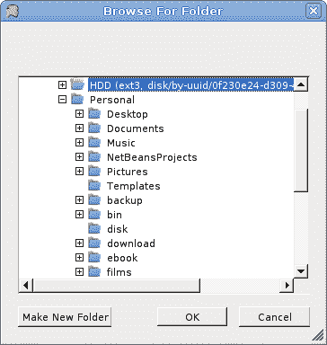
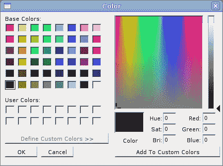
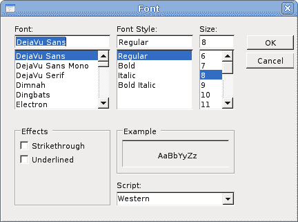
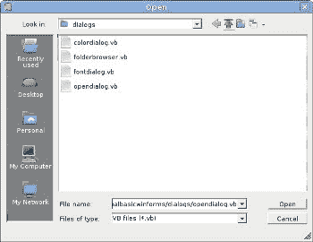

# 对话方块

> 原文： [http://zetcode.com/gui/vbwinforms/dialogs/](http://zetcode.com/gui/vbwinforms/dialogs/)

在 Visual Basic Winforms 教程的这一部分中，我们将讨论对话框。

对话框窗口或对话框是大多数现代 GUI 应用程序必不可少的部分。 对话被定义为两个或更多人之间的对话。 在计算机应用程序中，对话框是一个窗口，用于与应用程序“对话”。 对话框用于输入数据，修改数据，更改应用程序设置等。对话框是用户与计算机程序之间进行通信的重要手段。

基本上有两种类型的对话框。 预定义对话框和自定义对话框。

## 文件夹浏览器对话框

此对话框提示用户选择一个文件夹。

```
' ZetCode Mono Visual Basic Winforms tutorial
'
' In this program we select a directory with a
' FolderBrowser dialog. The selected directory's
' name is shown in the statusbar. 
'
' author jan bodnar
' last modified May 2009
' website www.zetcode.com

Imports System.Windows.Forms
Imports System.Drawing

Public Class WinVBApp
    Inherits Form

    Dim statusbar As StatusBar

    Public Sub New

       Me.Text = "FolderBrowserDialog"
       Me.Size = New Size(300, 250)

       Me.InitUI

       Me.CenterToScreen

    End Sub

    Private Sub InitUI

        Dim toolbar As New ToolBar
        Dim open As New ToolBarButton

        statusbar = New StatusBar
        statusbar.Parent = Me

        toolbar.Buttons.Add(open)

        Me.Controls.Add(toolbar)

        AddHandler toolbar.ButtonClick, AddressOf Me.OnClicked

    End Sub

    Private Sub OnClicked(ByVal sender As Object, _
                    ByVal e As ToolBarButtonClickEventArgs)

        Dim dialog As New FolderBrowserDialog

        If dialog.ShowDialog(Me) = DialogResult.OK
           statusbar.Text = dialog.SelectedPath
        End If

    End Sub

    Public Shared Sub Main
        Application.Run(New WinVBApp)
    End Sub

End Class

```

我们有一个工具栏和一个工具栏按钮。 点击按钮，`FolderBrowserDialog`出现在屏幕上。 所选文件夹的名称显示在状态栏中。

```
Dim dialog As New FolderBrowserDialog

```

`FolderBrowserDialog`已创建。

```
If dialog.ShowDialog(Me) = DialogResult.OK
    statusbar.Text = dialog.SelectedPath
End If    

```

`ShowDialog`方法在屏幕上显示对话框。 如果单击对话框的“确定”按钮，则所选的目录路径将显示在状态栏上。



Figure: FolderBrowserDialog

## 色彩对话

此对话框显示可用的颜色以及使用户能够定义自定义颜色的控件。

```
' ZetCode Mono Visual Basic Winforms tutorial
'
' In this program we use the ColorDialog
' to change a color of a rectangle
'
' author jan bodnar
' last modified May 2009
' website www.zetcode.com

Imports System.Windows.Forms
Imports System.Drawing

Public Class WinVBApp
    Inherits Form

    Private col As Color

    Private Const rectWidth As Integer = 100
    Private Const rectHeight As Integer = 100
    Private Dim r As Rectangle

    Public Sub New

       Me.Text = "ColorDialog"
       Me.Size = New Size(300, 250)

       Me.InitUI

       Me.CenterToScreen

    End Sub

    Private Sub InitUI

        Dim tbar As New ToolBar
        Dim open As New ToolBarButton

        col = Color.Blue

        tbar.Buttons.Add(open)

        Me.LocateRect

        Me.SetStyle(ControlStyles.ResizeRedraw, True)
        Controls.Add(tbar)

        AddHandler Me.Paint, AddressOf Me.OnPaint
        AddHandler tbar.ButtonClick, AddressOf Me.OnClicked

    End Sub

    Private Sub OnPaint(ByVal sender As Object, ByVal e As PaintEventArgs)

      Dim g As Graphics = e.Graphics
      Me.LocateRect

      Dim brsh As New SolidBrush(col)

      g.FillRectangle(brsh, r)    

    End Sub

    Private Sub OnClicked(ByVal sender As Object, _ 
                    ByVal e As ToolBarButtonClickEventArgs)

       Dim dialog As New ColorDialog

       If dialog.ShowDialog(Me) = DialogResult.OK
          col = dialog.Color
          Me.Invalidate
       End If

    End Sub

    Private Sub LocateRect
        Dim x As Integer = (Me.ClientSize.Width - rectWidth) / 2
        Dim y As Integer = (Me.ClientSize.Height - rectHeight) / 2
        r = New Rectangle(x, y, rectWidth, rectHeight)
    End Sub

    Public Shared Sub Main
        Application.Run(New WinVBApp)
    End Sub

End Class

```

在此代码示例中，我们使用`ColorDialog`为位于窗体控件中间的矩形选择颜色。

```
col = Color.Blue

```

开始时，矩形的颜色是蓝色。 我们使用`col`变量来确定矩形的颜色。

```
Dim dialog As New ColorDialog

```

`ColorDialog`已创建。

```
If dialog.ShowDialog(Me) = DialogResult.OK
  col = dialog.Color
  Me.Invalidate
End If

```

该代码显示颜色对话框。 如果单击“确定”按钮，则将获得选定的颜色并调用`Invalidate`方法。 该方法会使控件的整个表面无效，并使控件重画。 结果是用新的颜色值绘制了矩形。



Figure: ColorDialog

## 字体对话框

`FontDialog`用于选择字体。

```
' ZetCode Mono Visual Basic Winforms tutorial
'
' In this program we use the FontDialog
' to change a font of a label
'
' author jan bodnar
' last modified May 2009
' website www.zetcode.com

Imports System.Windows.Forms
Imports System.Drawing

Public Class WinVBApp
    Inherits Form

    Private Dim txt As Label

    Public Sub New

       Me.Text = "FontDialog"
       Me.Size = New Size(300, 250)

       Me.InitUI

       Me.CenterToScreen

    End Sub

    Private Sub InitUI

        Dim tbar As New ToolBar
        tbar.Parent = Me

        Dim open As New ToolBarButton
        tbar.Buttons.Add(open)

        txt = New Label
        txt.Parent = Me
        txt.Text = "Winforms tutorial"

        Me.LocateText

        txt.AutoSize = True

        AddHandler Me.Resize, AddressOf Me.OnResize
        AddHandler tbar.ButtonClick, AddressOf Me.OnClicked

    End Sub

    Private Sub OnClicked(ByVal sender As Object, _ 
                    ByVal e As ToolBarButtonClickEventArgs)

       Dim dialog As New FontDialog

       If dialog.ShowDialog(Me) = DialogResult.OK
          txt.Font = dialog.Font
          Me.LocateText
       End If

    End Sub

    Private Sub LocateText
        txt.Top = (Me.ClientSize.Height - txt.Height) / 2
        txt.Left = (Me.ClientSize.Width - txt.Width) / 2
    End Sub

    Private Sub OnResize(ByVal sender As Object, ByVal e As EventArgs)
         Me.LocateText
    End Sub

    Public Shared Sub Main
        Application.Run(New WinVBApp)
    End Sub

End Class

```

我们在表单控件的中间绘制一些文本。 我们使用字体对话框更改此文本的字体。

```
Dim dialog As New FontDialog

```

`FontDialog`已创建。

```
If dialog.ShowDialog(Me) = DialogResult.OK
  txt.Font = dialog.Font
  Me.LocateText
End If

```

单击“确定”按钮时，将为`Label`控件设置新选择的字体。 由于文本的大小会随着字体的变化而变化，因此我们必须调用`LocateText`方法，该方法将文本定位在表单控件的中间。



Figure: FontDialog

## 打开对话框

此对话框用于打开文件。

```
' ZetCode Mono Visual Basic Winforms tutorial
'
' In this program we use the OpenDialog to
' open a file and show its contents in 
' a TextBox control
'
' author jan bodnar
' last modified May 2009
' website www.zetcode.com

Imports System.Windows.Forms
Imports System.Drawing
Imports System.IO

Public Class WinVBApp
    Inherits Form

    Private txtBox As TextBox

    Public Sub New

       Me.Text = "OpenDialog"
       Me.Size = New Size(300, 250)

       Me.InitUI

       Me.CenterToScreen

    End Sub

    Private Sub InitUI

        Dim tbar As New ToolBar
        tbar.Parent = Me

        Dim open As New ToolBarButton
        tbar.Buttons.Add(open)

        txtBox = New TextBox
        txtBox.Parent = Me
        txtBox.Multiline = True
        txtBox.ScrollBars = ScrollBars.Both
        txtBox.WordWrap = False
        txtBox.Parent = Me
        txtBox.Dock = DockStyle.Fill

        AddHandler tbar.ButtonClick, AddressOf Me.OnClicked

    End Sub

    Private Sub OnClicked(ByVal sender As Object, _ 
                    ByVal e As ToolBarButtonClickEventArgs)

       Dim dia As New OpenFileDialog
       dia.Filter = "VB files (*.vb)|*.vb"

       If dia.ShowDialog(Me) = DialogResult.OK

           Dim reader As New StreamReader(dia.FileName)
           Dim data As String = reader.ReadToEnd

           reader.Close
           txtBox.Text = data

       End If

    End Sub

    Public Shared Sub Main
        Application.Run(New WinVBApp)
    End Sub

End Class

```

我们使用`OpenDialog`控件打开 VB 源文件。 我们有一个`TextBox`控件，用于显示文件。

```
Dim dia As New OpenFileDialog

```

`OpenDialog`已创建。

```
dia.Filter = "VB files (*.vb)|*.vb"

```

我们将`Filter`属性设置为 VB 源文件。 此对话框实例只能选择 VB 文件。

```
If dia.ShowDialog(Me) = DialogResult.OK

    Dim reader As New StreamReader(dia.FileName)
    Dim data As String = reader.ReadToEnd

    reader.Close
    txtBox.Text = data

End If

```

单击确定后，我们读取所选文件的内容并将其放入`TextBox`控件。



Figure: OpenDialog

在 Visual Basic Winforms 教程的这一部分中，我们显示了各种对话框。