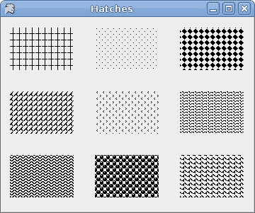
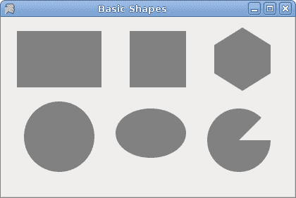
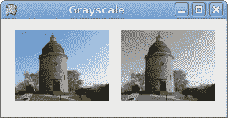
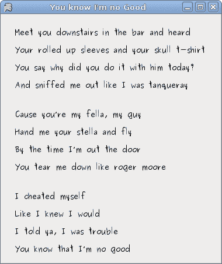
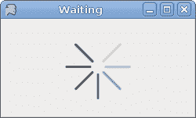

# 绘图

> 原文： [http://zetcode.com/gui/vbwinforms/painting/](http://zetcode.com/gui/vbwinforms/painting/)

在 Visual Basic Winforms 教程的这一部分中，我们将进行绘图。 当我们想要更改或增强现有控件时，将使用绘图。 或者，如果我们要从头开始创建自定义控件。 要进行绘图，我们使用 Winforms 库提供的绘图 API。 绘图是在一种方法中完成的，我们将其插入`Paint`事件。

`System.Drawing`名称空间提供对`GDI+`基本图形功能的访问。 `System.Drawing.Drawing2D`，`System.Drawing.Imaging`和`System.Drawing.Text`命名空间中提供了更高级的功能。 `Graphics`类提供了在表单上绘图的方法。

## `HatchBrush`

`HatchBrush`对象用于填充形状的内部。 我们可以使用几种内置模式。

```vb
' ZetCode Mono Visual Basic Winforms tutorial
'
' This program draws nine rectangles.
' The interiors are filled with
' different built-in patterns.
'
' author jan bodnar
' last modified May 2009
' website www.zetcode.com

Imports System.Windows.Forms
Imports System.Drawing
Imports System.Drawing.Drawing2D

Public Class WinVBApp
    Inherits Form

    Public Sub New

       Me.Text = "Hatches"
       Me.Size = New Size(360, 300)

       AddHandler Me.Paint AddressOf Me.OnPaint

       Me.CenterToScreen

    End Sub

    Private Sub OnPaint(ByVal sender As Object, ByVal e As PaintEventArgs)

        Dim g As Graphics = e.Graphics

        Dim hb As HatchBrush = New HatchBrush(HatchStyle.Cross, Color.Black, Me.BackColor)
        g.FillRectangle(hb, 10, 15, 90, 60)

        hb = New HatchBrush(HatchStyle.Percent05, Color.Black, Me.BackColor)
        g.FillRectangle(hb, 130, 15, 90, 60)

        hb = New HatchBrush(HatchStyle.SolidDiamond, Color.Black, Me.BackColor)
        g.FillRectangle(hb, 250, 15, 90, 60)

        hb = New HatchBrush(HatchStyle.DiagonalBrick, Color.Black, Me.BackColor)
        g.FillRectangle(hb, 10, 105, 90, 60)

        hb = New HatchBrush(HatchStyle.Divot, Color.Black, Me.BackColor)
        g.FillRectangle(hb, 130, 105, 90, 60)

        hb = New HatchBrush(HatchStyle.Wave, Color.Black, Me.BackColor)
        g.FillRectangle(hb, 250, 105, 90, 60)

        hb = New HatchBrush(HatchStyle.ZigZag, Color.Black, Me.BackColor)
        g.FillRectangle(hb, 10, 195, 90, 60)

        hb = New HatchBrush(HatchStyle.Sphere, Color.Black, Me.BackColor)
        g.FillRectangle(hb, 130, 195, 90, 60)

        hb = New HatchBrush(HatchStyle.Shingle, Color.Black, Me.BackColor)
        g.FillRectangle(hb, 250, 195, 90, 60)

        g.Dispose
        hb.Dispose

    End Sub

    Public Shared Sub Main
        Application.Run(New WinVBApp)
    End Sub

End Class

```

这次，我们用九种不同的图案（称为剖面线）填充了九个矩形。

```vb
Dim hb As HatchBrush = New HatchBrush(HatchStyle.Cross, Color.Black, Me.BackColor)

```

在这里，我们创建一个`HatchBrush`对象。 参数是图案填充样式以及前景色和背景色。 背景颜色设置为表单的颜色，因此看起来就像我们在表单上绘制的一样。

```vb
g.FillRectangle(hb, 10, 15, 90, 60)

```

我们使用指定的阴影刷填充矩形。



Figure: Hatches

## 基本形状

下面的示例在窗体控件上绘制一些基本形状。

```vb
' ZetCode Mono Visual Basic Winforms tutorial
'
' This program draws basic shapes available
' in Winforms
'
' author jan bodnar
' last modified May 2009
' website www.zetcode.com

Imports System.Windows.Forms
Imports System.Drawing
Imports System.Drawing.Drawing2D
Imports System.Collections.Generic

Public Class WinVBApp
    Inherits Form

    Public Sub New

       Me.Text = "Basic Shapes"
       Me.Size = New Size(420, 280)

       AddHandler Me.Paint AddressOf Me.OnPaint

       Me.CenterToScreen

    End Sub

    Private Sub OnPaint(ByVal sender As Object, ByVal e As PaintEventArgs)

        Dim g As Graphics = e.Graphics
        g.SmoothingMode = SmoothingMode.AntiAlias

        g.FillRectangle(Brushes.Gray, 20, 20, 120, 80)
        g.FillRectangle(Brushes.Gray, 180, 20, 80, 80)

        g.FillEllipse(Brushes.Gray, 30, 120, 100, 100)
        g.FillEllipse(Brushes.Gray, 160, 130, 100, 70)

        Dim points(5) As Point

        points(0) = New Point(300, 40)
        points(1) = New Point(340, 15)
        points(2) = New Point(380, 40)
        points(3) = New Point(380, 80)
        points(4) = New Point(340, 105)
        points(5) = New Point(300, 80)

        g.FillPolygon(Brushes.Gray, points)
        g.FillPie(Brushes.Gray, New Rectangle(290, 130, 90, 90), 0, 315)

        g.Dispose

    End Sub

    Public Shared Sub Main
        Application.Run(New WinVBApp)
    End Sub

End Class

```

该代码示例在表单上绘制六个形状。 矩形，正方形，圆形，椭圆形，多边形和扇形。

```vb
g.SmoothingMode = SmoothingMode.AntiAlias

```

这使绘图更平滑。

```vb
g.FillRectangle(Brushes.Gray, 20, 20, 120, 80)

```

这条线用灰色填充矩形。 参数是画笔颜色，矩形左上角的 x，y 坐标以及矩形的宽度和高度。

```vb
Dim points(5) As Point

points(0) = New Point(300, 40)
points(1) = New Point(340, 15)
...

```

我们创建五个点的数组。

```vb
g.FillPolygon(Brushes.Gray, points)

```

这条线绘制了一个包含六个单点的多边形。

```vb
g.FillPie(Brushes.Gray, New Rectangle(290, 130, 90, 90), 0, 315)

```

这条线画了一个馅饼。 最后两个参数是起始角度和后掠角度。 以度为单位。



Figure: Basic shapes

## 透明矩形

透明性是指能够透视材料的质量。 了解透明度的最简单方法是想象一块玻璃或水。 从技术上讲，光线可以穿过玻璃，这样我们就可以看到玻璃后面的物体。

在计算机图形学中，我们可以使用 alpha 合成来实现透明效果。 Alpha 合成是将图像与背景组合以创建部分透明外观的过程。 合成过程使用 Alpha 通道。 （wikipedia.org，answers.com）

```vb
' ZetCode Mono Visual Basic Winforms tutorial
'
' This program draws ten
' rectangles with different
' levels of transparency
'
' author jan bodnar
' last modified May 2009
' website www.zetcode.com

Imports System.Windows.Forms
Imports System.Drawing
Imports System.Drawing.Drawing2D
Imports System.Collections.Generic

Public Class WinVBApp
    Inherits Form

    Public Sub New

       Me.Text = "Transparent rectangles"
       Me.Size = New Size(590, 110)

       AddHandler Me.Paint AddressOf Me.OnPaint

       Me.CenterToScreen

    End Sub

    Private Sub OnPaint(ByVal sender As Object, ByVal e As PaintEventArgs)

        Dim g As Graphics = e.Graphics

        For i As Integer = 1 to 10
            Dim color As Color = Color.FromArgb(i*25, 0, 0, 255)
            Dim brush As Brush = New SolidBrush(color)
            g.FillRectangle(brush, 50*i, 20, 40, 40)
        Next

        g.Dispose

    End Sub

    Public Shared Sub Main
        Application.Run(New WinVBApp)
    End Sub

End Class

```

在示例中，我们将绘制十个具有不同透明度级别的矩形。

```vb
Dim color As Color = Color.FromArgb(i*25, 0, 0, 255)

```

该行创建一个颜色对象。 第一个值是 Alpha 透明度。

```vb
Dim brush As Brush = New SolidBrush(color)

```

我们用颜色创建画笔。

```vb
g.FillRectangle(brush, 50*i, 20, 40, 40)

```

我们用颜色填充矩形。


Figure: Transparent rectangles

## 灰度图像

下面的示例创建一个灰度图像。

```vb
' ZetCode Mono Visual Basic Winforms tutorial
'
' This program draws creates a grayscale 
' clone of a bitmap image
'
' author jan bodnar
' last modified May 2009
' website www.zetcode.com

Imports System.Windows.Forms
Imports System.Drawing
Imports System.Drawing.Drawing2D

Public Class WinVBApp
    Inherits Form

    Private rotunda As Bitmap
    Private gs As Bitmap

    Public Sub New

       Me.Text = "Grayscale"
       Me.Size = New Size(290, 150)

       rotunda = Me.LoadImage
       gs = GrayScale(rotunda.Clone)

       AddHandler Me.Paint AddressOf Me.OnPaint

       Me.CenterToScreen

    End Sub

    Private Function LoadImage As Bitmap

        Try
            rotunda = New Bitmap("rotunda.jpg")
            Return rotunda
        Catch
            Console.WriteLine("Image not found")
            Environment.Exit(1)
        End Try

    End Function

    Private Function GrayScale(ByVal image As Bitmap) As Bitmap

        Dim w As Integer = image.Width
        Dim h As Integer = image.Height

        For i as Integer = 0 To w-1
            For j As Integer = 0 To h-1
                Dim c As Color = image.GetPixel(i, j)
                Dim lum As Double = 0.299*c.R + 0.587*c.G + 0.114*c.B
                image.SetPixel(i, j, Color.FromArgb(lum, lum, lum))
            Next
        Next

        Return image

    End Function

    Private Sub OnPaint(ByVal sender As Object, ByVal e As PaintEventArgs)

        Dim g As Graphics = e.Graphics

        Dim r1 As New Rectangle(15, 15, rotunda.Width, rotunda.Height)
        g.DrawImage(rotunda, r1)

        Dim r2 As New Rectangle(150, 15, gs.Width, gs.Height)
        g.DrawImage(gs, r2)

        g.Dispose

    End Sub

    Public Shared Sub Main
        Application.Run(New WinVBApp)
    End Sub

End Class

```

我们的示例中有两个图像。 一种颜色和一种灰度。

```vb
rotunda = Me.LoadImage

```

`LoadImage`方法从磁盘的当前工作目录加载位图。

```vb
gs = GrayScale(rotunda.Clone)

```

`GrayScale`方法从彩色图像制作灰度图像。 我们将圆形大厅图像的副本作为此方法的参数。

```vb
Dim c As Color = image.GetPixel(i, j)

```

我们得到一个像素的颜色。

```vb
Dim lum As Double = 0.299*c.R + 0.587*c.G + 0.114*c.B

```

该方程式计算灰度图像的亮度。 如果我们使用这些因素来缩放颜色的红色，绿色和蓝色部分，则人眼会将图像视为灰色。

```vb
image.SetPixel(i, j, Color.FromArgb(lum, lum, lum))

```

我们修改像素。



Figure: Grayscale image

## 绘制文字

要在 Winforms `Form`上绘制文本，我们使用`DrawString`方法。

```vb
' ZetCode Mono Visual Basic Winforms tutorial
'
' This program draws lyrics of
' a song
'
' author jan bodnar
' last modified May 2009
' website www.zetcode.com

Imports System.Windows.Forms
Imports System.Drawing
Imports System.Drawing.Drawing2D
Imports System.Collections.Generic

Public Class WinVBApp
    Inherits Form

    Public Sub New

       Me.Text = "You know I'm no Good"
       Me.Size = New Size(380, 450)

       AddHandler Me.Paint AddressOf Me.OnPaint

       Me.CenterToScreen

    End Sub

    Private Sub OnPaint(ByVal sender As Object, ByVal e As PaintEventArgs)

        Dim g As Graphics = e.Graphics

        Dim ft As New Font("Purisa", 10)
        Dim br As New SolidBrush(Color.Black)

        Dim pt As PointF = New PointF(20.0f, 20.0f)     
        g.DrawString("Meet you downstairs in the bar and heard", ft, br, pt)

        pt = New PointF(20.0f, 50.0f)
        g.DrawString("Your rolled up sleeves and your skull t-shirt", ft, br, pt)

        pt = New PointF(20.0f, 80.0f)
        g.DrawString("You say why did you do it with him today?", ft, br, pt)

        pt = New PointF(20.0f, 110.0f)  
        g.DrawString("And sniffed me out like I was tanqueray", ft, br, pt)

        pt = New PointF(20.0f, 160.0f)             
        g.DrawString("Cause you’re my fella, my guy", ft, br, pt)

        pt = New PointF(20.0f, 190.0f)       
        g.DrawString("Hand me your stella and fly", ft, br, pt)

        pt = New PointF(20.0f, 220.0f)             
        g.DrawString("By the time I’m out the door", ft, br, pt)

        pt = New PointF(20.0f, 250.0f)             
        g.DrawString("You tear me down like roger moore", ft, br, pt)

        pt = New PointF(20.0f, 300.0f)             
        g.DrawString("I cheated myself", ft, br, pt)

        pt = New PointF(20.0f, 330.0f)             
        g.DrawString("Like I knew I would", ft, br, pt)

        pt = New PointF(20.0f, 360.0f)
        g.DrawString("I told ya, I was trouble", ft, br, pt)

        pt = New PointF(20.0f, 390.0f)
        g.DrawString("You know that I’m no good", ft, br, pt)

        ft.Dispose
        br.Dispose
        g.Dispose

    End Sub

    Public Shared Sub Main
        Application.Run(New WinVBApp)
    End Sub

End Class

```

在我们的示例中，我们在 Winforms 窗体上绘制歌曲的歌词。

```vb
Dim ft As New Font("Purisa", 10)

```

我们使用 10 磅高的 Purisa 字体。

```vb
Dim pt As PointF = New PointF(20.0f, 20.0f) 

```

要在表单上绘制字符串，我们必须使用浮点值。

```vb
g.DrawString("Meet you downstairs in the bar and heard", ft, br, pt)

```

`DrawString`方法采用以下参数：要绘制的文本，字体，笔刷和`PointF`对象。



Figure: Lyrics

## 等待

在此示例中，我们使用透明效果创建一个等待演示。 我们将绘制 8 条线，这些线将逐渐消失，从而产生一种错觉，即一条线在移动。 这种效果通常用于通知用户，一项艰巨的任务正在幕后进行。 一个示例是通过互联网流式传输视频。

```vb
' ZetCode Mono Visual Basic Winforms tutorial
'
' This program creates a waiting
' demo
'
' author jan bodnar
' last modified May 2009
' website www.zetcode.com

Imports System.Windows.Forms
Imports System.Drawing
Imports System.Drawing.Drawing2D
Imports System.Collections.Generic

Public Class WinVBApp
    Inherits Form

    Dim trs(,) As Integer = New Integer(,) { _
        { 0, 35, 70, 100, 150, 180, 210, 250 }, _
        { 250, 0, 35, 70, 100, 150, 180, 210 }, _
        { 210, 250, 0, 35, 70, 100, 150, 180 }, _
        { 180, 210, 250, 0, 35, 70, 100, 150 }, _
        { 150, 180, 210, 250, 0, 35, 70, 100 }, _
        { 100, 150, 180, 210, 250, 0, 35, 70 }, _
        { 70, 100, 150, 180, 210, 250, 0, 35 }, _
        { 35, 70, 100, 150, 180, 210, 250, 0 } _
    }

    Dim count As Integer = 0
    Dim timer As Timer

    Public Sub New

       Me.Text = "Waiting"
       Me.Size = New Size(250, 150)

       timer = New Timer
       timer.Enabled = True
       timer.Interval = 80

       AddHandler timer.Tick, AddressOf Me.OnTick
       AddHandler Me.Paint, AddressOf Me.OnPaint

       Me.CenterToScreen

    End Sub

    Private Sub OnTick(ByVal sender As Object, ByVal e As EventArgs)
        count = count + 1
        Me.Refresh
    End Sub

    Private Sub OnPaint(ByVal sender As Object, ByVal e As PaintEventArgs)

        Dim g As Graphics = e.Graphics
        g.SmoothingMode = SmoothingMode.AntiAlias

        Dim si As Size = Me.ClientSize
        g.TranslateTransform(si.Width/2, si.Height/2)

        For i As Integer = 0 To 7 
            Dim color As Color = Color.FromArgb(trs(count Mod 8, i), 30, 30, 30)
            Dim pen As New Pen(color, 3)
            pen.StartCap = LineCap.Round
            pen.EndCap = LineCap.Round
            g.DrawLine(pen, 0, -10, 0, -40)
            g.RotateTransform(45)
            pen.Dispose
        Next

        g.Dispose

    End Sub

    Public Shared Sub Main
        Application.Run(New WinVBApp)
    End Sub

End Class

```

我们用八个不同的 alpha 值绘制八条线。

```vb
timer = New Timer
timer.Enabled = True
timer.Interval = 80

AddHandler timer.Tick, AddressOf Me.OnTick

```

我们使用`Timer`制作动画。

```vb
Dim trs(,) As Integer = New Integer(,) { _
    { 0, 35, 70, 100, 150, 180, 210, 250 }, _
...
}

```

这是此演示中使用的透明度值的二维集合。 有 8 行，每行一种状态。 8 行中的每行将连续使用这些值。

```vb
Dim pen As New Pen(color, 3)
pen.StartCap = LineCap.Round
pen.EndCap = LineCap.Round

```

我们使线条更粗一些，以便更好地显示它们。 我们用带帽的线画线。

```vb
Dim color As Color = Color.FromArgb(trs(count Mod 8, i), 30, 30, 30)

```

在这里，我们定义了一条线的透明度值。

```vb
g.DrawLine(pen, 0, -10, 0, -40)
g.RotateTransform(45)

```

我们画了 8 条线。 它们是顺时针旋转的。



Figure: Waiting

在本章中，我们使用 Visual Basic 在 Winforms 中进行了一些绘图。