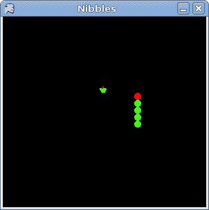

# 轻咬

> 原文： [http://zetcode.com/gui/vbwinforms/nibbles/](http://zetcode.com/gui/vbwinforms/nibbles/)

在 Mono Winforms 编程教程的这一部分中，我们将创建 Nibbles 游戏克隆。

## 半字节游戏

Nibbles 是较旧的经典视频游戏。 它最初是在 70 年代后期创建的。 后来它被带到 PC 上。 在这个游戏中，玩家控制蠕虫。 目的是尽可能多地吃苹果。 蠕虫每次吃一个苹果，它的身体就会长大。 它必须避开墙壁和自己的身体。

## 发展历程

蠕虫每个关节的大小为 10 像素。 蠕虫由光标键控制。 最初，蠕虫具有三个关节。 通过按下光标键之一开始游戏。 如果游戏结束，我们将在棋盘中间显示 Game Over 消息。

`board.vb`

```
Imports System
Imports System.Collections
Imports System.ComponentModel
Imports System.Drawing
Imports System.Data
Imports System.Windows.Forms

NameSpace BoardSpace

public class Board 
    Inherits UserControl 

    Const WIDTH As Integer = 300
    Const HEIGHT As Integer = 300
    Const DOT_SIZE As Integer = 10
    Const ALL_DOTS As Integer = 900
    Const RAND_POS As Integer = 27
    Const DELAY As Integer = 140

    Dim x(ALL_DOTS) As Integer 
    Dim y(ALL_DOTS) As Integer 

    Dim dots As Integer
    Dim apple_x As Integer
    Dim apple_y As Integer

    Dim left As Boolean = False
    Dim right As Boolean = True

    Dim up As Boolean = False
    Dim down As Boolean = False
    Dim inGame As Boolean = True

    Private Dim timer As Timer

    Private Dim dot As Bitmap
    Private Dim apple As Bitmap
    Private Dim head As Bitmap

    Private Dim components As IContainer

    Public Dim BORDER_WIDTH As Integer
    Public Dim TITLEBAR_HEIGHT As Integer

    Public Sub New

        components = New Container
        Me.BackColor = Color.Black
        Me.DoubleBuffered = True
        Me.ClientSize = New Size(WIDTH, HEIGHT)

        Try 
            dot = New Bitmap("dot.png")
            apple = New Bitmap("apple.png")
            head = New Bitmap("head.png")

        Catch e As Exception
            Console.WriteLine(e.Message)
            Environment.Exit(1)
        End Try

        Me.InitGame

    End Sub

    Private Sub InitGame

        dots = 3

        For z As Integer = 0 To dots-1 
            x(z) = 50 - z*10
            y(z) = 50
        Next

        Me.LocateApple

        AddHandler Me.KeyUp, AddressOf Me.OnKeyUp

        timer = New Timer(Me.components)
        timer.Enabled = True
        timer.Interval = DELAY

        AddHandler timer.Tick, AddressOf Me.OnTick
        AddHandler Me.Paint, AddressOf Me.OnPaint

    End Sub

    Private Sub OnPaint(ByVal sender As Object, _
               ByVal e As PaintEventArgs) 

        Dim g As Graphics = e.Graphics

        If inGame
            Me.DrawObjects(g)
        Else 
            Me.GameOver(g)
        End If

    End Sub

    Private Sub DrawObjects(ByVal g As Graphics) 
        g.DrawImage(apple, apple_x, apple_y)

        For z As Integer = 0 To dots-1
            If z = 0 
                g.DrawImage(head, x(z), y(z))
            Else 
                g.DrawImage(dot, x(z), y(z))
            End If
        Next
    End Sub

    Private Sub GameOver(ByVal g As Graphics) 

        Dim msg As String = "Game Over"
        Dim rectF As RectangleF = RectangleF.op_Implicit(Me.ClientRectangle)

        Dim format As New StringFormat
        format.Alignment = StringAlignment.Center
        format.LineAlignment = StringAlignment.Center

        g.DrawString(msg, Font, Brushes.White, rectF , format)
        timer.Stop

    End Sub

    Private Sub CheckApple

        If x(0) = apple_x And y(0) = apple_y

            dots += 1
            Me.LocateApple

        End If

    End Sub

    Private Sub Move

        For z As Integer = dots To 1 Step -1
            x(z) = x(z - 1)
            y(z) = y(z - 1)
        Next

        If left
            x(0) -= DOT_SIZE
        End If

        If right
            x(0) += DOT_SIZE
        End If

        If up 
            y(0) -= DOT_SIZE
        End If

        If down 
            y(0) += DOT_SIZE
        End If

    End Sub

    Private Sub CheckCollision

        For z As Integer = dots To 1 Step -1
            If z > 4 And x(0) = x(z) And y(0) = y(z) 
                inGame = False
            End If
        Next   

        If y(0) >= HEIGHT - DOT_SIZE - TITLEBAR_HEIGHT
            inGame = False
        End If

        If y(0) < 0 
            inGame = False
        End If

        If x(0) >=  WIDTH - DOT_SIZE - BORDER_WIDTH:
            inGame = False
        End If

        If x(0) < 0 
            inGame = False
        End If

    End Sub

    Private Sub LocateApple

        Dim rand As New Random

        Dim r As Integer = rand.Next(RAND_POS)

        apple_x = r * DOT_SIZE
        r = rand.Next(RAND_POS)
        apple_y = r * DOT_SIZE

    End Sub

    Private Sub OnTick(ByVal sender As Object, ByVal e As EventArgs)

        If inGame
            Me.CheckApple
            Me.CheckCollision
            Me.Move
        End If

        Me.Refresh

    End Sub

    Private Sub OnKeyUp(ByVal sender As Object, ByVal e As KeyEventArgs)

        Dim key As Integer = e.KeyCode

        If key = Keys.Left And Not right
            left = True
            up = False
            down = False
        End If

        If key = Keys.Right And Not left
            right = True
            up = False
            down = False
        End If

        If key = Keys.Up And Not down
            up = True
            right = False
            left = False
        End if

        If key = Keys.Down And Not up 
            down = True
            right = False
            left = False
        End If

    End Sub

End Class

End Namespace

```

首先，我们将定义游戏中使用的常量。

`WIDTH`和`HEIGHT`常数确定电路板的大小。 `DOT_SIZE`是苹果的大小和蠕虫的点。 `ALL_DOTS`常数定义了板上可能的最大点数。 （900 = 300 * 300/10 * 10）`RAND_POS`常数用于计算苹果的随机位置。 `DELAY`常数确定游戏的速度。

```
Dim x(ALL_DOTS) As Integer 
Dim y(ALL_DOTS) As Integer 

```

这两个数组存储蠕虫的所有关节的 x，y 坐标。

在`Move`方法中，我们有游戏的密钥算法。 要了解它，请查看蠕虫如何移动。 您控制蠕虫的头部。 您可以使用光标键更改其方向。 其余关节在链上向上移动一个位置。 第二关节移动到第一个关节的位置，第三关节移动到第二个关节的位置，依此类推。

```
For z As Integer = dots To 1 Step -1
    x(z) = x(z - 1)
    y(z) = y(z - 1)
Next

```

该代码将关节向上移动。

```
If left
    x(0) -= DOT_SIZE
End If

```

将头向左移动。

在`CheckCollision`方法中，我们确定蠕虫是否已经击中自己或撞墙之一。

```
For z As Integer = dots To 1 Step -1
    If z > 4 And x(0) = x(z) And y(0) = y(z) 
        inGame = False
    End If
Next

```

如果蠕虫用头撞到关节之一，就结束游戏。

```
If y(0) >= HEIGHT - DOT_SIZE - TITLEBAR_HEIGHT
    inGame = False
End If

```

如果蠕虫到达了棋盘的底部，我们就结束了游戏。

下图有助于了解蠕虫对象与板子底部的碰撞。


Figure: Collision

`locateApple`方法在表格上随机定位一个苹果。

```
Dim rand As New Random

Dim r As Integer = rand.Next(RAND_POS)

```

我们得到一个从 0 到 RAND_POS-1 的随机数。

```
apple_x = r * DOT_SIZE
...
apple_y = r * DOT_SIZE

```

这些行设置了 apple 对象的 x，y 坐标。

在`OnKeyUp`方法中，我们确定了键击玩家击键的时间。

```
If key = Keys.Left And Not right
    left = True
    up = False
    down = False
End If

```

如果我们按左光标键，则将`left`变量设置为 True。 在`Move`方法中使用此变量来更改蠕虫对象的坐标。 还要注意，当蠕虫向右移动时，我们不能立即向左转。

`nibbles.vb`

```
' ZetCode Mono Visual Basic Winforms tutorial
'
' In this program, we create
' a Nibbles game clone
'
' author jan bodnar
' last modified May 2009
' website www.zetcode.com

Imports System
Imports System.Drawing
Imports System.Windows.Forms

Public Class WinVBApp 
    Inherits Form

    Public Sub New

        Me.Text = "Nibbles"       

        Me.FormBorderStyle = FormBorderStyle.FixedSingle

        Dim borderWidth As Integer = (Me.Width - Me.ClientSize.Width) / 2
        Dim titleBarHeight As Integer = Me.Height - Me.ClientSize.Height - borderWidth

        Dim board As New BoardSpace.Board
        board.BORDER_WIDTH = borderWidth
        board.TITLEBAR_HEIGHT = titleBarHeight

        Me.Controls.Add(board)
        Me.CenterToScreen

    End Sub

    Public Shared Sub Main
        Application.Run(New WinVBApp)
    End Sub

End Class

```

这是主要的类。



Figure: Nibbles

这是使用 Mono Winforms 库和 Visual Basic 语言编写的 Nibbles 游戏。