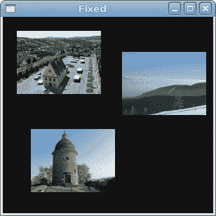
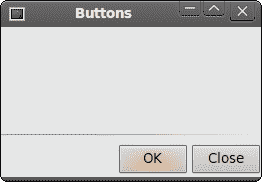
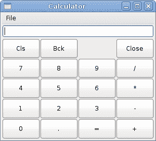

# 布局管理

> 原文： [http://zetcode.com/gui/javascriptgtktutorial/layoutmanagement/](http://zetcode.com/gui/javascriptgtktutorial/layoutmanagement/)

在本章中，我们将展示如何在窗口或对话框中布置窗口小部件。

在设计应用程序的 GUI 时，我们决定要使用哪些小部件以及如何在应用程序中组织这些小部件。 为了组织窗口小部件，我们使用专门的不可见窗口小部件，称为布局容器。 在本章中，我们将提到`Alignment`，`Fixed`，`VBox`和`Table`。

## 固定

`Fixed`容器将子窗口小部件放置在固定位置并具有固定大小。 此容器不执行自动布局管理。 在大多数应用程序中，我们不使用此容器。 我们在某些专业领域使用它。 例如游戏，使用图表的专用应用程序，可以移动的可调整大小的组件（如电子表格应用程序中的图表），小型教育示例。

```
#!/usr/bin/seed

/*
ZetCode JavaScript GTK tutorial

In this program, we lay out widgets
using absolute positioning

author: Jan Bodnar
website: www.zetcode.com
last modified: July 2011
*/

Gtk = imports.gi.Gtk;
Gdk = imports.gi.Gdk;

Gtk.init(null, null);

Example = new GType({
    parent: Gtk.Window.type,
    name: "Example",
    init: function ()
    {

        init_ui(this);

        function init_ui(w) {

            w.signal.hide.connect(Gtk.main_quit);
            w.set_default_size(300, 280);
            w.set_title("Fixed");
            w.set_position(Gtk.WindowPosition.CENTER);

            w.modify_bg(Gtk.StateType.NORMAL, 
                new Gdk.Color({red:6400, green:6400, blue:6440}));

            var image1 = new Gtk.Image.from_file("bardejov.jpg");
            var image2 = new Gtk.Image.from_file("rotunda.jpg");
            var image3 = new Gtk.Image.from_file("mincol.jpg");

            var fixed = new Gtk.Fixed();

            fixed.put(image1, 20, 20);
            fixed.put(image2, 40, 160);
            fixed.put(image3, 170, 50);

            w.add(fixed);
            w.show_all();                     
        }
    }       
});

var window = new Example();
Gtk.main();

```

在我们的示例中，我们在窗口上显示了三个小图像。 我们明确指定放置这些图像的 x，y 坐标。

```
w.modify_bg(Gtk.StateType.NORMAL, 
    new Gdk.Color({red:6400, green:6400, blue:6440}));

```

为了获得更好的视觉体验，我们将背景色更改为深灰色。

```
var image1 = new Gtk.Image.from_file("bardejov.jpg");

```

`Image`是用于显示图像的小部件。 图片是从磁盘上的文件加载的。

```
var fixed = new Gtk.Fixed();

```

我们创建`Fixed`容器。

```
fixed.put(image1, 20, 20);

```

我们将第一个图像放置在 x = 20，y = 20 坐标处。

```
w.add(fixed);

```

最后，我们将`Fixed`容器添加到窗口中。



Figure: Fixed

## 纽扣

在此代码示例中，我们将使用垂直框，水平框和路线小部件。 水平框将小部件排列为一行。 同样，垂直框将其小部件放在一列中。 `Alignment`容器控制其子窗口小部件的对齐方式和大小。

```
#!/usr/bin/seed

/*
ZetCode JavaScript GTK tutorial

In this program, we position two buttons
in the bottom right corner of the window.
We use horizontal and vertical boxes.

author: Jan Bodnar
website: www.zetcode.com
last modified: July 2011
*/

Gtk = imports.gi.Gtk;

Gtk.init(null, null);

Example = new GType({
    parent: Gtk.Window.type,
    name: "Example",
    init: function ()
    {

        init_ui(this);

        function init_ui(w) {

            w.signal.hide.connect(Gtk.main_quit);
            w.set_default_size(260, 150);
            w.set_title("Buttons");
            w.set_position(Gtk.WindowPosition.CENTER);

            var vbox = new Gtk.VBox({homogeneous: false, spacing:5});
            var hbox = new Gtk.HBox({homogeneous: true, spacing:3});

            var space = new Gtk.Frame();
            vbox.pack_start(space, true, true, 0);

            var okButton = new Gtk.Button({label:"OK"});
            okButton.set_size_request(70, 30);
            var closeButton = new Gtk.Button({label:"Close"});

            hbox.add(okButton);
            hbox.add(closeButton);

            var halign = new Gtk.Alignment({xalign: 1.0, yalign: 0.0, 
                                           xscale: 0.0, yscale: 0.0});
            halign.add(hbox);
            vbox.pack_start(halign, false, false, 3);

            w.add(vbox);
            w.show_all(); 
        }
    }       
});

var window = new Example();
Gtk.main();

```

在代码示例中，我们在窗口的右下角放置了两个按钮。 为此，我们使用一个水平框，一个垂直框和一个对齐容器。

```
var vbox = new Gtk.VBox({homogeneous: false, spacing:5});

```

将创建一个垂直框容器。 我们将`homogeneous`成员设置为 false。 这意味着放在垂直框中的窗口小部件将具有相同的大小。 小部件之间的垂直间距设置为 5 像素。

```
var space = new Gtk.Frame();

```

在这里，我们创建一个`Frame`小部件。 该小部件的目的是占用两个按钮上方的空间。

```
vbox.pack_start(space, true, true, 0);

```

在这里，我们将框架小部件放入垂直框中。 该方法的第一个参数是小部件，它被放置在框中。 以下三个参数是 expand，fill 和 padding。 expand 参数设置为 true，这意味着将在小部件周围分配可用空间。 当 fill 参数设置为 true 时，小部件实际上会占用其周围的所有可用空间。 子窗口小部件周围没有填充。

```
var hbox = new Gtk.HBox({homogeneous: true, spacing:3});            

```

此代码行创建一个水平框。 框内的所有小部件都将具有相同的大小。 小部件之间的水平间隔为 3px。

```
var okButton = new Gtk.Button({label:"OK"});
okButton.set_size_request(70, 30);
var closeButton = new Gtk.Button({label:"Close"});

hbox.add(okButton);
hbox.add(closeButton);

```

我们创建两个按钮，并将它们放在水平框中。

```
var halign = new Gtk.Alignment({xalign: 1.0, yalign: 0.0, 
                                xscale: 0.0, yscale: 0.0});
halign.add(hbox);
vbox.pack_start(halign, false, false, 3);

```

这将创建一个对齐容器，它将其子窗口小部件放在右侧。 设置为 1.0 的`xalign`成员会将所有可用空间放在水平框的左侧。 这将向右推两个按钮。 我们将水平框添加到对齐容器中，然后将对齐容器包装到垂直框中。 我们必须记住，对齐容器仅包含一个子窗口小部件。 这就是为什么我们必须使用水平框。



Figure: Buttons

## 计算器骨架

`Table`小部件按行和列排列小部件。

```
#!/usr/bin/seed

/*
ZetCode JavaScript GTK tutorial

In this program we create a skeleton of
a calculator. We use the Table widget.

author: Jan Bodnar
website: www.zetcode.com
last modified: July 2011
*/

Gtk = imports.gi.Gtk;
Gdk = imports.gi.Gdk;

Gtk.init(null, null);

Example = new GType({
    parent: Gtk.Window.type,
    name: "Example",
    init: function ()
    {

        init_ui(this);

        function init_ui(w) {  

            w.signal.hide.connect(Gtk.main_quit);
            w.set_default_size(300, 250);
            w.set_title("Calculator");
            w.set_position(Gtk.WindowPosition.CENTER);

            var vbox = new Gtk.VBox({homogeneous: false, spacing:2});

            var mb = new Gtk.MenuBar();
            var filemenu = new Gtk.Menu();
            var file = new Gtk.MenuItem({label:"File"});
            file.set_submenu(filemenu);
            mb.append(file);

            vbox.pack_start(mb, false, false, 0);

            var table = new Gtk.Table.c_new(5, 4, true);

            table.attach_defaults(new Gtk.Button.with_label("Cls"), 0, 1, 0, 1);
            table.attach_defaults(new Gtk.Button.with_label("Bck"), 1, 2, 0, 1);
            table.attach_defaults(new Gtk.Label(), 2, 3, 0, 1);
            table.attach_defaults(new Gtk.Button.with_label("Close"), 3, 4, 0, 1);

            table.attach_defaults(new Gtk.Button.with_label("7"), 0, 1, 1, 2);
            table.attach_defaults(new Gtk.Button.with_label("8"), 1, 2, 1, 2);
            table.attach_defaults(new Gtk.Button.with_label("9"), 2, 3, 1, 2);
            table.attach_defaults(new Gtk.Button.with_label("/"), 3, 4, 1, 2);

            table.attach_defaults(new Gtk.Button.with_label("4"), 0, 1, 2, 3);
            table.attach_defaults(new Gtk.Button.with_label("5"), 1, 2, 2, 3);
            table.attach_defaults(new Gtk.Button.with_label("6"), 2, 3, 2, 3);
            table.attach_defaults(new Gtk.Button.with_label("*"), 3, 4, 2, 3);

            table.attach_defaults(new Gtk.Button.with_label("1"), 0, 1, 3, 4);
            table.attach_defaults(new Gtk.Button.with_label("2"), 1, 2, 3, 4);
            table.attach_defaults(new Gtk.Button.with_label("3"), 2, 3, 3, 4);
            table.attach_defaults(new Gtk.Button.with_label("-"), 3, 4, 3, 4);

            table.attach_defaults(new Gtk.Button.with_label("0"), 0, 1, 4, 5);
            table.attach_defaults(new Gtk.Button.with_label("."), 1, 2, 4, 5);
            table.attach_defaults(new Gtk.Button.with_label("="), 2, 3, 4, 5);
            table.attach_defaults(new Gtk.Button.with_label("+"), 3, 4, 4, 5);

            vbox.pack_start(new Gtk.Entry(), false, false, 0);            
            vbox.pack_end(table, true, true, 0);            

            w.add(vbox);
            w.show_all(); 
        }
    }   

});

var window = new Example();
Gtk.main();

```

我们使用`Table`小部件创建一个计算器框架。

```
var table = new Gtk.Table.c_new(5, 4, true);

```

我们创建一个具有 5 行 4 列的表小部件。 第三个参数是同质参数。 如果设置为 true，则表中的所有小部件都具有相同的大小。 所有窗口小部件的大小等于表容器中最大的窗口小部件。

```
table.attach_defaults(new Gtk.Button.with_label("Cls"), 0, 1, 0, 1);

```

我们在表格容器上附加一个按钮。 到表格的左上方单元格。 前两个参数是单元格的左侧和右侧，后两个参数是单元格的顶部和左侧。

```
vbox.pack_end(table, true, true, 0);

```

我们将表格小部件打包到垂直框中。



Figure: Calculator skeleton

## 视窗

接下来，我们将创建一个更高级的示例。 我们显示一个窗口，可以在 JDeveloper IDE 中找到它。

```
#!/usr/bin/seed

/*
ZetCode JavaScript GTK tutorial

This is a more complicated layout example.
We use Alignment and Table widgets. 

author: Jan Bodnar
website: www.zetcode.com
last modified: July 2011
*/

Gtk = imports.gi.Gtk;
Gdk = imports.gi.Gdk;

Gtk.init(null, null);

Example = new GType({
    parent: Gtk.Window.type,
    name: "Example",
    init: function ()
    {

        init_ui(this);

        function init_ui(w) {

            w.signal.hide.connect(Gtk.main_quit);
            w.set_default_size(300, 280);
            w.set_title("Windows");
            w.set_position(Gtk.WindowPosition.CENTER);

            w.set_border_width(15);

            var table = new Gtk.Table.c_new(8, 4, false);
            table.set_col_spacings(3);

            var title = new Gtk.Label.c_new("Windows");

            var halign = new Gtk.Alignment.c_new(0.0, 0.0, 0.0, 0.0);
            halign.add(title);

            table.attach(halign, 0, 1, 0, 1, Gtk.AttachOptions.FILL,
                Gtk.AttachOptions.FILL, 0, 0);

            var frame = new Gtk.Frame();
            table.attach(frame, 0, 2, 1, 3, Gtk.AttachOptions.FILL | 
                Gtk.AttachOptions.EXPAND, Gtk.AttachOptions.FILL | 
                Gtk.AttachOptions.EXPAND, 1, 1);

            var activate = new Gtk.Button.with_label("Activate");
            activate.set_size_request(50, 30);
            table.attach(activate, 3, 4, 1, 2, Gtk.AttachOptions.FILL,
                Gtk.AttachOptions.SHRINK, 1, 1)

            var valign = new Gtk.Alignment.c_new(0.0, 0.0, 0.0, 0.0);
            var closeButton = new Gtk.Button.with_label("Close");
            closeButton.set_size_request(70, 30);
            valign.add(closeButton);
            table.set_row_spacing(1, 3);
            table.attach(valign, 3, 4, 2, 3, Gtk.AttachOptions.FILL,
                Gtk.AttachOptions.FILL | Gtk.AttachOptions.EXPAND, 1, 1)

            halign2 = new Gtk.Alignment.c_new(0.0, 1.0, 0.0, 0.0);
            help = new Gtk.Button.with_label("Help");
            help.set_size_request(70, 30);
            halign2.add(help);
            table.set_row_spacing(3, 6);
            table.attach(halign2, 0, 1, 4, 5, Gtk.AttachOptions.FILL,
                Gtk.AttachOptions.FILL, 0, 0);

            var okButton = new Gtk.Button.with_label("OK");
            okButton.set_size_request(70, 30);
            table.attach(okButton, 3, 4, 4, 5, Gtk.AttachOptions.FILL,
                Gtk.AttachOptions.FILL, 0, 0);

            w.add(table);
            w.show_all(); 
        }
    }       
});

var window = new Example();
Gtk.main();

```

该代码示例显示了如何在 JavaScript GTK 中创建类似的窗口。

```
var table = new Gtk.Table.c_new(8, 4, false);
table.set_col_spacings(3);

```

该示例基于`Table`容器。 列之间将有 3px 的间隔。

```
var title = new Gtk.Label.c_new("Windows");

var halign = new Gtk.Alignment.c_new(0.0, 0.0, 0.0, 0.0);
halign.add(title);

table.attach(halign, 0, 1, 0, 1, Gtk.AttachOptions.FILL,
    Gtk.AttachOptions.FILL, 0, 0);

```

这段代码创建了一个向左对齐的标签。 标签放置在 Table 容器的第一列的第一行中。

```
var frame = new Gtk.Frame();
table.attach(frame, 0, 2, 1, 3, Gtk.AttachOptions.FILL | Gtk.AttachOptions.EXPAND,
    Gtk.AttachOptions.FILL | Gtk.AttachOptions.EXPAND, 1, 1);

```

框架小部件跨越两行两列。 它将消耗其周围的所有可用空间。 因此，占用了窗口的大部分区域。

```
var valign = new Gtk.Alignment.c_new(0.0, 0.0, 0.0, 0.0);
var closeButton = new Gtk.Button.with_label("Close");
closeButton.set_size_request(70, 30);
valign.add(closeButton);
table.set_row_spacing(1, 3);
table.attach(valign, 3, 4, 2, 3, Gtk.AttachOptions.FILL,
    Gtk.AttachOptions.FILL | Gtk.AttachOptions.EXPAND, 1, 1)

```

我们将关闭按钮放在框架小部件旁边，进入第四列。 （我们从零开始计数）将按钮添加到对齐小部件中，以便可以将其对齐到顶部。

```
halign2 = new Gtk.Alignment.c_new(0.0, 1.0, 0.0, 0.0);
help = new Gtk.Button.with_label("Help");
help.set_size_request(70, 30);
halign2.add(help);
table.set_row_spacing(3, 6);
table.attach(halign2, 0, 1, 4, 5, Gtk.AttachOptions.FILL,
    Gtk.AttachOptions.FILL, 0, 0);

```

将帮助按钮放置在对齐小部件中，以便可以在其表格单元格中使其对齐。 它位于第一列第五行。

```
var okButton = new Gtk.Button.with_label("OK");
okButton.set_size_request(70, 30);
table.attach(okButton, 3, 4, 4, 5, Gtk.AttachOptions.FILL,
    Gtk.AttachOptions.FILL, 0, 0);

```

最后，单击确定按钮。 它位于第四列第五行。


Figure: Windows

在 JavaScript GTK 教程的这一部分中，我们提到了小部件的布局管理。