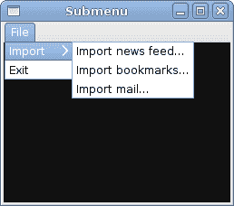
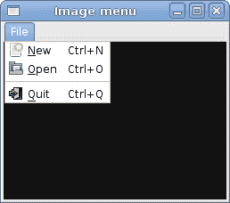

# JavaScript GTK 中的菜单&工具栏

> 原文： [http://zetcode.com/gui/javascriptgtktutorial/menustoolbars/](http://zetcode.com/gui/javascriptgtktutorial/menustoolbars/)

在 JavaScript GTK 编程教程的这一部分中，我们将使用菜单&工具栏。

菜单栏是 GUI 应用程序中最常见的部分之一。 它是位于各个菜单中的一组命令。 在控制台应用程序中，您必须记住所有这些神秘命令，在这里，我们将大多数命令分组为逻辑部分。 这些公认的标准可进一步减少学习新应用程序的时间。

## 简单菜单

在第一个示例中，我们将创建一个带有一个文件菜单的菜单栏。 该菜单将只有一个菜单项。 通过选择项目，应用程序退出。

```
#!/usr/bin/seed

/*
ZetCode JavaScript GTK tutorial

This example shows a simple menu.

author: Jan Bodnar
website: www.zetcode.com
last modified: July 2011
*/

Gtk = imports.gi.Gtk;
Gdk = imports.gi.Gdk;

Gtk.init(null, null);

Example = new GType({
    parent: Gtk.Window.type,
    name: "Example",
    init: function ()
    {

        init_ui(this);

        function init_ui(w) {

            w.signal.hide.connect(Gtk.main_quit);
            w.set_default_size(250, 200);
            w.set_title("Simple menu");
            w.set_position(Gtk.WindowPosition.CENTER);

            w.modify_bg(Gtk.StateType.NORMAL, 
                        new Gdk.Color({red:6400, green:6400, blue:6440}));

            var mb = new Gtk.MenuBar();

            var filemenu = new Gtk.Menu();
            var filem = new Gtk.MenuItem.with_label("File");
            filem.set_submenu(filemenu);

            var exitmu = new Gtk.MenuItem.with_label("Exit");
            exitmu.signal.activate.connect(Gtk.main_quit);              
            filemenu.append(exitmu);

            mb.append(filem);

            vbox = new Gtk.VBox.c_new(false, 2);
            vbox.pack_start(mb, false, false, 0);

            w.add(vbox);
            w.show_all();                     
        }
    }       
});

var window = new Example();
Gtk.main();

```

这是一个最小的菜单栏功能示例。

```
var mb = new Gtk.MenuBar();

```

`MenuBar`小部件已创建。 这是菜单的容器。

```
var filemenu = new Gtk.Menu();
var filem = new Gtk.MenuItem.with_label("File");
filem.set_submenu(filemenu);

```

创建顶层`MenuItem`。

```
var exitmu = new Gtk.MenuItem.with_label("Exit");
exitmu.signal.activate.connect(Gtk.main_quit);              
filemenu.append(exitmu);

```

将创建出口`MenuItem`，并将其附加到文件`MenuItem`中。

```
mb.append(filem);

```

顶级`MenuItem`被附加到`MenuBar`小部件。

```
vbox = new Gtk.VBox.c_new(false, 2);
vbox.pack_start(mb, false, false, 0);

```

与其他工具包不同，我们必须自己照顾菜单栏的布局管理。 我们将菜单栏放入垂直框中。


Figure: Simple menu

## 子菜单

我们的最后一个示例演示了如何创建子菜单。 子菜单是另一个菜单中的菜单。

```
#!/usr/bin/seed

/*
ZetCode JavaScript GTK tutorial

This example shows a submenu.

author: Jan Bodnar
website: www.zetcode.com
last modified: July 2011
*/

Gtk = imports.gi.Gtk;
Gdk = imports.gi.Gdk;

Gtk.init(null, null);

Example = new GType({
    parent: Gtk.Window.type,
    name: "Example",
    init: function ()
    {

        init_ui(this);

        function init_ui(w) {

            w.signal.hide.connect(Gtk.main_quit);
            w.set_default_size(250, 200);
            w.set_title("Submenu");
            w.set_position(Gtk.WindowPosition.CENTER);

            w.modify_bg(Gtk.StateType.NORMAL, 
                          new Gdk.Color({red:6400, green:6400, blue:6440}));

            var mb = new Gtk.MenuBar();

            var filemenu = new Gtk.Menu();
            var filem = new Gtk.MenuItem.with_label("File");
            filem.set_submenu(filemenu);

            mb.append(filem);

            var imenu = new Gtk.Menu();

            var importm = new Gtk.MenuItem.with_label("Import");
            importm.set_submenu(imenu);

            var inews = new Gtk.MenuItem.with_label("Import news feed...");
            var ibookmarks = new Gtk.MenuItem.with_label("Import bookmarks...");
            var imail = new Gtk.MenuItem.with_label("Import mail...");

            imenu.append(inews);
            imenu.append(ibookmarks);
            imenu.append(imail);

            filemenu.append(importm);

            var emi = new Gtk.MenuItem.with_label("Exit");
            emi.signal.activate.connect(Gtk.main_quit);

            filemenu.append(emi);

            var vbox = new Gtk.VBox.c_new(false, 2);
            vbox.pack_start(mb, false, false, 0);

            w.add(vbox);
            w.show_all();
        }
    }   

});

var window = new Example();
Gtk.main();

```

在此示例中，我们创建一个子菜单。

```
var imenu = new Gtk.Menu();

```

子菜单是`Menu`。

```
var importm = new Gtk.MenuItem.with_label("Import");
importm.set_submenu(imenu);

```

它是菜单项的子菜单，它会登录到顶级文件菜单。

```
var inews = new Gtk.MenuItem.with_label("Import news feed...");
var ibookmarks = new Gtk.MenuItem.with_label("Import bookmarks...");
var imail = new Gtk.MenuItem.with_label("Import mail...");

imenu.append(inews);
imenu.append(ibookmarks);
imenu.append(imail);

```

子菜单有其自己的菜单项。



Figure: Submenu

## 图像菜单

在下一个示例中，我们将进一步探索菜单。 我们将图像和加速器添加到我们的菜单项中。 加速器是用于激活菜单项的键盘快捷键。

```
#!/usr/bin/seed

/*
ZetCode JavaScript GTK tutorial

In this example, we explore image menu
items, a separator, accelerators.

author: Jan Bodnar
website: www.zetcode.com
last modified: July 2011
*/

Gtk = imports.gi.Gtk;
Gdk = imports.gi.Gdk;

Gtk.init(null, null);

Example = new GType({
    parent: Gtk.Window.type,
    name: "Example",
    init: function ()
    {

        init_ui(this);

        function init_ui(w) {

            w.signal.hide.connect(Gtk.main_quit);
            w.set_default_size(250, 200);
            w.set_title("Image menu");
            w.set_position(Gtk.WindowPosition.CENTER);

            w.modify_bg(Gtk.StateType.NORMAL, 
                new Gdk.Color({red:6400, green:6400, blue:6440}));

            var mb = new Gtk.MenuBar();

            var filemenu = new Gtk.Menu();
            var filem = new Gtk.MenuItem.with_label("File");
            filem.set_submenu(filemenu);

            var agr = new Gtk.AccelGroup();
            w.add_accel_group(agr);

            var newi = new Gtk.ImageMenuItem.from_stock(Gtk.STOCK_NEW, agr);
            newi.signal.activate.connect(function() {print("new")});
            filemenu.append(newi);

            var openm = new Gtk.ImageMenuItem.from_stock(Gtk.STOCK_OPEN, agr);
            filemenu.append(openm);

            var sep = new Gtk.SeparatorMenuItem();
            filemenu.append(sep);

            var exitmu = new Gtk.ImageMenuItem.from_stock(Gtk.STOCK_QUIT, agr);       

            exitmu.signal.activate.connect(Gtk.main_quit);
            filemenu.append(exitmu);

            mb.append(filem);

            var vbox = new Gtk.VBox.c_new(false, 2);
            vbox.pack_start(mb, false, false, 0);                

            w.add(vbox);
            w.show_all(); 
        }
    }       
});

var window = new Example();
Gtk.main();

```

我们的示例显示了具有三个子菜单项的顶级菜单项。 每个菜单项都有一个图像和一个加速器。 退出菜单项的加速器退出应用程序。 新菜单项的加速器将“ new”打印到控制台。

```
var agr = new Gtk.AccelGroup();
w.add_accel_group(agr);

```

要使用加速器，我们创建一个全局`AccelGroup`对象。 稍后将使用。

```
var newi = new Gtk.ImageMenuItem.from_stock(Gtk.STOCK_NEW, agr);
newi.signal.activate.connect(function() {print("new")});
filemenu.append(newi);

```

`ImageMenuItem`已创建。 图片来自图片库。 自动创建 `Ctrl` + `N` 加速器。 我们将匿名方法插入菜单项。 它将消息打印到控制台。

```
var sep = new Gtk.SeparatorMenuItem();
filemenu.append(sep);

```

这些行创建一个分隔符。 它用于将菜单项放入逻辑组。



Figure: Image menu

菜单将我们可以在应用程序中使用的命令分组。 使用工具栏可以快速访问最常用的命令。

## 简单的工具栏

接下来，我们创建一个简单的工具栏。 工具栏提供对应用程序最常用功能的快速访问。

```
#!/usr/bin/seed

/*
ZetCode JavaScript GTK tutorial

In this example, we create a simple
toolbar.

author: Jan Bodnar
website: www.zetcode.com
last modified: July 2011
*/

Gtk = imports.gi.Gtk;

Gtk.init(null, null);

Example = new GType({
    parent: Gtk.Window.type,
    name: "Example",
    init: function ()
    {

        init_ui(this);

        function init_ui(w) {

            w.signal.hide.connect(Gtk.main_quit);
            w.set_default_size(250, 200);
            w.set_title("Toolbar");
            w.set_position(Gtk.WindowPosition.CENTER);

            var toolbar = new Gtk.Toolbar();
            toolbar.set_style(Gtk.ToolbarStyle.ICONS);

            var newtb = new Gtk.ToolButton.from_stock(Gtk.STOCK_NEW);
            var opentb = new Gtk.ToolButton.from_stock(Gtk.STOCK_OPEN);
            var savetb = new Gtk.ToolButton.from_stock(Gtk.STOCK_SAVE);
            var sep = new Gtk.SeparatorToolItem();
            var quittb = new Gtk.ToolButton.from_stock(Gtk.STOCK_QUIT);

            toolbar.insert(newtb, 0);
            toolbar.insert(opentb, 1);
            toolbar.insert(savetb, 2);
            toolbar.insert(sep, 3);
            toolbar.insert(quittb, 4);

            quittb.signal.clicked.connect(Gtk.main_quit);

            var vbox = new Gtk.VBox.c_new(false, 2);
            vbox.pack_start(toolbar, false, false, 0);

            w.add(vbox);
            w.show_all(); 
        }
    }   

});

var window = new Example();
Gtk.main();

```

该示例显示了一个工具栏和四个工具按钮。

```
var toolbar = new Gtk.Toolbar();

```

`Toolbar`小部件已创建。

```
toolbar.set_style(Gtk.ToolbarStyle.ICONS);

```

在工具栏上，我们仅显示图标。 没有文字。

```
var newtb = new Gtk.ToolButton.from_stock(Gtk.STOCK_NEW);

```

创建带有库存图像的`ToolButton`。 该图像来自图像的内置库存。

```
var sep = new Gtk.SeparatorToolItem();

```

这是一个分隔符。 它可用于将工具栏按钮放入逻辑组。

```
toolbar.insert(newtb, 0);
toolbar.insert(opentb, 1);
...

```

工具栏按钮插入到工具栏小部件中。 `insert()`方法的第一个参数是工具按钮。 第二个是工具栏上的位置。


Figure: Toolbar

在 JavaScript GTK 教程的这一章中，我们展示了如何使用菜单&工具栏。