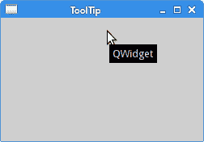
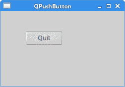
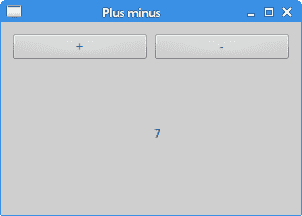

# Qt5 中的第一个程序

> 原文： [http://zetcode.com/gui/qt5/firstprograms/](http://zetcode.com/gui/qt5/firstprograms/)

在 Qt5 C++ 编程教程的这一部分中，我们创建了第一个程序。

我们显示一个应用图标，一个工具提示和各种鼠标光标。 我们在屏幕上居中放置一个窗口，并介绍信号和槽机制。

## 简单的例子

我们从一个非常简单的例子开始。

`simple.cpp`

```cpp
#include <QApplication>
#include <QWidget>

int main(int argc, char *argv[]) {

    QApplication app(argc, argv);

    QWidget window;

    window.resize(250, 150);
    window.setWindowTitle("Simple example");
    window.show();

    return app.exec();
}

```

该示例在屏幕上显示一个基本窗口。

```cpp
#include <QApplication>
#include <QWidget>

```

我们包括必要的头文件。

```cpp
QApplication app(argc, argv);

```

这是应用对象。 每个 Qt5 应用都必须创建此对象。 （控制台应用除外。）

```cpp
QWidget window;

```

这是我们的主要小部件。

```cpp
window.resize(250, 150);
window.setWindowTitle("Simple example");
window.show();

```

在这里，我们调整窗口小部件的大小并为我们的主窗口设置标题。 在这种情况下，`QWidget`是我们的主窗口。 最后，我们在屏幕上显示小部件。

```cpp
return app.exec();

```

`exec()`方法启动应用的主循环。


Figure: Simple example

## 工具提示

工具提示是有关应用中项目的特定提示。 以下示例将演示如何在 Qt5 编程库中创建工具提示。

`tooltip.cpp`

```cpp
#include <QApplication>
#include <QWidget>

int main(int argc, char *argv[]) {

  QApplication app(argc, argv);  

  QWidget window;

  window.resize(250, 150);
  window.move(300, 300);
  window.setWindowTitle("ToolTip");
  window.setToolTip("QWidget");
  window.show();

  return app.exec();
}

```

该示例显示了主`QWidget`的工具提示。

```cpp
window.setWindowTitle("ToolTip");

```

我们使用`setToolTip()`方法为`QWidget`小部件设置了工具提示。



Figure: A tooltip

## 应用图标

在下一个示例中，我们显示应用图标。 大多数窗口管理器在标题栏的左上角以及任务栏上都显示图标。

`icon.cpp`

```cpp
#include <QApplication>
#include <QWidget>
#include <QIcon>

int main(int argc, char *argv[]) {

  QApplication app(argc, argv);  

  QWidget window;

  window.resize(250, 150);
  window.setWindowTitle("Icon");
  window.setWindowIcon(QIcon("web.png"));
  window.show();

  return app.exec();
}

```

窗口左上角显示一个图标。

```cpp
window.setWindowIcon(QIcon("web.png"));

```

为了显示图标，我们使用`setWindowIcon()`方法和`QIcon`类。 该图标是位于当前工作目录中的一个小 PNG 文件。


Figure: Icon

## 光标

光标是一个小图标，指示鼠标指针的位置。 在下一个示例中，将显示我们可以在程序中使用的各种游标。

`cursors.cpp`

```cpp
#include <QApplication>
#include <QWidget>
#include <QFrame>
#include <QGridLayout>

class Cursors : public QWidget {

 public:
     Cursors(QWidget *parent = 0);
};

Cursors::Cursors(QWidget *parent)
    : QWidget(parent) {

  QFrame *frame1 = new QFrame(this);
  frame1->setFrameStyle(QFrame::Box);
  frame1->setCursor(Qt::SizeAllCursor);

  QFrame *frame2 = new QFrame(this);
  frame2->setFrameStyle(QFrame::Box);
  frame2->setCursor(Qt::WaitCursor);

  QFrame *frame3 = new QFrame(this);
  frame3->setFrameStyle(QFrame::Box);
  frame3->setCursor(Qt::PointingHandCursor);

  QGridLayout *grid = new QGridLayout(this);
  grid->addWidget(frame1, 0, 0);
  grid->addWidget(frame2, 0, 1);
  grid->addWidget(frame3, 0, 2);

  setLayout(grid);
}

int main(int argc, char *argv[]) {

  QApplication app(argc, argv);  

  Cursors window;

  window.resize(350, 150);
  window.setWindowTitle("Cursors");
  window.show();

  return app.exec();
}

```

在此示例中，我们使用三个框架。 每个帧都有一个不同的光标集。

```cpp
QFrame *frame1 = new QFrame(this);

```

`QFrame`小部件已创建。

```cpp
frame1->setFrameStyle(QFrame::Box);

```

我们使用`setFrameStyle()`方法设置框架样式。 这样我们可以看到框架的边界。

```cpp
frame1->setCursor(Qt::SizeAllCursor);

```

使用`setCursor()`方法将光标设置到该帧。

```cpp
QGridLayout *grid = new QGridLayout(this);
grid->addWidget(frame1, 0, 0);
grid->addWidget(frame2, 0, 1);
grid->addWidget(frame3, 0, 2);
setLayout(grid);

```

这会将所有帧分组为一行。 我们将在布局管理一章中详细讨论这一点。

## `QButton`

在下一个代码示例中，我们在窗口上显示一个按钮。 通过单击按钮，我们关闭应用。

`pushbutton.cpp`

```cpp
#include <QApplication>
#include <QWidget>
#include <QPushButton>

class MyButton : public QWidget {

 public:
     MyButton(QWidget *parent = 0);
};

MyButton::MyButton(QWidget *parent)
    : QWidget(parent) {

  QPushButton *quitBtn = new QPushButton("Quit", this);
  quitBtn->setGeometry(50, 40, 75, 30);

  connect(quitBtn, &QPushButton::clicked, qApp, &QApplication::quit);
}

int main(int argc, char *argv[]) {

  QApplication app(argc, argv);  

  MyButton window;

  window.resize(250, 150);  
  window.setWindowTitle("QPushButton");
  window.show();

  return app.exec();
}

```

在此代码示例中，我们首次使用信号和槽的概念。

```cpp
QPushButton *quitBtn = new QPushButton("Quit", this);
quitBtn->setGeometry(50, 40, 75, 30);

```

我们创建一个新的`QPushButton`。 我们手动调整其大小，然后使用`setGeometry()`方法将其放置在窗口中。

```cpp
connect(quitBtn, &QPushButton::clicked, qApp, &QApplication::quit);

```

当我们点击按钮时，会产生一个`clicked`信号。 时隙是对信号做出反应的方法。 在我们的情况下，它是主应用对象的`quit`槽。 `qApp`是指向应用对象的全局指针。 它在`QApplication`头文件中定义。



Figure: QPushButton

## `PlusMinus`

我们将在本节完成，展示小部件如何进行通信。 该代码分为三个文件。

`plusminus.h`

```cpp
#pragma once

#include <QWidget>
#include <QApplication>
#include <QPushButton>
#include <QLabel>

class PlusMinus : public QWidget {

  Q_OBJECT

  public:
    PlusMinus(QWidget *parent = 0);

  private slots:
    void OnPlus();
    void OnMinus();

  private:
    QLabel *lbl;

};

```

这是示例的头文件。 在此文件中，我们定义了两个槽和一个标签小部件。

```cpp
class PlusMinus : public QWidget {

  Q_OBJECT
...  

```

`Q_OBJECT`宏必须包含在声明自己的信号和槽的类中。

`plusminus.cpp`

```cpp
#include "plusminus.h"
#include <QGridLayout>

PlusMinus::PlusMinus(QWidget *parent)
    : QWidget(parent) {

  QPushButton *plsBtn = new QPushButton("+", this);
  QPushButton *minBtn = new QPushButton("-", this);
  lbl = new QLabel("0", this);

  QGridLayout *grid = new QGridLayout(this);
  grid->addWidget(plsBtn, 0, 0);
  grid->addWidget(minBtn, 0, 1);
  grid->addWidget(lbl, 1, 1);

  setLayout(grid);  

  connect(plsBtn, &QPushButton::clicked, this, &PlusMinus::OnPlus);
  connect(minBtn, &QPushButton::clicked, this, &PlusMinus::OnMinus);
}

void PlusMinus::OnPlus() {

  int val = lbl->text().toInt();
  val++;
  lbl->setText(QString::number(val));
}

void PlusMinus::OnMinus() {

  int val = lbl->text().toInt();
  val--;
  lbl->setText(QString::number(val));
}

```

我们有两个按钮和一个标签小部件。 我们使用按钮增加或减少标签上显示的数字。

```cpp
connect(plsBtn, &QPushButton::clicked, this, &PlusMinus::OnPlus);
connect(minBtn, &QPushButton::clicked, this, &PlusMinus::OnMinus);

```

在这里，我们将`clicked`信号连接到它们的槽。

```cpp
void PlusMinus::OnPlus() {

  int val = lbl->text().toInt();
  val++;
  lbl->setText(QString::number(val));
}

```

在`OnPlus()`方法中，我们确定标签的当前值。 标签窗口小部件显示一个字符串值，因此我们必须将其转换为整数。 我们增加数量并为标签设置新的文本。 我们将数字转换为字符串值。

`main.cpp`

```cpp
#include "plusminus.h"

int main(int argc, char *argv[]) {

  QApplication app(argc, argv);  

  PlusMinus window;

  window.resize(300, 190);
  window.setWindowTitle("Plus minus");
  window.show();

  return app.exec();
}

```

这是代码示例的主文件。



Figure: Plus minus

在本章中，我们在 Qt5 中创建了第一个程序。