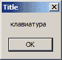

# Windows API 主函数

> 原文： [http://zetcode.com/gui/winapi/main/](http://zetcode.com/gui/winapi/main/)

在 Windows API 教程的这一部分中，我们将讨论主函数。

## 主函数原型

`main()`函数是 C 程序的入口点。 但是，它不是第一个运行的程序。 当入口点为`main()`时，程序实际上从称为`mainCRTStartup()`的函数开始执行。 该函数位于 C 运行时库中。 它初始化诸如内存管理器，文件 I / O 支持和`argv`参数之类的东西。 之后，`mainCRTStartup()`函数将调用`main()`函数。

```
int main(void);
int main(int argc, char **argv);
int main(int argc, char *argv[]);

```

这些是经典控制台程序的`main()`函数的函数原型。

`classic_console.c`

```
#include <stdio.h>

int main(void) {

    puts("This is a classic C program.");

    return 0;
}

```

上面的源代码提供了经典控制台 C 程序的示例。

```
C:\Users\Jano\Documents\Pelles C Projects\ClassicConsole>ClassicConsole.exe
This is a classic C program.

```

这是`ClassicConsole.exe`程序的输出。

## `wmain`函数原型

先前的主函数原型只能接收 ASCII 字符。 如果我们想要一个可以从命令行接收宽字符的程序，我们将使用`wmain()`函数原型。

```
int wmain(void);
int wmain(int argc, wchar_t **argv);
int wmain(int argc, wchar_t *argv[]);

```

上面的`wmain()`函数原型在命令行上接收`wchar_t`字符。 当我们使用这些原型时，执行从名为`wmainCRTStartup()`的函数开始，该函数随后将调用`wmain()`函数。

`win_console.c`

```
#include <windows.h>
#include <wchar.h>

int wmain(int argc, wchar_t **argv) {

    PDWORD cChars = NULL;
    HANDLE std = GetStdHandle(STD_OUTPUT_HANDLE);   

    if (std == INVALID_HANDLE_VALUE) {
        wprintf(L"Cannot retrieve standard output handle\n (%d)", 
            GetLastError());
    }

    if (argv[1]) {

        WriteConsoleW(std, argv[1], wcslen(argv[1]), cChars, NULL);
    }

    CloseHandle(std);

    return 0;
}

```

我们有一个`wmain()`函数，可以接收宽字符。 该示例显示控制台程序的第一个参数。 要在 Pelles C 中插入命令行参数，我们转到项目选项，然后选择常规选项卡。 有一个名为“命令行参数”的编辑框。

```
int wmain(int argc, wchar_t **argv) {

```

`wmain()`函数的第二个参数的`wchar_t`类型告诉我们程序输入为宽字符。

```
HANDLE std = GetStdHandle(STD_OUTPUT_HANDLE);    

```

`GetStdHandle()`函数将句柄返回到标准输出。

```
if (std == INVALID_HANDLE_VALUE) {
    wprintf(L"Cannot retrieve standard output handle\n (%d)", 
        GetLastError());
} 

```

如果发生错误，我们会收到`INVALID_HANDLE_VALUE`返回码。 对于这种情况，我们将显示一条错误消息。 `GetLastError()`函数检索上一个错误代码值。

```
WriteConsoleW(std, argv[1], wcslen(argv[1]), cChars, NULL);

```

我们使用`WriteConsoleW()`函数以宽字符写入控制台。

```
CloseHandle(std);

```

`CloseHandle()`函数将打开的手柄关闭到标准输出。

```
C:\Users\Jano\Documents\Pelles C Projects\WindowsConsole>WindowsConsole.exe компилятор
компилятор

```

我们将俄语单词（编译器）作为参数传递给程序。 该程序只需将参数打印回控制台即可。 请注意，为了查看正确的字符，我们需要将控制台的默认字体更改为 Lucida Console。 我们需要一种真正的字体来正确显示宽字符。

## `_tmain`函数原型

`_tmain()`函数是 Microsoft 扩展。 它使程序员可以轻松地创建程序的 ANSI 和 UNICODE 版本。 它是一个 C 宏，它转换为`wmain()`或`main()`函数，具体取决于是否定义了`_UNICODE`常量。 在过去，创建 ANSI 和 UNICODE 构建都是很常见的。 如今，许多程序员建议仅创建 Unicode 程序。 这也是我们在本教程中将要做的。 我们将主要创建 Unicode 程序。

```
int _tmain(void);
int _tmain(int argc, TCHAR **argv);
int _tmain(int argc, TCHAR *argv[]);

```

这些是`_tmain`函数原型。 `TCHAR`宏转换为`char`或`wchar_t`。 它由`UNICODE`常数控制。

`tmain_ex.c`

```
#define _UNICODE
#define UNICODE

#include <windows.h>
#include <tchar.h>

int _tmain(int argc, TCHAR *argv[]) {

    PDWORD cChars = NULL;
    HANDLE std = GetStdHandle(STD_OUTPUT_HANDLE);

    if (std == INVALID_HANDLE_VALUE) {
        _tprintf(L"Cannot retrieve standard output handle\n (%d)", 
            GetLastError());
    }  

    if (argv[1]) {

        WriteConsole(std, argv[1], _tcslen(argv[1]), cChars, NULL);
    }

    CloseHandle(std);

    return 0;
}

```

该示例输出其第一个参数（如果有）。

```
#define _UNICODE
#define UNICODE

```

在这里，我们定义两个常数。 这些定义意味着我们将构建一个 Unicode 程序。 它们转换 C 运行时和 Windows 头文件中的 C 宏。 `_UNICODE`常量在 C 运行时中转换宏。 （这些宏以下划线开头。）`UNICODE`常量转换 Windows 头文件中的宏。

```
#include <windows.h>

```

我们包括`TCHAR`宏的定义。 宏受`UNICODE`常数的影响。

```
#include <tchar.h>

```

我们必须为`_tmain`和`_tcslen`宏包含此头文件。 根据`_UNICODE`常数翻译它们。

```
int _tmain(int argc, TCHAR *argv[]) {

```

在我们的情况下，`_tmain()`函数将转换为`wmain()`，`TCHAR`宏将转换为`wchar_t`。

```
WriteConsole(std, argv[1], _tcslen(argv[1]), cChars, NULL);

```

`WriteConsole()`宏被转换为`WriteConsoleW()`函数。 `WriteConsoleW()`将输出写入控制台。 `_tcslen`宏被转换为`wcslen()`函数； 它返回宽字符串的长度。

```
C:\Users\Jano\Documents\Pelles C Projects\TMainEx>TMainEx.exe "операционная система"
операционная система

```

该程序将另一个俄语单词（操作系统）作为参数并将其打印到控制台。

## `WinMain`函数原型

到目前为止，我们已经有了控制台的主函数。 对于图形用户界面开发，我们使用`WinMain`函数原型之一。

```
int WINAPI wWinMain(HINSTANCE hInstance, HINSTANCE hPrevInstance, 
    PWSTR pCmdLine, int nCmdShow);
int WINAPI WinMain(HINSTANCE hInstance, HINSTANCE hPrevInstance, 
    LPSTR lpCmdLine, int nCmdShow);
int APIENTRY _tWinMain(HINSTANCE hInstance, HINSTANCE hPrevInstance, 
    LPTSTR lpCmdLine, int nCmdShow);

```

这三个函数原型用于 Windows GUI 应用的入口点。 `wWinMain()`函数的`pCmdLine`参数包含作为 Unicode 字符串的命令行参数。 `WinMain()`函数的`pCmdLine`参数包含作为 ANSI 字符串的命令行参数。 `_tWinMain`是一个 C 宏，它取决于是否定义了`_UNICODE`常量，它转换为其他两个函数原型。

当入口点为`WinMain()`时，程序的执行从`WinMainCRTStartup()`开始。 在`wWinMain()`的情况下，执行从`wWinMainCRTStartup()`开始。

`winmain_ex.c`

```
#include <windows.h>

int WINAPI wWinMain(HINSTANCE hInstance, HINSTANCE hPrevInstance, 
               PWSTR szCmdLine, int CmdShow) {

    MessageBoxW(NULL, szCmdLine, L"Title", MB_OK);

    return 0;
}

```

此代码在屏幕上显示一个小消息框。 它显示第一个命令行参数。

```
int WINAPI wWinMain(HINSTANCE hInstance, HINSTANCE hPrevInstance, 
               PWSTR szCmdLine, int CmdShow)

```

`wWinMain()`函数的第三个参数是`PWSTR`（指向宽字符串的指针）。 它接受宽字符。



Figure: A message box

在 Windows API 教程的这一部分中，我们提到了主函数。