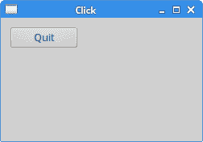

# Qt5 中的事件和信号

> 原文： [http://zetcode.com/gui/qt5/eventsandsignals/](http://zetcode.com/gui/qt5/eventsandsignals/)

在 Qt5 C ++编程教程的这一部分中，我们讨论事件和信号。

事件是任何 GUI 程序中的重要组成部分。 所有 GUI 应用程序都是事件驱动的。 应用程序会对在其生命周期内生成的不同事件类型做出反应。 事件主要由应用程序的用户生成。 但是它们也可以通过其他方式生成，例如 Internet 连接，窗口管理器或计时器。 在事件模型中，有三个参与者：

*   事件来源
*   事件对象
*   事件目标

_ 事件源 _ 是状态更改的对象。 它生成事件。 _ 事件对象 _（事件）将状态更改封装在事件源中。 _ 事件目标 _ 是要通知的对象。 事件源对象将处理事件的任务委托给事件目标。

当我们调用应用程序的`exec()`方法时，应用程序进入主循环。 主循环获取事件并将其发送到对象。 Qt 具有独特的信号和槽机制。 该信号和槽机制是 C ++编程语言的扩展。

信号和槽用于对象之间的通信。 当发生特定事件时，会发出 _ 信号 _。 _ 槽 _ 是正常的 C ++方法； 发出与其连接的信号时调用它。

## 点击

第一个示例显示了一个非常简单的事件处理示例。 我们有一个按钮。 通过单击按钮，我们终止该应用程序。

`click.h`

```
#pragma once

#include <QWidget>

class Click : public QWidget {

  public:
    Click(QWidget *parent = 0);
};

```

这是头文件。

`click.cpp`

```
#include <QPushButton>
#include <QApplication>
#include <QHBoxLayout>
#include "click.h"

Click::Click(QWidget *parent)
    : QWidget(parent) {

  QHBoxLayout *hbox = new QHBoxLayout(this);
  hbox->setSpacing(5);

  QPushButton *quitBtn = new QPushButton("Quit", this);
  hbox->addWidget(quitBtn, 0, Qt::AlignLeft | Qt::AlignTop);

  connect(quitBtn, &QPushButton::clicked, qApp, &QApplication::quit);
}

```

我们在窗口上显示一个`QPushButton`。

```
connect(quitBtn, &QPushButton::clicked, qApp, &QApplication::quit);

```

`connect()`方法将信号连接到槽。 当我们单击退出按钮时，会生成`clicked`信号。 `qApp`是指向应用程序对象的全局指针。 它在`&lt;QApplication&gt;`头文件中定义。 发出点击信号时，将调用`quit()`方法。

`main.cpp`

```
#include <QApplication>
#include "click.h"

int main(int argc, char *argv[]) {

  QApplication app(argc, argv);  

  Click window;

  window.resize(250, 150);
  window.setWindowTitle("Click");
  window.show();

  return app.exec();
}

```

这是主文件。



Figure: Click

## 按键

在以下示例中，我们对按键进行反应。

`keypress.h`

```
#pragma once

#include <QWidget>

class KeyPress : public QWidget {

  public:
    KeyPress(QWidget *parent = 0);

  protected:
    void keyPressEvent(QKeyEvent * e);
};

```

这是`keypress.h`头文件。

`keypress.cpp`

```
#include <QApplication>
#include <QKeyEvent>
#include "keypress.h"

KeyPress::KeyPress(QWidget *parent)
    : QWidget(parent)
{ }

void KeyPress::keyPressEvent(QKeyEvent *event) {

   if (event->key() == Qt::Key_Escape) {  
       qApp->quit();
   } 
}

```

如果我们按 `Escape` 键，则应用程序终止。

```
void KeyPress::keyPressEvent(QKeyEvent *e) {

   if (e->key() == Qt::Key_Escape) {  
       qApp->quit();
   } 
}

```

在 Qt5 中使用事件的一种方法是重新实现事件处理程序。 `QKeyEvent`是一个事件对象，其中包含有关发生的情况的信息。 在我们的例子中，我们使用事件对象来确定实际按下了哪个键。

`main.cpp`

```
#include <QApplication>
#include "keypress.h"

int main(int argc, char *argv[]) {

  QApplication app(argc, argv);  

  KeyPress window;

  window.resize(250, 150);
  window.setWindowTitle("Key press");
  window.show();

  return app.exec();
}

```

这是主文件。

## `QMoveEvent`

`QMoveEvent`类包含移动事件的事件参数。 移动事件将发送到已移动的窗口小部件。

`move.h`

```
#pragma once

#include <QMainWindow>

class Move : public QWidget {

  Q_OBJECT

  public:
    Move(QWidget *parent = 0);

  protected:
    void moveEvent(QMoveEvent *e);
};

```

这是`move.h`头文件。

`move.cpp`

```
#include <QMoveEvent>
#include "move.h"

Move::Move(QWidget *parent)
    : QWidget(parent)
{ }

void Move::moveEvent(QMoveEvent *e) {

  int x = e->pos().x();
  int y = e->pos().y();

  QString text = QString::number(x) + "," + QString::number(y);

  setWindowTitle(text);
}

```

在我们的代码编程示例中，我们对 move 事件做出反应。 我们确定窗口客户区左上角的当前 x，y 坐标，并将这些值设置为窗口标题。

```
int x = e->pos().x();
int y = e->pos().y();

```

我们使用`QMoveEvent`对象来确定`x`和`y`值。

```
QString text = QString::number(x) + "," + QString::number(y);

```

我们将整数值转换为字符串。

```
setWindowTitle(text);

```

`setWindowTitle()`方法将文本设置为窗口的标题。

`main.cpp`

```
#include <QApplication>
#include "move.h"

int main(int argc, char *argv[]) {

  QApplication app(argc, argv);  

  Move window;

  window.resize(250, 150);
  window.setWindowTitle("Move");
  window.show();

  return app.exec();
}

```

这是主文件。


Figure: QMoveEvent

## 断开信号

可以从槽断开信号。 下一个示例显示了我们如何完成此任务。

`disconnect.h`

```
#pragma once

#include <QWidget>
#include <QPushButton>

class Disconnect : public QWidget {

  Q_OBJECT  

  public:
    Disconnect(QWidget *parent = 0);

  private slots:
    void onClick();
    void onCheck(int);

  private:
    QPushButton *clickBtn;
};

```

在头文件中，我们声明了两个槽。 `slots`不是 C ++关键字，它是 Qt5 扩展名。 在代码编译之前，这些扩展由预处理器处理。 当我们在类中使用信号和时隙时，必须在类定义的开头提供`Q_OBJECT`宏。 否则，预处理器会抱怨。

`disconnect.cpp`

```
#include <QTextStream>
#include <QCheckBox>
#include <QHBoxLayout>
#include "disconnect.h"

Disconnect::Disconnect(QWidget *parent)
    : QWidget(parent) {

  QHBoxLayout *hbox = new QHBoxLayout(this);
  hbox->setSpacing(5);        

  clickBtn = new QPushButton("Click", this);
  hbox->addWidget(clickBtn, 0, Qt::AlignLeft | Qt::AlignTop);

  QCheckBox *cb = new QCheckBox("Connect", this);
  cb->setCheckState(Qt::Checked);
  hbox->addWidget(cb, 0, Qt::AlignLeft | Qt::AlignTop);

  connect(clickBtn, &QPushButton::clicked, this, &Disconnect::onClick);
  connect(cb, &QCheckBox::stateChanged, this, &Disconnect::onCheck);  
}

void Disconnect::onClick() {

  QTextStream out(stdout);
  out << "Button clicked" << endl;
}

void Disconnect::onCheck(int state) {

  if (state == Qt::Checked) {
    connect(clickBtn, &QPushButton::clicked, this, &Disconnect::onClick);
  } else {
    disconnect(clickBtn, &QPushButton::clicked, this, 
        &Disconnect::onClick);
  }
}

```

在我们的示例中，我们有一个按钮和一个复选框。 复选框用于将槽与单击的信号按钮断开连接。 此示例必须从命令行执行。

```
connect(clickBtn, &QPushButton::clicked, this, &Disconnect::onClick);
connect(cb, &QCheckBox::stateChanged, this, &Disconnect::onCheck); 

```

在这里，我们将信号连接到用户定义的槽。

```
void Disconnect::onClick() {

  QTextStream out(stdout);
  out << "Button clicked" << endl;
}

```

如果单击“单击”按钮，则将“单击按钮”文本发送到终端窗口。

```
void Disconnect::onCheck(int state) {

  if (state == Qt::Checked) {
    connect(clickBtn, &QPushButton::clicked, this, &Disconnect::onClick);
  } else {
    disconnect(clickBtn, &QPushButton::clicked, this, &Disconnect::onClick);
  }
}

```

在`onCheck()`槽内，我们根据单击状态将`onClick()`槽与单击按钮连接或断开。

`main.cpp`

```
#include <QApplication>
#include "disconnect.h"

int main(int argc, char *argv[]) {

  QApplication app(argc, argv);  

  Disconnect window;

  window.resize(250, 150);
  window.setWindowTitle("Disconnect");
  window.show();

  return app.exec();
}

```

这是主文件。

## 计时器

计时器用于执行单发或重复性任务。 一个使用计时器的好例子是时钟。 每秒，我们必须更新显示当前时间的标签。

`timer.h`

```
#pragma once

#include <QWidget>
#include <QLabel>

class Timer : public QWidget {

  public:
    Timer(QWidget *parent = 0);

  protected:
    void timerEvent(QTimerEvent *e);

  private:
    QLabel *label;
};

```

这是头文件。

`timer.cpp`

```
#include "timer.h"
#include <QHBoxLayout>
#include <QTime>

Timer::Timer(QWidget *parent)
    : QWidget(parent) {

  QHBoxLayout *hbox = new QHBoxLayout(this);
  hbox->setSpacing(5);               

  label = new QLabel("", this);
  hbox->addWidget(label, 0, Qt::AlignLeft | Qt::AlignTop);

  QTime qtime = QTime::currentTime();
  QString stime = qtime.toString();
  label->setText(stime);

  startTimer(1000);
}

void Timer::timerEvent(QTimerEvent *e) {

  Q_UNUSED(e);

  QTime qtime = QTime::currentTime();
  QString stime = qtime.toString();
  label->setText(stime);
}

```

在我们的示例中，我们在窗口上显示当前本地时间。

```
label = new QLabel("", this);

```

为了显示时间，我们使用标签小部件。

```
QTime qtime = QTime::currentTime();
QString stime = qtime.toString();
label->setText(stime);

```

在这里，我们确定当前的本地时间。 我们将其设置为标签小部件。

```
startTimer(1000);

```

我们启动计时器。 每 1000 ms 会生成一个计时器事件。

```
void Timer::timerEvent(QTimerEvent *e) {

  Q_UNUSED(e);

  QTime qtime = QTime::currentTime();
  QString stime = qtime.toString();
  label->setText(stime);
}

```

要处理计时器事件，我们必须重新实现`timerEvent()`方法。

`main.cpp`

```
#include <QApplication>
#include "timer.h"

int main(int argc, char *argv[]) {

  QApplication app(argc, argv);  

  Timer window;

  window.resize(250, 150);
  window.setWindowTitle("Timer");
  window.show();

  return app.exec();
}

```

这是主文件。


Figure: Timer

本章专门介绍 Qt5 中的事件和信号。