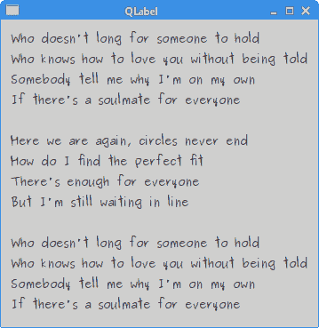
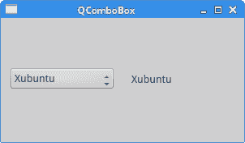
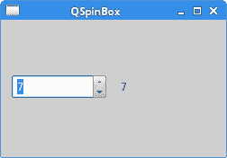
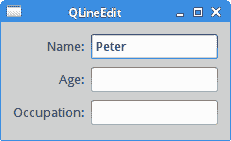
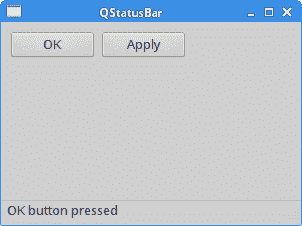

# Qt5 小部件

> 原文： [http://zetcode.com/gui/qt5/widgets/](http://zetcode.com/gui/qt5/widgets/)

在 Qt5 C++ 编程教程的这一部分中，我们将讨论一些基本的 Qt5 小部件。 我们有`QLabel`，`QSlider`，`QComboBox`，`QSpinBox`，`QLineEdit`和`QMainWindow`小部件的示例。

小部件是 GUI 应用的基本构建块。 Qt5 库具有丰富的各种小部件集。

## `QLabel`

`QLabel`用于显示文本和图像。 没有用户交互。 以下示例显示文本。

`label.h`

```cpp
#pragma once

#include <QWidget>
#include <QLabel>

class Label : public QWidget {

  public:
    Label(QWidget *parent = 0);

  private:
    QLabel *label;
};

```

这是我们的代码示例的头文件。

`label.cpp`

```cpp
#include <QVBoxLayout>
#include <QFont>
#include "label.h"

Label::Label(QWidget *parent)
    : QWidget(parent) {

  QString lyrics = "Who doesn't long for someone to hold\n\
Who knows how to love you without being told\n\
Somebody tell me why I'm on my own\n\
If there's a soulmate for everyone\n\
\n\
Here we are again, circles never end\n\
How do I find the perfect fit\n\
There's enough for everyone\n\
But I'm still waiting in line\n\
\n\
Who doesn't long for someone to hold\n\
Who knows how to love you without being told\n\
Somebody tell me why I'm on my own\n\
If there's a soulmate for everyone";

  label = new QLabel(lyrics, this);
  label->setFont(QFont("Purisa", 10));

  QVBoxLayout *vbox = new QVBoxLayout();
  vbox->addWidget(label);
  setLayout(vbox);
}

```

我们使用`QLabel`小部件在窗口中显示歌词。

```cpp
label = new QLabel(lyrics, this);
label->setFont(QFont("Purisa", 10));

```

我们创建一个标签小部件并为其设置特定的字体。

`main.cpp`

```cpp
#include <QApplication>
#include <QTextStream>
#include "label.h"

int main(int argc, char *argv[]) {

  QApplication app(argc, argv);  

  Label window;

  window.setWindowTitle("QLabel");
  window.show();

  return app.exec();
}

```

这是主文件。



Figure: QLabel

## `QSlider`

`QSlider`是具有简单句柄的小部件。 该手柄可以前后拉动。 这样，我们可以为特定任务选择一个值。

`slider.h`

```cpp
#pragma once

#include <QWidget>
#include <QSlider>
#include <QLabel>

class Slider : public QWidget {

  Q_OBJECT

  public:
    Slider(QWidget *parent = 0);

  private:
    QSlider *slider; 
    QLabel *label;
};

```

该示例的头文件。

`slider.cpp`

```cpp
#include <QHBoxLayout>
#include "slider.h"

Slider::Slider(QWidget *parent)
    : QWidget(parent) {

  QHBoxLayout *hbox = new QHBoxLayout(this);

  slider = new QSlider(Qt::Horizontal , this);
  hbox->addWidget(slider);

  label = new QLabel("0", this);
  hbox->addWidget(label);

  connect(slider, &QSlider::valueChanged, label, 
    static_cast<void (QLabel::*)(int)>(&QLabel::setNum));
}

```

我们显示两个小部件：一个滑块和一个标签。 滑块控制标签中显示的数字。

```cpp
slider = new QSlider(Qt::Horizontal , this);

```

将创建水平`QSlider`。

```cpp
connect(slider, &QSlider::valueChanged, label, 
  static_cast<void (QLabel::*)(int)>(&QLabel::setNum));

```

在此代码行中，我们将`valueChanged()`信号连接到标签的内置`setNum()`槽。 由于`setNum()`方法过载，因此我们使用`static_cast`选择正确的方法。

`main.cpp`

```cpp
#include <QApplication>
#include "slider.h"

int main(int argc, char *argv[]) {

  QApplication app(argc, argv);  

  Slider window;

  window.setWindowTitle("QSlider");
  window.show();

  return app.exec();
}

```

这是主文件。


Figure: QSlider

## `QComboBox`

`QComboBox`是一个小部件，它以占用最少屏幕空间的方式向用户显示选项列表。 这是一个显示当前项目的选择小部件，可以弹出可选择项目的列表。 组合框可能是可编辑的，允许用户修改列表中的每个项目。

`combobox.h`

```cpp
#pragma once

#include <QWidget>
#include <QComboBox>
#include <QLabel>

class ComboBoxEx : public QWidget {

  Q_OBJECT

  public:
    ComboBoxEx(QWidget *parent = 0);

  private:
    QComboBox *combo; 
    QLabel *label;
};

```

我们使用两个小部件：一个组合框和一个标签。

`combobox.cpp`

```cpp
#include <QHBoxLayout>
#include "combobox.h"

ComboBoxEx::ComboBoxEx(QWidget *parent)
    : QWidget(parent) {

  QStringList distros = {"Arch", "Xubuntu", "Redhat", "Debian", 
      "Mandriva"};

  QHBoxLayout *hbox = new QHBoxLayout(this);

  combo = new QComboBox();
  combo->addItems(distros);

  hbox->addWidget(combo);
  hbox->addSpacing(15);

  label = new QLabel("Arch", this);
  hbox->addWidget(label);

  connect(combo, static_cast<void(QComboBox::*)(const QString &)>(&QComboBox::activated), 
      label, &QLabel::setText);
}

```

在示例中，标签中显示了从组合框中选择的项目。

```cpp
QStringList distros = {"Arch", "Xubuntu", "Redhat", "Debian", 
    "Mandriva"};

```

`QStringList`存储组合框的数据。 我们列出了 Linux 发行版。

```cpp
combo = new QComboBox();
combo->addItems(distros);

```

创建一个`QComboBox`，并使用`addItems()`方法插入项目。

```cpp
connect(combo, static_cast<void(QComboBox::*)(const QString &)>(&QComboBox::activated), 
    label, &QLabel::setText);

```

组合框的`activated()`信号插入标签的`setText()`槽。 由于信号过载，我们进行静态转换。

`main.cpp`

```cpp
#include <QApplication>
#include "combobox.h"

int main(int argc, char *argv[]) {

  QApplication app(argc, argv);  

  ComboBoxEx window;

  window.resize(300, 150);
  window.setWindowTitle("QComboBox");
  window.show();

  return app.exec();
}

```

这是应用的主文件。



Figure: QComboBox

## `QSpinBox`

`QSpinbox`是一个小部件，用于处理整数和离散值集。 在我们的代码示例中，我们将有一个`QSpinbox`小部件。 我们可以选择数字`0..99`。 当前选择的值显示在标签窗口小部件中。

`spinbox.h`

```cpp
#pragma once

#include <QWidget>
#include <QSpinBox>

class SpinBox : public QWidget {

  Q_OBJECT

  public:
    SpinBox(QWidget *parent = 0);

  private:
    QSpinBox *spinbox;
};

```

这是`QSpinbox`示例的头文件。

`spinbox.cpp`

```cpp
#include <QHBoxLayout>
#include <QLabel>
#include "spinbox.h"

SpinBox::SpinBox(QWidget *parent)
    : QWidget(parent) {

  QHBoxLayout *hbox = new QHBoxLayout(this);   
  hbox->setSpacing(15);

  spinbox = new QSpinBox(this);
  QLabel *lbl = new QLabel("0", this);

  hbox->addWidget(spinbox);  
  hbox->addWidget(lbl);

  connect(spinbox, static_cast<void (QSpinBox::*)(int)>(&QSpinBox::valueChanged), 
    lbl, static_cast<void (QLabel::*)(int)>(&QLabel::setNum));  
}

```

我们在窗口上放置一个旋转框，并将其`valueChanged()`信号连接到`QLabel`的`setNum()`槽。

```cpp
connect(spinbox, static_cast<void (QSpinBox::*)(int)>(&QSpinBox::valueChanged), 
  lbl, static_cast<void (QLabel::*)(int)>(&QLabel::setNum)); 

```

我们需要进行两次转换，因为信号和槽都过载。

`main.cpp`

```cpp
#include <QApplication>
#include "spinbox.h"

int main(int argc, char *argv[]) {

  QApplication app(argc, argv);  

  SpinBox window;

  window.resize(250, 150);
  window.setWindowTitle("QSpinBox");
  window.show();

  return app.exec();
}

```

这是主文件。



Figure: QSpinBox

## `QLineEdit`

`QLineEdit`是一个小部件，允许输入和编辑单行纯文本。 `QLineEdit`小部件具有撤消/重做，剪切/粘贴和拖动的&放置功能。

在我们的示例中，我们显示了三个标签和三行编辑。

`ledit.h`

```cpp
#pragma once

#include <QWidget>

class Ledit : public QWidget {

  public:
    Ledit(QWidget *parent = 0);
};

```

该示例的头文件。

`ledit.cpp`

```cpp
#include <QGridLayout>
#include <QLabel>
#include <QLineEdit>
#include "ledit.h"

Ledit::Ledit(QWidget *parent)
    : QWidget(parent) {

  QLabel *name = new QLabel("Name:", this);
  name->setAlignment(Qt::AlignRight | Qt::AlignVCenter);
  QLabel *age = new QLabel("Age:", this);
  age->setAlignment(Qt::AlignRight | Qt::AlignVCenter);
  QLabel *occupation = new QLabel("Occupation:", this);
  occupation->setAlignment(Qt::AlignRight | Qt::AlignVCenter);

  QLineEdit *le1 = new QLineEdit(this);
  QLineEdit *le2 = new QLineEdit(this);
  QLineEdit *le3 = new QLineEdit(this);

  QGridLayout *grid = new QGridLayout(); 

  grid->addWidget(name, 0, 0);
  grid->addWidget(le1, 0, 1);
  grid->addWidget(age, 1, 0);
  grid->addWidget(le2, 1, 1);
  grid->addWidget(occupation, 2, 0);
  grid->addWidget(le3, 2, 1);

  setLayout(grid);
}

```

我们显示三个标签和三行编辑。 这些小部件由`QGridLayout`管理器组织。

`main.cpp`

```cpp
#include "ledit.h"
#include <QApplication>

int main(int argc, char *argv[]) {

  QApplication app(argc, argv);  

  Ledit window;

  window.setWindowTitle("QLineEdit");
  window.show();

  return app.exec();
}

```

这是主文件。



Figure: QLineEdit

## 状态栏

状态栏是一个面板，用于显示有关应用的状态信息。

在我们的示例中，我们有两个按钮和一个状态栏。 如果我们单击每个按钮，则会显示一条消息。 状态栏小部件是`QMainWindow`小部件的一部分。

`statusbar.h`

```cpp
#pragma once

#include <QMainWindow>
#include <QPushButton>

class Statusbar : public QMainWindow {

  Q_OBJECT  

  public:
    Statusbar(QWidget *parent = 0);

  private slots:
    void OnOkPressed();
    void OnApplyPressed();

  private:
    QPushButton *okBtn;
    QPushButton *aplBtn;
};

```

该示例的头文件。

`statusbar.cpp`

```cpp
#include <QLabel>
#include <QFrame>
#include <QStatusBar>
#include <QHBoxLayout>
#include "statusbar.h"

Statusbar::Statusbar(QWidget *parent)
    : QMainWindow(parent) {

  QFrame *frame = new QFrame(this);
  setCentralWidget(frame);

  QHBoxLayout *hbox = new QHBoxLayout(frame);

  okBtn = new QPushButton("OK", frame);
  hbox->addWidget(okBtn, 0, Qt::AlignLeft | Qt::AlignTop);

  aplBtn = new QPushButton("Apply", frame);
  hbox->addWidget(aplBtn, 1, Qt::AlignLeft | Qt::AlignTop);

  statusBar();

  connect(okBtn, &QPushButton::clicked, this, &Statusbar::OnOkPressed);
  connect(aplBtn, &QPushButton::clicked, this, &Statusbar::OnApplyPressed);
}

void Statusbar::OnOkPressed() {

  statusBar()->showMessage("OK button pressed", 2000);
}

void Statusbar::OnApplyPressed() {

 statusBar()->showMessage("Apply button pressed", 2000);
}

```

这是`statusbar.cpp`文件。

```cpp
QFrame *frame = new QFrame(this);
setCentralWidget(frame);

```

`QFrame`小部件放在`QMainWindow`小部件的中心区域。 中心区域只能容纳一个小部件。

```cpp
okBtn = new QPushButton("OK", frame);
hbox->addWidget(okBtn, 0, Qt::AlignLeft | Qt::AlignTop);

aplBtn = new QPushButton("Apply", frame);
hbox->addWidget(aplBtn, 1, Qt::AlignLeft | Qt::AlignTop);

```

我们创建两个`QPushButton`小部件，并将它们放置在水平框中。 按钮的父项是框架窗口小部件。

```cpp
statusBar();

```

要显示状态栏小部件，我们调用`QMainWindow`小部件的`statusBar()`方法。

```cpp
void Statusbar::OnOkPressed() {

  statusBar()->showMessage("OK button pressed", 2000);
}

```

`showMessage()`方法在状态栏上显示该消息。 最后一个参数指定消息在状态栏上显示的毫秒数。

`main.cpp`

```cpp
#include <QApplication>
#include "statusbar.h"

int main(int argc, char *argv[]) {

  QApplication app(argc, argv);  

  Statusbar window;

  window.resize(300, 200);
  window.setWindowTitle("QStatusBar");
  window.show();

  return app.exec();
}

```

这是主文件。



Figure: Statusbar example

在 Qt5 教程的这一部分中，我们介绍了几个 Qt5 小部件。