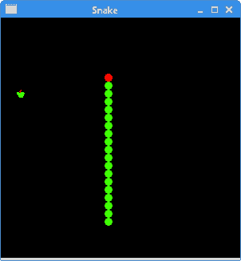

# Qt5 中的 Snake

> 原文： [http://zetcode.com/gui/qt5/snake/](http://zetcode.com/gui/qt5/snake/)

在 Qt5 教程的这一部分中，我们创建一个 Snake 游戏克隆。

## Snake

Snake 是较旧的经典视频游戏。 它最初是在 70 年代后期创建的。 后来它被带到 PC 上。 在这个游戏中，玩家控制蛇。 目的是尽可能多地吃苹果。 蛇每次吃一个苹果，它的身体就会长大。 蛇必须避开墙壁和自己的身体。 该游戏有时称为 Nibbles。

## 发展历程

蛇的每个关节的大小为 10 像素。 蛇由光标键控制。 最初，蛇具有三个关节。 如果游戏结束，则在面板中间显示“ Game Over”消息。

`Snake.h`

```cpp
#pragma once

#include <QWidget>
#include <QKeyEvent>

class Snake : public QWidget {

  public:
      Snake(QWidget *parent = 0);

  protected:
      void paintEvent(QPaintEvent *);
      void timerEvent(QTimerEvent *);
      void keyPressEvent(QKeyEvent *);

  private:
      QImage dot;
      QImage head; 
      QImage apple;

      static const int B_WIDTH = 300;
      static const int B_HEIGHT = 300;
      static const int DOT_SIZE = 10;
      static const int ALL_DOTS = 900;
      static const int RAND_POS = 29;
      static const int DELAY = 140;    

      int timerId;
      int dots;
      int apple_x;
      int apple_y;      

      int x[ALL_DOTS]; 
      int y[ALL_DOTS]; 

      bool leftDirection;
      bool rightDirection;
      bool upDirection;
      bool downDirection;
      bool inGame;

      void loadImages();
      void initGame();
      void locateApple();
      void checkApple();
      void checkCollision();
      void move();
      void doDrawing();
      void gameOver(QPainter &);      
};

```

这是头文件。

```cpp
static const int B_WIDTH = 300;
static const int B_HEIGHT = 300;
static const int DOT_SIZE = 10;
static const int ALL_DOTS = 900;
static const int RAND_POS = 29;
static const int DELAY = 140;   

```

`B_WIDTH`和`B_HEIGHT`常数确定电路板的尺寸。 `DOT_SIZE`是苹果的大小和蛇的点。 `ALL_DOTS`常数定义了板上可能的最大点数（900 =（300 * 300）/（10 * 10））。 `RAND_POS`常数用于计算苹果的随机位置。 `DELAY`常数确定游戏的速度。

```cpp
int x[ALL_DOTS]; 
int y[ALL_DOTS]; 

```

这两个数组保存着蛇所有关节的 x 和 y 坐标。

`snake.cpp`

```cpp
#include <QPainter>
#include <QTime>
#include "snake.h"

Snake::Snake(QWidget *parent) : QWidget(parent) {

    setStyleSheet("background-color:black;");
    leftDirection = false;
    rightDirection = true;
    upDirection = false;
    downDirection = false;
    inGame = true;

    resize(B_WIDTH, B_HEIGHT);
    loadImages();
    initGame();
}

void Snake::loadImages() {

    dot.load("dot.png");
    head.load("head.png");
    apple.load("apple.png");
}

void Snake::initGame() {

    dots = 3;

    for (int z = 0; z < dots; z++) {
        x[z] = 50 - z * 10;
        y[z] = 50;
    }

    locateApple();

    timerId = startTimer(DELAY);
}

void Snake::paintEvent(QPaintEvent *e) {

    Q_UNUSED(e);  

    doDrawing();
}    

void Snake::doDrawing() {

    QPainter qp(this);

    if (inGame) {

        qp.drawImage(apple_x, apple_y, apple);

        for (int z = 0; z < dots; z++) {
            if (z == 0) {
                qp.drawImage(x[z], y[z], head);
            } else {
                qp.drawImage(x[z], y[z], dot);
            }
        }

    } else {

        gameOver(qp);
    }        
}

void Snake::gameOver(QPainter &qp) {

    QString message = "Game over";
    QFont font("Courier", 15, QFont::DemiBold);
    QFontMetrics fm(font);
    int textWidth = fm.width(message);

    qp.setFont(font);
    int h = height();
    int w = width();

    qp.translate(QPoint(w/2, h/2));
    qp.drawText(-textWidth/2, 0, message);          
}

void Snake::checkApple() {

    if ((x[0] == apple_x) && (y[0] == apple_y)) {

        dots++;
        locateApple();
    }
}

void Snake::move() {

    for (int z = dots; z > 0; z--) {
        x[z] = x[(z - 1)];
        y[z] = y[(z - 1)];
    }

    if (leftDirection) {
        x[0] -= DOT_SIZE;
    }

    if (rightDirection) {
        x[0] += DOT_SIZE;
    }

    if (upDirection) {
        y[0] -= DOT_SIZE;
    }

    if (downDirection) {
        y[0] += DOT_SIZE;
    }
}

void Snake::checkCollision() {

    for (int z = dots; z > 0; z--) {

        if ((z > 4) && (x[0] == x[z]) && (y[0] == y[z])) {
            inGame = false;
        }
    }

    if (y[0] >= B_HEIGHT) {
        inGame = false;
    }

    if (y[0] < 0) {
        inGame = false;
    }

    if (x[0] >= B_WIDTH) {
        inGame = false;
    }

    if (x[0] < 0) {
        inGame = false;
    }

    if(!inGame) {
        killTimer(timerId); 
    }
}

void Snake::locateApple() {

    QTime time = QTime::currentTime();
    qsrand((uint) time.msec());

    int r = qrand() % RAND_POS;
    apple_x = (r * DOT_SIZE);

    r = qrand() % RAND_POS;
    apple_y = (r * DOT_SIZE);
}

void Snake::timerEvent(QTimerEvent *e) {

    Q_UNUSED(e);  

    if (inGame) {

        checkApple();
        checkCollision();
        move();
    }

    repaint();
}    

void Snake::keyPressEvent(QKeyEvent *e) {

    int key = e->key();

    if ((key == Qt::Key_Left) && (!rightDirection)) {
        leftDirection = true;
        upDirection = false;
        downDirection = false;
    }

    if ((key == Qt::Key_Right) && (!leftDirection)) {
        rightDirection = true;
        upDirection = false;
        downDirection = false;
    }

    if ((key == Qt::Key_Up) && (!downDirection)) {
        upDirection = true;
        rightDirection = false;
        leftDirection = false;
    }

    if ((key == Qt::Key_Down) && (!upDirection)) {
        downDirection = true;
        rightDirection = false;
        leftDirection = false;
    }    

    QWidget::keyPressEvent(e);    
}

```

在`snake.cpp`文件中，我们有游戏的逻辑。

```cpp
void Snake::loadImages() {

    dot.load("dot.png");
    head.load("head.png");
    apple.load("apple.png");
}

```

在`loadImages()`方法中，我们获得了游戏的图像。 `ImageIcon`类用于显示 PNG 图像。

```cpp
void Snake::initGame() {

    dots = 3;

    for (int z = 0; z < dots; z++) {
        x[z] = 50 - z * 10;
        y[z] = 50;
    }

    locateApple();

    timerId = startTimer(DELAY);
}

```

在`initGame()`方法中，我们创建蛇，在板上随机放置一个苹果，然后启动计时器。

```cpp
void Snake::checkApple() {

    if ((x[0] == apple_x) && (y[0] == apple_y)) {

        dots++;
        locateApple();
    }
}

```

如果苹果与头部碰撞，我们会增加蛇的关节数。 我们称`locateApple()`方法为随机放置一个新的 Apple 对象。

在`move()`方法中，我们有游戏的密钥算法。 要了解它，请看一下蛇是如何运动的。 我们控制蛇的头。 我们可以使用光标键更改其方向。 其余关节在链上向上移动一个位置。 第二关节移动到第一个关节的位置，第三关节移动到第二个关节的位置，依此类推。

```cpp
for (int z = dots; z > 0; z--) {
    x[z] = x[(z - 1)];
    y[z] = y[(z - 1)];
}

```

该代码将关节向上移动。

```cpp
if (leftDirection) {
    x[0] -= DOT_SIZE;
}

```

这条线将头向左移动。

在`checkCollision()`方法中，我们确定蛇是否击中了自己或撞墙之一。

```cpp
for (int z = dots; z > 0; z--) {

    if ((z > 4) && (x[0] == x[z]) && (y[0] == y[z])) {
        inGame = false;
    }
}

```

如果蛇用头撞到其关节之一，则游戏结束。

```cpp
if (y[0] >= B_HEIGHT) {
    inGame = false;
}

```

如果蛇击中了棋盘的底部，则游戏结束。

```cpp
void Snake::timerEvent(QTimerEvent *e) {

    Q_UNUSED(e);  

    if (inGame) {

        checkApple();
        checkCollision();
        move();
    }

    repaint();
}  

```

`timerEvent()`方法形成游戏周期。 假设游戏尚未结束，我们将执行碰撞检测并进行移动。 `repaint()`使窗口重新绘制。

```cpp
if ((key == Qt::Key_Left) && (!rightDirection)) {
    leftDirection = true;
    upDirection = false;
    downDirection = false;
}

```

如果单击左光标键，则将`leftDirection`变量设置为 true。 `move()`函数中使用此变量来更改蛇对象的坐标。 还要注意，当蛇向右行驶时，我们不能立即向左转。

`Snake.java`

```cpp
#include <QApplication>
#include "snake.h"

int main(int argc, char *argv[]) {

  QApplication app(argc, argv);

  Snake window;

  window.setWindowTitle("Snake");
  window.show();

  return app.exec();
}

```

这是主要的类。



Figure: Snake

这是 Qt5 中的 Snake 游戏。