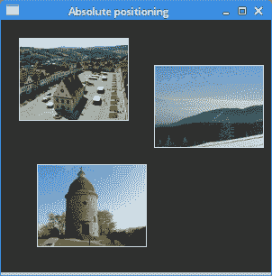
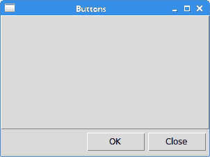
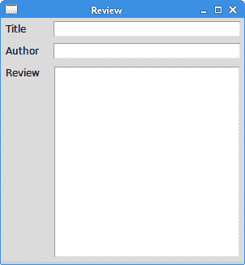
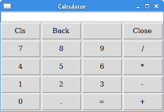
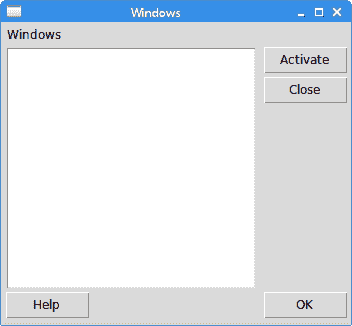

# Tkinter 中的布局管理

> 原文： [http://zetcode.com/tkinter/layout/](http://zetcode.com/tkinter/layout/)

在 Tkinter 教程的这一部分中，我们介绍布局管理器。

在设计应用的 GUI 时，我们决定要使用哪些小部件以及如何在应用中组织这些小部件。 为了组织小部件，我们使用专门的不可见对象，称为布局管理器。

有两种小部件：容器及其子级。 容器将孩子分组为合适的布局。

Tkinter 具有三个内置的布局管理器：`pack`，`grid`和`place`管理器。 `place`几何管理器使用绝对定位来定位小部件。 `pack`几何管理器在水平和垂直框中组织窗口小部件。 `grid`几何管理器将小部件放置在二维网格中。

## 绝对定位

在大多数情况下，程序员应使用布局管理器。 在某些情况下，我们可以使用绝对定位。 在绝对定位中，程序员以像素为单位指定每个小部件的位置和大小。 如果我们调整窗口大小，则小部件的大小和位置不会改变。 在各种平台上，应用看起来都不同，在 Linux 上看起来不错，在 Mac OS 上看起来不太正常。 在我们的应用中更改字体可能会破坏布局。 如果我们将应用翻译成另一种语言，则必须重做布局。

`absolute.py`

```py
#!/usr/bin/env python3

"""
ZetCode Tkinter tutorial

In this script, we lay out images
using absolute positioning.

Author: Jan Bodnar
Last modified: April 2019
Website: www.zetcode.com
"""

from PIL import Image, ImageTk
from tkinter import Tk, BOTH
from tkinter.ttk import Frame, Label, Style

class Example(Frame):

    def __init__(self):
        super().__init__()

        self.initUI()

    def initUI(self):

        self.master.title("Absolute positioning")
        self.pack(fill=BOTH, expand=1)

        Style().configure("TFrame", background="#333")

        bard = Image.open("bardejov.jpg")
        bardejov = ImageTk.PhotoImage(bard)
        label1 = Label(self, image=bardejov)
        label1.image = bardejov
        label1.place(x=20, y=20)

        rot = Image.open("rotunda.jpg")
        rotunda = ImageTk.PhotoImage(rot)
        label2 = Label(self, image=rotunda)
        label2.image = rotunda
        label2.place(x=40, y=160)

        minc = Image.open("mincol.jpg")
        mincol = ImageTk.PhotoImage(minc)
        label3 = Label(self, image=mincol)
        label3.image = mincol
        label3.place(x=170, y=50)

def main():

    root = Tk()
    root.geometry("300x280+300+300")
    app = Example()
    root.mainloop()

if __name__ == '__main__':
    main()

```

在此示例中，我们使用绝对定位放置了三个图像。 我们使用位置几何图形管理器。

```py
from PIL import Image, ImageTk

```

我们使用 Python Imaging Library（PIL）模块中的`Image`和`ImageTk`。

```py
style = Style()
style.configure("TFrame", background="#333")

```

我们使用样式将框架配置为具有深灰色背景。

```py
bard = Image.open("bardejov.jpg")
bardejov = ImageTk.PhotoImage(bard)

```

我们从当前工作目录中的图像创建图像对象和照片图像对象。

```py
label1 = Label(self, image=bardejov)

```

我们用图像创建一个`Label`。 标签可以包含文本或图像。

```py
label1.image = bardejov

```

我们必须保留对图像的引用，以防止图像被垃圾收集。

```py
label1.place(x=20, y=20)

```

将标签放置在框架上的 x = 20 和 y = 20 坐标处。



Figure: Absolute positioning

## Tkinter 包管理器

`pack`几何管理器在水平和垂直框中组织窗口小部件。 布局由`fill`，`expand`和`side`选项控制。

### 按钮示例

在下面的示例中，我们将两个按钮放置在窗口的右下角。 我们使用`pack`管理器。

`buttons.py`

```py
#!/usr/bin/env python3

"""
ZetCode Tkinter tutorial

In this script, we use the pack manager
to position two buttons in the
bottom-right corner of the window.

Author: Jan Bodnar
Last modified: April 2019
Website: www.zetcode.com
"""

from tkinter import Tk, RIGHT, BOTH, RAISED
from tkinter.ttk import Frame, Button, Style

class Example(Frame):

    def __init__(self):
        super().__init__()

        self.initUI()

    def initUI(self):

        self.master.title("Buttons")
        self.style = Style()
        self.style.theme_use("default")

        frame = Frame(self, relief=RAISED, borderwidth=1)
        frame.pack(fill=BOTH, expand=True)

        self.pack(fill=BOTH, expand=True)

        closeButton = Button(self, text="Close")
        closeButton.pack(side=RIGHT, padx=5, pady=5)
        okButton = Button(self, text="OK")
        okButton.pack(side=RIGHT)

def main():

    root = Tk()
    root.geometry("300x200+300+300")
    app = Example()
    root.mainloop()

if __name__ == '__main__':
    main()

```

我们有两个框架。 有一个基础框架和一个附加框架，该框架可在两个方向上扩展，并将两个按钮按到基础框架的底部。 这些按钮放置在水平框中，并位于此框的右侧。

```py
frame = Frame(self, relief=RAISED, borderwidth=1)
frame.pack(fill=BOTH, expand=True)

```

我们创建另一个`Frame`小部件。 该小部件占用了大部分区域。 我们更改框架的边框，使框架可见。 默认情况下，它是平坦的。

```py
closeButton = Button(self, text="Close")
closeButton.pack(side=RIGHT, padx=5, pady=5)

```

创建了`closeButton`。 将其放入水平盒中。 `side`参数使按钮放置在水平线的右侧。 `padx`和`pady`参数在小部件之间放置了一些空间。 `padx`在按钮小部件之间以及`closeButton`和根窗口的右边框之间放置一些空间。 `pady`在按钮小部件与框架的边框和根窗口的边框之间放置一些空间。

```py
okButton.pack(side=RIGHT)

```

`okButton`放在`closeButton`旁边，它们之间有 5px 的间距。



Figure: Buttons example

### 回顾示例

`pack`管理器是一个简单的布局管理器。 它可用于执行简单的布局任务。 为了创建更复杂的布局，我们需要利用更多的框架，每个框架都有自己的包管理器。

`review.py`

```py
#!/usr/bin/env python3

"""
ZetCode Tkinter tutorial

In this example, we use the pack
manager to create a review example.

Author: Jan Bodnar
Last modified: April 2019
Website: www.zetcode.com
"""

from tkinter import Tk, Text, TOP, BOTH, X, N, LEFT
from tkinter.ttk import Frame, Label, Entry

class Example(Frame):

    def __init__(self):
        super().__init__()

        self.initUI()

    def initUI(self):

        self.master.title("Review")
        self.pack(fill=BOTH, expand=True)

        frame1 = Frame(self)
        frame1.pack(fill=X)

        lbl1 = Label(frame1, text="Title", width=6)
        lbl1.pack(side=LEFT, padx=5, pady=5)

        entry1 = Entry(frame1)
        entry1.pack(fill=X, padx=5, expand=True)

        frame2 = Frame(self)
        frame2.pack(fill=X)

        lbl2 = Label(frame2, text="Author", width=6)
        lbl2.pack(side=LEFT, padx=5, pady=5)

        entry2 = Entry(frame2)
        entry2.pack(fill=X, padx=5, expand=True)

        frame3 = Frame(self)
        frame3.pack(fill=BOTH, expand=True)

        lbl3 = Label(frame3, text="Review", width=6)
        lbl3.pack(side=LEFT, anchor=N, padx=5, pady=5)

        txt = Text(frame3)
        txt.pack(fill=BOTH, pady=5, padx=5, expand=True)

def main():

    root = Tk()
    root.geometry("300x300+300+300")
    app = Example()
    root.mainloop()

if __name__ == '__main__':
    main()

```

该示例显示了如何创建具有多个框架和包装管理器的更复杂的布局。

```py
self.pack(fill=BOTH, expand=True)

```

第一个框架是基础框架，其他框架放置在该基础框架上。 请注意，除了在框架内组织子代外，我们还在基础框架上管理框架。

```py
frame1 = Frame(self)
frame1.pack(fill=X)

lbl1 = Label(frame1, text="Title", width=6)
lbl1.pack(side=LEFT, padx=5, pady=5)

entry1 = Entry(frame1)
entry1.pack(fill=X, padx=5, expand=True)

```

前两个小部件放置在第一帧上。 使用`fill`和`expand`参数水平拉伸该条目。

```py
frame3 = Frame(self)
frame3.pack(fill=BOTH, expand=True)

lbl3 = Label(frame3, text="Review", width=6)
lbl3.pack(side=LEFT, anchor=N, padx=5, pady=5)

txt = Text(frame3)
txt.pack(fill=BOTH, pady=5, padx=5, expand=True)

```

在第三帧内，我们放置一个标签和一个文本小部件。 标签固定在北方。 文本小部件将占据整个剩余区域。



Figure: Review example

## Tkinter 网格管理器

Tkinter 的`grid`几何管理器用于创建计算器的骨架。

`calculator.py`

```py
#!/usr/bin/env python3

"""
ZetCode Tkinter tutorial

In this script, we use the grid manager
to create a skeleton of a calculator.

Author: Jan Bodnar
Last modified: April 2019
Website: www.zetcode.com
"""

from tkinter import Tk, W, E
from tkinter.ttk import Frame, Button, Entry, Style

class Example(Frame):

    def __init__(self):
        super().__init__()

        self.initUI()

    def initUI(self):

        self.master.title("Calculator")

        Style().configure("TButton", padding=(0, 5, 0, 5),
            font='serif 10')

        self.columnconfigure(0, pad=3)
        self.columnconfigure(1, pad=3)
        self.columnconfigure(2, pad=3)
        self.columnconfigure(3, pad=3)

        self.rowconfigure(0, pad=3)
        self.rowconfigure(1, pad=3)
        self.rowconfigure(2, pad=3)
        self.rowconfigure(3, pad=3)
        self.rowconfigure(4, pad=3)

        entry = Entry(self)
        entry.grid(row=0, columnspan=4, sticky=W+E)
        cls = Button(self, text="Cls")
        cls.grid(row=1, column=0)
        bck = Button(self, text="Back")
        bck.grid(row=1, column=1)
        lbl = Button(self)
        lbl.grid(row=1, column=2)
        clo = Button(self, text="Close")
        clo.grid(row=1, column=3)
        sev = Button(self, text="7")
        sev.grid(row=2, column=0)
        eig = Button(self, text="8")
        eig.grid(row=2, column=1)
        nin = Button(self, text="9")
        nin.grid(row=2, column=2)
        div = Button(self, text="/")
        div.grid(row=2, column=3)

        fou = Button(self, text="4")
        fou.grid(row=3, column=0)
        fiv = Button(self, text="5")
        fiv.grid(row=3, column=1)
        six = Button(self, text="6")
        six.grid(row=3, column=2)
        mul = Button(self, text="*")
        mul.grid(row=3, column=3)

        one = Button(self, text="1")
        one.grid(row=4, column=0)
        two = Button(self, text="2")
        two.grid(row=4, column=1)
        thr = Button(self, text="3")
        thr.grid(row=4, column=2)
        mns = Button(self, text="-")
        mns.grid(row=4, column=3)

        zer = Button(self, text="0")
        zer.grid(row=5, column=0)
        dot = Button(self, text=".")
        dot.grid(row=5, column=1)
        equ = Button(self, text="=")
        equ.grid(row=5, column=2)
        pls = Button(self, text="+")
        pls.grid(row=5, column=3)

        self.pack()

def main():

    root = Tk()
    app = Example()
    root.mainloop()

if __name__ == '__main__':
    main()

```

网格管理器用于组织框架容器中的按钮。

```py
Style().configure("TButton", padding=(0, 5, 0, 5),
    font='serif 10')

```

我们将`Button`小部件配置为具有特定的字体并具有一些内部填充。

```py
self.columnconfigure(0, pad=3)
...
self.rowconfigure(0, pad=3)

```

我们使用`columnconfigure()`和`rowconfigure()`方法在网格列和行中定义一些空间。 这样，我们可以实现按钮之间有一定的间隔。

```py
entry = Entry(self)
entry.grid(row=0, columnspan=4, sticky=W+E)

```

`Entry`小部件是显示数字的地方。 小部件放置在第一行中，它横跨所有四列。 小部件可能不会占用网格中单元所分配的所有空间。 `sticky`参数沿给定方向扩展小部件。 在我们的案例中，我们确保条目小部件从左向右展开。

```py
cls = Button(self, text="Cls")
cls.grid(row=1, column=0)

```

`cls`按钮位于第二行和第一列。 请注意，行和列从零开始。

```py
self.pack()

```

`pack()`方法显示框架小部件并为其指定初始大小。 如果没有给出其他参数，则大小将足以显示所有子项。 此方法将框架窗口小部件打包到顶级根窗口，该窗口也是一个容器。 `grid`几何管理器用于组织框架小部件中的按钮。



Figure: Calculator

### Windows 示例

以下示例使用`grid`几何管理器创建 Windows 对话框。

`windows.py`

```py
#!/usr/bin/env python3

"""
ZetCode Tkinter tutorial

In this script, we use the grid
manager to create a more complicated Windows
layout.

Author: Jan Bodnar
Last modified: April 2019
Website: www.zetcode.com
"""

from tkinter import Tk, Text, BOTH, W, N, E, S
from tkinter.ttk import Frame, Button, Label, Style

class Example(Frame):

    def __init__(self):
        super().__init__()

        self.initUI()

    def initUI(self):

        self.master.title("Windows")
        self.pack(fill=BOTH, expand=True)

        self.columnconfigure(1, weight=1)
        self.columnconfigure(3, pad=7)
        self.rowconfigure(3, weight=1)
        self.rowconfigure(5, pad=7)

        lbl = Label(self, text="Windows")
        lbl.grid(sticky=W, pady=4, padx=5)

        area = Text(self)
        area.grid(row=1, column=0, columnspan=2, rowspan=4,
            padx=5, sticky=E+W+S+N)

        abtn = Button(self, text="Activate")
        abtn.grid(row=1, column=3)

        cbtn = Button(self, text="Close")
        cbtn.grid(row=2, column=3, pady=4)

        hbtn = Button(self, text="Help")
        hbtn.grid(row=5, column=0, padx=5)

        obtn = Button(self, text="OK")
        obtn.grid(row=5, column=3)

def main():

    root = Tk()
    root.geometry("350x300+300+300")
    app = Example()
    root.mainloop()

if __name__ == '__main__':
    main()

```

在此示例中，我们使用`Label`小部件，`Text`小部件和四个按钮。

```py
self.columnconfigure(1, weight=1)
self.columnconfigure(3, pad=7)
self.rowconfigure(3, weight=1)
self.rowconfigure(5, pad=7)

```

我们在网格中的小部件之间定义一些空间。 `weight`参数使第二列和第四行可增长。 该行和列被文本小部件占据，因此所有多余的空间都被它占用。

```py
lbl = Label(self, text="Windows")
lbl.grid(sticky=W, pady=4, padx=5)

```

标签窗口小部件已创建并放入网格中。 如果未指定列和行，则假定为第一列或行。 该标签向西粘贴，其边框周围有一些填充物。

```py
area = Text(self)
area.grid(row=1, column=0, columnspan=2, rowspan=4,
    padx=5, sticky=E+W+S+N)

```

文本窗口小部件已创建，并从第二行和第一列开始。 它跨越两列和四行。 小部件和根窗口的左边框之间有 4px 的间距。 最终，小部件将粘在所有四个方面。 因此，调整窗口大小时，文本小部件会向各个方向扩展。

```py
abtn = Button(self, text="Activate")
abtn.grid(row=1, column=3)

cbtn = Button(self, text="Close")
cbtn.grid(row=2, column=3, pady=4)

```

这两个按钮位于文本小部件旁边。

```py
hbtn = Button(self, text="Help")
hbtn.grid(row=5, column=0, padx=5)

obtn = Button(self, text="OK")
obtn.grid(row=5, column=3)

```

这两个按钮位于文本小部件下方； “帮助”按钮占据第一列，“确定”按钮占据最后一列。



Figure: Windows example

在 Tkinter 教程的这一部分中，我们介绍了小部件的布局管理。