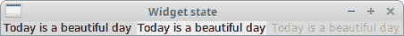
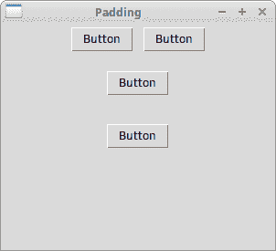
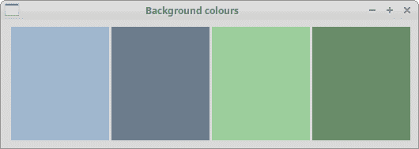
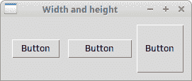
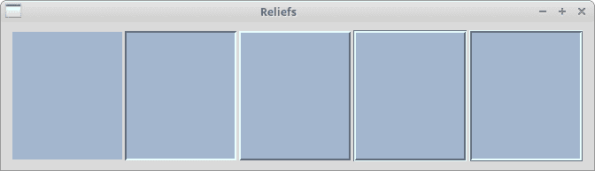
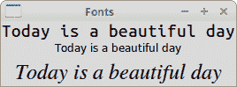

# Tkinter 标准小部件属性

> 原文： [http://zetcode.com/tkinter/attributes/](http://zetcode.com/tkinter/attributes/)

在 Tkinter 教程的这一部分中，我们讨论标准的窗口小部件属性，包括光标，浮雕，颜色和字体。

标准窗口小部件属性是在窗口小部件构造函数中使用的关键字。

## Tkinter 小部件状态

`state`属性定义窗口小部件的状态。 它可以具有以下值：`NORMAL`，`ACTIVE`和`DISABLED`。

`widget_states.py`

```py
#!/usr/bin/env python3

"""
ZetCode Tkinter tutorial

In this script, we use the state attribute.

Author: Jan Bodnar
Last modified: April 2019
Website: www.zetcode.com
"""

from tkinter import Tk, BOTH, NORMAL, ACTIVE, DISABLED
from tkinter.ttk import Frame, Label

class Example(Frame):

    def __init__(self):
        super().__init__()

        self.initUI()

    def initUI(self):

        self.master.title("Fonts")
        self.pack(fill=BOTH, expand=True)
        self.columnconfigure(0, pad=5)
        self.columnconfigure(1, pad=5)
        self.columnconfigure(2, pad=5)

        txt = "Today is a beautiful day"

        label1 = Label(self, text=txt, state=NORMAL)
        label1.grid(row=0, column=0)

        label2 = Label(self, text=txt, state=ACTIVE)
        label2.grid(row=0, column=1)

        label3 = Label(self, text=txt, state=DISABLED)
        label3.grid(row=0, column=2)

def main():

    root = Tk()
    ex = Example()
    root.geometry("+300+300")
    root.mainloop()

if __name__ == '__main__':
    main()

```

我们在`Label`小部件上演示 state 属性。

```py
label1 = Label(self, text=txt, state=NORMAL)

```

第一个标签具有`NORMAL`状态。



Figure: Widget state

## Tkinter 小部件填充

`padx`和`pady`属性为小部件添加了额外的水平和垂直空间。

`padding.py`

```py
#!/usr/bin/env python3

"""
ZetCode Tkinter tutorial

This program uses the padx and pady
widget attributes.

Author: Jan Bodnar
Last modified: April 2019
Website: www.zetcode.com
"""

from tkinter import Tk, Frame, Button
from tkinter import BOTH, LEFT, TOP

class Example(Frame):

    def __init__(self):
        super().__init__()

        self.initUI()

    def initUI(self):

        self.master.title("Padding")
        self.pack(fill=BOTH)

        frame = Frame(self, bd=5)
        frame.pack()

        btn1 = Button(frame, text='Button')
        btn1.pack(side=LEFT, padx=5)

        btn2 = Button(frame, text='Button')
        btn2.pack(side=LEFT, padx=5)

        frame2 = Frame(self)
        frame2.pack()

        btn1 = Button(frame2, text='Button')
        btn1.pack(side=TOP, pady=15)

        btn2 = Button(frame2, text='Button')
        btn2.pack(side=TOP, pady=15)

        self.pack()

def main():

    root = Tk()
    root.geometry("300x250+300+300")
    app = Example()
    root.mainloop()

if __name__ == '__main__':
    main()

```

在示例中，我们创建了两个框架； 他们每个人都有两个小部件。 第一个框架从按钮形成一行，第二个框架从列形成一行。 `padx`和`pady`属性在按钮之间添加空格。

```py
btn1 = Button(frame, text='Button')
btn1.pack(side=LEFT, padx=5)

```

使用`pack`管理器，我们创建了一行按钮。 `padx`在按钮之间水平增加 5px 的间距。

```py
btn1 = Button(frame2, text='Button')
btn1.pack(side=TOP, pady=15)

```

在这里，我们形成一列。 因此，我们使用`pady`属性垂直添加空间。



Figure: Padding

## 背景颜色

窗口小部件的背景色可以使用`background`属性设置。 可以缩写为`bg`。

同样，可以使用`foreground`属性设置窗口小部件的前景色。 可以缩写为`fg`。

`bg_colours.py`

```py
#!/usr/bin/env python3

"""
ZetCode Tkinter tutorial

This program uses sets various background
colours with bg attribute.

Author: Jan Bodnar
Last modified: April 2019
Website: www.zetcode.com
"""

from tkinter import Tk, Frame, Label
from tkinter import BOTH, LEFT

class Example(Frame):

    def __init__(self):
        super().__init__()

        self.initUI()

    def initUI(self):

        self.master.title("Background colours")
        self.pack(fill=BOTH)

        frame = Frame(self, borderwidth=10)
        frame.pack()

        lbl1 = Label(frame, bg='SlateGray3', width=15, height=10)
        lbl1.pack(side=LEFT, padx=3)

        lbl2 = Label(frame, bg='SlateGray4', width=15, height=10)
        lbl2.pack(side=LEFT)

        lbl3 = Label(frame, bg='DarkSeaGreen3', width=15, height=10)
        lbl3.pack(side=LEFT, padx=3)

        lbl4 = Label(frame, bg='DarkSeaGreen4', width=15, height=10)
        lbl4.pack(side=LEFT)

        self.pack()

def main():

    root = Tk()
    root.geometry("+300+300")
    app = Example()
    root.mainloop()

if __name__ == '__main__':
    main()

```

在代码示例中，我们创建具有四个不同背景颜色的四个标签。

```py
lbl1 = Label(frame, bg='SlateGray3', width=15, height=10)
lbl1.pack(side=LEFT, padx=3)

```

第一个标签具有 SlateGray3 背景色。



Figure: Background colours

## 宽度和高度

`width`和`height`属性设置窗口小部件的宽度和高度。

`width_height.py`

```py
#!/usr/bin/env python3

"""
ZetCode Tkinter tutorial

This program uses width and height
attributes to set the size of widgets.

Author: Jan Bodnar
Last modified: April 2019
Website: www.zetcode.com
"""

from tkinter import Tk, Frame, Button
from tkinter import BOTH, LEFT

class Example(Frame):

    def __init__(self):
        super().__init__()

        self.initUI()

    def initUI(self):

        self.master.title("Width and height")
        self.pack(fill=BOTH)

        frame = Frame(self, borderwidth=10)
        frame.pack()

        btn1 = Button(frame, text='Button')
        btn1.pack(side=LEFT, padx=5)

        btn2 = Button(frame, text='Button', width=8)
        btn2.pack(side=LEFT, padx=5)

        btn3 = Button(frame, text='Button', width=5, height=4)
        btn3.pack(side=LEFT)

        self.pack()

def main():

    root = Tk()
    root.geometry("+300+300")
    app = Example()
    root.mainloop()

if __name__ == '__main__':
    main()

```

在示例中，我们使用`width`和`height.`控制按钮的大小

```py
btn2 = Button(frame, text='Button', width=8)

```

此按钮的宽度设置为八个字符。



Figure: With and height attributes

## Tkinter 浮雕

浮雕是一种边界装饰。 可能的值为：`SUNKEN`，`RAISED`，`GROOVE`，`RIDGE`和`FLAT`。

`reliefs.py`

```py
#!/usr/bin/env python3

"""
ZetCode Tkinter tutorial

This program uses relief styles.

Author: Jan Bodnar
Last modified: April 2019
Website: www.zetcode.com
"""

from tkinter import Tk, Frame, Label
from tkinter import BOTH, LEFT, FLAT, SUNKEN, RAISED, GROOVE, RIDGE

class Example(Frame):

    def __init__(self):
        super().__init__()

        self.initUI()

    def initUI(self):

        self.master.title("Reliefs")
        self.pack(fill=BOTH)

        frame = Frame(self, borderwidth=10)
        frame.pack()

        lbl1 = Label(frame, bg='LightSteelBlue3', width=15, height=10, relief=FLAT)
        lbl1.pack(side=LEFT, padx=3)

        lbl2 = Label(frame, bg='LightSteelBlue3', bd=2, width=15,
            height=10, relief=SUNKEN)
        lbl2.pack(side=LEFT)

        lbl3 = Label(frame, bg='LightSteelBlue3', bd=2, width=15,
            height=10, relief=RAISED)
        lbl3.pack(side=LEFT, padx=3)

        lbl4 = Label(frame, bg='LightSteelBlue3', bd=3, width=15,
            height=10, relief=GROOVE)
        lbl4.pack(side=LEFT)

        lbl5 = Label(frame, bg='LightSteelBlue3', bd=3, width=15,
            height=10, relief=RIDGE)
        lbl5.pack(side=LEFT, padx=3)

        self.pack()

def main():

    root = Tk()
    root.geometry("+300+300")
    app = Example()
    root.mainloop()

if __name__ == '__main__':
    main()

```

该示例显示了应用于标签的五种不同的凸版。

```py
lbl3 = Label(frame, bg='LightSteelBlue3', bd=2, width=15,
    height=10, relief=RAISED)

```

第三个标签具有`RAISED`浮雕。 使用`bd`，我们增加了边框宽度，以使浮雕更加明显。



Figure: Reliefs

## Tkinter 字体

Tkinter 具有用于处理字体的`tkinter.font`模块。 它具有一些内置字体，例如`TkTooltipFont`，`TkDefaultFont`或`TkTextFont`。 字体通过`font`属性设置。

`fonts.py`

```py
#!/usr/bin/env python3

"""
ZetCode Tkinter tutorial

In this script, we display text in three
different fonts.

Author: Jan Bodnar
Last modified: April 2019
Website: www.zetcode.com
"""

from tkinter import Tk, BOTH
from tkinter.ttk import Frame, Label, Notebook, Style

from tkinter.font import Font

class Example(Frame):

    def __init__(self):
        super().__init__()

        self.initUI()

    def initUI(self):

        self.master.title("Fonts")
        self.pack(fill=BOTH, expand=True)

        txt = "Today is a beautiful day"

        myfont = Font(family="Ubuntu Mono", size=16)
        label1 = Label(self, text=txt, font=myfont)
        label1.grid(row=0, column=0)

        label2 = Label(self, text=txt, font="TkTextFont")
        label2.grid(row=1, column=0)

        label3 = Label(self, text=txt, font=('Times', '18', 'italic'))
        label3.grid(row=2, column=0)

def main():

    root = Tk()
    ex = Example()
    root.geometry("+300+300")
    root.mainloop()

if __name__ == '__main__':
    main()

```

该示例显示了三个带有三种不同字体的文本标签。

```py
myfont = Font(family="Ubuntu Mono", size=16)
label1 = Label(self, text=txt, font=myfont)

```

使用`Font`类创建特定的字体。 如果该字体在平台上不可用，则 Tkinter 会还原为某些默认字体。

```py
label2 = Label(self, text=txt, font="TkTextFont")

```

在这里，我们使用内置字体名称。

```py
label3 = Label(self, text=txt, font=('Times', '18', 'italic'))

```

字体也可以指定为字符串元组。



Figure: Tkinter fonts

## Tkinter 光标

光标是一个小图标，显示鼠标指针所在的位置。 使用`cursor`属性设置 Tkinter 中的光标。

`cursors.py`

```py
#!/usr/bin/env python3

"""
ZetCode Tkinter tutorial

This program uses different cursors.

Author: Jan Bodnar
Last modified: April 2019
Website: www.zetcode.com
"""

from tkinter import Tk, Frame, Label
from tkinter import BOTH, LEFT

class Example(Frame):

    def __init__(self):
        super().__init__()

        self.initUI()

    def initUI(self):

        self.master.title("Cursors")
        self.pack(fill=BOTH)

        frame = Frame(self, borderwidth=10)
        frame.pack()

        lbl1 = Label(frame, bg='SlateGray3', width=15, height=10,
            cursor='tcross')
        lbl1.pack(side=LEFT, padx=3)

        lbl2 = Label(frame, bg='SlateGray4', width=15, height=10,
            cursor='hand2')
        lbl2.pack(side=LEFT)

        lbl3 = Label(frame, bg='DarkSeaGreen3', width=15, height=10,
            cursor='heart')
        lbl3.pack(side=LEFT, padx=3)

        lbl4 = Label(frame, bg='DarkSeaGreen4', width=15, height=10,
            cursor='pencil')
        lbl4.pack(side=LEFT)

        self.pack()

def main():

    root = Tk()
    root.geometry("+300+300")
    app = Example()
    root.mainloop()

if __name__ == '__main__':
    main()

```

在示例中，我们有四个标签。 每个标签使用不同的光标。

```py
lbl4 = Label(frame, bg='DarkSeaGreen4', width=15, height=10,
    cursor='pencil')

```

第四个标签有一个用于光标的铅笔图标。

在 Tkinter 教程的这一部分中，我们使用了标准的窗口小部件属性。