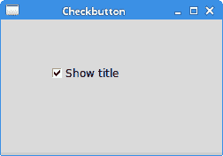
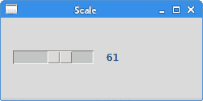
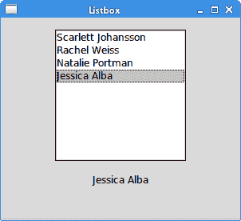

# Tkinter 小部件

> 原文： [http://zetcode.com/tkinter/widgets/](http://zetcode.com/tkinter/widgets/)

在 Tkinter 教程的这一部分中，我们将介绍一些基本的 Tkinter 小部件。 我们使用以下小部件：`Checkbutton`，`Label`，`Scale`和`Listbox`。

小部件是 GUI 应用程序的基本构建块。 多年以来，几个小部件已成为所有 OS 平台上所有工具包中的标准。 例如按钮，复选框或滚动条。 其中一些名称可能不同。 例如，在 Tkinter 中，复选框称为复选框。 Tkinter 具有一小组可满足基本编程需求的小部件。 可以将更多专门的窗口小部件创建为自定义窗口小部件。

## Tkinter `Checkbutton`

`Checkbutton`是具有两种状态的窗口小部件：打开和关闭。 接通状态通过复选标记显示。 （某些主题可能具有不同的视觉效果。）它用来表示某些布尔属性。 `Checkbutton`小部件提供一个带有文本标签的复选框。

`check_button.py`

```
#!/usr/bin/env python3

"""
ZetCode Tkinter tutorial

This program toggles the title of the
window with the Checkbutton widget.

Author: Jan Bodnar
Last modified: April 2019
Website: www.zetcode.com
"""

from tkinter import Tk, Frame, Checkbutton
from tkinter import BooleanVar, BOTH

class Example(Frame):

    def __init__(self):
        super().__init__()

        self.initUI()

    def initUI(self):

        self.master.title("Checkbutton")

        self.pack(fill=BOTH, expand=True)
        self.var = BooleanVar()

        cb = Checkbutton(self, text="Show title",
            variable=self.var, command=self.onClick)
        cb.select()
        cb.place(x=50, y=50)

    def onClick(self):

        if self.var.get() == True:
            self.master.title("Checkbutton")
        else:
            self.master.title("")

def main():

    root = Tk()
    root.geometry("250x150+300+300")
    app = Example()
    root.mainloop()

if __name__ == '__main__':
    main()

```

在我们的示例中，我们在窗口上放置了一个检查按钮。 复选按钮显示或隐藏窗口的标题。

```
self.var = BooleanVar()

```

我们创建一个`BooleanVar`对象。 它是 Tkinter 中小部件的布尔值的值持有者。

```
cb = Checkbutton(self, text="Show title",
    variable=self.var, command=self.onClick)

```

创建`Checkbutton`的实例。 值持有者通过`variable`参数连接到窗口小部件。 当我们单击检查按钮时，将调用`onClick()`方法。 这是通过`command`参数完成的。

```
cb.select()

```

最初，标题显示在标题栏中。 因此，一开始，我们使用`select()`方法对其进行了检查。

```
if self.var.get() == True:
    self.master.title("Checkbutton")
else:
    self.master.title("")

```

在`onClick()`方法内部，我们根据`self.var`变量中的值显示或隐藏标题。



Figure: Checkbutton

## Tkinter 标签

`Label`小部件用于显示文本或图像。 没有用户交互。

`label.py`

```
#!/usr/bin/env python3

"""
ZetCode Tkinter tutorial

In this script, we use the Label
widget to show an image.

Author: Jan Bodnar
Last modified: April 2019
Website: www.zetcode.com
"""

from PIL import Image, ImageTk
from tkinter import Tk
from tkinter.ttk import Frame, Label
import sys

class Example(Frame):

    def __init__(self):
        super().__init__()

        self.loadImage()
        self.initUI()

    def loadImage(self):
        try:
            self.img = Image.open("tatras.jpg")

        except IOError:
            print("Unable to load image")
            sys.exit(1)

    def initUI(self):

        self.master.title("Label")

        tatras = ImageTk.PhotoImage(self.img)
        label = Label(self, image=tatras)

        # reference must be stored
        label.image = tatras

        label.pack()
        self.pack()

    def setGeometry(self):

        w, h = self.img.size
        self.master.geometry(("%dx%d+300+300") % (w, h))

def main():

    root = Tk()
    ex = Example()
    ex.setGeometry()
    root.mainloop()

if __name__ == '__main__':
    main()

```

我们的示例在窗口上显示图像。

```
from PIL import Image, ImageTk

```

默认情况下，`Label`小部件只能显示一组有限的图像类型。 要显示 JPG 图像，我们必须使用 PIL，Python Imaging Library 模块。 通过[枕头教程](/python/pillow/)了解有关 PIL 的更多信息。

```
self.img = Image.open("tatras.jpg")

```

我们从当前工作目录中的图像文件创建一个`Image`。

```
tatras = ImageTk.PhotoImage(self.img)

```

我们根据图像创建照片图像。

```
label = Label(self, image=tatras)

```

将照片图像提供给标签窗口小部件的`image`参数。

```
label.image = tatras

```

为了不被垃圾收集，必须存储图像参考。

```
w, h = self.img.size
self.master.geometry(("%dx%d+300+300") % (w, h))

```

我们使窗口的大小完全适合图像的大小。

## Tkinter 刻度

`Scale`是一个小部件，可让用户通过在有限间隔内滑动旋钮以图形方式选择一个值。 我们的示例将在标签小部件中显示一个选定的数字。

`scale.py`

```
#!/usr/bin/env python3

"""
ZetCode Tkinter tutorial

In this script, we show how to
use the Scale widget.

Author: Jan Bodnar
Last modified: April 2019
Website: www.zetcode.com
"""

from tkinter import Tk, BOTH, IntVar, LEFT
from tkinter.ttk import Frame, Label, Scale, Style

class Example(Frame):

    def __init__(self):
        super().__init__()

        self.initUI()

    def initUI(self):

        self.master.title("Scale")
        self.style = Style()
        self.style.theme_use("default")

        self.pack(fill=BOTH, expand=1)

        scale = Scale(self, from_=0, to=100,
            command=self.onScale)
        scale.pack(side=LEFT, padx=15)

        self.var = IntVar()
        self.label = Label(self, text=0, textvariable=self.var)
        self.label.pack(side=LEFT)

    def onScale(self, val):

        v = int(float(val))
        self.var.set(v)

def main():

    root = Tk()
    ex = Example()
    root.geometry("250x100+300+300")
    root.mainloop()

if __name__ == '__main__':
    main()

```

上面的脚本中有两个小部件：标尺和标签。 标签控件中显示了比例控件的值。

```
scale = Scale(self, from_=0, to=100,
    command=self.onScale)

```

`Scale`小部件已创建。 我们提供上下限。 from 是常规的 Python 关键字，这就是为什么第一个参数后会有下划线的原因。 当我们移动秤的旋钮时，将调用`onScale()`方法。

```
self.var = IntVar()
self.label = Label(self, text=0, textvariable=self.var)

```

创建一个整数值持有者和标签小部件。 持有人的价值显示在标签小部件中。

```
def onScale(self, val):

    v = int(float(val))
    self.var.set(v)

```

`onScale()`方法从缩放窗口小部件接收当前选择的值作为参数。 该值首先转换为浮点数，然后转换为整数。 最后，将值设置为标签窗口小部件的值持有者。



Figure: Scale

## Tkinter 列表框

`Listbox`是显示对象列表的窗口小部件。 它允许用户选择一项或多项。

`listbox.py`

```
#!/usr/bin/env python3

"""
ZetCode Tkinter tutorial

In this script, we show how to
use the Listbox widget.

Author: Jan Bodnar
Last modified: April 2019
Website: www.zetcode.com
"""

from tkinter import Tk, BOTH, Listbox, StringVar, END
from tkinter.ttk import Frame, Label

class Example(Frame):

    def __init__(self):
        super().__init__()

        self.initUI()

    def initUI(self):

        self.master.title("Listbox")

        self.pack(fill=BOTH, expand=1)

        acts = ['Scarlett Johansson', 'Rachel Weiss',
            'Natalie Portman', 'Jessica Alba']

        lb = Listbox(self)

        for i in acts:
            lb.insert(END, i)

        lb.bind("<<ListboxSelect>>", self.onSelect)

        lb.pack(pady=15)

        self.var = StringVar()
        self.label = Label(self, text=0, textvariable=self.var)
        self.label.pack()

    def onSelect(self, val):

        sender = val.widget
        idx = sender.curselection()
        value = sender.get(idx)

        self.var.set(value)

def main():

    root = Tk()
    ex = Example()
    root.geometry("300x250+300+300")
    root.mainloop()

if __name__ == '__main__':
    main()

```

在我们的示例中，我们显示了`Listbox`中的女演员列表。 当前选择的女演员显示在标签小部件中。

```
acts = ['Scarlett Johansson', 'Rachel Weiss',
    'Natalie Portman', 'Jessica Alba']

```

这是要在列表框中显示的女演员列表。

```
lb = Listbox(self)
for i in acts:
    lb.insert(END, i)

```

我们创建`Listbox`的实例，并插入上述列表中的所有项目。

```
lb.bind("<<ListboxSelect>>", self.onSelect)

```

当我们在列表框中选择一个项目时，将生成`&lt;&lt;ListboxSelect&gt;&gt;`事件。 我们将`onSelect()`方法绑定到此事件。

```
self.var = StringVar()
self.label = Label(self, text=0, textvariable=self.var)

```

将创建标签及其值持有者。 在此标签中，我们将显示当前选择的项目。

```
sender = val.widget

```

我们得到了事件的发送者。 这是我们的列表框小部件。

```
idx = sender.curselection()

```

我们使用`curselection()`方法找出所选项目的索引。

```
value = sender.get(idx)

```

使用`get()`方法检索实际值，该方法获取项目的索引。

```
self.var.set(value)

```

最后，标签被更新。



Figure: Listbox widget

在 Tkinter 教程的这一部分中，我们介绍了几个 Tkinter 小部件。