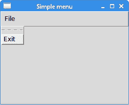
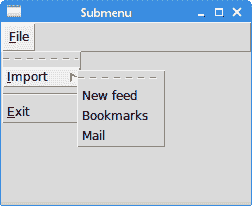
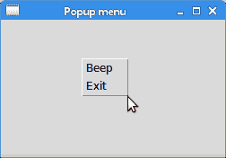
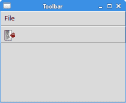

# Tkinter 中的菜单和工具栏

> 原文： [http://zetcode.com/tkinter/menustoolbars/](http://zetcode.com/tkinter/menustoolbars/)

在 Tkinter 教程的这一部分中，我们将使用菜单和工具栏。

菜单栏是 GUI 应用程序中最可见的部分之一。 它是位于各个菜单中的一组命令。 在控制台应用程序中，我们必须记住许多奥术命令，在这里，我们将大多数命令分组为逻辑部分。 有公认的标准可以进一步减少学习新应用程序的时间。 菜单将我们可以在应用程序中使用的命令分组。 使用工具栏可以快速访问最常用的命令。

## Tkinter 简单菜单

第一个示例显示了一个简单的菜单。

`simple_menu.py`

```
#!/usr/bin/env python3

"""
ZetCode Tkinter tutorial

This program shows a simple
menu. It has one action, which
will terminate the program, when
selected.

Author: Jan Bodnar
Last modified: April 2019
Website: www.zetcode.com
"""

from tkinter import Tk, Frame, Menu

class Example(Frame):

    def __init__(self):
        super().__init__()

        self.initUI()

    def initUI(self):

        self.master.title("Simple menu")

        menubar = Menu(self.master)
        self.master.config(menu=menubar)

        fileMenu = Menu(menubar)
        fileMenu.add_command(label="Exit", command=self.onExit)
        menubar.add_cascade(label="File", menu=fileMenu)

    def onExit(self):

        self.quit()

def main():

    root = Tk()
    root.geometry("250x150+300+300")
    app = Example()
    root.mainloop()

if __name__ == '__main__':
    main()

```

我们的示例将显示一个菜单项。 通过选择退出菜单项，我们关闭应用程序。

```
menubar = Menu(self.master)
self.master.config(menu=menubar)

```

在这里，我们创建一个菜单栏。 这是一个常规的`Menu`小部件，配置为根窗口的菜单栏。

```
fileMenu = Menu(menubar)

```

我们创建一个文件菜单对象。 菜单是一个包含命令的下拉窗口。

```
fileMenu.add_command(label="Exit", command=self.onExit)

```

我们向文件菜单添加命令。 该命令将调用`onExit()`方法。

```
menubar.add_cascade(label="File", menu=fileMenu)

```

使用`add_cascade()`方法将文件菜单添加到菜单栏。



Figure: Simple menu

## Tkinter 子菜单

子菜单是插入另一个菜单对象的菜单。 下一个示例对此进行了演示。

`submenu.py`

```
#!/usr/bin/env python3

"""
ZetCode Tkinter tutorial

In this script we create a submenu
a separator and keyboard shortcuts to menus.

Author: Jan Bodnar
Last modified: April 2019
Website: www.zetcode.com
"""

from tkinter import Tk, Frame, Menu

class Example(Frame):

    def __init__(self):
        super().__init__()

        self.initUI()

    def initUI(self):

        self.master.title("Submenu")

        menubar = Menu(self.master)
        self.master.config(menu=menubar)

        fileMenu = Menu(menubar)

        submenu = Menu(fileMenu)
        submenu.add_command(label="New feed")
        submenu.add_command(label="Bookmarks")
        submenu.add_command(label="Mail")
        fileMenu.add_cascade(label='Import', menu=submenu, underline=0)

        fileMenu.add_separator()

        fileMenu.add_command(label="Exit", underline=0, command=self.onExit)
        menubar.add_cascade(label="File", underline=0, menu=fileMenu)

    def onExit(self):

        self.quit()

def main():

    root = Tk()
    root.geometry("250x150+300+300")
    app = Example()
    root.mainloop()

if __name__ == '__main__':
    main()

```

在示例中，文件菜单的子菜单中有三个选项。 我们创建一个分隔符和键盘快捷键。

```
submenu = Menu(fileMenu)
submenu.add_command(label="New feed")
submenu.add_command(label="Bookmarks")
submenu.add_command(label="Mail")

```

我们有一个包含三个命令的子菜单。 子菜单是常规菜单。

```
fileMenu.add_cascade(label='Import', menu=submenu, underline=0)

```

通过将菜单添加到`fileMenu`而不是菜单栏，我们创建一个子菜单。 `underline`参数创建键盘快捷键。 它提供了应加下划线的字符位置。 在我们的情况下，这是第一个。 位置从零开始。 当我们单击“文件”菜单时，将显示一个弹出窗口。 导入菜单下划线一个字符。 我们可以使用鼠标指针或 `Alt` + `I` 快捷方式选择它。

```
fileMenu.add_separator()

```

分隔符是一条水平线，可以在视觉上分隔菜单命令。 这样，我们可以将项目分组到一些合理的位置。



Figure: Submenu

## Tkinter 弹出菜单

在下一个示例中，我们创建一个弹出菜单。 弹出菜单也称为上下文菜单。 它可以显示在窗口客户区的任何位置。

`popup_menu.py`

```
#!/usr/bin/env python3

"""
ZetCode Tkinter tutorial

In this program, we create
a popup menu.

Author: Jan Bodnar
Last modified: April 2019
Website: www.zetcode.com
"""

from tkinter import Tk, Frame, Menu

class Example(Frame):

    def __init__(self):
        super().__init__()

        self.initUI()

    def initUI(self):

        self.master.title("Popup menu")
        self.menu = Menu(self.master, tearoff=0)
        self.menu.add_command(label="Beep", command=self.bell)
        self.menu.add_command(label="Exit", command=self.onExit)

        self.master.bind("<Button-3>", self.showMenu)
        self.pack()

    def showMenu(self, e):

        self.menu.post(e.x_root, e.y_root)

    def onExit(self):

        self.quit()

def main():

    root = Tk()
    root.geometry("250x150+300+300")
    app = Example()
    root.mainloop()

if __name__ == '__main__':
    main()

```

在我们的示例中，我们使用两个命令创建一个弹出菜单。

```
self.menu = Menu(self.master, tearoff=0)

```

上下文菜单是常规的`Menu`小部件。 `tearoff`功能已关闭。 现在无法将菜单分离到新的顶层窗口中。

```
self.master.bind("<Button-3>", self.showMenu)

```

我们将`&lt;Button-3&gt;`事件绑定到`showMenu()`方法。 当我们右键单击窗口的客户区域时，将生成事件。

```
def showMenu(self, e):

    self.menu.post(e.x_root, e.y_root)

```

`showMenu()`方法显示上下文菜单。 弹出菜单显示在鼠标单击的 x 和 y 坐标处。



Figure: Popup menu

## Tkinter 工具栏

菜单将我们可以在应用程序中使用的命令分组。 使用工具栏可以快速访问最常用的命令。 Tkinter 中没有工具栏小部件。

`toolbar.py`

```
#!/usr/bin/env python3

"""
ZetCode Tkinter tutorial

In this program, we create a toolbar.

Author: Jan Bodnar
Last modified: April 2019
Website: www.zetcode.com
"""

from PIL import Image, ImageTk
from tkinter import Tk, Frame, Menu, Button
from tkinter import LEFT, TOP, X, FLAT, RAISED

class Example(Frame):

    def __init__(self):
        super().__init__()

        self.initUI()

    def initUI(self):

        self.master.title("Toolbar")

        menubar = Menu(self.master)
        self.fileMenu = Menu(self.master, tearoff=0)
        self.fileMenu.add_command(label="Exit", command=self.onExit)
        menubar.add_cascade(label="File", menu=self.fileMenu)

        toolbar = Frame(self.master, bd=1, relief=RAISED)

        self.img = Image.open("exit.png")
        eimg = ImageTk.PhotoImage(self.img)

        exitButton = Button(toolbar, image=eimg, relief=FLAT,
            command=self.quit)
        exitButton.image = eimg
        exitButton.pack(side=LEFT, padx=2, pady=2)

        toolbar.pack(side=TOP, fill=X)
        self.master.config(menu=menubar)
        self.pack()

    def onExit(self):
        self.quit()

def main():

    root = Tk()
    root.geometry("250x150+300+300")
    app = Example()
    root.mainloop()

if __name__ == '__main__':
    main()

```

我们的工具栏位于我们放置按钮的框架上。

```
toolbar = Frame(self.master, bd=1, relief=RAISED)

```

工具栏已创建。 它是`Frame`。 我们创建了一个凸起的边框，以便可见工具栏的边界。

```
self.img = Image.open("exit.png")
eimg = ImageTk.PhotoImage(self.img)

```

创建工具栏按钮的图像和照片图像。

```
exitButton = Button(toolbar, image=eimg, relief=FLAT,
    command=self.quit)

```

`Button`小部件已创建。

```
exitButton.pack(side=LEFT, padx=2, pady=2)

```

工具栏是框架，框架是容器小部件。 我们将按钮包装在左侧，并添加一些填充。

```
toolbar.pack(side=TOP, fill=X)

```

工具栏本身包装在顶层窗口的顶部。 它是水平拉伸的。



Figure: Toolbar

在 Tkinter 教程的这一部分中，我们使用了菜单和工具栏。