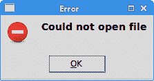
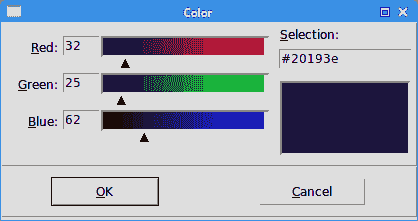
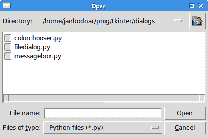

# Tkinter 中的对话框

> 原文： [http://zetcode.com/tkinter/dialogs/](http://zetcode.com/tkinter/dialogs/)

在 Tkinter 教程的这一部分中，我们将使用对话框。

对话框窗口或对话框是大多数现代 GUI 应用必不可少的部分。 对话被定义为两个或更多人之间的对话。 在计算机应用中，对话框是一个窗口，用于与应用“对话”。 对话框用于输入数据，修改数据，更改应用设置等。对话框是用户与计算机程序之间进行通信的重要手段。

## Tkinter 消息框

消息框是方便的对话框，可向应用的用户提供消息。 该消息由文本和图像数据组成。 Tkinter 中的消息框位于`tkMessageBox`模块中。

`messagebox.py`

```py
#!/usr/bin/env python3

"""
ZetCode Tkinter tutorial

In this program, we show various
message boxes.

Author: Jan Bodnar
Last modified: April 2019
Website: www.zetcode.com
"""

from tkinter import Tk, BOTH
from tkinter.ttk import Frame, Button
from tkinter import messagebox as mbox

class Example(Frame):

    def __init__(self):
        super().__init__()

        self.initUI()

    def initUI(self):

        self.master.title("Message boxes")
        self.pack()

        error = Button(self, text="Error", command=self.onError)
        error.grid(padx=5, pady=5)
        warning = Button(self, text="Warning", command=self.onWarn)
        warning.grid(row=1, column=0)
        question = Button(self, text="Question", command=self.onQuest)
        question.grid(row=0, column=1)
        inform = Button(self, text="Information", command=self.onInfo)
        inform.grid(row=1, column=1)

    def onError(self):

        mbox.showerror("Error", "Could not open file")

    def onWarn(self):

        mbox.showwarning("Warning", "Deprecated function call")

    def onQuest(self):

        mbox.askquestion("Question", "Are you sure to quit?")

    def onInfo(self):

        mbox.showinfo("Information", "Download completed")

def main():

    root = Tk()
    ex = Example()
    root.geometry("300x150+300+300")
    root.mainloop()

if __name__ == '__main__':
    main()

```

我们使用网格管理器来设置四个按钮的网格。 每个按钮显示一个不同的消息框。

```py
from tkinter import messagebox as mbox

```

我们导入`messagebox`，它具有显示对话框的功能。

```py
error = Button(self, text="Error", command=self.onError)

```

我们创建一个错误按钮，该按钮调用`onError()`方法。 在方法内部，我们显示错误消息对话框。

```py
def onError(self):

    mbox.showerror("Error", "Could not open file")

```

如果按下错误按钮，则会显示错误对话框。 我们使用`showerror()`功能在屏幕上显示对话框。 此方法的第一个参数是消息框的标题，第二个参数是实际消息。



图：错误消息 dialog

## Tkinter 颜色选择器

颜色选择器是用于选择颜色的对话框。

`color_chooser.py`

```py
#!/usr/bin/env python3

"""
ZetCode Tkinter tutorial

In this script, we use colorchooser
dialog to change the background of a frame.

Author: Jan Bodnar
Last modified: April 2019
Website: www.zetcode.com
"""

from tkinter import Tk, Frame, Button, BOTH, SUNKEN
from tkinter import colorchooser

class Example(Frame):

    def __init__(self):
        super().__init__()

        self.initUI()

    def initUI(self):

        self.master.title("Color chooser")
        self.pack(fill=BOTH, expand=1)

        self.btn = Button(self, text="Choose Color",
            command=self.onChoose)
        self.btn.place(x=30, y=30)

        self.frame = Frame(self, border=1,
            relief=SUNKEN, width=100, height=100)
        self.frame.place(x=160, y=30)

    def onChoose(self):

        (rgb, hx) = colorchooser.askcolor()
        self.frame.config(bg=hx)

def main():

    root = Tk()
    ex = Example()
    root.geometry("300x150+300+300")
    root.mainloop()

if __name__ == '__main__':
    main()

```

我们有一个按钮和一个框架。 单击按钮，我们显示一个颜色选择器对话框。 我们将通过从对话框中选择一种颜色来更改框架的背景颜色。

```py
(rgb, hx) = colorchooser.askcolor()
self.frame.config(bg=hx)

```

`askcolor()`功能显示对话框。 如果单击“确定”，则返回一个元组。 它是 RGB 和十六进制格式的颜色值。 在第二行中，我们使用返回的颜色值更改框架的背景颜色。



图：颜色选择器

## Tkinter 文件对话框

`tkFileDialog`对话框允许用户从文件系统中选择文件。

`file_dialog.py`

```py
#!/usr/bin/env python3

"""
ZetCode Tkinter tutorial

In this program, we use the
tkFileDialog to select a file from
a filesystem.

Author: Jan Bodnar
Last modified: April 2019
Website: www.zetcode.com
"""

from tkinter import Frame, Tk, BOTH, Text, Menu, END
from tkinter import filedialog

class Example(Frame):

    def __init__(self):
        super().__init__()

        self.initUI()

    def initUI(self):

        self.master.title("File dialog")
        self.pack(fill=BOTH, expand=1)

        menubar = Menu(self.master)
        self.master.config(menu=menubar)

        fileMenu = Menu(menubar)
        fileMenu.add_command(label="Open", command=self.onOpen)
        menubar.add_cascade(label="File", menu=fileMenu)

        self.txt = Text(self)
        self.txt.pack(fill=BOTH, expand=1)

    def onOpen(self):

        ftypes = [('Python files', '*.py'), ('All files', '*')]
        dlg = filedialog.Open(self, filetypes = ftypes)
        fl = dlg.show()

        if fl != '':
            text = self.readFile(fl)
            self.txt.insert(END, text)

    def readFile(self, filename):

        with open(filename, "r") as f:
            text = f.read()

        return text

def main():

    root = Tk()
    ex = Example()
    root.geometry("300x250+300+300")
    root.mainloop()

if __name__ == '__main__':
    main()

```

在我们的代码示例中，我们使用`tkFileDialog`对话框选择一个文件，并在`Text`小部件中显示其内容。

```py
self.txt = Text(self)

```

这是`Text`小部件，我们将在其中显示所选文件的内容。

```py
ftypes = [('Python files', '*.py'), ('All files', '*')]

```

这些是文件过滤器。 第一个仅显示 Python 文件，另一个显示所有文件。

```py
dlg = filedialog.Open(self, filetypes = ftypes)
fl = dlg.show()

```

该对话框已创建并显示在屏幕上。 我们得到返回值，它是所选文件的名称。

```py
text = self.readFile(fl)

```

我们读取了文件的内容。

```py
self.txt.insert(END, text)

```

文本被插入到`Text`小部件中。



图：文件对话框

在 Tkinter 教程的这一部分中，我们使用了对话框窗口。