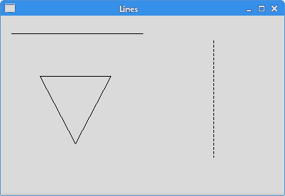
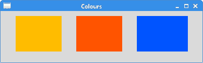
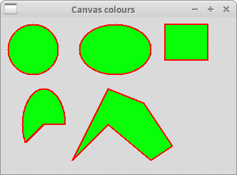
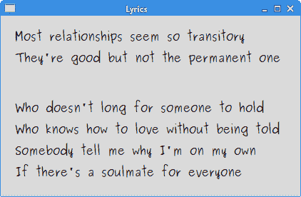

# Tkinter 中的绘图

> 原文： [http://zetcode.com/tkinter/drawing/](http://zetcode.com/tkinter/drawing/)

在 Tkinter 教程的这一部分中，我们将进行一些绘制。 在`Canvas`小部件上完成了 Tkinter 的绘制。 `Canvas`是用于在 Tkinter 中进行图形处理的高级工具。

它可用于创建图表，自定义窗口小部件或创建游戏。

## 直线

线是简单的几何图元。 `create_line()`方法在`Canvas`上创建一个订单项。

`lines.py`

```
#!/usr/bin/env python3

"""
ZetCode Tkinter tutorial

The example draws lines on the Canvas.

Author: Jan Bodnar
Last modified: April 2019
Website: www.zetcode.com
"""

from tkinter import Tk, Canvas, Frame, BOTH

class Example(Frame):

    def __init__(self):
        super().__init__()

        self.initUI()

    def initUI(self):

        self.master.title("Lines")
        self.pack(fill=BOTH, expand=1)

        canvas = Canvas(self)
        canvas.create_line(15, 25, 200, 25)
        canvas.create_line(300, 35, 300, 200, dash=(4, 2))
        canvas.create_line(55, 85, 155, 85, 105, 180, 55, 85)

        canvas.pack(fill=BOTH, expand=1)

def main():

    root = Tk()
    ex = Example()
    root.geometry("400x250+300+300")
    root.mainloop()

if __name__ == '__main__':
    main()

```

在代码示例中，我们绘制了简单的线条。

```
canvas.create_line(15, 25, 200, 25)

```

`create_line()`方法的参数是直线起点和终点的 x 和 y 坐标。

```
canvas.create_line(300, 35, 300, 200, dash=(4, 2))

```

画一条垂直线。 `dash`选项指定线条的虚线图案。 我们有一条线，由 4 px 虚线和 2 px 间隔的交替部分组成。

```
canvas.create_line(55, 85, 155, 85, 105, 180, 55, 85)

```

`create_line()`方法可以取多个点。 这条线画了一个三角形。



Figure: Lines

## 颜色

颜色是代表红色，绿色和蓝色（RGB）强度值的组合的对象。

`colours.py`

```
#!/usr/bin/env python3

"""
ZetCode Tkinter tutorial

This program draws three
rectangles filled with different
colours.

Author: Jan Bodnar
Last modified: April 2019
Website: www.zetcode.com
"""

from tkinter import Tk, Canvas, Frame, BOTH

class Example(Frame):

    def __init__(self):
        super().__init__()

        self.initUI()

    def initUI(self):

        self.master.title("Colours")
        self.pack(fill=BOTH, expand=1)

        canvas = Canvas(self)
        canvas.create_rectangle(30, 10, 120, 80,
            outline="#fb0", fill="#fb0")
        canvas.create_rectangle(150, 10, 240, 80,
            outline="#f50", fill="#f50")
        canvas.create_rectangle(270, 10, 370, 80,
            outline="#05f", fill="#05f")
        canvas.pack(fill=BOTH, expand=1)

def main():

    root = Tk()
    ex = Example()
    root.geometry("400x100+300+300")
    root.mainloop()

if __name__ == '__main__':
    main()

```

在代码示例中，我们绘制了三个矩形，并用不同的颜色值填充了它们。

```
canvas = Canvas(self)

```

我们创建`Canvas`小部件。

```
canvas.create_rectangle(30, 10, 120, 80,
    outline="#fb0", fill="#fb0")

```

`create_rectangle()`在画布上创建一个矩形项目。 前四个参数是两个边界点的 x 和 y 坐标：左上角点和右下角点。 使用`outline`参数，我们可以控制矩形轮廓的颜色。 同样，`fill`参数为矩形的内部提供颜色。



Figure: Colours

## 形状

我们可以在`Canvas`上绘制各种形状。 以下代码示例将显示其中的一些。

`shapes.py`

```
#!/usr/bin/env python3

"""
ZetCode Tkinter tutorial

In this script, we draw basic
shapes on the canvas.

Author: Jan Bodnar
Last modified: April 2019
Website: www.zetcode.com
"""

from tkinter import Tk, Canvas, Frame, BOTH

class Example(Frame):

    def __init__(self):
        super().__init__()

        self.initUI()

    def initUI(self):

        self.master.title("Shapes")
        self.pack(fill=BOTH, expand=1)

        canvas = Canvas(self)
        canvas.create_oval(10, 10, 80, 80, outline="#f11",
            fill="#1f1", width=2)
        canvas.create_oval(110, 10, 210, 80, outline="#f11",
            fill="#1f1", width=2)
        canvas.create_rectangle(230, 10, 290, 60,
            outline="#f11", fill="#1f1", width=2)
        canvas.create_arc(30, 200, 90, 100, start=0,
            extent=210, outline="#f11", fill="#1f1", width=2)

        points = [150, 100, 200, 120, 240, 180, 210,
            200, 150, 150, 100, 200]
        canvas.create_polygon(points, outline='#f11',
            fill='#1f1', width=2)

        canvas.pack(fill=BOTH, expand=1)

def main():

    root = Tk()
    ex = Example()
    root.geometry("330x220+300+300")
    root.mainloop()

if __name__ == '__main__':
    main()

```

我们在窗口上绘制五个不同的形状：一个圆形，一个椭圆形，一个矩形，一个弧形和一个多边形。 轮廓以红色绘制，内部以绿色绘制。 轮廓的宽度为 2 像素。

```
canvas.create_oval(10, 10, 80, 80, outline="#f11",
    fill="#1f1", width=2)

```

此处`create_oval()`方法用于创建圈子项目。 前四个参数是圆的边界框坐标。 换句话说，它们是在其中绘制圆的框的左上和右下点的 x 和 y 坐标。

```
canvas.create_rectangle(230, 10, 290, 60,
    outline="#f11", fill="#1f1", width=2)

```

我们创建一个矩形项目。 坐标还是要绘制的矩形的边界框。

```
canvas.create_arc(30, 200, 90, 100, start=0,
    extent=210, outline="#f11", fill="#1f1", width=2)

```

该代码行创建了一条弧。 圆弧是圆的圆周的一部分。 我们提供边界框。 `start`参数是圆弧的起始角度。 `extent`是角度大小。

```
points = [150, 100, 200, 120, 240, 180, 210,
    200, 150, 150, 100, 200]
canvas.create_polygon(points, outline='#f11',
    fill='#1f1', width=2)

```

创建一个多边形。 它是具有多个角的形状。 要在 Tkinter 中创建多边形，我们向`create_polygon()`方法提供了多边形坐标列表。



Figure: Shapes

## 绘图图像

在下面的示例中，我们在画布上绘制一个图像项。

`draw_image.py`

```
#!/usr/bin/env python3

"""
ZetCode Tkinter tutorial

In this script, we draw an image
on the canvas.

Author: Jan Bodnar
Last modified: April 2019
Website: www.zetcode.com
"""

from tkinter import Tk, Canvas, Frame, BOTH, NW
from PIL import Image, ImageTk

class Example(Frame):

    def __init__(self):
        super().__init__()

        self.initUI()

    def initUI(self):

        self.master.title("High Tatras")
        self.pack(fill=BOTH, expand=1)

        self.img = Image.open("tatras.jpg")
        self.tatras = ImageTk.PhotoImage(self.img)

        canvas = Canvas(self, width=self.img.size[0]+20,
           height=self.img.size[1]+20)
        canvas.create_image(10, 10, anchor=NW, image=self.tatras)
        canvas.pack(fill=BOTH, expand=1)

def main():

    root = Tk()
    ex = Example()
    root.mainloop()

if __name__ == '__main__':
    main()

```

该示例在画布上显示图像。

```
from PIL import Image, ImageTk

```

从 PIL（Python 影像库）模块，导入`Image`和`ImageTk`模块。

```
self.img = Image.open("tatras.jpg")
self.tatras = ImageTk.PhotoImage(self.img)

```

Tkinter 在内部不支持 JPG 图像。 解决方法是，使用`Image`和`ImageTk`模块。

```
canvas = Canvas(self, width=self.img.size[0]+20,
    height=self.img.size[1]+20)

```

我们创建`Canvas`小部件。 它考虑了图像的大小。 它比实际图像尺寸宽 20px，高 20px。

```
canvas.create_image(10, 10, anchor=NW, image=self.tatras)

```

我们使用`create_image()`方法在画布上创建一个图像项。 为了显示整个图像，它固定在北部和西部。 `image`参数提供要显示的照片图像。

## 绘图文字

在最后一个示例中，我们将在窗口上绘制文本。

`draw_text.py`

```
#!/usr/bin/env python3

"""
ZetCode Tkinter tutorial

In this script, we draw text
on the window.

Author: Jan Bodnar
Last modified: April 2019
Website: www.zetcode.com
"""

from tkinter import Tk, Canvas, Frame, BOTH, W

class Example(Frame):

    def __init__(self):
        super().__init__()

        self.initUI()

    def initUI(self):

        self.master.title("Lyrics")
        self.pack(fill=BOTH, expand=1)

        canvas = Canvas(self)
        canvas.create_text(20, 30, anchor=W, font="Purisa",
            text="Most relationships seem so transitory")
        canvas.create_text(20, 60, anchor=W, font="Purisa",
            text="They're good but not the permanent one")
        canvas.create_text(20, 130, anchor=W, font="Purisa",
            text="Who doesn't long for someone to hold")
        canvas.create_text(20, 160, anchor=W, font="Purisa",
            text="Who knows how to love without being told")
        canvas.create_text(20, 190, anchor=W, font="Purisa",
            text="Somebody tell me why I'm on my own")
        canvas.create_text(20, 220, anchor=W, font="Purisa",
            text="If there's a soulmate for everyone")
        canvas.pack(fill=BOTH, expand=1)

def main():

    root = Tk()
    ex = Example()
    root.geometry("420x250+300+300")
    root.mainloop()

if __name__ == '__main__':
    main()

```

我们在窗口上画一首歌的歌词。

```
canvas.create_text(20, 30, anchor=W, font="Purisa",
    text="Most relationships seem so transitory")

```

前两个参数是文本中心点的 x 和 y 坐标。 如果我们将文本项锚定在西方，则文本将从该位置开始。 `font`参数提供文本的字体，`text`参数是要显示的文本。



Figure: Drawing text

在 Tkinter 教程的这一部分中，我们做了一些绘图。