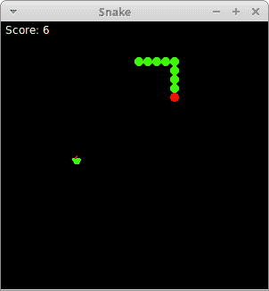

# Tkinter 中的 Snake

> 原文： [http://zetcode.com/tkinter/snake/](http://zetcode.com/tkinter/snake/)

在 Tkinter 教程的这一部分中，我们创建一个 Snake 游戏克隆。

Snake 是较旧的经典视频游戏。 它最初是在 70 年代后期创建的。 后来它被带到 PC 上。 在这个游戏中，玩家控制蛇。 目的是尽可能多地吃苹果。 蛇每次吃一个苹果，它的身体就会长大。 蛇必须避开墙壁和自己的身体。

## 发展历程

蛇的每个关节的大小为 10 像素。 蛇由光标键控制。 最初，蛇具有三个关节。 游戏立即开始。 游戏结束后，我们将在窗口中心显示分数上方的游戏结束消息。

我们使用`Canvas`小部件来创建游戏。 游戏中的对象是图像。 我们使用画布方法创建图像项。 我们使用画布方法使用标签在画布上查找项目并进行碰撞检测。

`snake.py`

```
#!/usr/bin/env python3

"""
ZetCode Tkinter tutorial

This is a simple Snake game
clone.

Author: Jan Bodnar
Website: zetcode.com
Last edited: April 2019
"""

import sys
import random
from PIL import Image, ImageTk
from tkinter import Tk, Frame, Canvas, ALL, NW

class Cons:

    BOARD_WIDTH = 300
    BOARD_HEIGHT = 300
    DELAY = 100
    DOT_SIZE = 10
    MAX_RAND_POS = 27

class Board(Canvas):

    def __init__(self):
        super().__init__(width=Cons.BOARD_WIDTH, height=Cons.BOARD_HEIGHT,
            background="black", highlightthickness=0)

        self.initGame()
        self.pack()

    def initGame(self):
        '''initializes game'''

        self.inGame = True
        self.dots = 3
        self.score = 0

        # variables used to move snake object
        self.moveX = Cons.DOT_SIZE
        self.moveY = 0

        # starting apple coordinates
        self.appleX = 100
        self.appleY = 190

        self.loadImages()

        self.createObjects()
        self.locateApple()
        self.bind_all("<Key>", self.onKeyPressed)
        self.after(Cons.DELAY, self.onTimer)

    def loadImages(self):
        '''loads images from the disk'''

        try:
            self.idot = Image.open("dot.png")
            self.dot = ImageTk.PhotoImage(self.idot)
            self.ihead = Image.open("head.png")
            self.head = ImageTk.PhotoImage(self.ihead)
            self.iapple = Image.open("apple.png")
            self.apple = ImageTk.PhotoImage(self.iapple)

        except IOError as e:

            print(e)
            sys.exit(1)

    def createObjects(self):
        '''creates objects on Canvas'''

        self.create_text(30, 10, text="Score: {0}".format(self.score),
                         tag="score", fill="white")
        self.create_image(self.appleX, self.appleY, image=self.apple,
            anchor=NW, tag="apple")
        self.create_image(50, 50, image=self.head, anchor=NW,  tag="head")
        self.create_image(30, 50, image=self.dot, anchor=NW, tag="dot")
        self.create_image(40, 50, image=self.dot, anchor=NW, tag="dot")

    def checkAppleCollision(self):
        '''checks if the head of snake collides with apple'''

        apple = self.find_withtag("apple")
        head = self.find_withtag("head")

        x1, y1, x2, y2 = self.bbox(head)
        overlap = self.find_overlapping(x1, y1, x2, y2)

        for ovr in overlap:

            if apple[0] == ovr:

                self.score += 1
                x, y = self.coords(apple)
                self.create_image(x, y, image=self.dot, anchor=NW, tag="dot")
                self.locateApple()

    def moveSnake(self):
        '''moves the Snake object'''

        dots = self.find_withtag("dot")
        head = self.find_withtag("head")

        items = dots + head

        z = 0
        while z < len(items)-1:

            c1 = self.coords(items[z])
            c2 = self.coords(items[z+1])
            self.move(items[z], c2[0]-c1[0], c2[1]-c1[1])
            z += 1

        self.move(head, self.moveX, self.moveY)

    def checkCollisions(self):
        '''checks for collisions'''

        dots = self.find_withtag("dot")
        head = self.find_withtag("head")

        x1, y1, x2, y2 = self.bbox(head)
        overlap = self.find_overlapping(x1, y1, x2, y2)

        for dot in dots:
            for over in overlap:
                if over == dot:
                  self.inGame = False

        if x1 < 0:
            self.inGame = False

        if x1 > Cons.BOARD_WIDTH - Cons.DOT_SIZE:
            self.inGame = False

        if y1 < 0:
            self.inGame = False

        if y1 > Cons.BOARD_HEIGHT - Cons.DOT_SIZE:
            self.inGame = False

    def locateApple(self):
        '''places the apple object on Canvas'''

        apple = self.find_withtag("apple")
        self.delete(apple[0])

        r = random.randint(0, Cons.MAX_RAND_POS)
        self.appleX = r * Cons.DOT_SIZE
        r = random.randint(0, Cons.MAX_RAND_POS)
        self.appleY = r * Cons.DOT_SIZE

        self.create_image(self.appleX, self.appleY, anchor=NW,
            image=self.apple, tag="apple")

    def onKeyPressed(self, e):
        '''controls direction variables with cursor keys'''

        key = e.keysym

        LEFT_CURSOR_KEY = "Left"
        if key == LEFT_CURSOR_KEY and self.moveX <= 0:

            self.moveX = -Cons.DOT_SIZE
            self.moveY = 0

        RIGHT_CURSOR_KEY = "Right"
        if key == RIGHT_CURSOR_KEY and self.moveX >= 0:

            self.moveX = Cons.DOT_SIZE
            self.moveY = 0

        RIGHT_CURSOR_KEY = "Up"
        if key == RIGHT_CURSOR_KEY and self.moveY <= 0:

            self.moveX = 0
            self.moveY = -Cons.DOT_SIZE

        DOWN_CURSOR_KEY = "Down"
        if key == DOWN_CURSOR_KEY and self.moveY >= 0:

            self.moveX = 0
            self.moveY = Cons.DOT_SIZE

    def onTimer(self):
        '''creates a game cycle each timer event'''

        self.drawScore()
        self.checkCollisions()

        if self.inGame:
            self.checkAppleCollision()
            self.moveSnake()
            self.after(Cons.DELAY, self.onTimer)
        else:
            self.gameOver()

    def drawScore(self):
        '''draws score'''

        score = self.find_withtag("score")
        self.itemconfigure(score, text="Score: {0}".format(self.score))

    def gameOver(self):
        '''deletes all objects and draws game over message'''

        self.delete(ALL)
        self.create_text(self.winfo_width() /2, self.winfo_height()/2,
            text="Game Over with score {0}".format(self.score), fill="white")

class Snake(Frame):

    def __init__(self):
        super().__init__()

        self.master.title('Snake')
        self.board = Board()
        self.pack()

def main():

    root = Tk()
    nib = Snake()
    root.mainloop()

if __name__ == '__main__':
    main()

```

首先，我们将定义一些在游戏中使用的常量。

```
class Cons:

    BOARD_WIDTH = 300
    BOARD_HEIGHT = 300
    DELAY = 100
    DOT_SIZE = 10
    MAX_RAND_POS = 27

```

`BOARD_WIDTH`和`BOARD_HEIGHT`常数确定电路板的大小。 `DELAY`常数确定游戏的速度。 `DOT_SIZE`是苹果的大小和蛇的点。 `MAX_RAND_POS`常数用于计算苹果的随机位置。

`initGame()`方法初始化变量，加载图像并启动超时功能。

```
self.createObjects()
self.locateApple()

```

`createObjects()`方法在画布上创建项目。 `locateApple()`在画布上随机放置一个苹果。

```
self.bind_all("<Key>", self.onKeyPressed)

```

我们将键盘事件绑定到`onKeyPressed()`方法。 游戏由键盘光标键控制。

```
try:
    self.idot = Image.open("dot.png")
    self.dot = ImageTk.PhotoImage(self.idot)
    self.ihead = Image.open("head.png")
    self.head = ImageTk.PhotoImage(self.ihead)
    self.iapple = Image.open("apple.png")
    self.apple = ImageTk.PhotoImage(self.iapple)

except IOError as e:

    print(e)
    sys.exit(1)

```

在这些行中，我们加载图像。 Snake 游戏中包含三个图像：头部，圆点和苹果。

```
def createObjects(self):
    '''creates objects on Canvas'''

    self.create_text(30, 10, text="Score: {0}".format(self.score),
                        tag="score", fill="white")
    self.create_image(self.appleX, self.appleY, image=self.apple,
        anchor=NW, tag="apple")
    self.create_image(50, 50, image=self.head, anchor=NW,  tag="head")
    self.create_image(30, 50, image=self.dot, anchor=NW, tag="dot")
    self.create_image(40, 50, image=self.dot, anchor=NW, tag="dot")

```

在`createObjects()`方法中，我们在画布上创建游戏对象。 这些是帆布物品。 它们被赋予初始的 x 和 y 坐标。 `image`参数提供要显示的图像。 `anchor`参数设置为`NW`； 这样，画布项目的坐标就是项目的左上角。 如果我们希望能够在根窗口的边框旁边显示图像，这很重要。 尝试删除锚点，看看会发生什么。 `tag`参数用于识别画布上的项目。 一个标签可用于多个画布项目。

`checkAppleCollision()`方法检查蛇是否击中了苹果对象。 如果是这样，我们会增加分数，添加另一个蛇形关节，并称为`locateApple()`。

```
apple = self.find_withtag("apple")
head = self.find_withtag("head")

```

`find_withtag()`方法使用其标签在画布上找到一个项目。 我们需要两个项目：蛇的头和苹果。 请注意，即使只有一个带有给定标签的项目，该方法也会返回一个元组。 苹果产品就是这种情况。 然后，可以通过以下方式访问苹果项目：`apple[0]`。

```
x1, y1, x2, y2 = self.bbox(head)
overlap = self.find_overlapping(x1, y1, x2, y2)

```

`bbox()`方法返回项目的边界框点。 `find_overlapping()`方法查找给定坐标的冲突项。

```
for ovr in overlap:

    if apple[0] == ovr:
        x, y = self.coords(apple)
        self.create_image(x, y, image=self.dot, anchor=NW, tag="dot")
        self.locateApple()

```

如果苹果与头部碰撞，我们将在苹果对象的坐标处创建一个新的点项目。 我们调用`locateApple()`方法，该方法从画布上删除旧的苹果项目，然后创建并随机放置一个新的项目。

在`moveSnake()`方法中，我们有游戏的密钥算法。 要了解它，请看一下蛇是如何运动的。 我们控制蛇的头。 我们可以使用光标键更改其方向。 其余关节在链上向上移动一个位置。 第二关节移动到第一个关节的位置，第三关节移动到第二个关节的位置，依此类推。

```
z = 0
while z < len(items)-1:
    c1 = self.coords(items[z])
    c2 = self.coords(items[z+1])
    self.move(items[z], c2[0]-c1[0], c2[1]-c1[1])
    z += 1

```

该代码将关节向上移动。

```
self.move(head, self.moveX, self.moveY)

```

我们使用`move()`方法移动磁头。 按下光标键时，将设置`self.moveX`和`self.moveY`变量。

在`checkCollisions()`方法中，我们确定蛇是否击中了自己或撞墙之一。

```
x1, y1, x2, y2 = self.bbox(head)
overlap = self.find_overlapping(x1, y1, x2, y2)

for dot in dots:
    for over in overlap:
        if over == dot:
          self.inGame = False

```

如果蛇用头撞到关节之一，我们就结束游戏。

```
if y1 > Cons.BOARD_HEIGHT - Cons.DOT_SIZE:
    self.inGame = False

```

如果蛇击中`Board`的底部，我们就结束游戏。

`locateApple()`方法在板上随机找到一个新苹果，然后删除旧的苹果。

```
apple = self.find_withtag("apple")
self.delete(apple[0])

```

在这里，我们找到并删除了被蛇吃掉的苹果。

```
r = random.randint(0, Cons.MAX_RAND_POS)

```

我们得到一个从 0 到`MAX_RAND_POS`-1 的随机数。

```
self.appleX = r * Cons.DOT_SIZE
...
self.appleY = r * Cons.DOT_SIZE

```

这些行设置了 apple 对象的 x 和 y 坐标。

在`onKeyPressed()`方法中，我们在游戏过程中对按下的键做出反应。

```
LEFT_CURSOR_KEY = "Left"
if key == LEFT_CURSOR_KEY and self.moveX <= 0:

    self.moveX = -Cons.DOT_SIZE
    self.moveY = 0

```

如果我们按左光标键，则相应地设置`self.moveX`和`self.moveY`变量。 在`moveSnake()`方法中使用这些变量来更改蛇对象的坐标。 还要注意，当蛇向右行驶时，我们不能立即向左转。

```
def onTimer(self):
    '''creates a game cycle each timer event '''

    self.drawScore()
    self.checkCollisions()

    if self.inGame:
        self.checkAppleCollision()
        self.moveSnake()
        self.after(Cons.DELAY, self.onTimer)
    else:
        self.gameOver()

```

每`DELAY` ms，就会调用`onTimer()`方法。 如果我们参与了游戏，我们将调用三种构建游戏逻辑的方法。 否则，游戏结束。 计时器基于`after()`方法，该方法仅在`DELAY` ms 之后调用一次方法。 要重复调用计时器，我们递归调用`onTimer()`方法。

```
def drawScore(self):
    '''draws score'''

    score = self.find_withtag("score")
    self.itemconfigure(score, text="Score: {0}".format(self.score))

```

`drawScore()`方法在板上画分数。

```
def gameOver(self):
    '''deletes all objects and draws game over message'''

    self.delete(ALL)
    self.create_text(self.winfo_width() /2, self.winfo_height()/2,
        text="Game Over with score {0}".format(self.score), fill="white")

```

如果游戏结束，我们将删除画布上的所有项目。 然后，我们将游戏的最终比分绘制在屏幕中央。



Figure: Snake

这是用 Tkinter 创建的 Snake 电脑游戏。