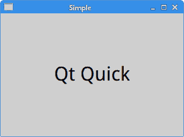
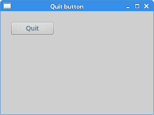
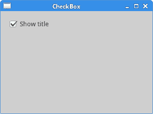
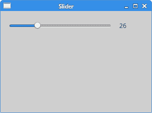
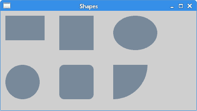

# Qt Quick 教程

> 原文： [http://zetcode.com/gui/qtquick/](http://zetcode.com/gui/qtquick/)

这是 Qt Quick 入门教程。 本教程讲授了 Qt Quick 中编程的基础知识。 本教程使用 Qt 5.5.1 编写。

## Qt Quick

Qt Quick 是一种现代的用户界面技术，将声明性用户界面设计和命令性编程逻辑分开。 它是 Qt 框架内的一个应用框架。 它提供了一种构建自定义的，高度动态的，具有流畅过渡和效果的用户界面的方式，这种方式在移动设备中尤为常见。

Qt Quick 是与 Qt Widgets 分离的模块，该模块针对传统的桌面应用。 Qt Quick 基于 QML 声明性语言。

## QML

QML 是一种用户界面规范和编程语言。 它允许创建流畅的动画和视觉吸引力的应用。 QML 提供了一种高度可读的，声明性的，类似于 JSON 的语法，并支持将命令性 JavaScript 表达式与动态属性绑定结合在一起。

QML 由元素层次构成。

## 简单的例子

我们从一个简单的例子开始。

`simple.qml`

```js
import QtQuick 2.5
import QtQuick.Controls 1.4

ApplicationWindow {

    width: 300
    height: 200
    title: "Simple"

    Text {

        text: "Qt Quick"
        anchors.horizontalCenter: parent.horizontalCenter
        anchors.verticalCenter: parent.verticalCenter
        font.pointSize: 24; font.bold: true
    }
}

```

该代码创建一个带有居中文本的小窗口。

```js
import QtQuick 2.5
import QtQuick.Controls 1.4

```

导入了必要的模块。 Qt Quick 模块的最新版本与 Qt 版本不同。 这些是 Qt 5.5.1 的最新模块。

```js
ApplicationWindow {
...
}

```

`ApplicationWindow`是用于主应用窗口的 Qt Quick 控件。 用户界面元素由其类型名称指定，后跟两个大括号。

```js
width: 300
height: 200
title: "Simple"

```

这是`ApplicationWindow`元素的三个内置属性。 它们指定窗口的宽度，高度和标题。

```js
Text {

    text: "Qt Quick"
    anchors.horizontalCenter: parent.horizontalCenter
    anchors.verticalCenter: parent.verticalCenter
    font.pointSize: 24
}

```

`Text`控件显示文本； 文本是使用`text`属性指定的。 在其父元素`ApplicationWindow`元素中声明它。 我们通过`parent`属性引用父对象。 `anchors`用于在应用窗口中将`Text`控件居中。 最后，`font`属性用于设置文本的大小。 `parent`和`font`是组属性的示例。



Figure: Simple example

用`qmlscene`工具加载`simple.qml`文档后，我们得到了这张图片。

## 退出按钮

在第二个示例中，我们展示`Button`控件。

`quit_button.qml`

```js
import QtQuick 2.5
import QtQuick.Controls 1.4

ApplicationWindow {

    width: 300
    height: 200
    title: "Quit button"

    Button {
        x: 20
        y: 20
        text: "Quit"
        onClicked: Qt.quit()
    }
}

```

窗口上放置了一个按钮。 单击该按钮可终止该应用。

```js
Button {
    x: 20
    y: 20
    text: "Quit"
    onClicked: Qt.quit()
}

```

`Button`控件嵌套在`ApplicationWindow`元素内。 它放置在 x = 20，y = 20 坐标处； 坐标相对于窗口的左上角。 `text`属性指定按钮的标签。 `onClicked()`是按钮单击信号的处理程序。 `Qt.quick()`功能终止应用。



Figure: Quit button

## 复选框

`CheckBox`是 Qt Quick 控件，具有两种状态：开和关。 复选框通常用于表示可以启用或禁用的应用中的功能。

`mycheckbox.qml`

```js
import QtQuick 2.5
import QtQuick.Controls 1.4

ApplicationWindow {

    id: rootwin
    width: 300
    height: 200
    title: "CheckBox"

    function onChecked(checked) {

        if (checked) {
            rootwin.title = "CheckBox"
        } else {
            rootwin.title = " "
        }
    }

    CheckBox {
        x: 15
        y: 15
        text: "Show title"
        checked: true

        onClicked: rootwin.onChecked(checked)
    }
}

```

在我们的示例中，我们在窗口上放置了一个检查按钮。 复选按钮显示或隐藏窗口的标题。

```js
id: rootwin

```

`id`是一个特殊值，用于引用 QML 文档中的元素。 id 在文档中必须唯一，并且不能将其重置为其他值，也无法查询。

```js
function onChecked(checked) {

    if (checked) {
        rootwin.title = "CheckBox"
    } else {
        rootwin.title = " "
    }
}

```

`onChecked`是一个 JavaScript 函数，用于设置或删除窗口的标题。 为此，我们使用先前创建的`rootwin` ID。

```js
CheckBox {
    x: 15
    y: 15
    text: "Show title"
    checked: true

    onClicked: rootwin.onChecked(checked)
}

```

由于标题在应用的开头是可见的，因此我们使用`checked`属性将`CheckBox`设置为选中状态。 `onClicked`处理程序调用`onChecked`函数。 由于它是在根窗口的空间中定义的，因此我们再次使用`rootwin` id 来引用它。



Figure: CheckBox

## 滑杆

`Slider`是具有简单句柄的控件。 可以前后拉动此手柄，从而为特定任务选择一个值。

`slider.qml`

```js
import QtQuick 2.5
import QtQuick.Controls 1.4

ApplicationWindow {

    id: rootwin
    width: 300
    height: 200
    title: "Slider"

    Row {

        Slider {

            id: slider
            minimumValue: 0
            maximumValue: 100
        }

        Label {

            text: Math.floor(slider.value)
        }            
    }
}

```

窗口上放置了`Slider`和`Label`控件。 拉动滑块，我们将更新标签。

```js
Row {
...          
}

```

`Row`是 QML 类型，其子项沿一行放置。

```js
Slider {

    id: slider
    minimumValue: 0
    maximumValue: 100
}

```

创建一个`Slider`控件。 我们指定其最小值和最大值。

```js
Label {

    text: Math.floor(slider.value)
}    

```

标签的`text`属性绑定到滑块的 value 属性。 这称为属性绑定。



Figure: Slider

## `NumberAnimation`

Qt Quick 中提供了几种动画类型。 其中之一是`NumberAnimation`。 `NumberAnimation`是数值变化的特殊属性动画。

`numberanim.qml`

```js
import QtQuick 2.5
import QtQuick.Controls 1.4

ApplicationWindow {

    width: 400
    height: 300
    title: "Number animation"

    Rectangle {
        x: 20
        y: 20
        width: 100; height: 100
        color: "forestgreen"

        NumberAnimation on x { to: 250; duration: 1000 }
    }
}

```

在示例中，我们使用`NumberAnimation`为矩形设置动画； 矩形沿 x 轴移动一秒钟。

```js
NumberAnimation on x { to: 250; duration: 1000 }

```

动画将应用于`Rectangle`的 x 属性。 `to:`属性保存动画的结束值。 `duration:`属性保存动画的持续时间（以毫秒为单位）。

## 自定义绘图

可以在`Canvas`元素上执行自定义绘图。

`shapes.qml`

```js
import QtQuick 2.5
import QtQuick.Controls 1.4

ApplicationWindow {

    width: 400
    height: 200
    title: "Shapes"

    Canvas {

        anchors.fill: parent

        onPaint: {

            var ctx = getContext("2d");
            ctx.fillStyle = "lightslategray"

            ctx.beginPath();
            ctx.fillRect(10, 10, 80, 50);

            ctx.beginPath();
            ctx.fillRect(120, 10, 70, 70);

            ctx.beginPath();
            ctx.ellipse(230, 10, 90, 70);
            ctx.fill();            

            ctx.beginPath();
            ctx.ellipse(10, 110, 70, 70);
            ctx.fill();                                     

            ctx.beginPath();
            ctx.roundedRect(120, 110, 70, 70, 10, 10);
            ctx.fill();      

            ctx.beginPath();
            ctx.moveTo(230, 110);
            ctx.arc(230, 110, 70, 0, Math.PI * 0.5, false);
            ctx.fill();

        }
    }
}

```

在示例中，我们在画布上绘制了六个不同的形状：矩形，正方形，椭圆形，圆形，圆角矩形和弧形。

```js
Canvas {

    anchors.fill: parent
...
}

```

`Canvas`填充整个父级。

```js
var ctx = getContext("2d");

```

我们使用`getContext()`函数获得绘图上下文。

```js
ctx.fillStyle = "lightslategray"

```

形状的内部充满了光亮的色彩。

```js
ctx.beginPath();
ctx.fillRect(10, 10, 80, 50);

```

`beginPath()`功能开始一个新路径。 `fillRect()`使用`fillStyle`绘制指定的矩形区域。



Figure: Shapes

## 在 C++ 中部署 Qt Quick 应用

在本节中，我们显示如何在 C++ 中部署 Qt Quick 应用。

`simple.pro`

```js
QT += qml quick

TARGET = Simple
TEMPLATE = app

SOURCES += main.cpp

```

这是项目文件。 它在应用中包括 qml 和 quick 模块。

`basic.qml`

```js
import QtQuick 2.5
import QtQuick.Controls 1.4

ApplicationWindow {

    width: 300
    height: 200
    title: "Simple"

    Text {

        text: "Qt Quick"
        anchors.horizontalCenter: parent.horizontalCenter
        anchors.verticalCenter: parent.verticalCenter
        font.pointSize: 24
    }
}

```

这是要在 C++ 应用中显示的 QML 文档。 它包含居中文本。

`main.cpp`

```cpp
#include <QGuiApplication>
#include <QQmlApplicationEngine>
#include <QQuickWindow>

int main(int argc, char *argv[]) {

    QGuiApplication app(argc, argv);
    QQmlApplicationEngine engine;
    engine.load(QUrl("simple.qml"));
    QObject *topLevel = engine.rootObjects().value(0);
    QQuickWindow *window = qobject_cast<QQuickWindow *>(topLevel);
    window->show();
    return app.exec();
}

```

`QQmlApplicationEngine`用于加载 QML 文档。

## 在 PyQt5 中部署 Qt Quick 应用

在本节中，我们显示如何在 PyQt5 中部署 Qt Quick 应用。

```py
$ sudo apt-get install python3-pyqt5
$ sudo apt-get install python3-pyqt5.qtquick
$ sudo apt-get install qtdeclarative5-qtquick2-plugin

```

在基于 Debian 的 Linux 上，我们可以安装上述软件包以使事情顺利进行。

`basic.qml`

```js
import QtQuick 2.2

Rectangle {

    x: 20
    y: 20
    width: 100
    height: 100
    color: "lightsteelblue"
}

```

这是要在 PyQt5 应用中显示的 QML 文档； 它包含一个矩形对象。

`launcher.py`

```py
#!/usr/bin/python3
# -*- coding: utf-8 -*-

import sys
from PyQt5.QtWidgets import QApplication, QMainWindow
from PyQt5.QtCore import QUrl
from PyQt5.QtQuick import QQuickView

if __name__ == "__main__":

    app = QApplication(sys.argv)

    view = QQuickView()
    view.setSource(QUrl('basic.qml'))
    view.show()

    sys.exit(app.exec_())

```

`QQuickView`类提供了一个用于显示 Qt Quick 用户界面的窗口。

[Tweet](https://twitter.com/share) 

这是 QtQuick 教程。 您可能也对 [Qt5 教程](/gui/qt5/)或 [PyQt5 教程](/gui/pyqt5/)感兴趣。