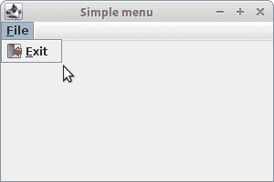
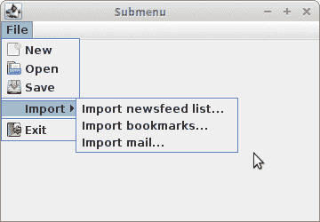
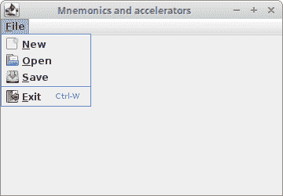
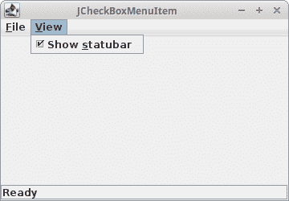
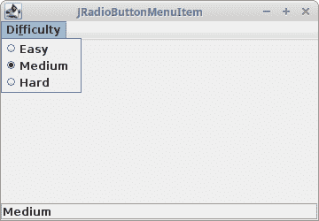
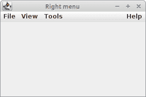
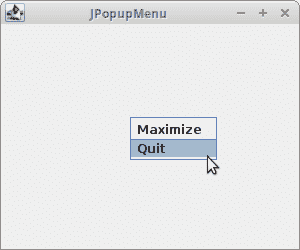
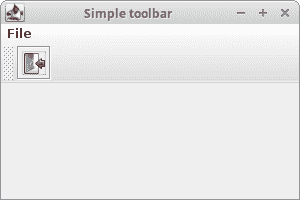
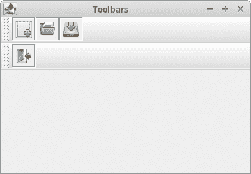

# Java Swing 中的菜单和工具栏

> [http://zetcode.com/tutorials/javaswingtutorial/menusandtoolbars/](http://zetcode.com/tutorials/javaswingtutorial/menusandtoolbars/)

在 Java Swing 教程的这一部分中，我们将使用菜单和工具栏。 在示例中，我们将创建常规菜单，子菜单，复选框菜单项，单选按钮菜单项，弹出菜单和工具栏。

[Tweet](https://twitter.com/share) 

菜单是位于菜单栏中的一组命令。 工具栏上的按钮带有应用中的一些常用命令。

我们将使用以下组件：

*   `JMenuBar`-实现菜单栏。
*   `JMenu` —实现一个菜单，一个包含`JMenuItems`的弹出窗口，当用户在`JMenuBar`上选择一个项目时显示。
*   `JMenuItem`-在菜单中实现一个项目。 用户选择它来执行操作。
*   `JSeparator`-提供用于实现分隔线的通用组件。
*   `JCheckBoxMenuItem` ­-实施可以选择或取消选择的菜单。
*   `JRadioButtonMenuItem` ­-实现单选按钮菜单项，用于相互排斥的选择。
*   `ButtonGroup` ­-为一组按钮创建一个多重排除范围。
*   `JPopupMenu` ­-实现一个弹出菜单，一个弹出的小窗口并显示一系列选项。
*   `JToolBar`-实现工具栏，该工具栏对于显示常用的`Actions`或控件很有用。

## Swing `JMenuBar`

我们从一个简单的菜单栏示例开始。

`com/zetcode/SimpleMenuEx.java`

```java
package com.zetcode;

import java.awt.EventQueue;
import java.awt.event.KeyEvent;
import javax.swing.ImageIcon;
import javax.swing.JFrame;
import javax.swing.JMenu;
import javax.swing.JMenuBar;
import javax.swing.JMenuItem;

public class SimpleMenuEx extends JFrame {

    public SimpleMenuEx() {

        initUI();
    }

    private void initUI() {

        createMenuBar();

        setTitle("Simple menu");
        setSize(350, 250);
        setLocationRelativeTo(null);
        setDefaultCloseOperation(EXIT_ON_CLOSE);
    }

    private void createMenuBar() {

        var menuBar = new JMenuBar();
        var exitIcon = new ImageIcon("src/resources/exit.png");

        var fileMenu = new JMenu("File");
        fileMenu.setMnemonic(KeyEvent.VK_F);

        var eMenuItem = new JMenuItem("Exit", exitIcon);
        eMenuItem.setMnemonic(KeyEvent.VK_E);
        eMenuItem.setToolTipText("Exit application");
        eMenuItem.addActionListener((event) -> System.exit(0));

        fileMenu.add(eMenuItem);
        menuBar.add(fileMenu);

        setJMenuBar(menuBar);
    }

    public static void main(String[] args) {

        EventQueue.invokeLater(() -> {

            var ex = new SimpleMenuEx();
            ex.setVisible(true);
        });
    }
}

```

我们的示例将显示一个菜单项。 选择退出菜单项，我们关闭应用。

```java
var menuBar = new JMenuBar();

```

使用`JMenuBar`创建菜单栏。

```java
var exitIcon = new ImageIcon("src/resources/exit.png");

```

菜单中显示退出图标。

```java
var fileMenu = new JMenu("File");
fileMenu.setMnemonic(KeyEvent.VK_F);

```

使用`JMenu`类创建菜单对象。 也可以通过键盘访问菜单。 要将菜单绑定到特定键，我们使用`setMnemonic()`方法。 在我们的情况下，可以使用 `Alt` + `F` 快捷方式打开菜单。

```java
var eMenuItem = new JMenuItem("Exit", exitIcon);
eMenuItem.setMnemonic(KeyEvent.VK_E);

```

菜单对象由菜单项组成。 使用`JMenuItem`类创建一个菜单项。 菜单项具有其自己的助记符。 可以使用 `Alt` + `F` + `E` 组合键激活。

```java
eMenuItem.setToolTipText("Exit application");

```

此代码行为菜单项创建工具提示。

```java
eMenuItem.addActionListener((event) -> System.exit(0));

```

`JMenuItem`是一种特殊的按钮组件。 我们向它添加了一个动作监听器，它终止了应用。

```java
fileMenu.add(eMenuItem);
menuBar.add(fileMenu);

```

菜单项被添加到菜单对象，菜单对象被插入菜单栏。

```java
setJMenuBar(menuBar);

```

`setJMenuBar()`方法设置`JFrame`容器的菜单栏。



Figure: Simple menu

## Swing 子菜单

每个菜单也可以有一个子菜单。 这样，我们可以将类似的命令分组。 例如，我们可以将用于隐藏和显示各种工具栏（例如个人栏，地址栏，状态栏或导航栏）的命令放在称为工具栏的子菜单中。 在菜单中，我们可以使用分隔符来分隔命令。 分隔符是一条简单的线。 通常的做法是使用单个分隔符将“新建”，“打开”，“保存”等命令与“打印”，“打印预览”等命令分开。 除助记符外，还可通过加速器启动菜单命令。

`com/zetcode/SubmenuEx.java`

```java
package com.zetcode;

import javax.swing.ImageIcon;
import javax.swing.JFrame;
import javax.swing.JMenu;
import javax.swing.JMenuBar;
import javax.swing.JMenuItem;
import java.awt.EventQueue;

public class SubmenuEx extends JFrame {

    public SubmenuEx() {

        initUI();
    }

    private void initUI() {

        createMenuBar();

        setTitle("Submenu");
        setSize(360, 250);
        setLocationRelativeTo(null);
        setDefaultCloseOperation(EXIT_ON_CLOSE);
    }

    private void createMenuBar() {

        var menuBar = new JMenuBar();

        var iconNew = new ImageIcon("src/resources/new.png");
        var iconOpen = new ImageIcon("src/resources/open.png");
        var iconSave = new ImageIcon("src/resources/save.png");
        var iconExit = new ImageIcon("src/resources/exit.png");

        var fileMenu = new JMenu("File");
        var impMenu = new JMenu("Import");

        var newsMenuItem = new JMenuItem("Import newsfeed list...");
        var bookmarksMenuItem = new JMenuItem("Import bookmarks...");
        var importMailMenuItem = new JMenuItem("Import mail...");

        impMenu.add(newsMenuItem);
        impMenu.add(bookmarksMenuItem);
        impMenu.add(importMailMenuItem);

        var newMenuItem = new JMenuItem("New", iconNew);
        var openMenuItem = new JMenuItem("Open", iconOpen);
        var saveMenuItem = new JMenuItem("Save", iconSave);

        var exitMenuItem = new JMenuItem("Exit", iconExit);
        exitMenuItem.setToolTipText("Exit application");

        exitMenuItem.addActionListener((event) -> System.exit(0));

        fileMenu.add(newMenuItem);
        fileMenu.add(openMenuItem);
        fileMenu.add(saveMenuItem);
        fileMenu.addSeparator();
        fileMenu.add(impMenu);
        fileMenu.addSeparator();
        fileMenu.add(exitMenuItem);

        menuBar.add(fileMenu);

        setJMenuBar(menuBar);
    }

    public static void main(String[] args) {

        EventQueue.invokeLater(() -> {

            var ex = new SubmenuEx();
            ex.setVisible(true);
        });
    }
}

```

本示例创建一个子菜单，并使用菜单分隔符分隔菜单项组。

```java
var impMenu = new JMenu("Import");
...
fileMenu.add(impMenu);

```

子菜单与其他任何普通菜单一样。 它是用相同的方式创建的。 我们只需将菜单添加到现有菜单即可。

```java
exitMenuItem.setToolTipText("Exit application");

```

使用`setToolTipText()`方法将工具提示设置为“退出”菜单项。

```java
var newMenuItem = new JMenuItem("New", iconNew);

```

此`JMenuItem`构造函数创建带有标签和图标的菜单项。

```java
fileMenu.addSeparator();

```

分隔符是一条水平线，可以在视觉上分隔菜单项。 这样，我们可以将项目分组到一些合理的位置。 使用`addSeparator()`方法创建分隔符。



Figure: Submenu

## Swing 助记符和加速器

助记符和加速键是使您能够通过键盘执行命令的快捷键。 助记符导航菜单层次结构以选择特定的菜单项，而加速器则跳过菜单层次结构并直接激活菜单项。

下面的示例利用操作，这些操作是可以由需要相同功能的不同组件共享的对象。

`com/zetcode/ShortcutsEx.java`

```java
package com.zetcode;

import javax.swing.AbstractAction;
import javax.swing.ImageIcon;
import javax.swing.JFrame;
import javax.swing.JMenu;
import javax.swing.JMenuBar;
import javax.swing.JMenuItem;
import javax.swing.KeyStroke;
import java.awt.EventQueue;
import java.awt.event.ActionEvent;
import java.awt.event.InputEvent;
import java.awt.event.KeyEvent;

public class ShortcutsEx extends JFrame {

    public ShortcutsEx() {

        initUI();
    }

    private void initUI() {

        createMenuBar();

        setTitle("Mnemonics and accelerators");
        setSize(360, 250);
        setLocationRelativeTo(null);
        setDefaultCloseOperation(EXIT_ON_CLOSE);
    }

    private void createMenuBar() {

        var menuBar = new JMenuBar();

        var iconNew = new ImageIcon("src/resources/new.png");
        var iconOpen = new ImageIcon("src/resources/open.png");
        var iconSave = new ImageIcon("src/resources/save.png");
        var iconExit = new ImageIcon("src/resources/exit.png");

        var fileMenu = new JMenu("File");
        fileMenu.setMnemonic(KeyEvent.VK_F);

        var newMenuItem = new JMenuItem(new MenuItemAction("New", iconNew,
                KeyEvent.VK_N));

        var openMenuItem = new JMenuItem(new MenuItemAction("Open", iconOpen,
                KeyEvent.VK_O));

        var saveMenuItem = new JMenuItem(new MenuItemAction("Save", iconSave,
                KeyEvent.VK_S));

        var exitMenuItem = new JMenuItem("Exit", iconExit);
        exitMenuItem.setMnemonic(KeyEvent.VK_E);
        exitMenuItem.setToolTipText("Exit application");
        exitMenuItem.setAccelerator(KeyStroke.getKeyStroke(KeyEvent.VK_W,
                InputEvent.CTRL_DOWN_MASK));

        exitMenuItem.addActionListener((event) -> System.exit(0));

        fileMenu.add(newMenuItem);
        fileMenu.add(openMenuItem);
        fileMenu.add(saveMenuItem);
        fileMenu.addSeparator();
        fileMenu.add(exitMenuItem);

        menuBar.add(fileMenu);

        setJMenuBar(menuBar);
    }

    private class MenuItemAction extends AbstractAction {

        public MenuItemAction(String text, ImageIcon icon,
                              Integer mnemonic) {
            super(text);

            putValue(SMALL_ICON, icon);
            putValue(MNEMONIC_KEY, mnemonic);
        }

        @Override
        public void actionPerformed(ActionEvent e) {

            System.out.println(e.getActionCommand());
        }
    }

    public static void main(String[] args) {

        EventQueue.invokeLater(() -> {

            var ex = new ShortcutsEx();
            ex.setVisible(true);
        });
    }
}

```

该示例包含多个助记符和一个加速器。 三个菜单项共享一个动作对象。 选择这三个菜单项会使它们的操作命令打印到控制台。

```java
var fileMenu = new JMenu("File");
fileMenu.setMnemonic(KeyEvent.VK_F);

```

助记符设置为“文件”菜单。 现在可以使用 `Alt` + `F` 快捷键激活菜单。

```java
var newMenuItem = new JMenuItem(new MenuItemAction("New", iconNew,
        KeyEvent.VK_N));

```

“新建”菜单项将操作对象作为参数。 其构造函数将文本标签，图标和助记键作为参数。

```java
exitMenuItem.setMnemonic(KeyEvent.VK_E);

```

“退出”菜单项不使用操作对象。 其功能是单独构建的。 我们调用`setMnemonic()`方法来设置助记键。 要使用助记符，该组件必须在屏幕上可见。 因此，我们必须首先激活菜单对象，使“退出”菜单项可见，然后才能激活此菜单项。 这意味着此菜单项通过 `Alt` + `F` + `E` 组合键激活。

```java
exitMenuItem.setAccelerator(KeyStroke.getKeyStroke(KeyEvent.VK_W,
        ActionEvent.CTRL_MASK));

```

加速器是直接启动菜单项的快捷键。 在我们的情况下，通过按 `Ctrl` + `W` 关闭我们的应用。 通过`setAccelerator()`方法设置加速器。

```java
private class MenuItemAction extends AbstractAction {

    public MenuItemAction(String text, ImageIcon icon, 
            Integer mnemonic) {
        super(text);

        putValue(SMALL_ICON, icon);
        putValue(MNEMONIC_KEY, mnemonic);
    }

    @Override
    public void actionPerformed(ActionEvent e) {

        System.out.println(e.getActionCommand());
    }
}

```

此动作类的一个实例由三个菜单项共享。 动作使用各种键来定义其功能。 `putValue()`方法将字符串值与指定的键关联。



Figure: Mnemonics and accelerators

带下划线的字符在视觉上提示助记符，加速器的快捷键显示在菜单项标签的旁边。

## `JCheckBoxMenuItem`

`JCheckBoxMenuItem`是可以选择或取消选择的菜单项。 如果选中该菜单项，通常会在其旁边带有对勾标记。 如果未选择或取消选择，菜单项将显示而没有选中标记。 与常规菜单项一样，复选框菜单项可以具有与之关联的文本或图形图标，或两者都有。

`com/zetcode/CheckBoxMenuItemEx.java`

```java
package com.zetcode;

import java.awt.BorderLayout;
import java.awt.EventQueue;
import java.awt.event.ItemEvent;
import java.awt.event.KeyEvent;
import javax.swing.BorderFactory;
import javax.swing.JCheckBoxMenuItem;
import javax.swing.JFrame;
import javax.swing.JLabel;
import javax.swing.JMenu;
import javax.swing.JMenuBar;

public class CheckBoxMenuItemEx extends JFrame {

    private JLabel statusBar;

    public CheckBoxMenuItemEx() {

        initUI();
    }

    private void initUI() {

        createMenuBar();

        statusBar = new JLabel("Ready");
        statusBar.setBorder(BorderFactory.createEtchedBorder());
        add(statusBar, BorderLayout.SOUTH);

        setTitle("JCheckBoxMenuItem");
        setSize(360, 250);
        setLocationRelativeTo(null);
        setDefaultCloseOperation(EXIT_ON_CLOSE);
    }

    private void createMenuBar() {

        var menuBar = new JMenuBar();
        var fileMenu = new JMenu("File");
        fileMenu.setMnemonic(KeyEvent.VK_F);

        var viewMenu = new JMenu("View");
        viewMenu.setMnemonic(KeyEvent.VK_V);

        var showStatusBarMenuItem = new JCheckBoxMenuItem("Show statubar");
        showStatusBarMenuItem.setMnemonic(KeyEvent.VK_S);
        showStatusBarMenuItem.setDisplayedMnemonicIndex(5);
        showStatusBarMenuItem.setSelected(true);

        showStatusBarMenuItem.addItemListener((e) -> {
            if (e.getStateChange() == ItemEvent.SELECTED) {
                statusBar.setVisible(true);
            } else {
                statusBar.setVisible(false);
            }
        });

        viewMenu.add(showStatusBarMenuItem);

        menuBar.add(fileMenu);
        menuBar.add(viewMenu);

        setJMenuBar(menuBar);
    }

    public static void main(String[] args) {

        EventQueue.invokeLater(() -> {

            var ex = new CheckBoxMenuItemEx();
            ex.setVisible(true);
        });
    }
}

```

本示例使用`JCheckBoxMenuItem`来切换状态栏的可见性。

```java
statusBar = new JLabel("Ready");
statusBar.setBorder(BorderFactory.createEtchedBorder());
add(statusBar, BorderLayout.SOUTH);

```

状态栏是一个简单的`JLabel`组件。 我们在标签周围放置了凸起的`EtchedBorder`，以使其可见。

```java
var showStatusBarMenuItem = new JCheckBoxMenuItem("Show statubar");
showStatusBarMenuItem.setMnemonic(KeyEvent.VK_S);
showStatusBarMenuItem.setDisplayedMnemonicIndex(5);

```

`JCheckBoxMenuItem`创建一个复选框菜单项。 标签上有两个字母； 因此，我们使用`setDisplayedMnemonicIndex()`方法来选择要强调的内容。 我们选择了第二个。

```java
showStatusBarMenuItem.setSelected(true);

```

因为状态栏最初是可见的，所以我们调用`JCheckBoxMenuItem's` `setSelected()`方法来选择它。

```java
showStatusBarMenuItem.addItemListener((e) -> {
    if (e.getStateChange() == ItemEvent.SELECTED) {
        statusbar.setVisible(true);
    } else {
        statusbar.setVisible(false);
    }
});

```

`JCheckBoxMenuItem`是一种特殊的按钮组件。 它实现了`ItemSelectable`接口。 `ItemListener`可用于侦听其状态变化。 根据其状态，我们显示或隐藏状态栏。



Figure: JCheckBoxMenuItem

## `JRadioButtonMenuItem`

`JRadioButtonMenuItem`使您可以从互斥的选项列表中进行选择。 选择特定的`JRadioButtonMenuItem`会取消选择所有其他项目。 将`JRadioButtonMenuItems`放入`ButtonGroup`。

`com/zetcode/RadioMenuItemEx.java`

```java
package com.zetcode;

import javax.swing.BorderFactory;
import javax.swing.ButtonGroup;
import javax.swing.JFrame;
import javax.swing.JLabel;
import javax.swing.JMenu;
import javax.swing.JMenuBar;
import javax.swing.JRadioButtonMenuItem;
import java.awt.BorderLayout;
import java.awt.EventQueue;
import java.awt.event.ItemEvent;
import java.awt.event.KeyEvent;

public class RadioMenuItemEx extends JFrame {

    private JLabel statusBar;

    public RadioMenuItemEx() {

        initUI();
    }

    private void initUI() {

        createMenuBar();

        statusBar = new JLabel("Easy");
        statusBar.setBorder(BorderFactory.createEtchedBorder());
        add(statusBar, BorderLayout.SOUTH);

        setTitle("JRadioButtonMenuItem");
        setSize(360, 250);
        setLocationRelativeTo(null);
        setDefaultCloseOperation(EXIT_ON_CLOSE);
    }

    private void createMenuBar() {

        var menuBar = new JMenuBar();
        var difMenu = new JMenu("Difficulty");
        difMenu.setMnemonic(KeyEvent.VK_F);

        var difGroup = new ButtonGroup();

        var easyRMenuItem = new JRadioButtonMenuItem("Easy");
        easyRMenuItem.setSelected(true);
        difMenu.add(easyRMenuItem);

        easyRMenuItem.addItemListener((e) -> {
            if (e.getStateChange() == ItemEvent.SELECTED) {
                statusBar.setText("Easy");
            }
        });

        var mediumRMenuItem = new JRadioButtonMenuItem("Medium");
        difMenu.add(mediumRMenuItem);

        mediumRMenuItem.addItemListener((e) -> {
            if (e.getStateChange() == ItemEvent.SELECTED) {
                statusBar.setText("Medium");
            }
        });

        var hardRMenuItem = new JRadioButtonMenuItem("Hard");
        difMenu.add(hardRMenuItem);

        hardRMenuItem.addItemListener((e) -> {
            if (e.getStateChange() == ItemEvent.SELECTED) {
                statusBar.setText("Hard");
            }
        });

        difGroup.add(easyRMenuItem);
        difGroup.add(mediumRMenuItem);
        difGroup.add(hardRMenuItem);

        menuBar.add(difMenu);

        setJMenuBar(menuBar);
    }

    public static void main(String[] args) {

        EventQueue.invokeLater(() -> {

            var ex = new RadioMenuItemEx();
            ex.setVisible(true);
        });
    }
}

```

该示例创建一个包含三个`JRadioButtonMenuItem`组件的菜单。

```java
var difGroup = new ButtonGroup();

```

`ButtonGroup`用于为一组按钮创建一个多重排除范围。

```java
var easyRMenuItem = new JRadioButtonMenuItem("Easy");
easyRMenuItem.setSelected(true);
difMenu.add(easyRMenuItem);

```

创建一个新的`JRadioButtonMenuItem`。 用`setSelected()`方法选择它，并用`add()`方法放置在按钮组中。

```java
easyRMenuItem.addItemListener((e) -> {
    if (e.getStateChange() == ItemEvent.SELECTED) {
        statusbar.setText("Easy");
    }
});

```

`ItemListener`用于监听`JRadioButtonMenuItem`的事件。 `getStateChange()`确定状态更改的类型。 如果更改为`ItemEvent.SELECTED`，我们将在状态栏上更改状态。 （另一个状态更改是`ItemEvent.DESELECTED`。）



Figure: JRadioButtonMenuItem

## 右侧菜单

某些应用在右侧显示菜单。 通常，它是一个“帮助”菜单。

`com/zetcode/RightMenuEx.java`

```java
package com.zetcode;

import java.awt.EventQueue;
import javax.swing.Box;
import javax.swing.JFrame;
import javax.swing.JMenu;
import javax.swing.JMenuBar;

public class RightMenuEx extends JFrame {

    public RightMenuEx() {

        initUI();
    }

    private void initUI() {

        createMenuBar();

        setTitle("Right menu");
        setSize(300, 200);
        setLocationRelativeTo(null);
        setDefaultCloseOperation(EXIT_ON_CLOSE);
    }

    private void createMenuBar() {

        var menuBar = new JMenuBar();

        var fileMenu = new JMenu("File");
        var viewMenu = new JMenu("View");
        var toolsMenu = new JMenu("Tools");
        var helpMenu = new JMenu("Help");

        menuBar.add(fileMenu);
        menuBar.add(viewMenu);
        menuBar.add(toolsMenu);
        menuBar.add(Box.createHorizontalGlue());
        menuBar.add(helpMenu);

        setJMenuBar(menuBar);
    }

    public static void main(String[] args) {

        EventQueue.invokeLater(() -> {

            var ex = new RightMenuEx();
            ex.setVisible(true);
        });
    }
}

```

该示例在左侧显示三个菜单，在右侧显示一个菜单。

```java
var menubar = new JMenuBar();

var fileMenu = new JMenu("File");
var viewMenu = new JMenu("View");
var toolsMenu = new JMenu("Tools");
var helpMenu = new JMenu("Help");

```

将创建一个菜单栏和四个菜单对象。

```java
menuBar.add(fileMenu);
menuBar.add(viewMenu);
menuBar.add(toolsMenu);
menuBar.add(Box.createHorizontalGlue());
menuBar.add(helpMenu);

```

添加三个菜单后，我们使用`Box.createHorizontalGlue()`方法在菜单栏上添加水平胶水。 胶水会吸收所有可用的额外空间。 这会将“帮助”菜单推到菜单栏的右侧。



Figure: Help menu on the right

## 弹出菜单

菜单的另一种类型是弹出菜单。 Java Swing 具有此功能的`JPopupMenu`类。 它也称为上下文菜单，通常在右键单击组件时显示。 想法是仅提供与当前上下文相关的命令。 说我们有一张图片。 通过右键单击图像，我们将弹出一个窗口，其中包含用于保存，缩放或移动图像的命令。

`com/zetcode/PopupMenuEx.java`

```java
package com.zetcode;

import java.awt.EventQueue;
import java.awt.event.MouseAdapter;
import java.awt.event.MouseEvent;
import javax.swing.JFrame;
import javax.swing.JMenuItem;
import javax.swing.JPopupMenu;

public class PopupMenuEx extends JFrame {

    private JPopupMenu popupMenu;

    public PopupMenuEx() {

        initUI();
    }

    private void initUI() {

        createPopupMenu();

        setTitle("JPopupMenu");
        setSize(300, 250);
        setLocationRelativeTo(null);
        setDefaultCloseOperation(JFrame.EXIT_ON_CLOSE);
    }

    private void createPopupMenu() {

        popupMenu = new JPopupMenu();

        var maximizeMenuItem = new JMenuItem("Maximize");
        maximizeMenuItem.addActionListener((e) -> {
            if (getExtendedState() != JFrame.MAXIMIZED_BOTH) {
                setExtendedState(JFrame.MAXIMIZED_BOTH);
                maximizeMenuItem.setEnabled(false);
            }
        });

        popupMenu.add(maximizeMenuItem);

        var quitMenuItem = new JMenuItem("Quit");
        quitMenuItem.addActionListener((e) -> System.exit(0));

        popupMenu.add(quitMenuItem);

        addMouseListener(new MouseAdapter() {

            @Override
            public void mouseReleased(MouseEvent e) {

                if (getExtendedState() != JFrame.MAXIMIZED_BOTH) {
                    maximizeMenuItem.setEnabled(true);
                }

                if (e.getButton() == MouseEvent.BUTTON3) {
                    popupMenu.show(e.getComponent(), e.getX(), e.getY());
                }
            }
        });
    }

    public static void main(String[] args) {

        EventQueue.invokeLater(() -> {

            var ex = new PopupMenuEx();
            ex.setVisible(true);
        });
    }
}

```

该示例显示了带有两个命令的弹出菜单。 第一个命令最大化窗口，第二个命令退出应用。

```java
popupMenu = new JPopupMenu();

```

`JPopupMenu`创建一个弹出菜单。

```java
var maximizeMenuItem = new JMenuItem("Maximize");
maximizeMenuItem.addActionListener((e) -> {
    if (getExtendedState() != JFrame.MAXIMIZED_BOTH) {
        setExtendedState(JFrame.MAXIMIZED_BOTH);
        maximizeMenuItem.setEnabled(false);
    }
});

```

弹出菜单由`JMenuItems`组成。 此项目将最大化框架。 `getExtendedState()`方法确定帧的状态。 可用状态为：`NORMAL`，`ICONIFIED`，`MAXIMIZED_HORIZ`，`MAXIMIZED_VERT`和`MAXIMIZED_BOTH`。 最大化帧后，我们将使用`setEnabled()`方法禁用菜单项。

```java
popupMenu.add(quitMenuItem);

```

菜单项通过`add()`插入到弹出菜单中。

```java
addMouseListener(new MouseAdapter() {

    @Override
    public void mouseReleased(MouseEvent e) {

        if (getExtendedState() != JFrame.MAXIMIZED_BOTH) {
            maximizeMenuItem.setEnabled(true);
        }

        if (e.getButton() == MouseEvent.BUTTON3) {
            popupMenu.show(e.getComponent(), e.getX(), e.getY());
        }
    }
});

```

弹出菜单显示在我们用鼠标按钮单击的位置。 `getButton()`方法返回哪些鼠标按钮已更改状态。 `MouseEvent.BUTTON3`仅在右键单击时启用弹出菜单。 一旦窗口未最大化，我们将启用最大化菜单项。



Figure: JPopupMenu

## 工具栏

菜单将我们可以在应用中使用的命令分组。 使用工具栏可以快速访问最常用的命令。 在 Java Swing 中，`JToolBar`类在应用中创建一个工具栏。

`com/zetcode/ToolbarEx.java`

```java
package com.zetcode;

import javax.swing.ImageIcon;
import javax.swing.JButton;
import javax.swing.JFrame;
import javax.swing.JMenu;
import javax.swing.JMenuBar;
import javax.swing.JToolBar;
import java.awt.BorderLayout;
import java.awt.EventQueue;

public class ToolbarEx extends JFrame {

    public ToolbarEx() {

        initUI();
    }

    private void initUI() {

        createMenuBar();
        createToolBar();

        setTitle("Simple toolbar");
        setSize(300, 200);
        setLocationRelativeTo(null);
        setDefaultCloseOperation(EXIT_ON_CLOSE);
    }

    private void createMenuBar() {

        var menuBar = new JMenuBar();
        var fileMenu = new JMenu("File");

        menuBar.add(fileMenu);
        setJMenuBar(menuBar);
    }

    private void createToolBar() {

        var toolbar = new JToolBar();
        var icon = new ImageIcon("src/resources/exit2.png");

        var exitButton = new JButton(icon);
        toolbar.add(exitButton);

        exitButton.addActionListener((e) -> System.exit(0));

        add(toolbar, BorderLayout.NORTH);
    }

    public static void main(String[] args) {

        EventQueue.invokeLater(() -> {

            var ex = new ToolbarEx();
            ex.setVisible(true);
        });
    }
}

```

该示例创建一个带有一个退出按钮的工具栏。

```java
var toolbar = new JToolBar();

```

使用`JToolBar`创建工具栏。

```java
var exitButton = new JButton(icon);
toolbar.add(exitButton);

```

我们创建一个按钮并将其添加到工具栏。 插入工具栏中的按钮是常规`JButton`。

```java
add(toolbar, BorderLayout.NORTH);

```

工具栏位于`BorderLayout`的北部区域。 （`BorderLayout`是`JFrame`，`JWindow`，`JDialog`，`JInternalFrame`和`JApplet`内容窗格的默认布局管理器。



Figure: JToolBar

## Swing 工具栏

通常需要在窗口上显示多个工具栏。 以下示例显示了如何执行此操作。

`com/zetcode/ToolbarsEx.java`

```java
package com.zetcode;

import javax.swing.GroupLayout;
import javax.swing.ImageIcon;
import javax.swing.JButton;
import javax.swing.JComponent;
import javax.swing.JFrame;
import javax.swing.JToolBar;
import java.awt.EventQueue;

public class ToolbarsEx extends JFrame {

    public ToolbarsEx() {

        initUI();
    }

    private void initUI() {

        createToolBars();

        setTitle("Toolbars");
        setSize(360, 250);
        setLocationRelativeTo(null);
        setDefaultCloseOperation(EXIT_ON_CLOSE);
    }

    private void createToolBars() {

        var toolbar1 = new JToolBar();
        var toolbar2 = new JToolBar();

        var newIcon = new ImageIcon("src/resources/new2.png");
        var openIcon = new ImageIcon("src/resources/open2.png");
        var saveIcon = new ImageIcon("src/resources/save2.png");
        var exitIcon = new ImageIcon("src/resources/exit2.png");

        var newBtn = new JButton(newIcon);
        var openBtn = new JButton(openIcon);
        var saveBtn = new JButton(saveIcon);

        toolbar1.add(newBtn);
        toolbar1.add(openBtn);
        toolbar1.add(saveBtn);

        var exitBtn = new JButton(exitIcon);
        toolbar2.add(exitBtn);

        exitBtn.addActionListener((e) -> System.exit(0));

        createLayout(toolbar1, toolbar2);
    }

    private void createLayout(JComponent... arg) {

        var pane = getContentPane();
        var gl = new GroupLayout(pane);
        pane.setLayout(gl);

        gl.setHorizontalGroup(gl.createParallelGroup()
                .addComponent(arg[0], GroupLayout.DEFAULT_SIZE,
                        GroupLayout.DEFAULT_SIZE, Short.MAX_VALUE)
                .addComponent(arg[1], GroupLayout.DEFAULT_SIZE,
                        GroupLayout.DEFAULT_SIZE, Short.MAX_VALUE)
        );

        gl.setVerticalGroup(gl.createSequentialGroup()
                .addComponent(arg[0])
                .addComponent(arg[1])
        );
    }

    public static void main(String[] args) {

        EventQueue.invokeLater(() -> {

            var ex = new ToolbarsEx();
            ex.setVisible(true);
        });
    }
}

```

窗口顶部显示两个工具栏。

```java
var toolbar1 = new JToolBar();
var toolbar2 = new JToolBar();

```

使用`JToolBar`创建两个工具栏对象。

```java
private void createLayout(JComponent... arg) {

    var pane = getContentPane();
    var gl = new GroupLayout(pane);
    pane.setLayout(gl);

    gl.setHorizontalGroup(gl.createParallelGroup()
            .addComponent(arg[0], GroupLayout.DEFAULT_SIZE,
                    GroupLayout.DEFAULT_SIZE, Short.MAX_VALUE)
            .addComponent(arg[1], GroupLayout.DEFAULT_SIZE,
                    GroupLayout.DEFAULT_SIZE, Short.MAX_VALUE)
    );

    gl.setVerticalGroup(gl.createSequentialGroup()
            .addComponent(arg[0])
            .addComponent(arg[1])
    );
}

```

`GroupLayout`管理器用于将工具栏放置在容器的顶部。



Figure: Toolbars

在 Java Swing 教程的这一部分中，我们提到了菜单和工具栏。 我们使用了以下组件：`JMenuBar`，`JMenu`，`JMenuItem`，`JSeparator`，`JCheckBoxMenuItem`，`JRadioButtonMenuItem`，`ButtonGroup`，`JPopupMenu`和`JToolBar`。