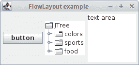
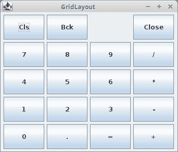
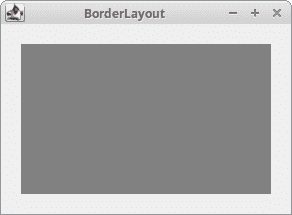
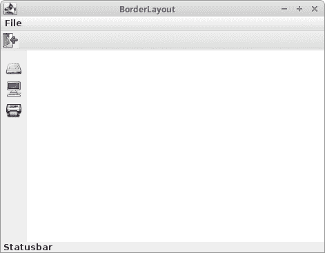
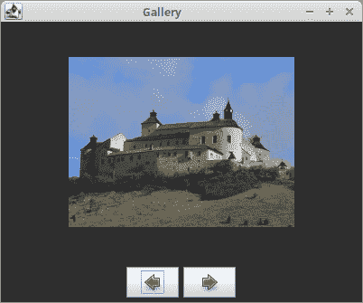
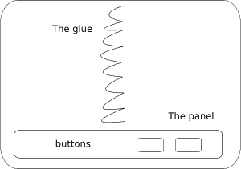
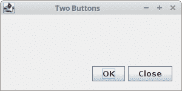
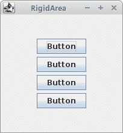
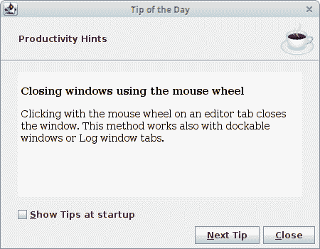
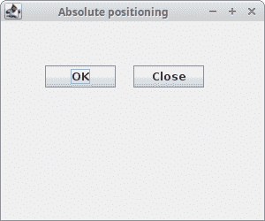

# Swing 布局管理

> 原文： [http://zetcode.com/tutorials/javaswingtutorial/swinglayoutmanagement/](http://zetcode.com/tutorials/javaswingtutorial/swinglayoutmanagement/)

Java Swing 具有两种组件：容器和子组件。 容器将子项分组为合适的布局。 要创建布局，我们使用布局管理器。

[Tweet](https://twitter.com/share) 

ZetCode 为 Swing 布局管理过程提供了 196 页专门的电子书： [Java Swing 布局管理教程](/ebooks/javaswinglayout/)

## Swing 布局管理器

Swing 有大量可用的布局管理器-内置和第三方。 但是，大多数管理器都不适合现代 UI 的创建。

有三种可以正确完成工作的布局管理器：

*   `MigLayout`
*   `GroupLayout`
*   `FormLayout`

`MigLayout`，`GroupLayout`和`FormLayout`是强大，灵活的布局管理器，可以满足大多数布局要求。 在本教程中，我们使用`GroupLayout`管理器来设计用户界面。

以下布局管理器已过时：

*   `FlowLayout`
*   `GridLayout`
*   `CardLayout`
*   `BoxLayout`
*   `GridBagLayout`

这些布局管理器无法满足现代 UI 的要求。

## 过时的管理器遇到的问题

过时的管理器要么太简单（`FlowLayout`，`GridLayout`），要么就是不必要的复杂（`GridBagLayout`）。 所有这些管理器都有一个基本的设计错误：他们使用组件之间的固定间隙。 在组件之间使用刚性空间是不可移植的：一旦在不同的屏幕分辨率下运行程序，用户界面就会损坏。

过时的管理器试图通过一种称为嵌套的技术来修复其弱点。 在嵌套中，开发人员在多个面板中使用几个不同的布局管理器。 尽管可以使用嵌套创建 UI，但它给代码带来了额外的不必要的复杂性。

## 过时的管理器

在本节中，我们将介绍过时的布局管理器。 不建议使用这些管理器。 如果我们需要维护一些遗留代码，只需花一些时间研究它们。 否则，应拒绝使用它们。

### `FlowLayout`管理器

这是 Java Swing 工具箱中最简单的布局管理器。 它是`JPanel`组件的默认布局管理器。

它是如此简单，以至于不能用于任何实际布局。 许多 Java Swing 教程都介绍了该管理器，因此，初学者尝试在其项目中使用它，而没有意识到它不能用于任何严重的事情。

在计算其子大小时，流程布局使每个组件都假定其自然（首选）大小。 管理器将组件排成一排。 按顺序添加了它们。 如果它们不适合一排，则进入下一排。 可以从右向左添加组件，反之亦然。 管理器允许对齐组件。 隐式地，组件居中，并且组件之间以及组件的边缘与容器的边缘之间有 5px 的空间。

```java
FlowLayout()
FlowLayout(int align)
FlowLayout(int align, int hgap, int vgap) 

```

FlowLayout 管理器有三个可用的构造函数。 第一个创建具有隐式值的管理器。 以 5px 水平和垂直空间居中。 其他允许指定这些参数。

`FlowLayoutEx.java`

```java
package com.zetcode;

import javax.swing.JButton;
import javax.swing.JFrame;
import javax.swing.JPanel;
import javax.swing.JTextArea;
import javax.swing.JTree;
import java.awt.Dimension;
import java.awt.EventQueue;

public class FlowLayoutEx extends JFrame {

    public FlowLayoutEx() {

        initUI();
    }

    private void initUI() {

        var panel = new JPanel();

        var button = new JButton("button");
        panel.add(button);

        var tree = new JTree();
        panel.add(tree);

        var area = new JTextArea("text area");
        area.setPreferredSize(new Dimension(100, 100));

        panel.add(area);

        add(panel);

        pack();

        setTitle("FlowLayout example");
        setDefaultCloseOperation(JFrame.EXIT_ON_CLOSE);
        setLocationRelativeTo(null);
    }

    public static void main(String[] args) {

        EventQueue.invokeLater(() -> {
            var ex = new FlowLayoutEx();
            ex.setVisible(true);
        });
    }
}

```

该示例显示了窗口中的按钮，树组件和文本区域组件。 如果我们创建一个空树组件，则组件内部会有一些默认值。

```java
var panel = new JPanel();

```

`JPanel`组件的隐式布局管理器是`FlowLayout`。 我们不必手动设置。

```java
var area = new JTextArea("text area");
area.setPreferredSize(new Dimension(100, 100));

```

流布局管理器为其组件设置首选大小。 因此，在我们的案例中，区域组件将为`100x100px`。 如果我们未设置首选大小，则组件将具有其文本的大小。 没有文本，该组件将根本不可见。 尝试在区域组件中编写或删除一些文本。 组件将相应地增长和收缩。

```java
panel.add(area);

```

该组件放置在带有`add()`的容器内。



图：`FlowLayout`

### `GridLayout`

`GridLayout`布局管理器将组件布置在矩形网格中。 容器分为大小相等的矩形。 每个矩形中放置一个组件。

`GridLayout`非常简单，不能用于任何实际布局。

`GridLayoutEx.java`

```java
package com.zetcode;

import javax.swing.BorderFactory;
import javax.swing.JButton;
import javax.swing.JFrame;
import javax.swing.JLabel;
import javax.swing.JPanel;
import java.awt.EventQueue;
import java.awt.GridLayout;

public class GridLayoutEx extends JFrame {

    public GridLayoutEx() {

        initUI();
    }

    private void initUI() {

        var panel = new JPanel();

        panel.setBorder(BorderFactory.createEmptyBorder(5, 5, 5, 5));
        panel.setLayout(new GridLayout(5, 4, 5, 5));

        String[] buttons = {
                "Cls", "Bck", "", "Close", "7", "8", "9", "/", "4",
                "5", "6", "*", "1", "2", "3", "-", "0", ".", "=", "+"
        };

        for (int i = 0; i < buttons.length; i++) {

            if (i == 2) {
                panel.add(new JLabel(buttons[i]));
            } else {
                panel.add(new JButton(buttons[i]));
            }
        }

        add(panel);

        setTitle("GridLayout");
        setSize(350, 300);
        setDefaultCloseOperation(JFrame.EXIT_ON_CLOSE);
        setLocationRelativeTo(null);
    }

    public static void main(String[] args) {

        EventQueue.invokeLater(() -> {
            var ex = new GridLayoutEx();
            ex.setVisible(true);
        });
    }
}

```

该示例显示了一个简单计算器工具的框架。 我们在管理器中放入了 19 个按钮和一个标签。 请注意，每个按钮的大小均相同。

```java
panel.setLayout(new GridLayout(5, 4, 5, 5));

```

在这里，我们为面板组件设置了网格布局管理器。 布局管理器采用四个参数。 行数，列数以及组件之间的水平和垂直间隙。



图：`GridLayout`

### `BorderLayout`

`BorderLayout`是一个简单的布局管理器，在某些布局中可以派上用场。 它是`JFrame`，`JWindow`，`JDialog`，`JInternalFrame`和`JApplet`的默认布局管理器。 它有一个严重的局限性-它以像素为单位设置子元素之间的间隙，从而创建了刚性的布局。 这导致了不可移植的 UI，因此不建议使用它。

`BorderLayout`将空间分为五个区域：北，西，南，东和中心。 每个区域只能有一个组件。 如果需要在一个区域中放置更多组件，则必须在其中放置一个由我们选择的管理器组成的小组。 N，W，S，E 区域中的组件具有首选大小。 中间的组件占据了剩余的整个空间。

如果子组件彼此之间距离太近，则看起来不太好。 我们必须在它们之间留一些空间。 Swing 工具箱中的每个组件的边缘都可以带有边框。 要创建边框，我们可以创建`EmptyBorder`类的新实例，或者使用`BorderFactory`。

`BorderEx.java`

```java
package com.zetcode;

import javax.swing.JFrame;
import javax.swing.JPanel;
import javax.swing.border.EmptyBorder;
import java.awt.BorderLayout;
import java.awt.Color;
import java.awt.Dimension;
import java.awt.EventQueue;
import java.awt.Insets;

public class BorderLayoutEx extends JFrame {

    public BorderLayoutEx() {

        initUI();
    }

    private void initUI() {

        var bottomPanel = new JPanel(new BorderLayout());
        var topPanel = new JPanel();

        topPanel.setBackground(Color.gray);
        topPanel.setPreferredSize(new Dimension(250, 150));
        bottomPanel.add(topPanel);

        bottomPanel.setBorder(new EmptyBorder(new Insets(20, 20, 20, 20)));

        add(bottomPanel);

        pack();

        setTitle("BorderLayout");
        setDefaultCloseOperation(JFrame.EXIT_ON_CLOSE);
        setLocationRelativeTo(null);
    }

    public static void main(String[] args) {

        EventQueue.invokeLater(() -> {
            var ex = new BorderLayoutEx();
            ex.setVisible(true);
        });
    }
}

```

该示例将显示一个灰色面板及其周围的边框。

```java
var bottomPanel = new JPanel(new BorderLayout());
var topPanel = new JPanel();

```

我们将面板放入面板中。 底部面板具有`BorderLayout`管理器。

```java
bottomPanel.add(topPanel);

```

在这里，我们将顶部面板放入底部面板组件中。 更准确地说，我们将其放置在`BorderLayout`管理器的中心区域。

```java
bottomPanel.setBorder(new EmptyBorder(new Insets(20, 20, 20, 20)));

```

在这里，我们在底部面板周围创建了 20px 的边框。 边框值如下：上，左，下和右。 请注意，创建固定的嵌入（空格）不是可移植的。



图：`BorderLayout`

下一个示例显示`BorderLayout`管理器的典型用法。

`BorderLayoutEx2.java`

```java
package com.zetcode;

import javax.swing.ImageIcon;
import javax.swing.JButton;
import javax.swing.JFrame;
import javax.swing.JLabel;
import javax.swing.JMenu;
import javax.swing.JMenuBar;
import javax.swing.JTextArea;
import javax.swing.JToolBar;
import javax.swing.border.EmptyBorder;
import java.awt.BorderLayout;
import java.awt.EventQueue;
import java.awt.Insets;

public class BorderLayoutEx2 extends JFrame {

    public BorderLayoutEx2() {

        initUI();
    }

    private void initUI() {

        var menubar = new JMenuBar();
        var fileMenu = new JMenu("File");

        menubar.add(fileMenu);
        setJMenuBar(menubar);

        var toolbar = new JToolBar();
        toolbar.setFloatable(false);

        var exitIcon = new ImageIcon("src/resources/exit.png");
        var exitBtn = new JButton(exitIcon);
        exitBtn.setBorder(new EmptyBorder(0, 0, 0, 0));
        toolbar.add(exitBtn);

        add(toolbar, BorderLayout.NORTH);

        var vertical = new JToolBar(JToolBar.VERTICAL);
        vertical.setFloatable(false);
        vertical.setMargin(new Insets(10, 5, 5, 5));

        var driveIcon = new ImageIcon("src/resources/drive.png");
        var compIcon = new ImageIcon("src/resources/computer.png");
        var printIcon = new ImageIcon("src/resources/printer.png");

        var driveBtn = new JButton(driveIcon);
        driveBtn.setBorder(new EmptyBorder(3, 0, 3, 0));

        var compBtn = new JButton(compIcon);
        compBtn.setBorder(new EmptyBorder(3, 0, 3, 0));
        var printBtn = new JButton(printIcon);
        printBtn.setBorder(new EmptyBorder(3, 0, 3, 0));

        vertical.add(driveBtn);
        vertical.add(compBtn);
        vertical.add(printBtn);

        add(vertical, BorderLayout.WEST);

        add(new JTextArea(), BorderLayout.CENTER);

        var statusbar = new JLabel(" Statusbar");
        add(statusbar, BorderLayout.SOUTH);

        setSize(400, 350);
        setTitle("BorderLayout");
        setDefaultCloseOperation(JFrame.EXIT_ON_CLOSE);
        setLocationRelativeTo(null);
    }

    public static void main(String[] args) {

        EventQueue.invokeLater(() -> {
            var ex = new BorderLayoutEx2();
            ex.setVisible(true);
        });
    }
}

```

该示例显示了典型的应用框架。 我们显示了一个垂直和水平工具栏，一个状态栏和一个中央组件（文本区域）。

`BorderLayout`是`JFrame`容器的默认布局管理器。 因此，我们不必显式设置它。

```java
add(toolbar, BorderLayout.NORTH);

```

我们将工具栏放置在布局的北部。

```java
var driveBtn = new JButton(driveIcon);
driveBtn.setBorder(new EmptyBorder(3, 0, 3, 0));

```

为了在按钮周围留一些空白，我们必须使用`EmptyBorder`。 这会在按钮的顶部和底部增加一些固定的空间。 当我们添加固定空间时，UI 不可移植。 3px 的空间在 1280x720 的屏幕上可能看起来不错，但在`1920x1200px`的屏幕上不合适。

```java
add(vertical, BorderLayout.WEST); 

```

我们将垂直太杆放在西边。

```java
add(new JTextArea(), BorderLayout.CENTER);

```

我们将文本区域放置在中间。

```java
add(statusbar, BorderLayout.SOUTH);

```

状态栏转到南部区域。



图：`BorderLayout` 2

### `CardLayout`

`CardLayout`是一个简单的布局管理器，将每个组件都视为卡。 容器是这些卡的堆栈。 一次只能看到一个组件。 其余的隐藏。 最初显示容器时，默认情况下将显示添加到容器的第一个组件。 该管理器的实际用途有限。 它可用于创建向导或选项卡式窗格。

以下示例使用`CardLayout`管理器创建图像库。 我们使用了 Krasna Horka 城堡的四张图片（2012 年大火之前）。

`CardLayoutEx.java`

```java
package com.zetcode;

import java.awt.BorderLayout;
import java.awt.CardLayout;
import java.awt.Color;
import java.awt.EventQueue;
import javax.swing.BorderFactory;
import javax.swing.ImageIcon;
import javax.swing.JButton;
import javax.swing.JFrame;
import javax.swing.JLabel;
import javax.swing.JPanel;

public class CardLayoutEx extends JFrame {

    private ImageIcon horka1;
    private ImageIcon horka2;
    private ImageIcon horka3;
    private ImageIcon horka4;
    private ImageIcon previ;
    private ImageIcon nexti;

    private JPanel mainPanel;
    private CardLayout cardLayout;

    public CardLayoutEx() {

        initUI();
    }

    private void initUI() {

        mainPanel = new JPanel();
        mainPanel.setBackground(new Color(50, 50, 50));

        mainPanel.setBorder(
                BorderFactory.createEmptyBorder(5, 5, 5, 5)
        );

        cardLayout = new CardLayout();
        mainPanel.setLayout(cardLayout);

        horka1 = new ImageIcon("src/resources/horka1.jpg");
        horka2 = new ImageIcon("src/resources/horka2.jpg");
        horka3 = new ImageIcon("src/resources/horka3.jpg");
        horka4 = new ImageIcon("src/resources/horka4.jpg");

        previ = new ImageIcon("src/resources/previous.png");
        nexti = new ImageIcon("src/resources/next.png");

        var label1 = new JLabel(horka1);
        var label2 = new JLabel(horka2);
        var label3 = new JLabel(horka3);
        var label4 = new JLabel(horka4);

        mainPanel.add(label1);
        mainPanel.add(label2);
        mainPanel.add(label3);
        mainPanel.add(label4);

        add(mainPanel);

        var prevButton = new JButton(previ);
        prevButton.addActionListener((e) -> cardLayout.previous(mainPanel));

        var nextButton = new JButton(nexti);
        nextButton.addActionListener((e) -> cardLayout.next(mainPanel));

        var btnPanel = new JPanel();
        btnPanel.setBackground(new Color(50, 50, 50));
        btnPanel.add(prevButton);
        btnPanel.add(nextButton);

        add(btnPanel, BorderLayout.SOUTH);

        pack();

        setTitle("Gallery");
        setDefaultCloseOperation(JFrame.EXIT_ON_CLOSE);
        setLocationRelativeTo(null);
    }

    public static void main(String[] args) {

        EventQueue.invokeLater(() -> {
            var ex = new CardLayoutEx();
            ex.setVisible(true);
        });
    }
}

```

我们创建两个按钮来浏览图像。

```java
mainPanel = new JPanel();
mainPanel.setBackground(new Color(50, 50, 50));

mainPanel.setBorder(
        BorderFactory.createEmptyBorder(5, 5, 5, 5)
);

```

我们创建主面板组件。 我们将其颜色设置为深灰色。 我们将 5px 放置在面板周围，以使它的子级不太靠近窗口的边界。

```java
cardLayout = new CardLayout();
mainPanel.setLayout(cardLayout);

```

`CardLayout`管理器已创建并设置到主面板。

```java
mainPanel.add(label1);
mainPanel.add(label2);
mainPanel.add(label3);
mainPanel.add(label4);

```

显示图像的标签组件将添加到面板中。

```java
var prevButton = new JButton(previ);
prevButton.addActionListener((e) -> cardLayout.previous(mainPanel));

```

单击上一个按钮，将调用管理器的`previous()`方法。 它会翻转到指定容器的上一张卡片。

```java
add(mainPanel);

```

我们将主面板添加到框架组件边框布局的中心区域。 如果未明确指定放置组件的位置，则会将其添加到中心区域。

```java
var btnPanel = new JPanel();
btnPanel.setBackground(new Color(50, 50, 50));
btnPanel.add(prevButton);
btnPanel.add(nextButton);

```

这些按钮将添加到按钮面板。

```java
add(btnPanel, BorderLayout.SOUTH);

```

最后，将带有按钮的面板放入`BorderLayout`管理器的南部区域。



图：`CardLayout`

### `BoxLayout`

`BoxLayout`管理器是一个简单的布局管理器，用于组织列或行中的组件。 它可以使用嵌套创建非常复杂的布局。 但是，这增加了布局创建的复杂性，并使用了额外的资源，尤其是许多其他`JPanel`组件。 `BoxLayout`仅能创建固定空间； 因此，其布局不可移植。

`BoxLayout`具有以下构造函数：

```java
BoxLayout(Container target, int axis)

```

构造函数创建一个布局管理器，该管理器将沿给定轴布置组件。 与其他布局管理器不同，`BoxLayout`将容器实例作为构造函数中的第一个参数。 第二个参数确定管理器的方向。 要创建一个水平框，我们可以使用`LINE_AXIS`常量。 要创建一个垂直框，我们可以使用`PAGE_AXIS`常量。

框布局管理器通常与`Box`类一起使用。 此类创建一些不可见的组件，这些组件会影响最终布局。

*   胶
*   支撑
*   刚性区域

假设我们要在窗口的右下角放置两个按钮。

`BoxLayoutButtonsEx.java`

```java
package com.zetcode;

import javax.swing.Box;
import javax.swing.BoxLayout;
import javax.swing.JButton;
import javax.swing.JFrame;
import javax.swing.JPanel;
import java.awt.Dimension;
import java.awt.EventQueue;

public class BoxLayoutButtonsEx extends JFrame {

    public BoxLayoutButtonsEx() {

        initUI();
    }

    private void initUI() {

        var basePanel = new JPanel();
        basePanel.setLayout(new BoxLayout(basePanel, BoxLayout.Y_AXIS));
        add(basePanel);

        basePanel.add(Box.createVerticalGlue());

        var bottomPanel = new JPanel();
        bottomPanel.setAlignmentX(1f);
        bottomPanel.setLayout(new BoxLayout(bottomPanel, BoxLayout.X_AXIS));

        var okBtn = new JButton("OK");
        var closeBtn = new JButton("Close");

        bottomPanel.add(okBtn);
        bottomPanel.add(Box.createRigidArea(new Dimension(5, 0)));
        bottomPanel.add(closeBtn);
        bottomPanel.add(Box.createRigidArea(new Dimension(15, 0)));

        basePanel.add(bottomPanel);
        basePanel.add(Box.createRigidArea(new Dimension(0, 15)));

        setTitle("Two Buttons");
        setSize(300, 150);
        setDefaultCloseOperation(JFrame.EXIT_ON_CLOSE);
        setLocationRelativeTo(null);
    }

    public static void main(String[] args) {

        EventQueue.invokeLater(() -> {
            var ex = new BoxLayoutButtonsEx();
            ex.setVisible(true);
        });
    }
}

```

下图说明了该示例。



图：两个按钮

我们创建两个面板。 基本面板具有垂直框布局。 底部面板有一个水平面板。 我们将底板插入底板。 底部面板右对齐。 窗口顶部和底部面板之间的空间是可扩展的。 这是通过垂直胶水实现的。

```java
basePanel.setLayout(new BoxLayout(basePanel, BoxLayout.Y_AXIS));

```

在这里，我们使用垂直`BoxLayout`创建一个基础面板。

```java
var bottomPanel = new JPanel();
bottomPanel.setAlignmentX(1f);
bottomPanel.setLayout(new BoxLayout(bottomPanel, BoxLayout.X_AXIS));

```

底部面板右对齐。 这是通过`setAlignmentX()`方法完成的。 面板具有水平布局。

```java
bottomPanel.add(Box.createRigidArea(new Dimension(5, 0)));

```

我们在按钮之间留出一些刚性空间。

```java
basePanel.add(bottomPanel);

```

在这里，我们将具有水平框布局的底部面板放置到垂直基础面板上。

```java
basePanel.add(Box.createRigidArea(new Dimension(0, 15)));

```

我们还在底部面板和窗口边框之间留出一些空间。



图：`BoxLayout`按钮示例

当使用`BoxLayout`管理器时，可以在组件之间设置一个刚性区域。

`BoxLayoutRigidAreaEx.java`

```java
package com.zetcode;

import javax.swing.Box;
import javax.swing.BoxLayout;
import javax.swing.JButton;
import javax.swing.JFrame;
import javax.swing.JPanel;
import javax.swing.border.EmptyBorder;
import java.awt.Dimension;
import java.awt.EventQueue;
import java.awt.Insets;

public class BoxLayoutRigidAreaEx extends JFrame {

    public BoxLayoutRigidAreaEx() {

        initUI();
    }

    private void initUI() {

        var basePanel = new JPanel();
        basePanel.setLayout(new BoxLayout(basePanel, BoxLayout.Y_AXIS));

        basePanel.setBorder(new EmptyBorder(new Insets(40, 60, 40, 60)));

        basePanel.add(new JButton("Button"));
        basePanel.add(Box.createRigidArea(new Dimension(0, 5)));
        basePanel.add(new JButton("Button"));
        basePanel.add(Box.createRigidArea(new Dimension(0, 5)));
        basePanel.add(new JButton("Button"));
        basePanel.add(Box.createRigidArea(new Dimension(0, 5)));
        basePanel.add(new JButton("Button"));

        add(basePanel);

        pack();

        setTitle("RigidArea");
        setDefaultCloseOperation(JFrame.EXIT_ON_CLOSE);
        setLocationRelativeTo(null);
    }

    public static void main(String[] args) {

        EventQueue.invokeLater(() -> {
            var ex = new BoxLayoutRigidAreaEx();
            ex.setVisible(true);
        });
    }
}

```

在此示例中，我们显示四个按钮。 默认情况下，按钮之间没有空格。 为了在其中留出一些空间，我们增加了一些刚性区域。

```java
basePanel.setLayout(new BoxLayout(basePanel, BoxLayout.Y_AXIS));

```

我们为面板使用垂直`BoxLayout`管理器。

```java
basePanel.add(new JButton("Button"));
basePanel.add(Box.createRigidArea(new Dimension(0, 5)));
basePanel.add(new JButton("Button"));

```

我们添加按钮并使用`Box.createRigidArea()`在它们之间创建一个刚性区域。



图：`RigidArea`

### 每日提示

下一个示例创建“每日提示”窗口对话框。 我们结合使用各种布局管理器。

`TipOfDayEx.java`

```java
package com.zetcode;

import javax.swing.BorderFactory;
import javax.swing.BoxLayout;
import javax.swing.ImageIcon;
import javax.swing.JButton;
import javax.swing.JCheckBox;
import javax.swing.JDialog;
import javax.swing.JLabel;
import javax.swing.JPanel;
import javax.swing.JSeparator;
import javax.swing.JTextPane;
import java.awt.BorderLayout;
import java.awt.Color;
import java.awt.Dimension;
import java.awt.EventQueue;
import java.awt.FlowLayout;
import java.awt.event.KeyEvent;

public class TipOfDayEx extends JDialog {

    public TipOfDayEx() {

        initUI();
    }

    private void initUI() {

        var basePanel = new JPanel();
        basePanel.setLayout(new BoxLayout(basePanel, BoxLayout.Y_AXIS));
        add(basePanel);

        var topPanel = new JPanel(new BorderLayout(0, 0));
        topPanel.setMaximumSize(new Dimension(450, 0));

        var hint = new JLabel("Productivity Hints");
        hint.setBorder(BorderFactory.createEmptyBorder(0, 25, 0, 0));
        topPanel.add(hint);

        var icon = new ImageIcon("src/resources/coffee2.png");
        var label = new JLabel(icon);
        label.setBorder(BorderFactory.createEmptyBorder(5, 5, 5, 5));
        topPanel.add(label, BorderLayout.EAST);

        var separator = new JSeparator();
        separator.setForeground(Color.gray);

        topPanel.add(separator, BorderLayout.SOUTH);

        basePanel.add(topPanel);

        var textPanel = new JPanel(new BorderLayout());
        textPanel.setBorder(BorderFactory.createEmptyBorder(15, 25, 15, 25));

        var pane = new JTextPane();
        pane.setContentType("text/html");
        var text = "<p><b>Closing windows using the mouse wheel</b></p>" +
             "<p>Clicking with the mouse wheel on an editor tab closes the window. " +
             "This method works also with dockable windows or Log window tabs.</p>";
        pane.setText(text);
        pane.setEditable(false);
        textPanel.add(pane);

        basePanel.add(textPanel);

        var boxPanel = new JPanel(new FlowLayout(FlowLayout.LEFT, 20, 0));

        var box = new JCheckBox("Show Tips at startup");
        box.setMnemonic(KeyEvent.VK_S);

        boxPanel.add(box);
        basePanel.add(boxPanel);

        var bottomPanel = new JPanel(new FlowLayout(FlowLayout.RIGHT));

        var tipBtn = new JButton("Next Tip");
        tipBtn.setMnemonic(KeyEvent.VK_N);

        var closeBtn = new JButton("Close");
        closeBtn.setMnemonic(KeyEvent.VK_C);

        bottomPanel.add(tipBtn);
        bottomPanel.add(closeBtn);
        basePanel.add(bottomPanel);

        bottomPanel.setMaximumSize(new Dimension(450, 0));

        setTitle("Tip of the Day");
        setSize(new Dimension(450, 350));
        setResizable(false);
        setDefaultCloseOperation(JDialog.DISPOSE_ON_CLOSE);
        setLocationRelativeTo(null);
    }

    public static void main(String[] args) {

        EventQueue.invokeLater(() -> {
            var ex = new TipOfDayEx();
            ex.setVisible(true);
        });
    }
}

```

该示例混合使用了布局管理器。 只需将四个面板放入垂直组织的基本面板中即可。

```java
var basePanel = new JPanel();
basePanel.setLayout(new BoxLayout(basePanel, BoxLayout.Y_AXIS));
add(basePanel);

```

这是最底部的面板。 它具有垂直框布局管理器。 基本面板已添加到默认的`JDialog`组件。 默认情况下，此组件具有边框布局管理器。

```java
var topPanel = new JPanel(new BorderLayout(0, 0));

```

`topPanel`面板具有边框布局管理器。 我们将包含三个组成部分。 两个标签和一个分隔符。

```java
topPanel.setMaximumSize(new Dimension(450, 0));

```

如果我们想要的面板不超过其组件，则必须设置其最大大小。 零值将被忽略。 管理器计算必要的高度。

```java
var textPanel = new JPanel(new BorderLayout());
...
textPanel.add(pane);

```

文本窗格组件将添加到边框布局管理器的中心区域。 它会占用所有剩余空间。 正是我们想要的。

```java
var boxPanel = new JPanel(new FlowLayout(FlowLayout.LEFT, 20, 0));

```

该复选框显示在`boxPanel`面板中。 它保持对齐。 流布局管理器的水平间隙为 20px。 其他组件的像素为 25px。 这是为什么？ 这是因为流布局管理器也在组件和边缘之间放置了一些空间。

```java
var bottomPanel = new JPanel(new FlowLayout(FlowLayout.RIGHT));
...
bottomPanel.setMaximumSize(new Dimension(450, 0));

```

底部面板显示两个按钮。 它具有右对齐的流布局管理器。 为了在对话框的右边缘显示按钮，面板必须从头到尾水平伸展。



图：当天的提示

## 没有管理器

可以不使用布局管理器。 在少数情况下，我们可能不需要布局管理器。 （也许将一些图像放置在一些不规则的位置。）但是在大多数情况下，要创建真正可移植的复杂应用，我们需要布局管理器。

如果没有布局管理器，我们将使用绝对值来定位组件。

`AbsoluteLayoutEx.java`

```java
package com.zetcode;

import javax.swing.JButton;
import javax.swing.JFrame;
import java.awt.EventQueue;

public class AbsoluteLayoutEx extends JFrame {

    public AbsoluteLayoutEx() {

        initUI();
    }

    private void initUI() {

        setLayout(null);

        var okBtn = new JButton("OK");
        okBtn.setBounds(50, 50, 80, 25);

        var closeBtn = new JButton("Close");
        closeBtn.setBounds(150, 50, 80, 25);

        add(okBtn);
        add(closeBtn);

        setTitle("Absolute positioning");
        setSize(300, 250);
        setDefaultCloseOperation(JFrame.EXIT_ON_CLOSE);
        setLocationRelativeTo(null);
    }

    public static void main(String[] args) {

        EventQueue.invokeLater(() -> {
            var ex = new AbsoluteLayoutEx();
            ex.setVisible(true);
        });
    }
}

```

这个简单的示例显示了两个按钮。

```java
setLayout(null);

```

我们通过向`setLayout()`方法提供`null`使用绝对定位。 （`JFrame`组件具有默认的布局管理器`BorderLayout`。）

```java
okBtn.setBounds(50, 50, 80, 25);

```

`setBounds()`方法放置“确定”按钮。 参数是 x 和 y 坐标以及组件的宽度和高度。



图：绝对布局

在本章中，我们提到了 Swing 中的布局管理。