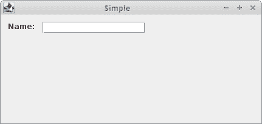
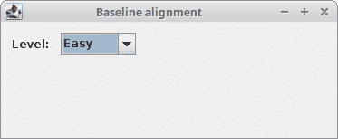
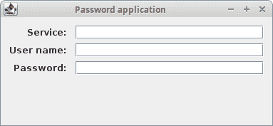

# `GroupLayout`管理器

> 原文： [http://zetcode.com/tutorials/javaswingtutorial/grouplayout/](http://zetcode.com/tutorials/javaswingtutorial/grouplayout/)

`GroupLayout`管理器是内置的 Swing 管理器。 它是唯一可以创建多平台布局的内置管理器。 所有其他管理器要么非常简单，要么使用固定大小的间隙，不适用于不同平台和屏幕分辨率的用户界面。 除了`GroupLayout`之外，我们还可以使用第三方`MigLayout`在 Java 中创建多平台布局。

[Tweet](https://twitter.com/share) 

ZetCode 为 Swing 布局管理过程提供了 196 页专门的电子书： [Java Swing 布局管理教程](/ebooks/javaswinglayout/)

## `GroupLayout`说明

`GroupLayout`将组件与实际布局分开； 所有组件都可以放置在一个地方，布局可以放置在另一个地方。

`GroupLayout`管理器独立定义每个大小的布局。 在一个维度上，我们将组件放置在水平轴的旁边。 在另一个维度中，我们沿垂直轴放置组件。 在两种布局中，我们都可以顺序或并行排列组件。 在水平布局中，一行组件称为顺序组，而一列组件称为并行组。 在垂直布局中，一列组件称为顺序组，一排组件称为并行组。

## `GroupLayout`的差距

`GroupLayout`使用组件之间或组件与边界之间的三种类型的间隙：`RELATED`，`UNRELATED`和`INDENTED`。 `RELATED`用于相关组件，`UNRELATED`用于不相关，`INDENTED`用于组件之间的缩进。 这些差距的主要优势在于它们与分辨率无关； 也就是说，它们在不同分辨率的屏幕上的像素大小不同。 其他内置管理器在所有分辨率上错误地使用了固定大小的间隙。

令人惊讶的是，只有三个预定义的间隙。 在高质量的排版系统 LaTeX 中，只有三个垂直空间可用：`\smallskip`，`\medskip`和`\bigskip`。 在设计 UI 时，少即是多，而仅仅是因为我们可以使用可能不同的间隙大小，字体大小或颜色，但这并不意味着我们应该这样做。

## `GroupLayout`简单示例

使用`addComponent()`方法将组件添加到布局管理器。 参数是最小，首选和最大大小值。 我们可以传递一些特定的绝对值，也可以提供`GroupLayout.DEFAULT_SIZE`或`GroupLayout.PREFERRED_SIZE`。 `GroupLayout.DEFAULT_SIZE`指示应使用组件的相应大小（例如，对于最小参数，该值由`getMinimumSize()`方法确定）。 以类似的方式，通过调用组件的`getPreferredSize()`方法来确定`GroupLayout.PREFERRED_SIZE`

`GroupLayoutSimpleEx.java`

```java
package com.zetcode;

import javax.swing.GroupLayout;
import javax.swing.JFrame;
import javax.swing.JLabel;
import javax.swing.JTextField;
import java.awt.EventQueue;

import static javax.swing.GroupLayout.Alignment.LEADING;
import static javax.swing.LayoutStyle.ComponentPlacement.RELATED;

public class GroupLayoutSimpleEx extends JFrame {

    public GroupLayoutSimpleEx() {

        initUI();
    }

    private void initUI() {

        var pane = getContentPane();
        var gl = new GroupLayout(pane);
        pane.setLayout(gl);

        var lbl = new JLabel("Name:");
        var field = new JTextField(15);

        GroupLayout.SequentialGroup sg = gl.createSequentialGroup();

        sg.addComponent(lbl).addPreferredGap(RELATED).addComponent(field,
                GroupLayout.DEFAULT_SIZE, GroupLayout.DEFAULT_SIZE,
                GroupLayout.PREFERRED_SIZE);

        gl.setHorizontalGroup(sg);

        GroupLayout.ParallelGroup pg = gl.createParallelGroup(
                LEADING, false);

        pg.addComponent(lbl).addComponent(field);
        gl.setVerticalGroup(pg);

        gl.setAutoCreateContainerGaps(true);

        pack();

        setTitle("Simple");
        setLocationRelativeTo(null);
        setDefaultCloseOperation(JFrame.EXIT_ON_CLOSE);
    }

    public static void main(String[] args) {

        EventQueue.invokeLater(() -> {
            var ex = new GroupLayoutSimpleEx();
            ex.setVisible(true);
        });
    }
}

```

在示例中，我们有一个标签和一个文本字段。 文本字段不可扩展。

```java
GroupLayout.SequentialGroup sg = gl.createSequentialGroup();

sg.addComponent(lbl).addPreferredGap(RELATED).addComponent(field,
        GroupLayout.DEFAULT_SIZE, GroupLayout.DEFAULT_SIZE,
        GroupLayout.PREFERRED_SIZE);

```

`addComponent()`和`addPreferredGap()`方法都返回组对象。 因此，可以创建一系列方法调用。 我们将文本字段的最大大小更改为`GroupLayout.PREFERRED_SIZE`，从而使其在水平方向上超出其首选大小不可扩展。 （首选大小和最大大小之间的差异是组件增长的趋势。这适用于遵循这些值的管理器。）将值改回`GroupLayout.DEFAULT_SIZE`将导致文本字段在水平维度上扩展。

```java
GroupLayout.ParallelGroup pg = gl.createParallelGroup(
        LEADING, false);

```

在垂直布局中，`createParallelGroup()`的第二个参数接收为`false`。 这样我们可以防止文本字段沿垂直方向增长。 通过将`addComponent()`的`max`参数设置为`GroupLayout.PREFERRED_SIZE`（在垂直布局中调用），可以实现相同的目的。



Figure: GroupLayout simple example

## `GroupLayout`基线对齐

基线对齐是使组件沿其包含的文本的基线对齐。 以下示例使两个组件沿其基线对齐。

`GroupLayoutBaselineEx.java`

```java
package com.zetcode;

import javax.swing.GroupLayout;
import javax.swing.JComboBox;
import javax.swing.JFrame;
import javax.swing.JLabel;
import java.awt.EventQueue;

import static javax.swing.GroupLayout.Alignment.BASELINE;

public class GroupLayoutBaselineEx extends JFrame {

    private JLabel display;
    private JComboBox box;
    private String[] distros;

    public GroupLayoutBaselineEx() {

        initUI();
    }

    private void initUI() {

        var pane = getContentPane();
        var gl = new GroupLayout(pane);
        pane.setLayout(gl);

        distros = new String[] {"Easy", "Medium", "Hard"};
        box = new JComboBox<>(distros);
        display = new JLabel("Level:");

        gl.setAutoCreateContainerGaps(true);
        gl.setAutoCreateGaps(true);

        gl.setHorizontalGroup(gl.createSequentialGroup()
                .addComponent(display)
                .addComponent(box,
                        GroupLayout.DEFAULT_SIZE,
                        GroupLayout.DEFAULT_SIZE,
                        GroupLayout.PREFERRED_SIZE)
        );

        gl.setVerticalGroup(gl.createParallelGroup(BASELINE)
                .addComponent(box, GroupLayout.DEFAULT_SIZE,
                        GroupLayout.DEFAULT_SIZE,
                        GroupLayout.PREFERRED_SIZE)
                .addComponent(display)
        );

        pack();

        setTitle("Baseline alignment");
        setLocationRelativeTo(null);
        setDefaultCloseOperation(JFrame.EXIT_ON_CLOSE);
    }

    public static void main(String[] args) {

        EventQueue.invokeLater(() -> {

            var ex = new GroupLayoutBaselineEx();
            ex.setVisible(true);
        });
    }
} 
```

我们有一个标签和一个组合框。 两个组件都包含文本。 我们将这两个组件沿其文本的基线对齐。

```java
gl.setHorizontalGroup(gl.createSequentialGroup()
        .addComponent(display)
        .addComponent(box,
                GroupLayout.DEFAULT_SIZE,
                GroupLayout.DEFAULT_SIZE,
                GroupLayout.PREFERRED_SIZE)
);

```

通过将`BASELINE`参数传递到`createParallelGroup()`方法可以实现基线对齐。



Figure: GroupLayout baseline alignment

## `GroupLayout`角按钮示例

下面的示例在窗口的右下角放置两个按钮。 按钮的大小相同。

`GroupLayoutCornerButtonsEx.java`

```java
package com.zetcode;

import javax.swing.GroupLayout;
import javax.swing.JButton;
import javax.swing.JFrame;
import javax.swing.SwingConstants;
import java.awt.Dimension;
import java.awt.EventQueue;

import static javax.swing.LayoutStyle.ComponentPlacement.RELATED;

public class GroupLayoutCornerButtonsEx extends JFrame {

    public GroupLayoutCornerButtonsEx() {

        initUI();
    }

    private void initUI() {

        setPreferredSize(new Dimension(300, 200));

        var cpane = getContentPane();
        var gl = new GroupLayout(cpane);
        cpane.setLayout(gl);

        gl.setAutoCreateGaps(true);
        gl.setAutoCreateContainerGaps(true);

        var okButton = new JButton("OK");
        var closeButton = new JButton("Close");

        gl.setHorizontalGroup(gl.createSequentialGroup()
                .addPreferredGap(RELATED,
                        GroupLayout.DEFAULT_SIZE, Short.MAX_VALUE)
                .addComponent(okButton)
                .addComponent(closeButton)
        );

        gl.setVerticalGroup(gl.createSequentialGroup()
                .addPreferredGap(RELATED,
                        GroupLayout.DEFAULT_SIZE, Short.MAX_VALUE)
                .addGroup(gl.createParallelGroup()
                        .addComponent(okButton)
                        .addComponent(closeButton))
        );

        gl.linkSize(SwingConstants.HORIZONTAL, okButton, closeButton);

        pack();

        setTitle("Buttons");
        setLocationRelativeTo(null);
        setDefaultCloseOperation(JFrame.EXIT_ON_CLOSE);
    }

    public static void main(String[] args) {

        EventQueue.invokeLater(() -> {

            var ex = new GroupLayoutCornerButtonsEx();
            ex.setVisible(true);
        });
    }
}

```

该示例使用`GroupLayout`管理器创建角按钮。

```java
gl.setHorizontalGroup(gl.createSequentialGroup()
        .addPreferredGap(RELATED,
                GroupLayout.DEFAULT_SIZE, Short.MAX_VALUE)
        .addComponent(okButton)
        .addComponent(closeButton)
);

```

在水平布局中，我们添加了一个可拉伸的间隙和两个单个组件。 可伸展的缝隙将两个按钮推向右侧。 间隙是通过`addPreferredGap()`方法调用创建的。 其参数是间隙的类型，间隙的首选大小和最大大小。 最大值和首选值之间的差异是间隙拉伸的能力。 当两个值相同时，间隙具有固定大小。

```java
gl.setVerticalGroup(gl.createSequentialGroup()
        .addPreferredGap(RELATED,
                GroupLayout.DEFAULT_SIZE, Short.MAX_VALUE)
        .addGroup(gl.createParallelGroup()
                .addComponent(okButton)
                .addComponent(closeButton))
);

```

在垂直布局中，我们添加了一个可拉伸的间隙和两个组件的平行组。 同样，该间隙将按钮组推到底部。

```java
gl.linkSize(SwingConstants.HORIZONTAL, okButton, closeButton);

```

`linkSize()`方法使两个按钮的大小相同。 我们只需要设置它们的宽度，因为默认情况下它们的高度已经相同。


Figure: GroupLayout corner buttons

## `GroupLayout` 密码示例

在基于表单的应用中可以找到以下布局，该应用由标签和文本字段组成。

`GroupLayoutPasswordEx.java`

```java
package com.zetcode;

import javax.swing.GroupLayout;
import javax.swing.JFrame;
import javax.swing.JLabel;
import javax.swing.JTextField;
import java.awt.EventQueue;

import static javax.swing.GroupLayout.Alignment.BASELINE;
import static javax.swing.GroupLayout.Alignment.TRAILING;

public class GroupLayoutPasswordEx extends JFrame {

    public GroupLayoutPasswordEx() {

        initUI();
    }

    private void initUI() {

        var pane = getContentPane();
        var gl = new GroupLayout(pane);
        pane.setLayout(gl);

        var serviceLbl = new JLabel("Service:");
        var userNameLbl = new JLabel("User name:");
        var passwordLbl = new JLabel("Password:");

        var field1 = new JTextField(10);
        var field2 = new JTextField(10);
        var field3 = new JTextField(10);

        gl.setAutoCreateGaps(true);
        gl.setAutoCreateContainerGaps(true);

        gl.setHorizontalGroup(gl.createSequentialGroup()
                .addGroup(gl.createParallelGroup(TRAILING)
                        .addComponent(serviceLbl)
                        .addComponent(userNameLbl)
                        .addComponent(passwordLbl))
                .addGroup(gl.createParallelGroup()
                        .addComponent(field1)
                        .addComponent(field2)
                        .addComponent(field3))
        );

        gl.setVerticalGroup(gl.createSequentialGroup()
                .addGroup(gl.createParallelGroup(BASELINE)
                        .addComponent(serviceLbl)
                        .addComponent(field1))
                .addGroup(gl.createParallelGroup(BASELINE)
                        .addComponent(userNameLbl)
                        .addComponent(field2))
                .addGroup(gl.createParallelGroup(BASELINE)
                        .addComponent(passwordLbl)
                        .addComponent(field3))
        );

        pack();

        setTitle("Password application");
        setLocationRelativeTo(null);
        setDefaultCloseOperation(JFrame.EXIT_ON_CLOSE);
    }

    public static void main(String[] args) {

        EventQueue.invokeLater(() -> {

            var ex = new GroupLayoutPasswordEx();
            ex.setVisible(true);
        });
    }
}

```

要求是：标签必须在水平方向上右对齐，并且必须使用相应的文本字段垂直对齐其基线。

```java
gl.setHorizontalGroup(gl.createSequentialGroup()
        .addGroup(gl.createParallelGroup(TRAILING)
                .addComponent(serviceLbl)
                .addComponent(userNameLbl)
                .addComponent(passwordLbl))
        .addGroup(gl.createParallelGroup()
                .addComponent(field1)
                .addComponent(field2)
                .addComponent(field3))
);

```

在水平方向上，布局由包装在顺序组中的两个平行组组成。 标签和字段分别放入其平行的组中。 平行标签组具有`GroupLayout.Alignment.TRAILING`对齐方式，这使标签正确对齐。

```java
gl.setVerticalGroup(gl.createSequentialGroup()
        .addGroup(gl.createParallelGroup(BASELINE)
                .addComponent(serviceLbl)
                .addComponent(field1))
        .addGroup(gl.createParallelGroup(BASELINE)
                .addComponent(userNameLbl)
                .addComponent(field2))
        .addGroup(gl.createParallelGroup(BASELINE)
                .addComponent(passwordLbl)
                .addComponent(field3))
);

```

在垂直布局中，我们确保标签与其文本字段对齐至基线。 为此，我们将标签及其对应的字段分组为具有`GroupLayout.Alignment.BASELINE`对齐方式的平行组。



Figure: GroupLayout password example

在本章中，我们使用内置的`GroupLayout`管理器来创建布局。