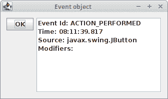
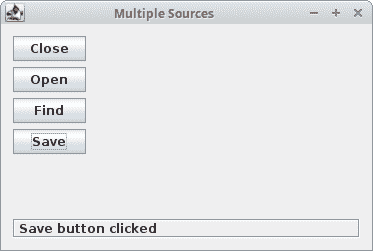
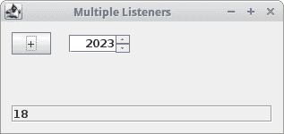
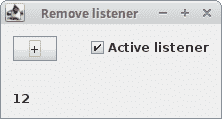
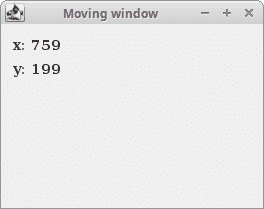

# Java Swing 事件

> 原文： [http://zetcode.com/tutorials/javaswingtutorial/swingevents/](http://zetcode.com/tutorials/javaswingtutorial/swingevents/)

所有 GUI 应用都是事件驱动的。 应用会对在其生命周期内生成的不同事件类型做出反应。 事件主要由应用的用户生成，但也可以通过其他方式生成，例如 Internet 连接，窗口管理器或计时器。

[Tweet](https://twitter.com/share) 

在事件模型中，有三个参与者：

*   事件来源
*   事件对象
*   事件监听器

事件源是状态更改的对象。 它生成事件。事件对象（事件）将状态更改封装在事件源中。事件监听器是要通知的对象。 事件源对象将处理事件的任务委托给事件监听器。

Java Swing 工具箱中的事件处理功能非常强大且灵活。 Java 使用事件委托模型。 我们指定发生特定事件时要通知的对象。

## 事件对象

当应用发生故障时，将创建一个事件对象。 例如，当我们单击按钮或从列表中选择一个项目时。 事件有几种类型，包括`ActionEvent`，`TextEvent`，`FocusEvent`和`ComponentEvent`。 它们每个都是在特定条件下创建的。

事件对象保存有关已发生事件的信息。 在下一个示例中，我们将更详细地分析`ActionEvent`。

`EventObjectEx.java`

```
package com.zetcode;

import javax.swing.AbstractAction;
import javax.swing.BorderFactory;
import javax.swing.DefaultListModel;
import javax.swing.GroupLayout;
import javax.swing.JButton;
import javax.swing.JComponent;
import javax.swing.JFrame;
import javax.swing.JList;
import java.awt.EventQueue;
import java.awt.event.ActionEvent;
import java.time.Instant;
import java.time.ZoneId;
import java.time.format.DateTimeFormatter;

public class EventObjectEx extends JFrame {

    private JList mylist;
    private DefaultListModel model;

    public EventObjectEx() {

        initUI();
    }

    private void initUI() {

        model = new DefaultListModel();
        mylist = new JList(model);
        mylist.setBorder(BorderFactory.createEtchedBorder());

        var okBtn = new JButton("OK");
        okBtn.addActionListener(new ClickAction());

        createLayout(okBtn, mylist);

        setTitle("Event object");
        setLocationRelativeTo(null);
        setDefaultCloseOperation(EXIT_ON_CLOSE);
    }

    private void createLayout(JComponent... arg) {

        var pane = getContentPane();
        var gl = new GroupLayout(pane);
        pane.setLayout(gl);

        gl.setAutoCreateContainerGaps(true);
        gl.setAutoCreateGaps(true);

        gl.setHorizontalGroup(gl.createSequentialGroup()
                .addComponent(arg[0])
                .addComponent(arg[1], 250, GroupLayout.PREFERRED_SIZE,
                        GroupLayout.DEFAULT_SIZE)
        );

        gl.setVerticalGroup(gl.createParallelGroup()
                .addComponent(arg[0])
                .addComponent(arg[1], 150, GroupLayout.PREFERRED_SIZE,
                        GroupLayout.DEFAULT_SIZE)
        );

        pack();
    }

    private class ClickAction extends AbstractAction {

        @Override
        public void actionPerformed(ActionEvent e) {

            var formatter = DateTimeFormatter.ISO_TIME;

            var localTime = Instant.ofEpochMilli(e.getWhen()).atZone(
                    ZoneId.systemDefault()).toLocalTime();

            var text = localTime.format(formatter);

            if (!model.isEmpty()) {
                model.clear();
            }

            if (e.getID() == ActionEvent.ACTION_PERFORMED) {
                model.addElement("Event Id: ACTION_PERFORMED");
            }

            model.addElement("Time: " + text);

            var source = e.getSource().getClass().getName();
            model.addElement("Source: " + source);

            var mod = e.getModifiers();

            var buffer = new StringBuffer("Modifiers: ");

            if ((mod & ActionEvent.ALT_MASK) &lt; 0) {
                buffer.append("Alt ");
            }

            if ((mod & ActionEvent.SHIFT_MASK) &lt; 0) {
                buffer.append("Shift ");
            }

            if ((mod & ActionEvent.META_MASK) &lt; 0) {
                buffer.append("Meta ");
            }

            if ((mod & ActionEvent.CTRL_MASK) &lt; 0) {
                buffer.append("Ctrl ");
            }

            model.addElement(buffer);
        }
    }

    public static void main(String[] args) {

        EventQueue.invokeLater(() -&lt; {
            var ex = new EventObjectEx();
            ex.setVisible(true);
        });
    }
}

```

发生动作时，将调用`actionPerformed()`方法。 它的参数是`ActionEvent`对象。

```
var formatter = DateTimeFormatter.ISO_TIME;

var localTime = Instant.ofEpochMilli(e.getWhen()).atZone(
        ZoneId.systemDefault()).toLocalTime();

var text = localTime.format(formatter);

```

我们获得事件发生的时间。 `getWhen()`方法返回以毫秒为单位的时间值。 我们将值转换为`LocalTime`并使用`DateTimeFormatter`将其格式化为 ISO 时间。

```
var source = e.getSource().getClass().getName();
model.addElement("Source: " + source);

```

在这里，我们将事件源的名称添加到列表中。 在我们的情况下，源是`JButton`。

```
var mod = e.getModifiers();

```

我们得到了修饰键。 它是修饰符常量的按位或。

```
if ((mod & ActionEvent.SHIFT_MASK) > 0)
    buffer.append("Shift ");

```

在这里，我们确定是否按下了 `Shift` 键。



Figure: Event Object

## 事件处理的实现

我们有几种方法可以在 Java Swing 中实现事件处理：

*   匿名内部类
*   内部类
*   派生类

### 匿名内部类

我们从一个匿名内部类开始。

`AnonymousInnerClassEx.java`

```
package com.zetcode;

import javax.swing.GroupLayout;
import javax.swing.JButton;
import javax.swing.JComponent;
import javax.swing.JFrame;
import java.awt.EventQueue;
import java.awt.event.ActionEvent;
import java.awt.event.ActionListener;

public class AnonymousInnerClassEx extends JFrame {

    public AnonymousInnerClassEx() {

        initUI();
    }

    private void initUI() {

        var closeBtn = new JButton("Close");

        closeBtn.addActionListener(new ActionListener() {

            @Override
            public void actionPerformed(ActionEvent event) {
                System.exit(0);
            }
        });

        createLayout(closeBtn);

        setTitle("Anonymous inner class");
        setLocationRelativeTo(null);
        setDefaultCloseOperation(EXIT_ON_CLOSE);
    }

    private void createLayout(JComponent... arg) {

        var pane = getContentPane();
        var gl = new GroupLayout(pane);
        pane.setLayout(gl);

        gl.setAutoCreateContainerGaps(true);
        gl.setAutoCreateGaps(true);

        gl.setHorizontalGroup(gl.createSequentialGroup()
                .addComponent(arg[0])
                .addGap(220)
        );

        gl.setVerticalGroup(gl.createParallelGroup()
                .addComponent(arg[0])
                .addGap(220)
        );

        pack();
    }

    public static void main(String[] args) {

        EventQueue.invokeLater(() -> {

            var ex = new AnonymousInnerClassEx();
            ex.setVisible(true);
        });
    }
}

```

在此示例中，我们有一个按钮，单击后会关闭窗口。

```
var closeBtn = new JButton("Close");

```

“关闭”按钮是事件源。 它将生成事件。

```
closeBtn.addActionListener(new ActionListener() {

    @Override
    public void actionPerformed(ActionEvent event) {
        System.exit(0);
    }
});

```

在这里，我们使用按钮注册一个动作监听器。 事件被发送到事件目标。 在我们的案例中，事件目标是`ActionListener`类； 在此代码中，我们使用匿名内部类。

```
closeBtn.addActionListener((ActionEvent event) -> {
    System.exit(0);
});

```

使用 lambda 表达式重写的代码。

### 内部类

在这里，我们使用内部`ActionListener`类实现示例。

`InnerClassEx.java`

```
package com.zetcode;

import javax.swing.GroupLayout;
import javax.swing.JButton;
import javax.swing.JComponent;
import javax.swing.JFrame;
import java.awt.EventQueue;
import java.awt.event.ActionEvent;
import java.awt.event.ActionListener;

public class InnerClassEx extends JFrame {

    public InnerClassEx() {

        initUI();
    }

    private void initUI() {

        var closeBtn = new JButton("Close");

        var listener = new ButtonCloseListener();
        closeBtn.addActionListener(listener);

        createLayout(closeBtn);

        setTitle("Inner class example");
        setLocationRelativeTo(null);
        setDefaultCloseOperation(EXIT_ON_CLOSE);
    }

    private void createLayout(JComponent... arg) {

        var pane = getContentPane();
        var gl = new GroupLayout(pane);
        pane.setLayout(gl);

        gl.setAutoCreateContainerGaps(true);
        gl.setAutoCreateGaps(true);

        gl.setHorizontalGroup(gl.createSequentialGroup()
                .addComponent(arg[0])
                .addGap(220)
        );

        gl.setVerticalGroup(gl.createParallelGroup()
                .addComponent(arg[0])
                .addGap(220)
        );

        pack();
    }

    private class ButtonCloseListener implements ActionListener {

        @Override
        public void actionPerformed(ActionEvent e) {
            System.exit(0);
        }
    }

    public static void main(String[] args) {

        EventQueue.invokeLater(() -> {

            var ex = new InnerClassEx();
            ex.setVisible(true);
        });
    }
}

```

我们在面板上有一个关闭按钮。 它的监听器在一个命名的内部类中定义。

```
var listener = new ButtonCloseListener();
closeBtn.addActionListener(listener);

```

在这里，我们有一个非匿名内部类。

```
private class ButtonCloseListener implements ActionListener {

    @Override
    public void actionPerformed(ActionEvent e) {
        System.exit(0);
    }
}

```

在此定义了按钮监听器。

### 实现监听器的派生类

下面的示例将从组件派生一个类，并在该类内部实现一个动作监听器。

`DerivedClassEx.java`

```
package com.zetcode;

import javax.swing.GroupLayout;
import javax.swing.JButton;
import javax.swing.JComponent;
import javax.swing.JFrame;
import java.awt.EventQueue;
import java.awt.event.ActionEvent;
import java.awt.event.ActionListener;

public class DerivedClassEx extends JFrame {

    public DerivedClassEx() {

        initUI();
    }

    private void initUI() {

        var closeBtn = new MyButton("Close");

        createLayout(closeBtn);

        setTitle("Derived class");
        setLocationRelativeTo(null);
        setDefaultCloseOperation(EXIT_ON_CLOSE);
    }

    private void createLayout(JComponent... arg) {

        var pane = getContentPane();
        var gl = new GroupLayout(pane);
        pane.setLayout(gl);

        gl.setAutoCreateContainerGaps(true);

        gl.setHorizontalGroup(gl.createSequentialGroup()
                .addComponent(arg[0])
                .addGap(220)
        );

        gl.setVerticalGroup(gl.createParallelGroup()
                .addComponent(arg[0])
                .addGap(220)
        );

        pack();
    }

    private class MyButton extends JButton implements ActionListener {

        public MyButton(String text) {

            super.setText(text);
            addActionListener(this);
        }

        @Override
        public void actionPerformed(ActionEvent e) {
            System.exit(0);
        }
    }

    public static void main(String[] args) {

        EventQueue.invokeLater(() -> {

            var ex = new DerivedClassEx();
            ex.setVisible(true);
        });
    }
}

```

在此示例中，我们创建一个派生的 MyButton 类，该类实现了动作监听器。

```
var closeButton = new MyButton("Close");

```

在这里，我们创建自定义 MyButton 类。

```
private class MyButton extends JButton implements ActionListener {

    public MyButton(String text) {

        super.setText(text);
        addActionListener(this);
    }

    @Override
    public void actionPerformed(ActionEvent e) {
        System.exit(0);
    }
}

```

`MyButton`类是从`JButton`类扩展的。 它实现了`ActionListener`接口。 这样，事件处理在`MyButton`类中进行管理。

## 多种来源

监听器可以插入多个源。 在下一个示例中将对此进行解释。

`MultipleSourcesEx.java`

```
package com.zetcode;

import javax.swing.BorderFactory;
import javax.swing.GroupLayout;
import javax.swing.JButton;
import javax.swing.JComponent;
import javax.swing.JFrame;
import javax.swing.JLabel;
import java.awt.EventQueue;
import java.awt.event.ActionEvent;
import java.awt.event.ActionListener;

import static javax.swing.LayoutStyle.ComponentPlacement.RELATED;

public class MultipleSourcesEx extends JFrame {

    private JLabel statusBar;

    public MultipleSourcesEx() {

        initUI();
    }

    private void initUI() {

        statusBar = new JLabel("Ready");
        statusBar.setBorder(BorderFactory.createEtchedBorder());

        var butListener = new ButtonListener();

        var closeBtn = new JButton("Close");
        closeBtn.addActionListener(butListener);

        var openBtn = new JButton("Open");
        openBtn.addActionListener(butListener);

        var findBtn = new JButton("Find");
        findBtn.addActionListener(butListener);

        var saveBtn = new JButton("Save");
        saveBtn.addActionListener(butListener);

        createLayout(closeBtn, openBtn, findBtn, saveBtn, statusBar);

        setTitle("Multiple Sources");
        setLocationRelativeTo(null);
        setDefaultCloseOperation(EXIT_ON_CLOSE);
    }

    private void createLayout(JComponent... arg) {

        var pane = getContentPane();
        var gl = new GroupLayout(pane);
        pane.setLayout(gl);

        gl.setAutoCreateContainerGaps(true);
        gl.setAutoCreateGaps(true);

        gl.setHorizontalGroup(gl.createParallelGroup()
                .addComponent(arg[0])
                .addComponent(arg[1])
                .addComponent(arg[2])
                .addComponent(arg[3])
                .addComponent(arg[4], GroupLayout.DEFAULT_SIZE,
                        GroupLayout.DEFAULT_SIZE, Short.MAX_VALUE)
                .addGap(250)
        );

        gl.setVerticalGroup(gl.createSequentialGroup()
                .addComponent(arg[0])
                .addComponent(arg[1])
                .addComponent(arg[2])
                .addComponent(arg[3])
                .addPreferredGap(RELATED,
                        GroupLayout.DEFAULT_SIZE, Short.MAX_VALUE)
                .addComponent(arg[4])
        );

        gl.linkSize(arg[0], arg[1], arg[2], arg[3]);

        pack();
    }

    private class ButtonListener implements ActionListener {

        @Override
        public void actionPerformed(ActionEvent e) {

            var o = (JButton) e.getSource();
            var label = o.getText();

            statusBar.setText(" " + label + " button clicked");
        }
    }

    public static void main(String[] args) {

        EventQueue.invokeLater(() -> {

            var ex = new MultipleSourcesEx();
            ex.setVisible(true);
        });
    }
}

```

我们创建四个按钮和一个状态栏。 单击按钮后，状态栏将显示一条消息。

```
var closeBtn = new JButton("Close");
closeBtn.addActionListener(butListener);

var openBtn = new JButton("Open");
openBtn.addActionListener(butListener);
...

```

每个按钮注册相同的`ButtonListener`对象。

```
private class ButtonListener implements ActionListener {

    @Override
    public void actionPerformed(ActionEvent e) {

        var o = (JButton) e.getSource();
        var label = o.getText();

        statusBar.setText(" " + label + " button clicked");
    }
}

```

我们确定按下了哪个按钮，并为状态栏创建一条消息。 `getSource()`方法返回最初发生事件的对象。 该消息是用`setText()`方法设置的。



Figure: Multiple sources

## 多监听器

可以为一个事件注册多个监听器。

`MultipleListenersEx.java`

```
package com.zetcode;

import javax.swing.BorderFactory;
import javax.swing.GroupLayout;
import javax.swing.JButton;
import javax.swing.JComponent;
import javax.swing.JFrame;
import javax.swing.JLabel;
import javax.swing.JSpinner;
import javax.swing.SpinnerNumberModel;
import java.awt.EventQueue;
import java.awt.event.ActionEvent;
import java.awt.event.ActionListener;
import java.time.Year;

import static javax.swing.GroupLayout.Alignment.BASELINE;
import static javax.swing.GroupLayout.DEFAULT_SIZE;
import static javax.swing.GroupLayout.PREFERRED_SIZE;
import static javax.swing.LayoutStyle.ComponentPlacement.RELATED;

public class MultipleListenersEx extends JFrame {

    private JLabel statusBar;
    private JSpinner spinner;
    private int count = 0;

    public MultipleListenersEx() {

        initUI();
    }

    private void initUI() {

        statusBar = new JLabel("0");
        statusBar.setBorder(BorderFactory.createEtchedBorder());

        JButton addBtn = new JButton("+");
        addBtn.addActionListener(new ButtonListener1());
        addBtn.addActionListener(new ButtonListener2());

        int currentYear = Year.now().getValue();

        var yearModel = new SpinnerNumberModel(currentYear,
                currentYear - 100,
                currentYear + 100,
                1);

        spinner = new JSpinner(yearModel);
        spinner.setEditor(new JSpinner.NumberEditor(spinner, "#"));

        createLayout(addBtn, spinner, statusBar);

        setTitle("Multiple Listeners");
        setLocationRelativeTo(null);
        setDefaultCloseOperation(EXIT_ON_CLOSE);
    }

    private void createLayout(JComponent... arg) {

        var pane = getContentPane();
        var gl = new GroupLayout(pane);
        pane.setLayout(gl);

        gl.setAutoCreateContainerGaps(true);

        gl.setHorizontalGroup(gl.createParallelGroup()
                .addGroup(gl.createSequentialGroup()
                        .addComponent(arg[0])
                        .addGap(20)
                        .addComponent(arg[1], DEFAULT_SIZE,
                                DEFAULT_SIZE, PREFERRED_SIZE))
                .addComponent(arg[2], GroupLayout.DEFAULT_SIZE,
                        GroupLayout.DEFAULT_SIZE, Short.MAX_VALUE)
        );

        gl.setVerticalGroup(gl.createSequentialGroup()
                .addGroup(gl.createParallelGroup(BASELINE)
                        .addComponent(arg[0])
                        .addGap(20)
                        .addComponent(arg[1], DEFAULT_SIZE,
                                DEFAULT_SIZE, PREFERRED_SIZE))
                .addPreferredGap(RELATED,
                        GroupLayout.DEFAULT_SIZE, Short.MAX_VALUE)
                .addComponent(arg[2])
        );

        pack();
    }

    private class ButtonListener1 implements ActionListener {

        @Override
        public void actionPerformed(ActionEvent e) {

            var val = (Integer) spinner.getValue();
            spinner.setValue(++val);
        }
    }

    private class ButtonListener2 implements ActionListener {

        @Override
        public void actionPerformed(ActionEvent e) {

            statusBar.setText(Integer.toString(++count));
        }
    }

    public static void main(String[] args) {

        EventQueue.invokeLater(() -> {
            var ex = new MultipleListenersEx();
            ex.setVisible(true);
        });
    }
}

```

在此示例中，我们有一个按钮，一个微调器和一个状态栏。 对于一个事件，我们使用两个按钮监听器。 一键单击将为微调器组件增加一年并更新状态栏。 状态栏将显示我们单击按钮的次数。

```
addBtn.addActionListener(new ButtonListener1());
addBtn.addActionListener(new ButtonListener2());

```

我们注册了两个按钮监听器。

```
var yearModel = new SpinnerNumberModel(currentYear,
        currentYear - 100,
        currentYear + 100,
        1);

spinner = new JSpinner(yearModel);

```

在这里，我们创建微调器组件。 我们使用微调器的年度模型。 `SpinnerNumberModel`参数是初始值，最小值和最大值以及步长。

```
spinner.setEditor(new JSpinner.NumberEditor(spinner, "#"));

```

我们删除了千位分隔符。

```
private class ButtonListener1 implements ActionListener {

    @Override
    public void actionPerformed(ActionEvent e) {

        var val = (Integer) spinner.getValue();
        spinner.setValue(++val);
    }
}

```

第一个按钮监听器增加微调器组件的值。

```
private class ButtonListener2 implements ActionListener {

    @Override
    public void actionPerformed(ActionEvent e) {

        statusBar.setText(Integer.toString(++count));
    }
}

```

第二个按钮监听器增加状态栏的值。



Figure: Multiple listeners

## 删除监听器

可以使用`removeActionListener()`方法删除注册的监听器。 下面的示例演示了这一点。

`RemoveListenerEx.java`

```
package com.zetcode;

import javax.swing.GroupLayout;
import javax.swing.JButton;
import javax.swing.JCheckBox;
import javax.swing.JComponent;
import javax.swing.JFrame;
import javax.swing.JLabel;
import java.awt.EventQueue;
import java.awt.event.ActionEvent;
import java.awt.event.ActionListener;
import java.awt.event.ItemEvent;

public class RemoveListenerEx extends JFrame {

    private JLabel lbl;
    private JButton addBtn;
    private JCheckBox activeBox;
    private ButtonListener buttonlistener;
    private int count = 0;

    public RemoveListenerEx() {

        initUI();
    }

    private void initUI() {

        addBtn = new JButton("+");
        buttonlistener = new ButtonListener();

        activeBox = new JCheckBox("Active listener");
        activeBox.addItemListener((ItemEvent event) -> {
            if (activeBox.isSelected()) {
                addBtn.addActionListener(buttonlistener);
            } else {
                addBtn.removeActionListener(buttonlistener);
            }
        });

        lbl = new JLabel("0");

        createLayout(addBtn, activeBox, lbl);

        setTitle("Remove listener");
        setLocationRelativeTo(null);
        setDefaultCloseOperation(EXIT_ON_CLOSE);
    }

    private void createLayout(JComponent... arg) {

        var pane = getContentPane();
        var gl = new GroupLayout(pane);
        pane.setLayout(gl);

        gl.setAutoCreateContainerGaps(true);
        gl.setAutoCreateGaps(true);

        gl.setHorizontalGroup(gl.createSequentialGroup()
                .addGroup(gl.createParallelGroup()
                        .addComponent(arg[0])
                        .addComponent(arg[2]))
                .addGap(30)
                .addComponent(arg[1])
        );

        gl.setVerticalGroup(gl.createSequentialGroup()
                .addGroup(gl.createParallelGroup()
                        .addComponent(arg[0])
                        .addComponent(arg[1]))
                .addGap(30)
                .addComponent(arg[2])
        );

        pack();
    }

    private class ButtonListener implements ActionListener {

        @Override
        public void actionPerformed(ActionEvent e) {

            lbl.setText(Integer.toString(++count));
        }
    }

    public static void main(String[] args) {

        EventQueue.invokeLater(() -> {
            var ex = new RemoveListenerEx();
            ex.setVisible(true);
        });
    }
}

```

面板上有三个组件：按钮，复选框和标签。 通过切换复选框，我们可以添加或删除按钮的监听器。

```
buttonlistener = new ButtonListener();

```

如果要稍后删除它，我们必须创建一个非匿名监听器。

```
activeBox.addItemListener((ItemEvent event) -> {
    if (activeBox.isSelected()) {
        addBtn.addActionListener(buttonlistener);
    } else {
        addBtn.removeActionListener(buttonlistener);
    }
});

```

我们确定是否选中该复选框。 然后，我们添加或删除监听器。



Figure: Remove listener

## 移动窗口

以下示例将在屏幕上寻找窗口的位置。

`MovingWindowEx.java`

```
package com.zetcode;

import javax.swing.GroupLayout;
import javax.swing.JComponent;
import javax.swing.JFrame;
import javax.swing.JLabel;
import java.awt.EventQueue;
import java.awt.Font;
import java.awt.event.ComponentEvent;
import java.awt.event.ComponentListener;

public class MovingWindowEx extends JFrame implements ComponentListener {

    private JLabel labelx;
    private JLabel labely;

    public MovingWindowEx() {

        initUI();
    }

    private void initUI() {

        addComponentListener(this);

        labelx = new JLabel("x: ");
        labelx.setFont(new Font("Serif", Font.BOLD, 14));
        labelx.setBounds(20, 20, 60, 25);

        labely = new JLabel("y: ");
        labely.setFont(new Font("Serif", Font.BOLD, 14));
        labely.setBounds(20, 45, 60, 25);

        createLayout(labelx, labely);

        setTitle("Moving window");
        setLocationRelativeTo(null);
        setDefaultCloseOperation(EXIT_ON_CLOSE);
    }

    private void createLayout(JComponent... arg) {

        var pane = getContentPane();
        var gl = new GroupLayout(pane);
        pane.setLayout(gl);

        gl.setAutoCreateContainerGaps(true);
        gl.setAutoCreateGaps(true);

        gl.setHorizontalGroup(gl.createParallelGroup()
                .addComponent(arg[0])
                .addComponent(arg[1])
                .addGap(250)
        );

        gl.setVerticalGroup(gl.createSequentialGroup()
                .addComponent(arg[0])
                .addComponent(arg[1])
                .addGap(130)
        );

        pack();
    }

    @Override
    public void componentResized(ComponentEvent e) {
    }

    @Override
    public void componentMoved(ComponentEvent e) {

        var x = e.getComponent().getX();
        var y = e.getComponent().getY();

        labelx.setText("x: " + x);
        labely.setText("y: " + y);
    }

    @Override
    public void componentShown(ComponentEvent e) {
    }

    @Override
    public void componentHidden(ComponentEvent e) {
    }

    public static void main(String[] args) {

        EventQueue.invokeLater(() -> {
            var ex = new MovingWindowEx();
            ex.setVisible(true);
        });
    }
}

```

该示例在面板上显示当前窗口坐标。 要获取窗口位置，我们使用`ComponentListener`。

```
public class MovingWindowExample extends JFrame implements ComponentListener {

```

主类实现`ComponentListener`接口。 它必须提供所有方法的实现。

```
@Override
public void componentResized(ComponentEvent e) {
}

@Override
public void componentMoved(ComponentEvent e) {

    var x = e.getComponent().getX();
    var y = e.getComponent().getY();

    labelx.setText("x: " + x);
    labely.setText("y: " + y);
}

@Override
public void componentShown(ComponentEvent e) {
}

@Override
public void componentHidden(ComponentEvent e) {
}

```

我们必须创建所有四种方法，即使我们对其中一种方法`componentMoved()`感兴趣。 其他三种方法为空。

```
var x = e.getComponent().getX();
var y = e.getComponent().getY();

```

在这里，我们获得了组件的 x 和 y 位置。

```
labelx.setText("x: " + x);
labely.setText("y: " + y);

```

检索到的值设置为标签。



Figure: Moving a window

## 适配器

适配器是一种方便的类，它为所有必需的方法提供空的实现。 在前面的代码示例中，即使没有使用它们，我们也必须实现`ComponentListener`类的所有四个方法。 为了避免不必要的编码，我们可以使用适配器。 然后，我们使用实现我们实际需要的那些方法。 没有用于按钮单击事件的适配器，因为只有一种方法可以实现`actionPerformed()`。 在有多种方法可以实现的情况下，可以使用适配器。

下面的示例是使用`ComponentAdapter`重写前一个示例。

`AdapterEx.java`

```
package com.zetcode;

import javax.swing.GroupLayout;
import javax.swing.JComponent;
import javax.swing.JFrame;
import javax.swing.JLabel;
import java.awt.EventQueue;
import java.awt.Font;
import java.awt.event.ComponentAdapter;
import java.awt.event.ComponentEvent;

public class AdapterEx extends JFrame {

    private JLabel labelx;
    private JLabel labely;

    public AdapterEx() {

        initUI();
    }

    private void initUI() {

        addComponentListener(new MoveAdapter());

        labelx = new JLabel("x: ");
        labelx.setFont(new Font("Serif", Font.BOLD, 14));

        labely = new JLabel("y: ");
        labely.setFont(new Font("Serif", Font.BOLD, 14));

        createLayout(labelx, labely);

        setTitle("Adapter example");
        setLocationRelativeTo(null);
        setDefaultCloseOperation(EXIT_ON_CLOSE);
    }

    private void createLayout(JComponent... arg) {

        var pane = getContentPane();
        var gl = new GroupLayout(pane);
        pane.setLayout(gl);

        gl.setAutoCreateContainerGaps(true);
        gl.setAutoCreateGaps(true);

        gl.setHorizontalGroup(gl.createParallelGroup()
                .addComponent(arg[0])
                .addComponent(arg[1])
                .addGap(250)
        );

        gl.setVerticalGroup(gl.createSequentialGroup()
                .addComponent(arg[0])
                .addComponent(arg[1])
                .addGap(130)
        );

        pack();
    }

    private class MoveAdapter extends ComponentAdapter {

        @Override
        public void componentMoved(ComponentEvent e) {

            var x = e.getComponent().getX();
            var y = e.getComponent().getY();

            labelx.setText("x: " + x);
            labely.setText("y: " + y);
        }
    }

    public static void main(String[] args) {

        EventQueue.invokeLater(() -> {
            var ex = new AdapterEx();
            ex.setVisible(true);
        });
    }
}

```

此示例是对上一个示例的重写。 在这里，我们使用`ComponentAdapter`。

```
addComponentListener(new MoveAdapter());

```

在这里，我们注册组件监听器。

```
private class MoveAdapter extends ComponentAdapter {

    @Override
    public void componentMoved(ComponentEvent e) {

        var x = e.getComponent().getX();
        var y = e.getComponent().getY();

        labelx.setText("x: " + x);
        labely.setText("y: " + y);
    }
}

```

在`MoveAdapter`内部类中，我们定义`componentMoved()`方法。 其他所有方法均保留为空。

Java Swing 教程的这一部分专门用于 Swing 事件。 我们介绍了事件源，事件对象，事件监听器，创建事件处理程序的几种方法，多个源和监听器，删除监听器以及事件适配器。