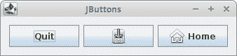
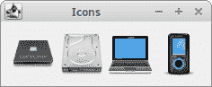
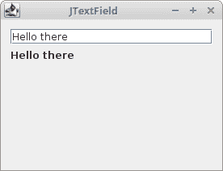
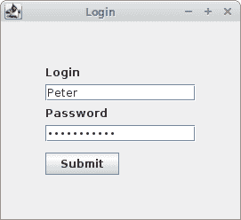

# 基本的 Swing 组件

> 原文： [http://zetcode.com/tutorials/javaswingtutorial/basicswingcomponents/](http://zetcode.com/tutorials/javaswingtutorial/basicswingcomponents/)

Swing 组件是应用的基本构建块。 Swing 具有广泛的各种组件，包括按钮，复选框，滑块和列表框。

[Tweet](https://twitter.com/share) 

在 Swing 教程的这一部分中，我们将介绍`JButton`，`JLabel`，`JTextField`和`JPasswordField`。

## `JButton`

`JButton`正在实现按钮。 如果用户单击该动作，则用于触发该动作。

### 显示文字和图标

`JButton`可以显示文本，图标或两者。

`ImageIconButtonEx.java`

```java
package com.zetcode;

import javax.swing.GroupLayout;
import javax.swing.ImageIcon;
import javax.swing.JButton;
import javax.swing.JComponent;
import javax.swing.JFrame;
import java.awt.EventQueue;

public class ImageIconButtonEx extends JFrame {

    public ImageIconButtonEx() {

        initUI();
    }

    private void initUI() {

        var saveIcon = new ImageIcon("src/resources/save.png");
        var homeIcon = new ImageIcon("src/resources/home.png");

        var quitBtn = new JButton("Quit");
        var saveBtn = new JButton(saveIcon);
        var homeBtn = new JButton("Home", homeIcon);

        createLayout(quitBtn, saveBtn, homeBtn);

        setTitle("JButtons");
        setLocationRelativeTo(null);
        setDefaultCloseOperation(EXIT_ON_CLOSE);
    }

    private void createLayout(JComponent... arg) {

        var pane = getContentPane();
        var gl = new GroupLayout(pane);
        pane.setLayout(gl);

        gl.setAutoCreateContainerGaps(true);
        gl.setAutoCreateGaps(true);

        gl.setHorizontalGroup(gl.createSequentialGroup()
                .addComponent(arg[0])
                .addComponent(arg[1])
                .addComponent(arg[2])
        );

        gl.setVerticalGroup(gl.createParallelGroup()
                .addComponent(arg[0])
                .addComponent(arg[1])
                .addComponent(arg[2])
        );

        gl.linkSize(arg[0], arg[1], arg[2]);

        pack();
    }

    public static void main(String[] args) {

        EventQueue.invokeLater(() -> {

            var ex = new ImageIconButtonEx();
            ex.setVisible(true);
        });
    }
}

```

该示例显示了三个按钮：一个显示文本，一个显示图标，一个同时显示文本和图标。

```java
var saveIcon = new ImageIcon("src/main/resources/save.png");

```

许多组件可以用图标修饰。 为此，我们使用`ImageIcon`类。

```java
var quitBtn = new JButton("Quit");

```

此`JButton`构造函数将文本作为参数。

```java
var saveBtn = new JButton(saveIcon);

```

在此`JButton`构造函数中，我们传递一个图标。

```java
JButton homeBtn = new JButton("Home", homeIcon);

```

此按钮显示文本和图标。

```java
gl.linkSize(arg[0], arg[1], arg[2]);

```

使用`GroupLayout`的`linkSize()`方法，使按钮大小相同。



Figure: JButtons

### 带有助记符的`JButton`

助记符该键与外观的无鼠标修饰符（通常为 Alt）结合使用时，如果焦点位于该按钮的祖先窗口内的某个位置，它将激活该按钮。

`ButtonMnemonicEx.java`

```java
package com.zetcode;

import javax.swing.GroupLayout;
import javax.swing.JButton;
import javax.swing.JComponent;
import javax.swing.JFrame;
import javax.swing.JOptionPane;
import java.awt.EventQueue;
import java.awt.event.ActionEvent;
import java.awt.event.ActionListener;
import java.awt.event.KeyEvent;

public class ButtonMnemonicEx extends JFrame implements ActionListener {

    public ButtonMnemonicEx() {

        initUI();
    }

    private void initUI() {

        var showBtn = new JButton("Show");
        showBtn.addActionListener(this);
        showBtn.setMnemonic(KeyEvent.VK_S);

        createLayout(showBtn);

        setTitle("JButton");
        setLocationRelativeTo(null);
        setDefaultCloseOperation(EXIT_ON_CLOSE);
    }

    private void createLayout(JComponent... arg) {

        var pane = getContentPane();
        var gl = new GroupLayout(pane);
        pane.setLayout(gl);

        gl.setAutoCreateContainerGaps(true);
        gl.setAutoCreateGaps(true);

        gl.setHorizontalGroup(gl.createSequentialGroup()
                .addComponent(arg[0])
                .addGap(250)
        );

        gl.setVerticalGroup(gl.createParallelGroup()
                .addComponent(arg[0])
                .addGap(150)
        );

        pack();
    }

    @Override
    public void actionPerformed(ActionEvent e) {

        JOptionPane.showMessageDialog(this, "Button clicked",
                "Information", JOptionPane.INFORMATION_MESSAGE);
    }

    public static void main(String[] args) {

        EventQueue.invokeLater(() -> {

            var ex = new ButtonMnemonicEx();
            ex.setVisible(true);
        });
    }
}

```

此示例中的按钮可以通过单击鼠标或 `Alt + S` 键盘快捷键来激活。

```java
public class ButtonMnemonicEx extends JFrame implements ActionListener

```

`ButtonMnemonicEx`类实现`ActionListener`； 它必须覆盖`actionPerformed()`方法，在该方法中，我们将激活按钮后执行的代码放入其中。

```java
var showBtn = new JButton("Show");
showBtn.addActionListener(this);

```

创建一个新的`JButton`。 我们使用`addActionListener()`方法向按钮添加一个动作监听器。

```java
showBtn.setMnemonic(KeyEvent.VK_S);

```

`setMnemonic()`设置助记键； 带下划线的“`S`”字符。

```java
@Override
public void actionPerformed(ActionEvent e) {

    JOptionPane.showMessageDialog(this, "Button clicked",
            "Information", JOptionPane.INFORMATION_MESSAGE);
}

```

当通过单击鼠标或通过快捷方式激活按钮时，将显示带有`JOptionPane.showMessageDialog()`的消息对话框。

## `JLabel`

`JLabel`是显示文本和/或图像的简单组件。 它不响应输入事件。

### 显示文字

以下示例显示文本。

`LabelEx.java`

```java
package com.zetcode;

import javax.swing.GroupLayout;
import javax.swing.JComponent;
import javax.swing.JFrame;
import javax.swing.JLabel;
import java.awt.Color;
import java.awt.EventQueue;
import java.awt.Font;

public class LabelEx extends JFrame {

    public LabelEx() {

        initUI();
    }

    private void initUI() {

        var lyrics =  "<html>It's way too late to think of<br>" +
                "Someone I would call now<br>" +
                "And neon signs got tired<br>" +
                "Red eye flights help the stars out<br>" +
                "I'm safe in a corner<br>" +
                "Just hours before me<br>" +
                "<br>" +
                "I'm waking with the roaches<br>" +
                "The world has surrendered<br>" +
                "I'm dating ancient ghosts<br>" +
                "The ones I made friends with<br>" +
                "The comfort of fireflies<br>" +
                "Long gone before daylight<br>" +
                "<br>" +
                "And if I had one wishful field tonight<br>" +
                "I'd ask for the sun to never rise<br>" +
                "If God leant his voice for me to speak<br>" +
                "I'd say go to bed, world<br>" +
                "<br>" +
                "I've always been too late<br>" +
                "To see what's before me<br>" +
                "And I know nothing sweeter than<br>" +
                "Champaign from last New Years<br>" +
                "Sweet music in my ears<br>" +
                "And a night full of no fears<br>" +
                "<br>" +
                "But if I had one wishful field tonight<br>" +
                "I'd ask for the sun to never rise<br>" +
                "If God passed a mic to me to speak<br>" +
                "I'd say stay in bed, world<br>" +
                "Sleep in peace</html>";

        var label = new JLabel(lyrics);
        label.setFont(new Font("Serif", Font.PLAIN, 14));
        label.setForeground(new Color(50, 50, 25));

        createLayout(label);

        setTitle("No Sleep");
        setLocationRelativeTo(null);
        setDefaultCloseOperation(EXIT_ON_CLOSE);
    }

    private void createLayout(JComponent... arg) {

        var pane = getContentPane();
        var gl = new GroupLayout(pane);
        pane.setLayout(gl);

        gl.setAutoCreateContainerGaps(true);

        gl.setHorizontalGroup(gl.createSequentialGroup()
                .addComponent(arg[0])
        );

        gl.setVerticalGroup(gl.createParallelGroup()
                .addComponent(arg[0])
        );

        pack();
    }

    public static void main(String[] args) {

        EventQueue.invokeLater(() -> {

            var ex = new LabelEx();
            ex.setVisible(true);
        });
    }
}

```

在我们的示例中，我们显示了 Cardigans 的歌曲的歌词。 我们可以在`JLabel`组件中使用 HTML 标签。 我们使用`<br>`标签来分隔行。

```java
var label = new JLabel(lyrics);
label.setFont(new Font("Serif", Font.PLAIN, 14));

```

在这里，我们创建一个标签组件。 我们选择纯衬线字体并将其高度设置为 14px。

```java
pack();

```

`pack()`方法将调整窗口大小，以便标签组件以其首选大小显示。


Figure: JLabel

### 显示图标

`JLabel`可用于显示图像。

`LabelEx2.java`

```java
package com.zetcode;

import javax.swing.GroupLayout;
import javax.swing.ImageIcon;
import javax.swing.JComponent;
import javax.swing.JFrame;
import javax.swing.JLabel;
import java.awt.EventQueue;

public class LabelEx2 extends JFrame {

    public LabelEx2() {

        initUI();
    }

    private void initUI() {

        var lbl1 = new JLabel(new ImageIcon("src/resources/cpu.png"));
        var lbl2 = new JLabel(new ImageIcon("src/resources/drive.png"));
        var lbl3 = new JLabel(new ImageIcon("src/resources/laptop.png"));
        var lbl4 = new JLabel(new ImageIcon("src/resources/player.png"));

        createLayout(lbl1, lbl2, lbl3, lbl4);

        setTitle("Icons");
        setLocationRelativeTo(null);
        setDefaultCloseOperation(EXIT_ON_CLOSE);
    }

    private void createLayout(JComponent... arg) {

        var pane = getContentPane();
        var gl = new GroupLayout(pane);
        pane.setLayout(gl);

        gl.setAutoCreateContainerGaps(true);
        gl.setAutoCreateGaps(true);

        gl.setHorizontalGroup(gl.createSequentialGroup()
                .addComponent(arg[0])
                .addComponent(arg[1])
                .addComponent(arg[2])
                .addComponent(arg[3])
        );

        gl.setVerticalGroup(gl.createParallelGroup()
                .addComponent(arg[0])
                .addComponent(arg[1])
                .addComponent(arg[2])
                .addComponent(arg[3])
        );

        pack();
    }

    public static void main(String[] args) {

        EventQueue.invokeLater(() -> {

            var ex = new LabelEx2();
            ex.setVisible(true);
        });
    }
}

```

在示例中，我们使用`JLabel`组件显示四个图标。

```java
var lbl1 = new JLabel(new ImageIcon("src/main/resources/cpu.png"));

```

`JLabel`将`ImageIcon`作为参数。 图标是固定大小的图像。 `ImageIcon`从 GIF，JPEG 或 PNG 图像绘制图标。



Figure: Displaying icons

## `JTextField`

`JTextField`是一个文本组件，允许编辑一行非格式化文本。

`JTextFieldEx.java`

```java
package com.zetcode;

import javax.swing.GroupLayout;
import javax.swing.JComponent;
import javax.swing.JFrame;
import javax.swing.JLabel;
import javax.swing.JTextField;
import javax.swing.event.DocumentEvent;
import javax.swing.event.DocumentListener;
import javax.swing.text.BadLocationException;
import java.awt.EventQueue;
import java.util.logging.Level;
import java.util.logging.Logger;

public class JTextFieldEx extends JFrame {

    private JLabel lbl;

    public JTextFieldEx() {

        initUI();
    }

    private void initUI() {

        var field = new JTextField(15);
        lbl = new JLabel();

        field.getDocument().addDocumentListener(new MyDocumentListener());

        createLayout(field, lbl);

        setTitle("JTextField");
        setLocationRelativeTo(null);
        setDefaultCloseOperation(EXIT_ON_CLOSE);
    }

    private class MyDocumentListener implements DocumentListener {

        private String text;

        @Override
        public void insertUpdate(DocumentEvent e) {
            updateLabel(e);
        }

        @Override
        public void removeUpdate(DocumentEvent e) {
            updateLabel(e);
        }

        @Override
        public void changedUpdate(DocumentEvent e) {
        }

        private void updateLabel(DocumentEvent e) {

            var doc = e.getDocument();
            int len = doc.getLength();

            try {
                text = doc.getText(0, len);
            } catch (BadLocationException ex) {
                Logger.getLogger(JTextFieldEx.class.getName()).log(
                        Level.WARNING, "Bad location", ex);
            }

            lbl.setText(text);

        }
    }

    private void createLayout(JComponent... arg) {

        var pane = getContentPane();
        var gl = new GroupLayout(pane);
        pane.setLayout(gl);

        gl.setAutoCreateContainerGaps(true);
        gl.setAutoCreateGaps(true);

        gl.setHorizontalGroup(gl.createParallelGroup()
                .addComponent(arg[0])
                .addComponent(arg[1])
                .addGap(250)
        );

        gl.setVerticalGroup(gl.createSequentialGroup()
                .addComponent(arg[0], GroupLayout.DEFAULT_SIZE,
                        GroupLayout.DEFAULT_SIZE, GroupLayout.PREFERRED_SIZE)
                .addComponent(arg[1])
                .addGap(150)
        );

        pack();
    }

    public static void main(String[] args) {

        EventQueue.invokeLater(() -> {

            var ex = new JTextFieldEx();
            ex.setVisible(true);
        });
    }
}

```

在示例中，输入`JTextField`的文本立即显示在标签组件中。

```java
var field = new JTextField(15);

```

创建了新的`JTextField`。 该参数是列数。 请注意，此值不会设置字段中允许的字符数。 该值用于计算字段的首选宽度。

```java
field.getDocument().addDocumentListener(new MyDocumentListener());

```

我们将文档监听器添加到`JTextField`。 `getDocument()`方法获取与编辑器关联的模型。 每个 Swing 组件都有一个模型，用于管理其状态或数据。

```java
@Override
public void insertUpdate(DocumentEvent e) {
    updateLabel(e);
}

@Override
public void removeUpdate(DocumentEvent e) {
    updateLabel(e);
}

```

`insertUpdate()`和`removeUpdate()`方法调用`updateLabel()`方法，该方法从文本字段复制文本并将其设置为标签组件。

```java
@Override
public void changedUpdate(DocumentEvent e) {
}

```

我们对`changeUpdate()`方法不感兴趣。 仅在样式化文档中生成此事件。

```java
private void updateLabel(DocumentEvent e) {

    var doc = e.getDocument();
    int len = doc.getLength();

    try {
        text = doc.getText(0, len);
    } catch (BadLocationException ex) {
        Logger.getLogger(JTextFieldEx.class.getName()).log(
                Level.WARNING, "Bad location", ex);
    }

    lbl.setText(text);
}

```

文档事件的`getDocument()`方法用于获取正在观察的文本字段的文档。 我们使用文档的`getLength()`方法获得字符数。 该值用于通过文档的`getText()`方法复制文本。 最后，使用标签的`setText()`方法将文本设置为标签。

```java
gl.setVerticalGroup(gl.createSequentialGroup()
        .addComponent(arg[0], GroupLayout.DEFAULT_SIZE, 
                GroupLayout.DEFAULT_SIZE, GroupLayout.PREFERRED_SIZE)
        .addComponent(arg[1])
        .addGap(150)
);

```

我们不希望`JTextField`垂直生长； 因此，我们在垂直方向将其最大值设置为`GroupLayout.PREFERRED_SIZE`。



Figure: JTextField

## `JPasswordField`

`JPasswordField`是`JTextField`子类，不显示用户键入的字符。

`PasswordEx.java`

```java
package com.zetcode;

import javax.swing.AbstractAction;
import javax.swing.GroupLayout;
import javax.swing.JButton;
import javax.swing.JFrame;
import javax.swing.JLabel;
import javax.swing.JPasswordField;
import javax.swing.JTextField;
import java.awt.Component;
import java.awt.EventQueue;
import java.awt.event.ActionEvent;
import java.util.Arrays;

import static javax.swing.LayoutStyle.ComponentPlacement.UNRELATED;

public class PasswordEx extends JFrame {

    private JTextField loginField;
    private JPasswordField passField;

    public PasswordEx() {

        initUI();
    }

    private void initUI() {

        var lbl1 = new JLabel("Login");
        var lbl2 = new JLabel("Password");

        loginField = new JTextField(15);
        passField = new JPasswordField(15);

        var submitButton = new JButton("Submit");
        submitButton.addActionListener(new SubmitAction());

        createLayout(lbl1, loginField, lbl2, passField, submitButton);

        setTitle("Login");
        setLocationRelativeTo(null);
        setDefaultCloseOperation(JFrame.EXIT_ON_CLOSE);
    }

    private class SubmitAction extends AbstractAction {

        @Override
        public void actionPerformed(ActionEvent e) {

            doSubmitAction();
        }

        private void doSubmitAction() {

            var login = loginField.getText();
            var passwd = passField.getPassword();

            if (!login.isEmpty() && passwd.length != 0) {

                System.out.format("User %s entered %s password%n",
                        login, String.valueOf(passwd));
            }

            Arrays.fill(passwd, '0');
        }
    }

    private void createLayout(Component... arg) {

        var pane = getContentPane();
        var gl = new GroupLayout(pane);
        pane.setLayout(gl);

        gl.setAutoCreateGaps(true);
        gl.setAutoCreateContainerGaps(true);

        gl.setHorizontalGroup(gl.createSequentialGroup()
                .addGap(50)
                .addGroup(gl.createParallelGroup()
                        .addComponent(arg[0])
                        .addComponent(arg[1])
                        .addComponent(arg[2])
                        .addComponent(arg[3])
                        .addComponent(arg[4]))
                .addGap(50)
        );

        gl.setVerticalGroup(gl.createSequentialGroup()
                .addGap(50)
                .addGroup(gl.createSequentialGroup()
                        .addComponent(arg[0])
                        .addComponent(arg[1], GroupLayout.DEFAULT_SIZE,
                                GroupLayout.DEFAULT_SIZE, GroupLayout.PREFERRED_SIZE)
                        .addComponent(arg[2])
                        .addComponent(arg[3], GroupLayout.DEFAULT_SIZE,
                                GroupLayout.DEFAULT_SIZE, GroupLayout.PREFERRED_SIZE)
                        .addPreferredGap(UNRELATED)
                        .addComponent(arg[4]))
                .addGap(50)
        );

        pack();
    }

    public static void main(String[] args) {

        EventQueue.invokeLater(() -> {

            var ex = new PasswordEx();
            ex.setVisible(true);
        });
    }
}

```

该示例具有一个文本字段，一个密码字段和一个按钮。 该按钮将打印用户输入的数据。

```java
passField = new JPasswordField (15);

```

创建`JPasswordField`的实例。

```java
var passwd = passField.getPassword();

```

为了安全起见，密码字段将其值存储为字符数组而不是字符串。 字符数组由`getPassword()`方法返回。 不推荐使用较早的`getText()`方法。

```java
Arrays.fill(passwd , '0');

```

处理完密码后，建议将数组的元素设置为零。



Figure: JPasswordField

在 Java Swing 教程的这一部分中，我们介绍了基本的 Swing 组件，包括`JButton`，`JLabel`，`JTextField`和`JPasswordField`。