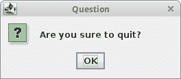
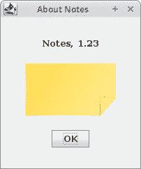

# Java Swing 对话框

> [http://zetcode.com/tutorials/javaswingtutorial/swingdialogs/](http://zetcode.com/tutorials/javaswingtutorial/swingdialogs/)

对话框窗口或对话框是大多数现代 GUI 应用必不可少的部分。 对话被定义为两个或更多人之间的对话。 在计算机应用中，对话框是一个窗口，用于与应用“对话”。 对话框用于输入数据，修改数据，更改应用设置等。对话框是用户与计算机程序之间进行通信的重要手段。

在 Java Swing 中，我们可以创建两种对话框：标准对话框和自定义对话框。自定义对话框由程序员创建。 它们基于`JDialog`类。标准对话框 是 Swing 工具箱中可用的预定义对话框，例如`JColorChooser`或`JFileChooser`。 这些是用于常见编程任务的对话框，例如显示文本，接收输入，加载和保存文件。 它们节省了程序员的时间，并增强了一些标准行为。

对话框有两种基本类型：模态对话框和非模态对话框。模态对话框阻止输入到其他顶级窗口。非模态对话框允许输入其他窗口。 打开文件对话框是模态对话框的一个很好的例子。 选择要打开的文件时，不应进行其他操作。 典型的非模态对话框是查找文本对话框。 能够在文本控件中移动光标并定义从何处开始查找特定文本很方便。

## 消息对话框

消息对话框是向用户提供信息的简单对话框。 消息对话框是使用`JOptionPane.showMessageDialog()`方法创建的。

`MessageDialogsEx.java`

```java
package com.zetcode;

import javax.swing.GroupLayout;
import javax.swing.JButton;
import javax.swing.JComponent;
import javax.swing.JFrame;
import javax.swing.JOptionPane;
import javax.swing.JPanel;
import java.awt.EventQueue;

import static javax.swing.GroupLayout.DEFAULT_SIZE;

public class MessageDialogsEx extends JFrame {

    private JPanel pnl;

    public MessageDialogsEx() {

        initUI();
    }

    private void initUI() {

        pnl = (JPanel) getContentPane();

        var warBtn = new JButton("Warning");
        var errBtn = new JButton("Error");
        var queBtn = new JButton("Question");
        var infBtn = new JButton("Information");

        warBtn.addActionListener(event -> JOptionPane.showMessageDialog(pnl,
                "A deprecated call!", "Warning", JOptionPane.WARNING_MESSAGE));

        errBtn.addActionListener(event -> JOptionPane.showMessageDialog(pnl,
                "Could not open file!", "Error", JOptionPane.ERROR_MESSAGE));

        queBtn.addActionListener(event -> JOptionPane.showMessageDialog(pnl,
                "Are you sure to quit?", "Question", JOptionPane.QUESTION_MESSAGE));

        infBtn.addActionListener(event -> JOptionPane.showMessageDialog(pnl,
                "Download completed.", "Information", 
                JOptionPane.INFORMATION_MESSAGE));

        createLayout(warBtn, errBtn, queBtn, infBtn);

        setTitle("Message dialogs");
        setSize(300, 200);
        setLocationRelativeTo(null);
        setDefaultCloseOperation(EXIT_ON_CLOSE);
    }

    private void createLayout(JComponent... arg) {

        var pane = getContentPane();
        var gl = new GroupLayout(pane);
        pane.setLayout(gl);

        gl.setAutoCreateGaps(true);

        gl.setHorizontalGroup(gl.createSequentialGroup()
                .addContainerGap(DEFAULT_SIZE, Short.MAX_VALUE)
                .addGroup(gl.createParallelGroup()
                        .addComponent(arg[0])
                        .addComponent(arg[2]))
                .addGroup(gl.createParallelGroup()
                        .addComponent(arg[1])
                        .addComponent(arg[3]))
                .addContainerGap(DEFAULT_SIZE, Short.MAX_VALUE)
        );

        gl.setVerticalGroup(gl.createSequentialGroup()
                .addContainerGap(DEFAULT_SIZE, Short.MAX_VALUE)
                .addGroup(gl.createParallelGroup()
                        .addComponent(arg[0])
                        .addComponent(arg[1]))
                .addGroup(gl.createParallelGroup()
                        .addComponent(arg[2])
                        .addComponent(arg[3]))
                .addContainerGap(DEFAULT_SIZE, Short.MAX_VALUE)
        );

        gl.linkSize(arg[0], arg[1], arg[2], arg[3]);

        pack();
    }

    public static void main(String[] args) {

        EventQueue.invokeLater(() -> {

            var md = new MessageDialogsEx();
            md.setVisible(true);
        });
    }
}

```

该示例显示了错误，警告，问题和信息消息对话框。

```java
var warBtn = new JButton("Warning");
var errBtn = new JButton("Error");
var queBtn = new JButton("Question");
var infBtn = new JButton("Information");

```

这四个按钮显示四个不同的消息对话框。

```java
errBtn.addActionListener(event -> JOptionPane.showMessageDialog(pnl,
        "Could not open file!", "Error", JOptionPane.ERROR_MESSAGE));

```

要创建消息对话框，我们调用`JOptionPane`类的静态`showMessageDialog()`方法。 我们提供对话框的父项，消息文本，标题和消息类型。 消息类型是以下常量之一：

*   错误信息
*   警告信息
*   QUESTION_MESSAGE
*   INFORMATION_MESSAGE

显示的图标取决于此常数。



Figure: Question message dialog

## 自定义对话框

在下面的示例中，我们创建一个简单的自定义对话框。 它是有关在许多 GUI 应用中找到的对话框的示例，通常位于“帮助”菜单中。

`CustomDialogEx.java`

```java
package com.zetcode;

import javax.swing.Box;
import javax.swing.GroupLayout;
import javax.swing.ImageIcon;
import javax.swing.JButton;
import javax.swing.JComponent;
import javax.swing.JDialog;
import javax.swing.JFrame;
import javax.swing.JLabel;
import javax.swing.JMenu;
import javax.swing.JMenuBar;
import javax.swing.JMenuItem;
import java.awt.EventQueue;
import java.awt.Font;
import java.awt.Frame;
import java.awt.event.ActionEvent;
import java.awt.event.ActionListener;
import java.awt.event.KeyEvent;

import static javax.swing.GroupLayout.Alignment.CENTER;

class AboutDialog extends JDialog {

    public AboutDialog(Frame parent) {
        super(parent);

        initUI();
    }

    private void initUI() {

        var icon = new ImageIcon("src/resources/notes.png");
        var imgLabel = new JLabel(icon);

        var textLabel = new JLabel("Notes, 1.23");
        textLabel.setFont(new Font("Serif", Font.BOLD, 13));

        var okBtn = new JButton("OK");
        okBtn.addActionListener(event -> dispose());

        createLayout(textLabel, imgLabel, okBtn);

        setModalityType(ModalityType.APPLICATION_MODAL);

        setTitle("About Notes");
        setDefaultCloseOperation(DISPOSE_ON_CLOSE);
        setLocationRelativeTo(getParent());
    }

    private void createLayout(JComponent... arg) {

        var pane = getContentPane();
        var gl = new GroupLayout(pane);
        pane.setLayout(gl);

        gl.setAutoCreateContainerGaps(true);
        gl.setAutoCreateGaps(true);

        gl.setHorizontalGroup(gl.createParallelGroup(CENTER)
                .addComponent(arg[0])
                .addComponent(arg[1])
                .addComponent(arg[2])
                .addGap(200)
        );

        gl.setVerticalGroup(gl.createSequentialGroup()
                .addGap(30)
                .addComponent(arg[0])
                .addGap(20)
                .addComponent(arg[1])
                .addGap(20)
                .addComponent(arg[2])
                .addGap(30)
        );

        pack();
    }
}

public class CustomDialogEx extends JFrame
        implements ActionListener {

    public CustomDialogEx() {

        initUI();
    }

    private void initUI() {

        createMenuBar();

        setTitle("Simple Dialog");
        setSize(350, 250);
        setLocationRelativeTo(null);
        setDefaultCloseOperation(EXIT_ON_CLOSE);
    }

    private void createMenuBar() {

        var menubar = new JMenuBar();

        var fileMenu = new JMenu("File");
        fileMenu.setMnemonic(KeyEvent.VK_F);

        var helpMenu = new JMenu("Help");
        helpMenu.setMnemonic(KeyEvent.VK_H);

        var aboutMemuItem = new JMenuItem("About");
        aboutMemuItem.setMnemonic(KeyEvent.VK_A);
        helpMenu.add(aboutMemuItem);

        aboutMemuItem.addActionListener(this);

        menubar.add(fileMenu);
        menubar.add(Box.createGlue());
        menubar.add(helpMenu);
        setJMenuBar(menubar);
    }

    @Override
    public void actionPerformed(ActionEvent e) {

        showAboutDialog();
    }

    private void showAboutDialog() {

        var aboutDialog = new AboutDialog(this);
        aboutDialog.setVisible(true);
    }

    public static void main(String[] args) {

        EventQueue.invokeLater(() -> {

            var ex = new CustomDialogEx();
            ex.setVisible(true);
        });
    }
}

```

从“帮助”菜单中，我们可以弹出一个小对话框。 该对话框显示文本，图标和按钮。

```java
class AboutDialog extends JDialog {

```

自定义对话框基于`JDialog`类。

```java
setModalityType(ModalityType.APPLICATION_MODAL);

```

`setModalityType()`方法设置对话框的模态类型。 `ModalityType.APPLICATION_MODAL`阻止来自同一应用的所有顶级窗口的输入。 在我们的例子中，在对话框的生存期内，应用框架的输入被阻止。

```java
setLocationRelativeTo(getParent());

```

`setLocationRelativeTo()`方法将对话框窗口居中在框架窗口的区域上方。

```java
setDefaultCloseOperation(DISPOSE_ON_CLOSE);

```

`setDefaultCloseOperation()`设置用户单击窗口的“关闭”按钮时发生的情况。 该对话框将被隐藏和处置。

```java
private void showAboutDialog() {

    var aboutDialog = new AboutDialog(this);
    aboutDialog.setVisible(true);
}

```

对话框窗口使用`setVisible()`方法显示在屏幕上。



Figure: Custom dialog

## `JFileChooser`

`JFileChooser`是用于从文件系统中选择文件的标准对话框。

`FileChooserEx.java`

```java
package com.zetcode;

import javax.swing.AbstractAction;
import javax.swing.GroupLayout;
import javax.swing.ImageIcon;
import javax.swing.JButton;
import javax.swing.JComponent;
import javax.swing.JFileChooser;
import javax.swing.JFrame;
import javax.swing.JOptionPane;
import javax.swing.JPanel;
import javax.swing.JScrollPane;
import javax.swing.JTextArea;
import javax.swing.JToolBar;
import javax.swing.filechooser.FileNameExtensionFilter;
import java.awt.EventQueue;
import java.awt.event.ActionEvent;
import java.io.File;
import java.io.IOException;
import java.nio.file.Files;
import java.nio.file.Paths;

import static javax.swing.GroupLayout.DEFAULT_SIZE;

public class FileChooserEx extends JFrame {

    private JPanel panel;
    private JTextArea area;

    public FileChooserEx() {

        initUI();
    }

    private void initUI() {

        panel = (JPanel) getContentPane();
        area = new JTextArea();

        var spane = new JScrollPane();
        spane.getViewport().add(area);

        var toolbar = createToolBar();

        createLayout(toolbar, spane);

        setTitle("JFileChooser");
        setSize(400, 300);
        setLocationRelativeTo(null);
        setDefaultCloseOperation(EXIT_ON_CLOSE);
    }

    private JToolBar createToolBar() {

        var openIcon = new ImageIcon("src/resources/document-open.png");

        var toolbar = new JToolBar();
        var openBtn = new JButton(openIcon);

        openBtn.addActionListener(new OpenFileAction());

        toolbar.add(openBtn);

        return toolbar;
    }

    private void createLayout(JComponent... arg) {

        var pane = getContentPane();
        var gl = new GroupLayout(pane);
        pane.setLayout(gl);

        gl.setHorizontalGroup(gl.createParallelGroup()
                .addComponent(arg[0], DEFAULT_SIZE, DEFAULT_SIZE,
                        Short.MAX_VALUE)
                .addGroup(gl.createSequentialGroup()
                        .addComponent(arg[1]))
        );

        gl.setVerticalGroup(gl.createSequentialGroup()
                .addComponent(arg[0])
                .addGap(4)
                .addComponent(arg[1])
        );

        pack();
    }

    public String readFile(File file) {

        String content = "";

        try {
            content = new String(Files.readAllBytes(Paths.get(
                    file.getAbsolutePath())));
        } catch (IOException ex) {
            JOptionPane.showMessageDialog(this,
                    "Could not read file", "Error", JOptionPane.ERROR_MESSAGE);
        }

        return content;
    }

    private class OpenFileAction extends AbstractAction {

        @Override
        public void actionPerformed(ActionEvent e) {

            var fileChooser = new JFileChooser();
            var filter = new FileNameExtensionFilter("Java files", "java");
            fileChooser.addChoosableFileFilter(filter);

            int ret = fileChooser.showDialog(panel, "Open file");

            if (ret == JFileChooser.APPROVE_OPTION) {

                var file = fileChooser.getSelectedFile();
                var text = readFile(file);

                area.setText(text);
            }
        }
    }

    public static void main(String[] args) {

        EventQueue.invokeLater(() -> {

            var ex = new FileChooserEx();
            ex.setVisible(true);
        });
    }
}

```

该代码示例将演示如何使用`JFileChooser`将文件内容加载到文本区域组件中。

```java
var fileChooser = new JFileChooser();

```

这是文件选择器对话框的构造函数。

```java
var filter = new FileNameExtensionFilter("Java files", "java");
fileChooser.addChoosableFileFilter(filter);

```

在这里，我们定义文件过滤器。 在本例中，我们将具有扩展名为`.java`的 Java 文件。 我们还有默认的“所有文件”选项。

```java
int ret = fileChooser.showDialog(panel, "Open file");

```

`showDialog()`方法在屏幕上显示对话框。 单击“是”或“确定”按钮时，将返回`JFileChooser.APPROVE_OPTION`。

```java
if (ret == JFileChooser.APPROVE_OPTION) {

    var file = fileChooser.getSelectedFile();
    var text = readFile(file);

    area.setText(text);
}

```

在这里，我们获得所选文件的名称。 我们读取文件的内容并将文本设置到文本区域中。


Figure: JFileChooser dialog

## `JColorChooser`

`JColorChooser`是用于选择颜色的标准对话框。

`ColorChooserEx.java`

```java
package com.zetcode;

import javax.swing.GroupLayout;
import javax.swing.ImageIcon;
import javax.swing.JButton;
import javax.swing.JColorChooser;
import javax.swing.JComponent;
import javax.swing.JFrame;
import javax.swing.JPanel;
import javax.swing.JToolBar;
import java.awt.Color;
import java.awt.EventQueue;

import static javax.swing.GroupLayout.DEFAULT_SIZE;

public class ColorChooserEx extends JFrame {

    private JPanel colourPanel;

    public ColorChooserEx() {

        initUI();
    }

    private void initUI() {

        colourPanel = new JPanel();
        colourPanel.setBackground(Color.WHITE);

        var toolbar = createToolBar();

        createLayout(toolbar, colourPanel);

        setTitle("JColorChooser");
        setSize(400, 300);
        setLocationRelativeTo(null);
        setDefaultCloseOperation(EXIT_ON_CLOSE);
    }

    private JToolBar createToolBar() {

        var openIcon = new ImageIcon("src/resources/colourdlg.png");

        var toolbar = new JToolBar();
        var openBtn = new JButton(openIcon);

        openBtn.addActionListener(e -> {

            var color = JColorChooser.showDialog(colourPanel,
                    "Choose colour", Color.white);
            colourPanel.setBackground(color);
        });

        toolbar.add(openBtn);

        return toolbar;
    }

    private void createLayout(JComponent... arg) {

        var pane = getContentPane();
        var gl = new GroupLayout(pane);
        pane.setLayout(gl);

        gl.setHorizontalGroup(gl.createParallelGroup()
                .addComponent(arg[0], DEFAULT_SIZE, DEFAULT_SIZE,
                        Short.MAX_VALUE)
                .addGroup(gl.createSequentialGroup()
                        .addGap(30)
                        .addComponent(arg[1])
                        .addGap(30))
        );

        gl.setVerticalGroup(gl.createSequentialGroup()
                .addComponent(arg[0])
                .addGap(30)
                .addComponent(arg[1])
                .addGap(30)
        );

        pack();
    }

    public static void main(String[] args) {

        EventQueue.invokeLater(() -> {

            var ex = new ColorChooserEx();
            ex.setVisible(true);
        });
    }
}

```

在示例中，我们有一个白色面板。 我们将通过从`JColorChooser`中选择一种颜色来更改面板的背景颜色。

```java
var color = JColorChooser.showDialog(colourPanel,
        "Choose colour", Color.white);
colourPanel.setBackground(color);

```

此代码显示颜色选择器对话框。 `showDialog()`方法返回所选的颜色值。 我们将`colourPanel's`背景更改为新选择的颜色。

在 Java Swing 教程的这一部分中，我们介绍了对话框。