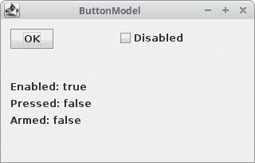
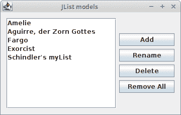
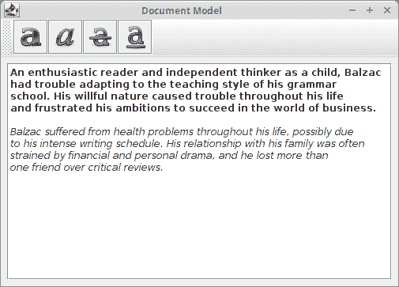

# Java Swing 模型架构

> [http://zetcode.com/tutorials/javaswingtutorial/swingmodels/](http://zetcode.com/tutorials/javaswingtutorial/swingmodels/)

Swing 工程师创建了 Swing 工具箱，实现了修改后的 MVC 设计模式。 这样可以有效地处理数据，并在运行时使用可插入的外观。

传统的 MVC 模式将应用分为三个部分：模型，视图和控制器。 该模型表示应用中的数据。 视图是数据的视觉表示。 最后，控制器处理并响应事件（通常是用户操作），并可以调用模型上的更改。 这个想法是通过引入一个中间组件：控制器，将数据访问和业务逻辑与数据表示和用户交互分开。

Swing 工具箱使用修改后的 MVC 设计模式。 对于视图和控制器，它只有一个 UI 对象。 有时将这种修改后的 MVC 称为可分离模型体系结构。

在 Swing 工具箱中，每个组件都有其模型，甚至包括按钮之类的基本组件。 Swing 工具箱中有两种模型：

*   状态模型
*   数据模型

状态模型处理组件的状态。 例如，模型会跟踪组件是处于选中状态还是处于按下状态。 数据模型处理它们使用的数据。 列表组件保留其显示的项目列表。

对于 Swing 开发人员来说，这意味着他们通常需要获取模型实例才能操纵组件中的数据。 但是也有例外。 为了方便起见，有一些方法可以返回数据，而无需程序员访问模型。

```java
public int getValue() { 
    return getModel().getValue(); 
}

```

一个示例是`JSlider`组件的`getValue()`方法。 开发人员无需直接使用模型。 而是在后台进行对模型的访问。 在如此简单的情况下直接使用模型将是一个过大的杀伤力。 因此，Swing 提供了一些便捷的方法，如上一个。

要查询模型的状态，我们有两种通知：

*   轻量级通知
*   状态通知

轻量级通知使用`ChangeListener`类。 对于来自组件的所有通知，我们只有一个事件（`ChangeEvent)`。对于更复杂的组件，将使用状态通知。对于此类通知，我们具有不同类型的事件。例如，`JList`组件具有`ListDataEvent`和`ListSelectionEvent`。

如果我们不为组件设置模型，则会创建一个默认模型。 例如，按钮组件具有`DefaultButtonModel`模型。

```java
public JButton(String text, Icon icon) {
  // Create the model
  setModel(new DefaultButtonModel());

  // initialize
  init(text, icon);
}

```

查看 JButton.java 源文件，我们发现默认模型是在构建组件时创建的。

## 按钮模型

该模型用于各种按钮，例如按钮，复选框，单选框和菜单项。 以下示例说明了`JButton`的模型。 因为没有数据可以与按钮关联，所以我们只能管理按钮的状态。

`ButtonModelEx.java`

```java
package com.zetcode;

import javax.swing.AbstractAction;
import javax.swing.DefaultButtonModel;
import javax.swing.GroupLayout;
import javax.swing.JButton;
import javax.swing.JCheckBox;
import javax.swing.JComponent;
import javax.swing.JFrame;
import javax.swing.JLabel;
import javax.swing.event.ChangeEvent;
import javax.swing.event.ChangeListener;
import java.awt.EventQueue;
import java.awt.event.ActionEvent;

public class ButtonModelEx extends JFrame {

    private JButton okBtn;
    private JLabel enabledLbl;
    private JLabel pressedLbl;
    private JLabel armedLbl;
    private JCheckBox checkBox;

    public ButtonModelEx() {

        initUI();
    }

    private void initUI() {

        okBtn = new JButton("OK");
        okBtn.addChangeListener(new DisabledChangeListener());
        checkBox = new JCheckBox();
        checkBox.setAction(new CheckBoxAction());

        enabledLbl = new JLabel("Enabled: true");
        pressedLbl = new JLabel("Pressed: false");
        armedLbl = new JLabel("Armed: false");

        createLayout(okBtn, checkBox, enabledLbl, pressedLbl, armedLbl);

        setTitle("ButtonModel");
        setLocationRelativeTo(null);
        setDefaultCloseOperation(EXIT_ON_CLOSE);
    }

    private void createLayout(JComponent... arg) {

        var pane = getContentPane();
        var gl = new GroupLayout(pane);
        pane.setLayout(gl);

        gl.setAutoCreateContainerGaps(true);
        gl.setAutoCreateGaps(true);

        gl.setHorizontalGroup(gl.createParallelGroup()
                .addGroup(gl.createSequentialGroup()
                        .addComponent(arg[0])
                        .addGap(80)
                        .addComponent(arg[1]))
                .addGroup(gl.createParallelGroup()
                        .addComponent(arg[2])
                        .addComponent(arg[3])
                        .addComponent(arg[4]))
        );

        gl.setVerticalGroup(gl.createSequentialGroup()
                .addGroup(gl.createParallelGroup()
                        .addComponent(arg[0])
                        .addComponent(arg[1]))
                .addGap(40)
                .addGroup(gl.createSequentialGroup()
                        .addComponent(arg[2])
                        .addComponent(arg[3])
                        .addComponent(arg[4]))
        );

        pack();
    }

    private class DisabledChangeListener implements ChangeListener {

        @Override
        public void stateChanged(ChangeEvent e) {

            var model = (DefaultButtonModel) okBtn.getModel();

            if (model.isEnabled()) {
                enabledLbl.setText("Enabled: true");
            } else {
                enabledLbl.setText("Enabled: false");
            }

            if (model.isArmed()) {
                armedLbl.setText("Armed: true");
            } else {
                armedLbl.setText("Armed: false");
            }

            if (model.isPressed()) {
                pressedLbl.setText("Pressed: true");
            } else {
                pressedLbl.setText("Pressed: false");
            }
        }
    }

    private class CheckBoxAction extends AbstractAction {

        public CheckBoxAction() {
            super("Disabled");
        }

        @Override
        public void actionPerformed(ActionEvent e) {

            if (okBtn.isEnabled()) {
                okBtn.setEnabled(false);
            } else {
                okBtn.setEnabled(true);
            }
        }
    }

    public static void main(String[] args) {

        EventQueue.invokeLater(() -> {

            var ex = new ButtonModelEx();
            ex.setVisible(true);
        });
    }
}

```

在我们的示例中，我们有一个按钮，一个复选框和三个标签。 标签代表按钮的三个属性：按下，禁用或布防状态。

```java
okbtn.addChangeListener(new DisabledChangeListener());

```

我们使用`ChangeListener`来监听按钮状态的变化。

```java
var model = (DefaultButtonModel) okBtn.getModel();

```

在这里，我们获得默认的按钮模型。

```java
if (model.isEnabled()) {
    enabledLbl.setText("Enabled: true");
} else {
    enabledLbl.setText("Enabled: false");
}

```

我们查询模型是否启用了按钮。 标签会相应更新。

```java
if (okBtn.isEnabled()) {
    okBtn.setEnabled(false);
} else {
    okBtn.setEnabled(true);
}

```

该复选框启用或禁用该按钮。 要启用“确定”按钮，我们调用`setEnabled()`方法。 因此，我们更改了按钮的状态。 模型在哪里？ 答案就在`AbstractButton.java`文件中。

```java
public void setEnabled(boolean b) {
    if (!b && model.isRollover()) {
        model.setRollover(false);
    } 
    super.setEnabled(b);
    model.setEnabled(b);
}

```

答案是，Swing 工具箱在内部与模型一起使用。 `setEnabled()`是程序员的另一种便捷方法。



Figure: ButtonModel

## 自定义`ButtonModel`

在前面的示例中，我们使用了默认按钮模型。 在下面的代码示例中，我们将使用我们自己的按钮模型。

`CustomButtonModelEx.java`

```java
package com.zetcode;

import javax.swing.AbstractAction;
import javax.swing.DefaultButtonModel;
import javax.swing.GroupLayout;
import javax.swing.JButton;
import javax.swing.JCheckBox;
import javax.swing.JComponent;
import javax.swing.JFrame;
import javax.swing.JLabel;
import java.awt.EventQueue;
import java.awt.event.ActionEvent;

public class CustomButtonModelEx extends JFrame {

    private JButton okBtn;
    private JLabel enabledLbl;
    private JLabel pressedLbl;
    private JLabel armedLbl;
    private JCheckBox checkBox;

    public CustomButtonModelEx() {

        initUI();
    }

    private void initUI() {

        okBtn = new JButton("OK");
        checkBox = new JCheckBox();
        checkBox.setAction(new CheckBoxAction());

        enabledLbl = new JLabel("Enabled: true");
        pressedLbl = new JLabel("Pressed: false");
        armedLbl  = new JLabel("Armed: false");

        var model = new OkButtonModel();
        okBtn.setModel(model);

        createLayout(okBtn, checkBox, enabledLbl, pressedLbl, armedLbl);

        setTitle("Custom button model");
        setLocationRelativeTo(null);
        setDefaultCloseOperation(EXIT_ON_CLOSE);
    }

    private void createLayout(JComponent... arg) {

        var pane = getContentPane();
        var gl = new GroupLayout(pane);
        pane.setLayout(gl);

        gl.setAutoCreateContainerGaps(true);
        gl.setAutoCreateGaps(true);

        gl.setHorizontalGroup(gl.createParallelGroup()
                .addGroup(gl.createSequentialGroup()
                        .addComponent(arg[0])
                        .addGap(80)
                        .addComponent(arg[1]))
                .addGroup(gl.createParallelGroup()
                        .addComponent(arg[2])
                        .addComponent(arg[3])
                        .addComponent(arg[4]))
        );

        gl.setVerticalGroup(gl.createSequentialGroup()
                .addGroup(gl.createParallelGroup()
                        .addComponent(arg[0])
                        .addComponent(arg[1]))
                .addGap(40)
                .addGroup(gl.createSequentialGroup()
                        .addComponent(arg[2])
                        .addComponent(arg[3])
                        .addComponent(arg[4]))
        );

        pack();
    }

    private class OkButtonModel extends DefaultButtonModel {

        @Override
        public void setEnabled(boolean b) {
            if (b) {
                enabledLbl.setText("Enabled: true");
            } else {
                enabledLbl.setText("Enabled: false");
            }

            super.setEnabled(b);
        }

        @Override
        public void setArmed(boolean b) {
            if (b) {
                armedLbl.setText("Armed: true");
            } else {
                armedLbl.setText("Armed: false");
            }

            super.setArmed(b);
        }

        @Override
        public void setPressed(boolean b) {
            if (b) {
                pressedLbl.setText("Pressed: true");
            } else {
                pressedLbl.setText("Pressed: false");
            }

            super.setPressed(b);
        }
    }

    private class CheckBoxAction extends AbstractAction {

        public CheckBoxAction() {
            super("Disabled");
        }

        @Override
        public void actionPerformed(ActionEvent e) {
            if (okBtn.isEnabled()) {
                okBtn.setEnabled(false);
            } else {
                okBtn.setEnabled(true);
            }
        }
    }

    public static void main(String[] args) {

        EventQueue.invokeLater(() -> {

            var ex = new CustomButtonModelEx();
            ex.setVisible(true);
        });
    }
}

```

本示例与上一个示例具有相同的作用。 区别在于我们不使用变更监听器，而使用自定义按钮模型。

```java
var model = new OkButtonModel();
okBtn.setModel(model);

```

我们为按钮设置自定义模型。

```java
private class OkButtonModel extends DefaultButtonModel {
...
}

```

我们创建一个自定义按钮模型并覆盖必要的方法。

```java
@Override
public void setEnabled(boolean b) {
    if (b) {
        enabledLbl.setText("Enabled: true");
    } else {
        enabledLbl.setText("Enabled: false");
    }

    super.setEnabled(b);
}

```

我们重写`setEnabled()`方法，并在其中添加一些功能。 我们一定不要忘记调用父方法来继续进行处理。

## `JList`模型

几个组件具有两个模型。 `JList`是其中之一。 它具有以下模型：`ListModel`和`ListSelectionModel`。 `ListModel`处理数据，`ListSelectionModel`处理列表的选择状态。 以下示例使用两种模型。

`ListModelsEx.java`

```java
package com.zetcode;

import javax.swing.DefaultListModel;
import javax.swing.GroupLayout;
import javax.swing.JButton;
import javax.swing.JComponent;
import javax.swing.JFrame;
import javax.swing.JList;
import javax.swing.JOptionPane;
import javax.swing.JScrollPane;
import javax.swing.ListSelectionModel;
import java.awt.EventQueue;
import java.awt.event.MouseAdapter;
import java.awt.event.MouseEvent;

import static javax.swing.GroupLayout.Alignment.CENTER;

public class ListModelsEx extends JFrame {

    private DefaultListModel<String> model;
    private JList<String> myList;
    private JButton remAllBtn;
    private JButton addBtn;
    private JButton renBtn;
    private JButton delBtn;

    public ListModelsEx() {

        initUI();
    }

    private void createList() {

        model = new DefaultListModel<>();
        model.addElement("Amelie");
        model.addElement("Aguirre, der Zorn Gottes");
        model.addElement("Fargo");
        model.addElement("Exorcist");
        model.addElement("Schindler's myList");

        myList = new JList<>(model);
        myList.setSelectionMode(ListSelectionModel.SINGLE_SELECTION);

        myList.addMouseListener(new MouseAdapter() {

            @Override
            public void mouseClicked(MouseEvent e) {

                if (e.getClickCount() == 2) {

                    int index = myList.locationToIndex(e.getPoint());
                    var item = model.getElementAt(index);
                    var text = JOptionPane.showInputDialog("Rename item", item);

                    String newItem;

                    if (text != null) {
                        newItem = text.trim();
                    } else {
                        return;
                    }

                    if (!newItem.isEmpty()) {

                        model.remove(index);
                        model.add(index, newItem);

                        var selModel = myList.getSelectionModel();
                        selModel.setLeadSelectionIndex(index);
                    }
                }
            }
        });
    }

    private void createButtons() {

        remAllBtn = new JButton("Remove All");
        addBtn = new JButton("Add");
        renBtn = new JButton("Rename");
        delBtn = new JButton("Delete");

        addBtn.addActionListener(e -> {

            var text = JOptionPane.showInputDialog("Add a new item");
            String item;

            if (text != null) {
                item = text.trim();
            } else {
                return;
            }

            if (!item.isEmpty()) {

                model.addElement(item);
            }
        });

        delBtn.addActionListener(event -> {

            var selModel = myList.getSelectionModel();

            int index = selModel.getMinSelectionIndex();

            if (index >= 0) {
                model.remove(index);
            }
        });

        renBtn.addActionListener(e -> {

            var selModel = myList.getSelectionModel();
            int index = selModel.getMinSelectionIndex();

            if (index == -1) {
                return;
            }

            var item = model.getElementAt(index);
            var text = JOptionPane.showInputDialog("Rename item", item);
            String newItem;

            if (text != null) {
                newItem = text.trim();
            } else {
                return;
            }

            if (!newItem.isEmpty()) {

                model.remove(index);
                model.add(index, newItem);
            }
        });

        remAllBtn.addActionListener(e -> model.clear());
    }

    private void initUI() {

        createList();
        createButtons();

        var scrollPane = new JScrollPane(myList);
        createLayout(scrollPane, addBtn, renBtn, delBtn, remAllBtn);

        setTitle("JList models");
        setLocationRelativeTo(null);
        setDefaultCloseOperation(EXIT_ON_CLOSE);
    }

    private void createLayout(JComponent... arg) {

        var pane = getContentPane();
        var gl = new GroupLayout(pane);
        pane.setLayout(gl);

        gl.setAutoCreateContainerGaps(true);
        gl.setAutoCreateGaps(true);

        gl.setHorizontalGroup(gl.createSequentialGroup()
                .addComponent(arg[0])
                .addGroup(gl.createParallelGroup()
                        .addComponent(arg[1])
                        .addComponent(arg[2])
                        .addComponent(arg[3])
                        .addComponent(arg[4]))
        );

        gl.setVerticalGroup(gl.createParallelGroup(CENTER)
                .addComponent(arg[0])
                .addGroup(gl.createSequentialGroup()
                        .addComponent(arg[1])
                        .addComponent(arg[2])
                        .addComponent(arg[3])
                        .addComponent(arg[4]))
        );

        gl.linkSize(addBtn, renBtn, delBtn, remAllBtn);

        pack();
    }

    public static void main(String[] args) {

        EventQueue.invokeLater(() -> {

            var ex = new ListModelsEx();
            ex.setVisible(true);
        });
    }
}

```

该示例显示了一个列表组件和四个按钮。 这些按钮控制列表组件中的数据。 该示例更大，因为我们在那里进行了一些其他检查。 例如，我们不允许在列表组件中输入空格。

```java
model = new DefaultListModel<>();
model.addElement("Amelie");
model.addElement("Aguirre, der Zorn Gottes");
model.addElement("Fargo");
...

```

我们创建一个默认列表模型，并向其中添加元素。

```java
myList = new JList<>(model);
myList.setSelectionMode(ListSelectionModel.SINGLE_SELECTION);

```

我们创建一个列表组件。 构造函数的参数是我们创建的模型。 我们使列表进入单选模式。

```java
if (text != null) {
    item = text.trim();
} else {
    return;
}

if (!item.isEmpty()) {

    model.addElement(item);
}

```

我们仅添加不等于 null 且不为空的项目，例如 包含至少一个非空格字符的项目。 在列表中添加空格或空值没有意义。

```java
var selModel = myList.getSelectionModel();

int index = selModel.getMinSelectionIndex();

if (index >= 0) {
    model.remove(index);
}

```

这是我们按下 Delete 按钮时运行的代码。 为了从列表中删除一个项目，必须选择它-我们必须找出当前选择的项目。 为此，我们调用`getSelectionModel()`方法。 我们使用`getMinSelectionIndex()`获取选定的索引，并使用`remove()`方法删除该项目。

在此示例中，我们使用了两种列表模型。 我们调用列表数据模型的`add()`，`remove()`和`clear()`方法来处理我们的数据。 并且我们使用了一个列表选择模型，以便找出所选项目。



Figure: List models

## 文件模型

文档模型是从视觉表示中分离数据的一个很好的例子。 在`JTextPane`组件中，我们有一个`StyledDocument`用于设置文本数据的样式。

`DocumentModelEx.java`

```java
package com.zetcode;

import javax.swing.BorderFactory;
import javax.swing.ImageIcon;
import javax.swing.JButton;
import javax.swing.JFrame;
import javax.swing.JPanel;
import javax.swing.JScrollPane;
import javax.swing.JTextPane;
import javax.swing.JToolBar;
import javax.swing.text.StyleConstants;
import javax.swing.text.StyledDocument;
import java.awt.BorderLayout;
import java.awt.EventQueue;

public class DocumentModelEx extends JFrame {

    private StyledDocument sdoc;
    private JTextPane textPane;

    public DocumentModelEx() {

        initUI();
    }

    private void initUI() {

        createToolbar();

        var panel =  new JPanel(new BorderLayout());
        panel.setBorder(BorderFactory.createEmptyBorder(8, 8, 8, 8));

        textPane = new JTextPane();
        sdoc = textPane.getStyledDocument();
        initStyles(textPane);

        panel.add(new JScrollPane(textPane));
        add(panel);
        pack();

        setTitle("Document Model");
        setLocationRelativeTo(null);
        setDefaultCloseOperation(EXIT_ON_CLOSE);
    }

    private void createToolbar() {

        var toolbar = new JToolBar();

        var bold = new ImageIcon("src/main/resources/bold.png");
        var italic = new ImageIcon("src/main/resources/italic.png");
        var strike = new ImageIcon("src/main/resources/strike.png");
        var underline = new ImageIcon("src/main/resources/underline.png");

        var boldBtn = new JButton(bold);
        var italBtn = new JButton(italic);
        var striBtn = new JButton(strike);
        var undeBtn = new JButton(underline);

        toolbar.add(boldBtn);
        toolbar.add(italBtn);
        toolbar.add(striBtn);
        toolbar.add(undeBtn);

        add(toolbar, BorderLayout.NORTH);

        boldBtn.addActionListener(e -> sdoc.setCharacterAttributes(
                textPane.getSelectionStart(),
                textPane.getSelectionEnd() - textPane.getSelectionStart(),
                textPane.getStyle("Bold"), false));

        italBtn.addActionListener(e -> sdoc.setCharacterAttributes(
                textPane.getSelectionStart(),
                textPane.getSelectionEnd() - textPane.getSelectionStart(),
                textPane.getStyle("Italic"), false));

        striBtn.addActionListener(e -> sdoc.setCharacterAttributes(
                textPane.getSelectionStart(),
                textPane.getSelectionEnd() - textPane.getSelectionStart(),
                textPane.getStyle("Strike"), false));

        undeBtn.addActionListener(e -> sdoc.setCharacterAttributes(
                textPane.getSelectionStart(),
                textPane.getSelectionEnd() - textPane.getSelectionStart(),
                textPane.getStyle("Underline"), false));
    }

    private void initStyles(JTextPane textPane) {

        var style = textPane.addStyle("Bold", null);
        StyleConstants.setBold(style, true);

        style = textPane.addStyle("Italic", null);
        StyleConstants.setItalic(style, true);

        style = textPane.addStyle("Underline", null);
        StyleConstants.setUnderline(style, true);

        style = textPane.addStyle("Strike", null);
        StyleConstants.setStrikeThrough(style, true);
    }

    public static void main(String[] args) {

        EventQueue.invokeLater(() -> {

            var ex = new DocumentModelEx();
            ex.setVisible(true);
        });
    }
}

```

该示例具有一个文本窗格和一个工具栏。 在工具栏中，我们有四个按钮可以更改文本的属性。

```java
sdoc = textpane.getStyledDocument();

```

在这里，我们获得样式化的文档，该文档是文本窗格组件的模型。

```java
var style = textpane.addStyle("Bold", null);
StyleConstants.setBold(style, true);

```

样式是一组文本属性，例如颜色和大小。 在这里，我们为文本窗格组件注册了一个粗体样式。 可以随时检索已注册的样式。

```java
doc.setCharacterAttributes(textpane.getSelectionStart(), 
    textpane.getSelectionEnd() - textpane.getSelectionStart(),
    textpane.getStyle("Bold"), false);

```

在这里，我们更改文本的属性。 参数是选择的偏移量和长度，样式和布尔值替换。 偏移量是我们应用粗体文本的开头。 我们通过减去选择结束值和选择开始值来获得长度值。 布尔值 false 表示我们不会用新样式替换旧样式，而是将它们合并。 这意味着如果文本带有下划线，并且我们将其设为粗体，则结果为带下划线的粗体文本。



Figure: Document model

在本章中，我们提到了 Swing 模型。