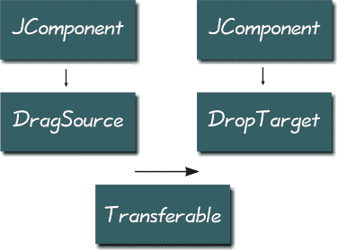
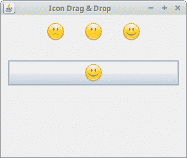

# 在 Swing 中拖放

> 原文： [http://zetcode.com/tutorials/javaswingtutorial/draganddrop/](http://zetcode.com/tutorials/javaswingtutorial/draganddrop/)

在计算机图形用户界面中，拖放是单击虚拟对象并将其拖动到其他位置或另一个虚拟对象上的动作（或支持以下动作）。 通常，它可用于调用多种动作，或在两个抽象对象之间创建各种类型的关联。

[Tweet](https://twitter.com/share) 

## 拖放

拖放操作使用户可以直观地完成复杂的事情。

通常，我们可以拖放两件事：数据或某些图形对象。 如果将图像从一个应用拖到另一个应用，则会拖放二进制数据。 如果我们在 Firefox 中拖动选项卡并将其移动到另一个位置，则将拖放图形组件。



Figure: Drag and drop in Swing

开始拖动操作的组件必须注册一个`DragSource`对象。 `DropTarget`是负责在拖放操作中接受拖放的对象。 `Transferable`封装正在传输的数据。 传输的数据可以是各种类型。 `DataFlavor`对象提供有关正在传输的数据的信息。

几个 Swing 组件已经内置了对拖放操作的支持。 在这种情况下，我们使用`TransferHandler`来管理拖放功能。 在没有内置支持的情况下，我们必须从头开始创建所有内容。

## Swing 文本拖放示例

我们将演示一个简单的拖放示例。 我们将使用内置的拖放支持。 我们利用了`TransferHandler`类。

`SimpeDnD.java`

```
package com.zetcode;

import javax.swing.GroupLayout;
import javax.swing.JButton;
import javax.swing.JComponent;
import javax.swing.JFrame;
import javax.swing.JTextField;
import javax.swing.TransferHandler;
import java.awt.EventQueue;

public class SimpleDnD extends JFrame {

    private JTextField field;
    private JButton button;

    public SimpleDnD() {

        initUI();
    }

    private void initUI() {

        setTitle("Simple Drag & Drop");

        button = new JButton("Button");
        field = new JTextField(15);

        field.setDragEnabled(true);
        button.setTransferHandler(new TransferHandler("text"));

        createLayout(field, button);

        setDefaultCloseOperation(JFrame.EXIT_ON_CLOSE);
        setLocationRelativeTo(null);
    }

    private void createLayout(JComponent... arg) {

        var pane = getContentPane();
        var gl = new GroupLayout(pane);
        pane.setLayout(gl);

        gl.setAutoCreateContainerGaps(true);
        gl.setAutoCreateGaps(true);

        gl.setHorizontalGroup(gl.createSequentialGroup()
                .addComponent(arg[0])
                .addComponent(arg[1])
        );

        gl.setVerticalGroup(gl.createParallelGroup(GroupLayout.Alignment.BASELINE)
                .addComponent(arg[0])
                .addComponent(arg[1])
        );

        pack();
    }

    public static void main(String[] args) {

        EventQueue.invokeLater(() -> {

            var ex = new SimpleDnD();
            ex.setVisible(true);
        });
    }
}

```

在我们的示例中，我们有一个文本字段和一个按钮。 我们可以将文本从字段中拖放到按钮上。

```
field.setDragEnabled(true);

```

文本字段具有内置的拖动支持。 我们必须启用它。

```
button.setTransferHandler(new TransferHandler("text"));

```

`TransferHandler`是负责在组件之间传输数据的类。 构造函数将属性名称作为参数。

## Swing 图标拖放

一些 Java Swing 组件没有内置的拖动支持。 `JLabel`组件就是这样的组件。 我们必须自己编写拖动功能。

以下示例显示了如何拖放图标。 在前面的示例中，我们使用了 text 属性。 这次我们使用 icon 属性。

`IconDnD.java`

```
package com.zetcode;

import javax.swing.GroupLayout;
import javax.swing.ImageIcon;
import javax.swing.JButton;
import javax.swing.JComponent;
import javax.swing.JFrame;
import javax.swing.JLabel;
import javax.swing.TransferHandler;
import java.awt.EventQueue;
import java.awt.event.MouseAdapter;
import java.awt.event.MouseEvent;

public class IconDnD extends JFrame {

    public IconDnD() {

        initUI();
    }

    private void initUI() {

        var icon1 = new ImageIcon("src/resources/sad.png");
        var icon2 = new ImageIcon("src/resources/plain.png");
        var icon3 = new ImageIcon("src/resources/smile.png");

        var label1 = new JLabel(icon1, JLabel.CENTER);
        var label2 = new JLabel(icon2, JLabel.CENTER);
        var label3 = new JLabel(icon3, JLabel.CENTER);

        var listener = new DragMouseAdapter();
        label1.addMouseListener(listener);
        label2.addMouseListener(listener);
        label3.addMouseListener(listener);

        var button = new JButton(icon2);
        button.setFocusable(false);

        label1.setTransferHandler(new TransferHandler("icon"));
        label2.setTransferHandler(new TransferHandler("icon"));
        label3.setTransferHandler(new TransferHandler("icon"));
        button.setTransferHandler(new TransferHandler("icon"));

        createLayout(label1, label2, label3, button);

        setTitle("Icon Drag & Drop");
        setDefaultCloseOperation(JFrame.EXIT_ON_CLOSE);
        setLocationRelativeTo(null);
    }

    private class DragMouseAdapter extends MouseAdapter {

        public void mousePressed(MouseEvent e) {

            var c = (JComponent) e.getSource();
            var handler = c.getTransferHandler();
            handler.exportAsDrag(c, e, TransferHandler.COPY);
        }
    }

    private void createLayout(JComponent... arg) {

        var pane = getContentPane();
        var gl = new GroupLayout(pane);
        pane.setLayout(gl);

        gl.setAutoCreateContainerGaps(true);
        gl.setAutoCreateGaps(true);

        gl.setHorizontalGroup(gl.createParallelGroup(GroupLayout.Alignment.CENTER)
                .addGroup(gl.createSequentialGroup()
                        .addComponent(arg[0])
                        .addGap(30)
                        .addComponent(arg[1])
                        .addGap(30)
                        .addComponent(arg[2])
                )
                .addComponent(arg[3], GroupLayout.DEFAULT_SIZE,
                        GroupLayout.DEFAULT_SIZE, Integer.MAX_VALUE)
        );

        gl.setVerticalGroup(gl.createSequentialGroup()
                .addGroup(gl.createParallelGroup()
                        .addComponent(arg[0])
                        .addComponent(arg[1])
                        .addComponent(arg[2]))
                .addGap(30)
                .addComponent(arg[3])
        );

        pack();
    }

    public static void main(String[] args) {

        EventQueue.invokeLater(() -> {

            var ex = new IconDnD();
            ex.setVisible(true);
        });
    }
}

```

在代码示例中，我们有两个标签和一个按钮。 每个组件都显示一个图标。 这两个标签启用拖动手势，按钮接受放置手势。

```
label1.setTransferHandler(new TransferHandler("icon"));
label2.setTransferHandler(new TransferHandler("icon"));
label3.setTransferHandler(new TransferHandler("icon"));

```

默认情况下，标签的拖动支持未启用。 我们为这两个标签注册了一个自定义鼠标适配器。

```
label1.setTransferHandler(new TransferHandler("icon"));
label2.setTransferHandler(new TransferHandler("icon"));
label3.setTransferHandler(new TransferHandler("icon"));
button.setTransferHandler(new TransferHandler("icon"));

```

每个组件都有一个用于图标属性的`TransferHandler`类。 拖动源和拖动目标也需要`TransferHandler`。

```
var c = (JComponent) e.getSource();
var handler = c.getTransferHandler();
handler.exportAsDrag(c, e, TransferHandler.COPY);

```

这些代码行启动拖动支持。 我们得到了拖动源。 在我们的例子中，它是一个标签实例。 我们获取其传输处理程序对象，并最终通过`exportAsDrag()`方法调用来启动拖动支持。



Figure: Icon drag & drop example

## Swing `JList`放置示例

某些组件没有默认的放置支持。 其中之一是`JList`。 这是有充分的理由的。 我们不知道是将数据插入一行，还是插入两行或更多行。 因此，我们必须手动实现对列表组件的拖放支持。

下面的示例将逗号或空格分隔的文本插入`JList`组件的行中。 否则，文本将进入一行。

`ListDnD.java`

```
package com.zetcode;

import javax.swing.DefaultListModel;
import javax.swing.DropMode;
import javax.swing.GroupLayout;
import javax.swing.JComponent;
import javax.swing.JFrame;
import javax.swing.JList;
import javax.swing.JScrollPane;
import javax.swing.JTextField;
import javax.swing.ListSelectionModel;
import javax.swing.TransferHandler;
import java.awt.Dimension;
import java.awt.EventQueue;
import java.awt.datatransfer.DataFlavor;

public class ListDnD extends JFrame {

    private JTextField field;
    private DefaultListModel model;

    public ListDnD() {

        initUI();
    }

    private void initUI() {

        var scrollPane = new JScrollPane();
        scrollPane.setPreferredSize(new Dimension(180, 150));

        model = new DefaultListModel();
        var myList = new JList(model);

        myList.setDropMode(DropMode.INSERT);
        myList.setSelectionMode(ListSelectionModel.SINGLE_SELECTION);
        myList.setTransferHandler(new ListHandler());

        field = new JTextField(15);
        field.setDragEnabled(true);

        scrollPane.getViewport().add(myList);

        createLayout(field, scrollPane);

        setTitle("ListDrop");
        setDefaultCloseOperation(JFrame.EXIT_ON_CLOSE);
        setLocationRelativeTo(null);
    }

    private class ListHandler extends TransferHandler {

        public boolean canImport(TransferSupport support) {

            if (!support.isDrop()) {
                return false;
            }

            return support.isDataFlavorSupported(DataFlavor.stringFlavor);
        }

        public boolean importData(TransferSupport support) {

            if (!canImport(support)) {
                return false;
            }

            var transferable = support.getTransferable();
            String line;

            try {
                line = (String) transferable.getTransferData(DataFlavor.stringFlavor);
            } catch (Exception e) {
                return false;
            }

            var dl = (JList.DropLocation) support.getDropLocation();
            int index = dl.getIndex();

            String[] data = line.split("[,\\s]");

            for (String item : data) {

                if (!item.isEmpty())
                    model.add(index++, item.trim());
            }

            return true;
        }
    }

    private void createLayout(JComponent... arg) {

        var pane = getContentPane();
        var gl = new GroupLayout(pane);
        pane.setLayout(gl);

        gl.setAutoCreateContainerGaps(true);
        gl.setAutoCreateGaps(true);

        gl.setHorizontalGroup(gl.createSequentialGroup()
                .addComponent(arg[0])
                .addComponent(arg[1])
        );

        gl.setVerticalGroup(gl.createParallelGroup(GroupLayout.Alignment.BASELINE)
                .addComponent(arg[0])
                .addComponent(arg[1])
        );

        pack();
    }

    public static void main(String[] args) {
        EventQueue.invokeLater(() -> {

            var ex = new ListDnD();
            ex.setVisible(true);
        });
    }
}

```

在示例中，我们有一个文本字段和一个列表组件。 可以将文本字段中的文本拖放到列表中。 如果文本用逗号或空格字符逗号分隔，则单词将分成几行。 如果不是，则将文本插入一行。

```
myList.setDropMode(DropMode.INSERT);

```

在这里，我们指定放置模式。 `DropMode.INSERT`指定我们将要在列表组件中插入新项目。 如果选择`DropMode.INSERT`，则将新项目拖放到现有项目上。

```
myList.setTransferHandler(new ListHandler());

```

我们设置了一个自定义的传输处理程序类。

```
field.setDragEnabled(true);

```

我们为文本字段组件启用了拖动支持。

```
public boolean canImport(TransferSupport support) {

    if (!support.isDrop()) {
        return false;
    }

    return support.isDataFlavorSupported(DataFlavor.stringFlavor);
}

```

此方法测试放置操作的适用性。 我们过滤掉剪贴板粘贴操作，仅允许字符串放置操作。 如果该方法返回 false，则取消放置操作。

```
public boolean importData(TransferSupport support) {
...
}

```

`importData()`方法将数据从剪贴板或拖放操作传输到放置位置。

```
var transferable = support.getTransferable();

```

`Transferable`是数据捆绑在一起的类。

```
line = (String) transferable.getTransferData(DataFlavor.stringFlavor);

```

我们检索我们的数据。

```
var dl = (JList.DropLocation) support.getDropLocation();
int index = dl.getIndex();

```

我们得到该列表的放置位置。 我们检索将在其中插入数据的索引。

```
String[] data = line.split("[,\\s]");

for (String item : data) {

    if (!item.isEmpty())
        model.add(index++, item.trim());
}

```

我们将文本分为几部分，然后将其插入一行或多行中。


Figure: JList drop example

前面的示例使用了具有内置拖放支持的组件。 接下来，我们将从头开始创建拖放功能。

## Swing 拖动手势

在以下示例中，我们检查了一个简单的拖动手势。 我们处理创建拖动手势所需的几个类。 A `DragSource`，`DragGestureEvent`，`DragGestureListener`和`Transferable`。

`DragGesture.java`

```
package com.zetcode;

import javax.swing.GroupLayout;
import javax.swing.JComponent;
import javax.swing.JFrame;
import javax.swing.JPanel;
import java.awt.Color;
import java.awt.Cursor;
import java.awt.Dimension;
import java.awt.EventQueue;
import java.awt.datatransfer.DataFlavor;
import java.awt.datatransfer.Transferable;
import java.awt.dnd.DnDConstants;
import java.awt.dnd.DragGestureEvent;
import java.awt.dnd.DragGestureListener;
import java.awt.dnd.DragSource;

public class DragGesture extends JFrame implements
        DragGestureListener, Transferable {

    public DragGesture() {

        initUI();
    }

    private void initUI() {

        var redPanel = new JPanel();
        redPanel.setBackground(Color.red);
        redPanel.setPreferredSize(new Dimension(120, 120));

        var ds = new DragSource();

        ds.createDefaultDragGestureRecognizer(redPanel,
                DnDConstants.ACTION_COPY, this);

        createLayout(redPanel);

        setTitle("Drag Gesture");
        setDefaultCloseOperation(JFrame.EXIT_ON_CLOSE);
        setLocationRelativeTo(null);
    }

    public void dragGestureRecognized(DragGestureEvent event) {

        var cursor = Cursor.getDefaultCursor();

        if (event.getDragAction() == DnDConstants.ACTION_COPY) {

            cursor = DragSource.DefaultCopyDrop;
        }

        event.startDrag(cursor, this);
    }

    public Object getTransferData(DataFlavor flavor) {

        return null;
    }

    public DataFlavor[] getTransferDataFlavors() {

        return new DataFlavor[0];
    }

    public boolean isDataFlavorSupported(DataFlavor flavor) {

        return false;
    }

    private void createLayout(JComponent... arg) {

        var pane = getContentPane();
        var gl = new GroupLayout(pane);
        pane.setLayout(gl);

        gl.setAutoCreateContainerGaps(true);
        gl.setAutoCreateGaps(true);

        gl.setHorizontalGroup(gl.createSequentialGroup()
                .addGap(50)
                .addComponent(arg[0])
                .addGap(50)
        );

        gl.setVerticalGroup(gl.createSequentialGroup()
                .addGap(50)
                .addComponent(arg[0])
                .addGap(50)
        );

        pack();
    }

    public static void main(String[] args) {

        EventQueue.invokeLater(() -> {

            var ex = new DragGesture();
            ex.setVisible(true);
        });
    }
}

```

这个简单的示例演示了拖动手势。 当我们单击组件并在按下按钮时移动鼠标指针时，将创建拖动手势。 该示例说明了如何为组件创建`DragSource`。

```
public class DragGesture extends JFrame implements 
   DragGestureListener, Transferable {

```

`DragGesture`实现两个接口。 `DragGestureListener`监听拖动手势。 `Transferable`处理用于传输操作的数据。 在该示例中，我们将不会传输任何数据； 我们仅演示拖动手势。 `Transferable`界面的三种必要方法未实现。

```
var ds = new DragSource();

ds.createDefaultDragGestureRecognizer(redPanel,
        DnDConstants.ACTION_COPY, this);

```

在这里，我们创建一个`DragSource`对象并将其注册到面板。 `DragSource`是负责启动拖放操作的实体。 `createDefaultDragGestureRecognizer()`将拖动源和`DragGestureListener`与特定组件相关联。

```
public void dragGestureRecognized(DragGestureEvent event) {

}

```

`dragGestureRecognized()`方法响应拖动手势。

```
var cursor = Cursor.getDefaultCursor();

if (event.getDragAction() == DnDConstants.ACTION_COPY) {
    cursor = DragSource.DefaultCopyDrop;
}

event.startDrag(cursor, this);

```

`DragGestureEvent`的`startDrag()`方法最终开始拖动操作。 我们指定两个参数：游标类型和`Transferable`对象。

```
public Object getTransferData(DataFlavor flavor) {

    return null;
}

public DataFlavor[] getTransferDataFlavors() {

    return new DataFlavor[0];
}

public boolean isDataFlavorSupported(DataFlavor flavor) {

    return false;
}

```

实现`Transferable`接口的对象必须实现这三种方法。 还没有功能。

## 一个复杂的拖放示例

在下面的示例中，我们创建一个复杂的拖放示例。 我们创建拖动源，放置目标和可移动对象。

`ComplexDnD.java`

```
package com.zetcode;

import javax.swing.GroupLayout;
import javax.swing.JButton;
import javax.swing.JColorChooser;
import javax.swing.JComponent;
import javax.swing.JFrame;
import javax.swing.JPanel;
import java.awt.Color;
import java.awt.Cursor;
import java.awt.Dimension;
import java.awt.EventQueue;
import java.awt.datatransfer.DataFlavor;
import java.awt.datatransfer.Transferable;
import java.awt.datatransfer.UnsupportedFlavorException;
import java.awt.dnd.DnDConstants;
import java.awt.dnd.DragGestureEvent;
import java.awt.dnd.DragGestureListener;
import java.awt.dnd.DragSource;
import java.awt.dnd.DropTarget;
import java.awt.dnd.DropTargetAdapter;
import java.awt.dnd.DropTargetDropEvent;

public class ComplexDnD extends JFrame
        implements DragGestureListener {

    private JPanel leftPanel;

    public ComplexDnD() {

        initUI();
    }

    private void initUI() {

        var colourBtn = new JButton("Choose Color");
        colourBtn.setFocusable(false);

        leftPanel = new JPanel();
        leftPanel.setBackground(Color.red);
        leftPanel.setPreferredSize(new Dimension(100, 100));

        colourBtn.addActionListener(event -> {

            var color = JColorChooser.showDialog(this, "Choose Color", Color.white);
            leftPanel.setBackground(color);
        });

        var rightPanel = new JPanel();
        rightPanel.setBackground(Color.white);
        rightPanel.setPreferredSize(new Dimension(100, 100));

        var mtl = new MyDropTargetListener(rightPanel);

        var ds = new DragSource();
        ds.createDefaultDragGestureRecognizer(leftPanel,
                DnDConstants.ACTION_COPY, this);

        createLayout(colourBtn, leftPanel, rightPanel);

        setTitle("Complex drag and drop example");
        setDefaultCloseOperation(JFrame.EXIT_ON_CLOSE);
        setLocationRelativeTo(null);
    }

    public void dragGestureRecognized(DragGestureEvent event) {

        var cursor = Cursor.getDefaultCursor();
        var panel = (JPanel) event.getComponent();

        var color = panel.getBackground();

        if (event.getDragAction() == DnDConstants.ACTION_COPY) {
            cursor = DragSource.DefaultCopyDrop;
        }

        event.startDrag(cursor, new TransferableColor(color));
    }

    private class MyDropTargetListener extends DropTargetAdapter {

        private final DropTarget dropTarget;
        private final JPanel panel;

        public MyDropTargetListener(JPanel panel) {
            this.panel = panel;

            dropTarget = new DropTarget(panel, DnDConstants.ACTION_COPY,
                    this, true, null);
        }

        public void drop(DropTargetDropEvent event) {

            try {

                var tr = event.getTransferable();
                var col = (Color) tr.getTransferData(TransferableColor.colorFlavor);

                if (event.isDataFlavorSupported(TransferableColor.colorFlavor)) {

                    event.acceptDrop(DnDConstants.ACTION_COPY);
                    this.panel.setBackground(col);
                    event.dropComplete(true);
                    return;
                }

                event.rejectDrop();
            } catch (Exception e) {

                e.printStackTrace();
                event.rejectDrop();
            }
        }
    }

    private void createLayout(JComponent... arg) {

        var pane = getContentPane();
        var gl = new GroupLayout(pane);
        pane.setLayout(gl);

        gl.setAutoCreateContainerGaps(true);
        gl.setAutoCreateGaps(true);

        gl.setHorizontalGroup(gl.createSequentialGroup()
                .addComponent(arg[0])
                .addGap(30)
                .addComponent(arg[1])
                .addGap(30)
                .addComponent(arg[2])
        );

        gl.setVerticalGroup(gl.createParallelGroup()
                .addComponent(arg[0])
                .addComponent(arg[1])
                .addComponent(arg[2])
        );

        pack();
    }

    public static void main(String[] args) {

        EventQueue.invokeLater(() -> {

            var ex = new ComplexDnD();
            ex.setVisible(true);
        });
    }
}

class TransferableColor implements Transferable {

    protected static final DataFlavor colorFlavor =
            new DataFlavor(Color.class, "A Color Object");

    protected static final DataFlavor[] supportedFlavors = {
            colorFlavor,
            DataFlavor.stringFlavor,
    };

    private final Color color;

    public TransferableColor(Color color) {

        this.color = color;
    }

    public DataFlavor[] getTransferDataFlavors() {

        return supportedFlavors;
    }

    public boolean isDataFlavorSupported(DataFlavor flavor) {

        return flavor.equals(colorFlavor) ||
                flavor.equals(DataFlavor.stringFlavor);
    }

    public Object getTransferData(DataFlavor flavor)
            throws UnsupportedFlavorException {

        if (flavor.equals(colorFlavor)) {
            return color;
        } else if (flavor.equals(DataFlavor.stringFlavor)) {
            return color.toString();
        } else {
            throw new UnsupportedFlavorException(flavor);
        }
    }
}

```

该代码示例显示一个按钮和两个面板。 该按钮显示一个颜色选择器对话框，并为第一个面板设置颜色。 可以将颜色拖到第二个面板中。

此示例增强了前一个示例。 我们将添加放置目标和自定义可转移对象。

```
var mtl = new MyDropTargetListener(rightPanel);

```

我们在右侧面板中注册放置目标监听器。

```
event.startDrag(cursor, new TransferableColor(color));

```

`startDrag()`方法具有两个参数。 游标和`Transferable`对象。

```
public MyDropTargetListener(JPanel panel) {
    this.panel = panel;

    dropTarget = new DropTarget(panel, DnDConstants.ACTION_COPY, 
        this, true, null);
}

```

在`MyDropTargetListener`中，我们创建一个放置目标对象。

```
var tr = event.getTransferable();
var col = (Color) tr.getTransferData(TransferableColor.colorFlavor);

if (event.isDataFlavorSupported(TransferableColor.colorFlavor)) {

    event.acceptDrop(DnDConstants.ACTION_COPY);
    this.panel.setBackground(color);
    event.dropComplete(true);
    return;
}

```

我们得到正在传输的数据。 在我们的情况下，它是一个颜色对象。 在这里，我们设置右侧面板的颜色。

```
event.rejectDrop();

```

如果不满足拖放操作的条件，我们将拒绝它。

```
protected static DataFlavor colorFlavor =
    new DataFlavor(Color.class, "A Color Object");

```

在`TransferableColor`中，我们创建一个新的`DataFlavor`对象。

```
protected static DataFlavor[] supportedFlavors = {
    colorFlavor,
    DataFlavor.stringFlavor,
};

```

在这里，我们指定了我们支持的数据类型。 在我们的情况下，这是一个自定义的颜色味道和预定义的`DataFlavor.stringFlavor`。

```
public Object getTransferData(DataFlavor flavor)
        throws UnsupportedFlavorException {

    if (flavor.equals(colorFlavor)) {
        return color;
    } else if (flavor.equals(DataFlavor.stringFlavor)) {
        return color.toString();
    } else {
        throw new UnsupportedFlavorException(flavor);
    }
}

```

`getTransferData()`返回一个具有特定数据风味的对象。

Java Swing 教程的这一部分专门用于 Swing 的拖放操作。