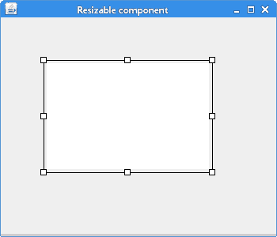

# Java Swing 中的可调整大小的组件

> 原文： [http://zetcode.com/tutorials/javaswingtutorial/resizablecomponent/](http://zetcode.com/tutorials/javaswingtutorial/resizablecomponent/)

在 Java Swing 教程的这一部分中，我们将创建一个可调整大小的组件。

## 可调整大小的组件

在创建图表时，经常使用可调整大小的组件。 常见的可调整大小的组件是电子表格应用中的图表。 可以将图表移到应用的表格小部件上并调整大小。

[Tweet](https://twitter.com/share) 

为了创建可以在面板上自由拖动的组件，我们使用启用了绝对定位的面板。 在我们的示例中，我们将创建一个可以在父窗口上自由移动并调整大小的组件。

当可调整大小的组件具有焦点时，将在其可调整大小的组件的边框上绘制八个小矩形。 矩形用作拖动点，我们可以在其中绘制组件并开始调整大小。

`ResizableComponentEx.java`

```java
package com.zetcode;

import java.awt.Color;
import java.awt.EventQueue;
import java.awt.event.MouseAdapter;
import java.awt.event.MouseEvent;
import javax.swing.JFrame;
import javax.swing.JPanel;

public class ResizableComponentEx extends JFrame {

    private Resizable res;

    public ResizableComponentEx() {

        initUI();
    }

    private void initUI() {

        var pnl = new JPanel(null);
        add(pnl);

        var area = new JPanel();
        area.setBackground(Color.white);

        res = new Resizable(area);
        res.setBounds(50, 50, 200, 150);
        pnl.add(res);

        addMouseListener(new MouseAdapter() {
            @Override
            public void mousePressed(MouseEvent me) {

                requestFocus();
                res.repaint();
            }
        });

        setSize(350, 300);
        setTitle("Resizable component");
        setLocationRelativeTo(null);
        setDefaultCloseOperation(JFrame.EXIT_ON_CLOSE);
    }

    public static void main(String[] args) {

        EventQueue.invokeLater(() -> {

            var ex = new ResizableComponentEx();
            ex.setVisible(true);
        });
    }
}

```

`ResizableComponentEx`设置面板和组件。

```java
var pnl = new JPanel(null);

```

我们对可调整大小的组件使用绝对定位。 通过将`null`提供给`JPanel`的构造器，我们创建了具有绝对定位的面板。

```java
addMouseListener(new MouseAdapter() {
    @Override
    public void mousePressed(MouseEvent me) {

        requestFocus();
        res.repaint();
    }
});

```

如果我们在父面板上（即在可调整大小的组件外部）按下，我们将抓住焦点并重新绘制该组件。 边框上的矩形将消失。

`ResizableBorder.java`

```java
package com.zetcode;

import java.awt.Color;
import java.awt.Component;
import java.awt.Cursor;
import java.awt.Graphics;
import java.awt.Insets;
import java.awt.Rectangle;
import java.awt.event.MouseEvent;
import javax.swing.SwingConstants;
import javax.swing.border.Border;

public class ResizableBorder implements Border {

    private int dist = 8;

    int locations[] = {
            SwingConstants.NORTH, SwingConstants.SOUTH, SwingConstants.WEST,
            SwingConstants.EAST, SwingConstants.NORTH_WEST,
            SwingConstants.NORTH_EAST, SwingConstants.SOUTH_WEST,
            SwingConstants.SOUTH_EAST
    };

    int cursors[] = {
            Cursor.N_RESIZE_CURSOR, Cursor.S_RESIZE_CURSOR, Cursor.W_RESIZE_CURSOR,
            Cursor.E_RESIZE_CURSOR, Cursor.NW_RESIZE_CURSOR, Cursor.NE_RESIZE_CURSOR,
            Cursor.SW_RESIZE_CURSOR, Cursor.SE_RESIZE_CURSOR
    };

    public ResizableBorder(int dist) {
        this.dist = dist;
    }

    @Override
    public Insets getBorderInsets(Component component) {
        return new Insets(dist, dist, dist, dist);
    }

    @Override
    public boolean isBorderOpaque() {
        return false;
    }

    @Override
    public void paintBorder(Component component, Graphics g, int x, int y,
                            int w, int h) {

        g.setColor(Color.black);
        g.drawRect(x + dist / 2, y + dist / 2, w - dist, h - dist);

        if (component.hasFocus()) {

            for (int i = 0; i < locations.length; i++) {

                var rect = getRectangle(x, y, w, h, locations[i]);

                g.setColor(Color.WHITE);
                g.fillRect(rect.x, rect.y, rect.width - 1, rect.height - 1);
                g.setColor(Color.BLACK);
                g.drawRect(rect.x, rect.y, rect.width - 1, rect.height - 1);
            }
        }
    }

    private Rectangle getRectangle(int x, int y, int w, int h, int location) {

        switch (location) {

            case SwingConstants.NORTH:
                return new Rectangle(x + w / 2 - dist / 2, y, dist, dist);

            case SwingConstants.SOUTH:
                return new Rectangle(x + w / 2 - dist / 2, y + h - dist, dist, dist);

            case SwingConstants.WEST:
                return new Rectangle(x, y + h / 2 - dist / 2, dist, dist);

            case SwingConstants.EAST:
                return new Rectangle(x + w - dist, y + h / 2 - dist / 2, dist, dist);

            case SwingConstants.NORTH_WEST:
                return new Rectangle(x, y, dist, dist);

            case SwingConstants.NORTH_EAST:
                return new Rectangle(x + w - dist, y, dist, dist);

            case SwingConstants.SOUTH_WEST:
                return new Rectangle(x, y + h - dist, dist, dist);

            case SwingConstants.SOUTH_EAST:
                return new Rectangle(x + w - dist, y + h - dist, dist, dist);
        }
        return null;
    }

    public int getCursor(MouseEvent me) {

        var c = me.getComponent();
        int w = c.getWidth();
        int h = c.getHeight();

        for (int i = 0; i < locations.length; i++) {

            var rect = getRectangle(0, 0, w, h, locations[i]);

            if (rect.contains(me.getPoint())) {
                return cursors[i];
            }
        }

        return Cursor.MOVE_CURSOR;
    }
}

```

`ResizableBorder`负责绘制组件的边框并确定要使用的光标的类型。

```java
int locations[] = {
    SwingConstants.NORTH, SwingConstants.SOUTH, SwingConstants.WEST,
    SwingConstants.EAST, SwingConstants.NORTH_WEST,
    SwingConstants.NORTH_EAST, SwingConstants.SOUTH_WEST,
    SwingConstants.SOUTH_EAST
};

```

这些是绘制矩形的位置。 这些位置也是抓取点，可以在其中抓取组件并调整其大小。

```java
g.setColor(Color.black);
g.drawRect(x + dist / 2, y + dist / 2, w - dist, h - dist);

```

在`paintBorder()`方法中，我们绘制了可调整大小组件的边框。 上面的代码绘制了组件的外边界。

```java
if (component.hasFocus()) {

    for (int i = 0; i < locations.length; i++) {

        var rect = getRectangle(x, y, w, h, locations[i]);

        g.setColor(Color.WHITE);
        g.fillRect(rect.x, rect.y, rect.width - 1, rect.height - 1);
        g.setColor(Color.BLACK);
        g.drawRect(rect.x, rect.y, rect.width - 1, rect.height - 1);
    }
}

```

仅当可调整大小的组件当前具有焦点时才绘制八个矩形。

```java
private Rectangle getRectangle(int x, int y, int w, int h, int location) {

    switch (location) {

        case SwingConstants.NORTH:
            return new Rectangle(x + w / 2 - dist / 2, y, dist, dist);

        case SwingConstants.SOUTH:
            return new Rectangle(x + w / 2 - dist / 2, y + h - dist, dist, dist);
...
}

```

`getRectangle()`方法返回矩形的坐标。

```java
public int getCursor(MouseEvent me) {

    var c = me.getComponent();
    int w = c.getWidth();
    int h = c.getHeight();

    for (int i = 0; i < locations.length; i++) {

        var rect = getRectangle(0, 0, w, h, locations[i]);

        if (rect.contains(me.getPoint())) {
            return cursors[i];
        }
    }

    return Cursor.MOVE_CURSOR;
}

```

`getCursor()`方法获取相关抓点的光标类型。

`Resizable.java`

```java
package com.zetcode;

import javax.swing.JComponent;
import javax.swing.event.MouseInputAdapter;
import javax.swing.event.MouseInputListener;
import java.awt.BorderLayout;
import java.awt.Component;
import java.awt.Cursor;
import java.awt.Point;
import java.awt.event.MouseEvent;

public class Resizable extends JComponent {

    public Resizable(Component comp) {
        this(comp, new ResizableBorder(8));
    }

    public Resizable(Component comp, ResizableBorder border) {

        setLayout(new BorderLayout());
        add(comp);
        addMouseListener(resizeListener);
        addMouseMotionListener(resizeListener);
        setBorder(border);
    }

    private void resize() {

        if (getParent() != null) {
            getParent().revalidate();
        }
    }

    MouseInputListener resizeListener = new MouseInputAdapter() {

        @Override
        public void mouseMoved(MouseEvent me) {

            if (hasFocus()) {

                var resizableBorder = (ResizableBorder) getBorder();
                setCursor(Cursor.getPredefinedCursor(resizableBorder.getCursor(me)));
            }
        }

        @Override
        public void mouseExited(MouseEvent mouseEvent) {
            setCursor(Cursor.getDefaultCursor());
        }

        private int cursor;
        private Point startPos = null;

        @Override
        public void mousePressed(MouseEvent me) {

            var resizableBorder = (ResizableBorder) getBorder();
            cursor = resizableBorder.getCursor(me);
            startPos = me.getPoint();

            requestFocus();
            repaint();
        }

        @Override
        public void mouseDragged(MouseEvent me) {

            if (startPos != null) {

                int x = getX();
                int y = getY();
                int w = getWidth();
                int h = getHeight();

                int dx = me.getX() - startPos.x;
                int dy = me.getY() - startPos.y;

                switch (cursor) {

                    case Cursor.N_RESIZE_CURSOR:

                        if (!(h - dy < 50)) {
                            setBounds(x, y + dy, w, h - dy);
                            resize();
                        }
                        break;

                    case Cursor.S_RESIZE_CURSOR:

                        if (!(h + dy < 50)) {
                            setBounds(x, y, w, h + dy);
                            startPos = me.getPoint();
                            resize();
                        }
                        break;

                    case Cursor.W_RESIZE_CURSOR:

                        if (!(w - dx < 50)) {
                            setBounds(x + dx, y, w - dx, h);
                            resize();
                        }
                        break;

                    case Cursor.E_RESIZE_CURSOR:

                        if (!(w + dx < 50)) {
                            setBounds(x, y, w + dx, h);
                            startPos = me.getPoint();
                            resize();
                        }
                        break;

                    case Cursor.NW_RESIZE_CURSOR:
                        if (!(w - dx < 50) && !(h - dy < 50)) {
                            setBounds(x + dx, y + dy, w - dx, h - dy);
                            resize();
                        }
                        break;

                    case Cursor.NE_RESIZE_CURSOR:

                        if (!(w + dx < 50) && !(h - dy < 50)) {
                            setBounds(x, y + dy, w + dx, h - dy);
                            startPos = new Point(me.getX(), startPos.y);
                            resize();
                        }
                        break;

                    case Cursor.SW_RESIZE_CURSOR:

                        if (!(w - dx < 50) && !(h + dy < 50)) {
                            setBounds(x + dx, y, w - dx, h + dy);
                            startPos = new Point(startPos.x, me.getY());
                            resize();
                        }
                        break;

                    case Cursor.SE_RESIZE_CURSOR:

                        if (!(w + dx < 50) && !(h + dy < 50)) {
                            setBounds(x, y, w + dx, h + dy);
                            startPos = me.getPoint();
                            resize();
                        }
                        break;

                    case Cursor.MOVE_CURSOR:

                        var bounds = getBounds();
                        bounds.translate(dx, dy);
                        setBounds(bounds);
                        resize();
                }

                setCursor(Cursor.getPredefinedCursor(cursor));
            }
        }

        @Override
        public void mouseReleased(MouseEvent mouseEvent) {
            startPos = null;
        }
    };
}

```

`Resizable`类表示正在调整大小并在窗口上移动的组件。

```java
private void resize() {

    if (getParent() != null) {
        getParent().revalidate();
    }
}

```

调整组件大小后，将调用`resize()`方法。 `revalidate()`方法导致重画组件。

```java
MouseInputListener resizeListener = new MouseInputAdapter() {

    @Override
    public void mouseMoved(MouseEvent me) {

        if (hasFocus()) {

            var border = (ResizableBorder) getBorder();
            setCursor(Cursor.getPredefinedCursor(border.getCursor(me)));
        }
    }
...
}

```

当我们将光标悬停在抓取点上时，我们将更改光标类型。 仅当组件具有焦点时，光标类型才会更改。

```java
@Override
public void mousePressed(MouseEvent me) {

    var resizableBorder = (ResizableBorder) getBorder();
    cursor = resizableBorder.getCursor(me);
    startPos = me.getPoint();

    requestFocus();
    repaint();
}

```

如果单击可调整大小的组件，则将更改光标，获得拖动的起点，将焦点放在该组件上，然后重新绘制它。

```java
int x = getX();
int y = getY();
int w = getWidth();
int h = getHeight();

int dx = me.getX() - startPos.x;
int dy = me.getY() - startPos.y;

```

在`mouseDragged()`方法中，我们确定光标的 x 和 y 坐标以及组件的宽度和高度。 我们计算鼠标拖动事件期间的距离。

```java
case Cursor.N_RESIZE_CURSOR:

    if (!(h - dy < 50)) {
        setBounds(x, y + dy, w, h - dy);
        resize();
    }
    break;

```

对于所有大小调整，我们确保该组件不小于 50px。 否则，我们可以将其减小到最终将其隐藏的程度。 `setBounds()`方法重新定位组件并调整其大小。



图：可调整大小的组件

在 Java Swing 教程的这一部分中，我们创建了一个可调整大小的组件。