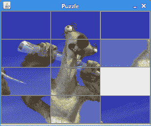

# Java Swing 中的益智游戏

> 原文： [http://zetcode.com/tutorials/javaswingtutorial/puzzle/](http://zetcode.com/tutorials/javaswingtutorial/puzzle/)

在本章中，我们将使用 Java Swing 创建一个简单的益智游戏。 来源可从作者的 Github [仓库](https://github.com/janbodnar/Puzzle-game-in-Java-Swing)中获得。

[Tweet](https://twitter.com/share) 

这个小游戏的目的是形成一张图片。 通过单击包含图像的按钮来移动它们。 只能移动与空按钮相邻的按钮。

在这个游戏中，我们学习了如何将图像裁剪成多个部分。

`PuzzleEx.java`

```java
package com.zetcode;

import javax.imageio.ImageIO;
import javax.swing.AbstractAction;
import javax.swing.BorderFactory;
import javax.swing.ImageIcon;
import javax.swing.JButton;
import javax.swing.JComponent;
import javax.swing.JFrame;
import javax.swing.JOptionPane;
import javax.swing.JPanel;
import java.awt.BorderLayout;
import java.awt.Color;
import java.awt.EventQueue;
import java.awt.GridLayout;
import java.awt.Image;
import java.awt.Point;
import java.awt.event.ActionEvent;
import java.awt.event.MouseAdapter;
import java.awt.event.MouseEvent;
import java.awt.image.BufferedImage;
import java.awt.image.CropImageFilter;
import java.awt.image.FilteredImageSource;
import java.io.File;
import java.io.IOException;
import java.util.ArrayList;
import java.util.Collections;
import java.util.List;

class MyButton extends JButton {

    private boolean isLastButton;

    public MyButton() {

        super();

        initUI();
    }

    public MyButton(Image image) {

        super(new ImageIcon(image));

        initUI();
    }

    private void initUI() {

        isLastButton = false;
        BorderFactory.createLineBorder(Color.gray);

        addMouseListener(new MouseAdapter() {

            @Override
            public void mouseEntered(MouseEvent e) {
                setBorder(BorderFactory.createLineBorder(Color.yellow));
            }

            @Override
            public void mouseExited(MouseEvent e) {
                setBorder(BorderFactory.createLineBorder(Color.gray));
            }
        });
    }

    public void setLastButton() {

        isLastButton = true;
    }

    public boolean isLastButton() {

        return isLastButton;
    }
}

public class PuzzleEx extends JFrame {

    private JPanel panel;
    private BufferedImage source;
    private BufferedImage resized;
    private Image image;
    private MyButton lastButton;
    private int width, height;

    private List<MyButton> buttons;
    private List<Point> solution;

    private final int NUMBER_OF_BUTTONS = 12;
    private final int DESIRED_WIDTH = 300;

    public PuzzleEx() {

        initUI();
    }

    private void initUI() {

        solution = new ArrayList<>();

        solution.add(new Point(0, 0));
        solution.add(new Point(0, 1));
        solution.add(new Point(0, 2));
        solution.add(new Point(1, 0));
        solution.add(new Point(1, 1));
        solution.add(new Point(1, 2));
        solution.add(new Point(2, 0));
        solution.add(new Point(2, 1));
        solution.add(new Point(2, 2));
        solution.add(new Point(3, 0));
        solution.add(new Point(3, 1));
        solution.add(new Point(3, 2));

        buttons = new ArrayList<>();

        panel = new JPanel();
        panel.setBorder(BorderFactory.createLineBorder(Color.gray));
        panel.setLayout(new GridLayout(4, 3, 0, 0));

        try {
            source = loadImage();
            int h = getNewHeight(source.getWidth(), source.getHeight());
            resized = resizeImage(source, DESIRED_WIDTH, h,
                    BufferedImage.TYPE_INT_ARGB);

        } catch (IOException ex) {
            JOptionPane.showMessageDialog(this, "Could not load image", "Error",
                    JOptionPane.ERROR_MESSAGE);
        }

        width = resized.getWidth(null);
        height = resized.getHeight(null);

        add(panel, BorderLayout.CENTER);

        for (int i = 0; i < 4; i++) {

            for (int j = 0; j < 3; j++) {

                image = createImage(new FilteredImageSource(resized.getSource(),
                        new CropImageFilter(j * width / 3, i * height / 4,
                                (width / 3), height / 4)));

                var button = new MyButton(image);
                button.putClientProperty("position", new Point(i, j));

                if (i == 3 && j == 2) {

                    lastButton = new MyButton();
                    lastButton.setBorderPainted(false);
                    lastButton.setContentAreaFilled(false);
                    lastButton.setLastButton();
                    lastButton.putClientProperty("position", new Point(i, j));
                } else {

                    buttons.add(button);
                }
            }
        }

        Collections.shuffle(buttons);
        buttons.add(lastButton);

        for (int i = 0; i < NUMBER_OF_BUTTONS; i++) {

            var btn = buttons.get(i);
            panel.add(btn);
            btn.setBorder(BorderFactory.createLineBorder(Color.gray));
            btn.addActionListener(new ClickAction());
        }

        pack();

        setTitle("Puzzle");
        setResizable(false);
        setDefaultCloseOperation(JFrame.EXIT_ON_CLOSE);
        setLocationRelativeTo(null);
    }

    private int getNewHeight(int w, int h) {

        double ratio = DESIRED_WIDTH / (double) w;
        int newHeight = (int) (h * ratio);
        return newHeight;
    }

    private BufferedImage loadImage() throws IOException {

        var bimg = ImageIO.read(new File("src/resources/icesid.jpg"));

        return bimg;
    }

    private BufferedImage resizeImage(BufferedImage originalImage, int width,
                                      int height, int type) {

        var resizedImage = new BufferedImage(width, height, type);
        var g = resizedImage.createGraphics();
        g.drawImage(originalImage, 0, 0, width, height, null);
        g.dispose();

        return resizedImage;
    }

    private class ClickAction extends AbstractAction {

        @Override
        public void actionPerformed(ActionEvent e) {

            checkButton(e);
            checkSolution();
        }

        private void checkButton(ActionEvent e) {

            int lidx = 0;

            for (MyButton button : buttons) {
                if (button.isLastButton()) {
                    lidx = buttons.indexOf(button);
                }
            }

            var button = (JButton) e.getSource();
            int bidx = buttons.indexOf(button);

            if ((bidx - 1 == lidx) || (bidx + 1 == lidx)
                    || (bidx - 3 == lidx) || (bidx + 3 == lidx)) {
                Collections.swap(buttons, bidx, lidx);
                updateButtons();
            }
        }

        private void updateButtons() {

            panel.removeAll();

            for (JComponent btn : buttons) {

                panel.add(btn);
            }

            panel.validate();
        }
    }

    private void checkSolution() {

        var current = new ArrayList<Point>();

        for (JComponent btn : buttons) {
            current.add((Point) btn.getClientProperty("position"));
        }

        if (compareList(solution, current)) {
            JOptionPane.showMessageDialog(panel, "Finished",
                    "Congratulation", JOptionPane.INFORMATION_MESSAGE);
        }
    }

    public static boolean compareList(List ls1, List ls2) {

        return ls1.toString().contentEquals(ls2.toString());
    }

    public static void main(String[] args) {

        EventQueue.invokeLater(() -> {

            var puzzle = new PuzzleEx();
            puzzle.setVisible(true);
        });
    }
}

```

我们使用的是冰河世纪电影中 Sid 角色的图像。 我们缩放图像并将其切成 12 张。 这些片段由`JButton`组件使用。 最后一块没有使用； 我们有一个空按钮。 您可以下载一些相当大的图片并在游戏中使用它。

```java
addMouseListener(new MouseAdapter() {

    @Override
    public void mouseEntered(MouseEvent e) {
        setBorder(BorderFactory.createLineBorder(Color.yellow));
    }

    @Override
    public void mouseExited(MouseEvent e) {
        setBorder(BorderFactory.createLineBorder(Color.gray));

    }
});

```

当我们将鼠标指针悬停在按钮上时，其边框变为黄色。

```java
public boolean isLastButton() {

    return isLastButton;
}

```

有一个按钮称为最后一个按钮。 它是没有图像的按钮。 其他按钮与此空间交换空间。

```java
private final int DESIRED_WIDTH = 300;

```

我们用来形成的图像被缩放以具有所需的宽度。 使用`getNewHeight()`方法，我们可以计算新的高度，并保持图像的比例。

```java
solution.add(new Point(0, 0));
solution.add(new Point(0, 1));
solution.add(new Point(0, 2));
solution.add(new Point(1, 0));
...

```

解决方案数组列表存储形成图像的按钮的正确顺序。 每个按钮由一个`Point`标识。

```java
panel.setLayout(new GridLayout(4, 3, 0, 0));

```

我们使用`GridLayout`存储我们的组件。 布局由 4 行和 3 列组成。

```java
image = createImage(new FilteredImageSource(resized.getSource(),
        new CropImageFilter(j * width / 3, i * height / 4,
                (width / 3), height / 4)));

```

`CropImageFilter`用于从已调整大小的图像源中切出矩形。 它旨在与`FilteredImageSource`对象结合使用，以生成现有图像的裁剪版本。

```java
button.putClientProperty("position", new Point(i, j));

```

按钮由其`position`客户端属性标识。 这是包含按钮在图片中正确的行和列的位置的点。 这些属性用于确定窗口中按钮的顺序是否正确。

```java
if (i == 3 && j == 2) {

    lastButton = new MyButton();
    lastButton.setBorderPainted(false);
    lastButton.setContentAreaFilled(false);
    lastButton.setLastButton();
    lastButton.putClientProperty("position", new Point(i, j));
} else {

    buttons.add(button);
}

```

没有图像的按钮称为最后一个按钮。 它放置在右下角网格的末端。 该按钮与被单击的相邻按钮交换位置。 我们使用`setLastButton()`方法设置其`isLastButton`标志。

```java
Collections.shuffle(buttons);
buttons.add(lastButton);

```

我们随机重新排列`buttons`列表的元素。 最后一个按钮，即没有图像的按钮，被插入到列表的末尾。 它不应该被改组，它总是在我们开始益智游戏时结束。

```java
for (int i = 0; i < NUMBER_OF_BUTTONS; i++) {

    var btn = buttons.get(i);
    panel.add(btn);
    btn.setBorder(BorderFactory.createLineBorder(Color.gray));
    btn.addActionListener(new ClickAction());
}    

```

`buttons`列表中的所有组件都放置在面板上。 我们在按钮周围创建一些灰色边框，并添加一个点击动作监听器。

```java
private int getNewHeight(int w, int h) {

    double ratio = DESIRED_WIDTH / (double) w;
    int newHeight = (int) (h * ratio);
    return newHeight;
}

```

`getNewHeight()`方法根据所需的宽度计算图像的高度。 图像的比例保持不变。 我们使用这些值缩放图像。

```java
private BufferedImage loadImage() throws IOException {

    var bimg = ImageIO.read(new File("src/resources/icesid.jpg"));

    return bimg;
}

```

从磁盘加载了 JPG 图像。 `ImageIO`的`read()`方法返回`BufferedImage`，这是 Swing 处理图像的重要类。

```java
private BufferedImage resizeImage(BufferedImage originalImage, int width,
        int height, int type) throws IOException {

    var resizedImage = new BufferedImage(width, height, type);
    var g = resizedImage.createGraphics();
    g.drawImage(originalImage, 0, 0, width, height, null);
    g.dispose();

    return resizedImage;
}

```

通过创建具有新大小的新`BufferedImage`来调整原始图像的大小。 我们将原始图像绘制到此新的缓冲图像中。

```java
private void checkButton(ActionEvent e) {

    int lidx = 0;

    for (MyButton button : buttons) {
        if (button.isLastButton()) {
            lidx = buttons.indexOf(button);
        }
    }

    var button = (JButton) e.getSource();
    int bidx = buttons.indexOf(button);

    if ((bidx - 1 == lidx) || (bidx + 1 == lidx)
            || (bidx - 3 == lidx) || (bidx + 3 == lidx)) {
        Collections.swap(buttons, bidx, lidx);
        updateButtons();
    }
}

```

按钮存储在数组列表中。 然后，此列表将映射到面板的网格。 我们得到最后一个按钮和被单击按钮的索引。 如果它们相邻，则使用`Collections.swap()`进行交换。

```java
private void updateButtons() {

    panel.removeAll();

    for (JComponent btn : buttons) {

        panel.add(btn);
    }

    panel.validate();
}

```

`updateButtons()`方法将列表映射到面板的网格。 首先，使用`removeAll()`方法删除所有组件。 `for`循环用于通过`buttons`列表，将重新排序的按钮添加回面板的布局管理器。 最后，`validate()`方法实现了新的布局。

```java
private void checkSolution() {

    var current = new ArrayList<Point>();

    for (JComponent btn : buttons) {
        current.add((Point) btn.getClientProperty("position"));
    }

    if (compareList(solution, current)) {
        JOptionPane.showMessageDialog(panel, "Finished",
                "Congratulation", JOptionPane.INFORMATION_MESSAGE);
    }
}

```

通过将正确排序的按钮的点列表与包含窗口中按钮顺序的当前列表进行比较，来完成解决方案检查。 如果解决方案出现，则会显示一个消息对话框。



图：益智游戏

这是益智游戏。