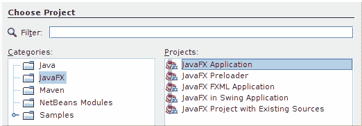

# JavaFX 简介

> 原文： [http://zetcode.com/gui/javafx/intro/](http://zetcode.com/gui/javafx/intro/)

这是 JavaFX 入门教程。 本教程的目的是帮助您开始使用 JavaFX。 该教程已在 Linux 上创建并测试。

## 关于 JavaFX

_JavaFX_ 是用于开发和交付可在多种设备上运行的富 Internet 应用程序（RIA）的软件平台。 JavaFX 是用于 Java 平台的下一代 GUI 工具包。 它与 Java SE Runtime Environment（JRE）和 Java Development Kit（JDK）的最新版本完全集成。

JavaFX 具有以下主要部分：

*   棱镜
*   玻璃开窗工具包
*   媒体引擎
*   网页引擎

_Prism_ 是用于 2D 和 3D 图形的高性能图形引擎。 _Glass_ 窗口工具箱是一个依赖于平台的层，将 JavaFX 连接到本机操作系统。 它提供本机操作系统服务，例如管理窗口，事件，计时器和表面。 _ 媒体 _ 引擎提供了用于创建媒体应用程序的工具，这些应用程序允许在支持的平台上的桌面窗口或网页内播放媒体。 _Web_ 引擎是一种网络浏览器引擎，支持 HTML5，CSS，JavaScript，DOM 和 SVG。

## JavaFX 应用程序剖析

`Application`是 JavaFX 程序的主要类。 每个 JavaFX 程序必须扩展`Application`类。 其`start()`方法是应用程序的主要入口点； 这是系统准备就绪后要调用的第一个方法。 JavaFX 应用程序中不需要`main()`方法； 当在某些情况下无法启动应用程序时，它可以用作备用。

JavaFX 应用程序由`Stage`和`Scene`组成。 `Stage`是顶级容器，是应用程序的主窗口。 （对于嵌入在 Web 浏览器中的应用程序，它是主要的矩形区域。）`Scene`是`Stage`可视内容的容器。 `Scene's`内容被组织在 _ 场景图 _ 中。 这两个术语反映了从桌面应用程序到更通用的富 Internet 应用程序的转变。

## 场景图

场景图是节点的分层树，代表应用程序用户界面的所有可视元素。 场景图中的单个元素称为节点。 每个节点都是分支节点或叶节点。 分支节点可以包含其他节点（它们的子节点）。 叶节点不包含其他节点。 树中的第一个节点称为 _ 根节点 _； 根节点没有父节点。

节点的具体实现包括图形基元，控件，布局管理器，图像或媒体。 可以通过修改节点属性来操纵场景。 这样，我们可以为节点设置动画，应用效果，进行变换或更改其不透明度。

## 构建 JavaFX 应用程序

NetBeans IDE 具有 JavaFX 项目类别。 可通过菜单栏中的文件，新建项目或通过 `Ctrl` + `Shift` + `N` 键盘快捷键访问该文件。



Figure: JavaFX project category in NetBeans

## 首次申请

在本节中，我们将介绍一个简单的 JavaFX 应用程序。

`FirstEx.java`

```
package com.zetcode;

import javafx.application.Application;
import javafx.scene.Scene;
import javafx.scene.control.Label;
import javafx.scene.layout.StackPane;
import javafx.scene.text.Font;
import javafx.scene.text.FontWeight;
import javafx.stage.Stage;

/**
 * ZetCode Java SWT tutorial
 *
 * This program shows a label control in
 * the middle of the main window.
 *
 * Author: Jan Bodnar
 * Website: zetcode.com
 * Last modified: June 2015
 */

public class FirstEx extends Application {

    @Override
    public void start(Stage stage) {

        initUI(stage);
    }

    private void initUI(Stage stage) {

        StackPane root = new StackPane();

        Scene scene = new Scene(root, 300, 250);

        Label lbl = new Label("Simple JavaFX application.");
        lbl.setFont(Font.font("Serif", FontWeight.NORMAL, 20));
        root.getChildren().add(lbl);

        stage.setTitle("Simple application");
        stage.setScene(scene);
        stage.show();
    }

    public static void main(String[] args) {
        launch(args);
    }
}

```

该示例在应用程序窗口的中间显示了一个文本。

```
import javafx.application.Application;
import javafx.scene.Scene;
import javafx.scene.control.Label;
import javafx.scene.layout.StackPane;
import javafx.scene.text.Font;
import javafx.scene.text.FontWeight;
import javafx.stage.Stage;

```

基本的 JavaFX 类，集合和属性驻留在`javafx`包中。

```
public class FirstEx extends Application {

```

`Application`是 JavaFX 程序的主要类。

```
@Override
public void start(Stage stage) {

    initUI(stage);
}

```

`Application's` `start()`方法被覆盖。 `start()`方法是 JavaFX 程序的主要入口点。 它接收`Stage`作为其唯一参数。 （`Stage`是主应用程序窗口或区域。）用户界面是通过`initUI()`方法构建的。

```
StackPane root = new StackPane();

```

`StackPane`是用于组织节点的容器。 它使用一个简单的布局管理器，将其内容节点放置在从后到前的单个堆栈中。 在我们的情况下，我们只想将单个节点居中。

```
Scene scene = new Scene(root, 300, 250);

```

`Scene`是场景图中所有内容的容器。 它以根节点为第一个参数。 `StackPane`是此场景图中的根节点。 接下来的两个参数指定场景的宽度和高度。

```
Label lbl = new Label("Simple JavaFX application.");
lbl.setFont(Font.font("Serif", FontWeight.NORMAL, 20));

```

创建一个`Label`控件，并使用`setFont()`方法设置其字体。 `Label`是不可编辑的文本控件。

```
root.getChildren().add(lbl);

```

标签控件被添加到`StackPane`中。 `getChildren()`方法返回窗格的子级列表。

```
stage.setTitle("Simple application");

```

`Stage`的`setTitle()`方法为主窗口设置标题。

```
stage.setScene(scene);

```

使用`setScene()`方法将场景添加到舞台。

```
stage.show();

```

`show()`方法在屏幕上显示窗口。

```
public static void main(String[] args) {
    launch(args);
}

```

不需要传统的`main()`方法。 它仅在 JavaFX 启动无法正常工作的情况下用作备用。


Figure: First JavaFX application

## 摇摆和 SWT

Swing 是 Java 的第一个主要 GUI 工具包。 它是一个健壮且灵活的 GUI 库。 Swing 在企业应用程序中很流行。 创建 JavaFX 的动机之一是很难使 Swing 适应用户界面的新趋势。 因此，决定将 JavaFX 创建为一个全新的工具箱。

标准窗口小部件工具箱（SWT）是 Java 的第三方 GUI 库。 SWT 使用 Windows API 或 GTK +之类的本地 GUI API 通过 Java 本机接口（JNI）创建其小部件。 与 Swing 和 JavaFX 不同，SWT 不是 JDK 的一部分。 它可以作为外部 JAR 文件使用。 SWT 最初是由 IBM 公司开发的。 现在，它是一个由 Eclipse 社区维护的开源项目。

这是 JavaFX 的简介。