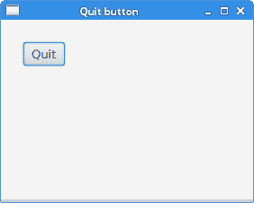
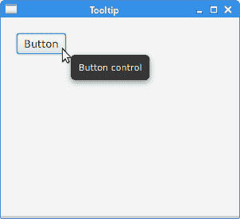

# JavaFX 首个程序

> 原文： [http://zetcode.com/gui/javafx/firstprograms/](http://zetcode.com/gui/javafx/firstprograms/)

在本章中，我们将创建一些基本的 JavaFX 程序。

## 退出按钮

在下面的示例中，我们有一个`Button`控件。 当我们单击按钮时，应用终止。 按下并释放按钮时，将发送`ActionEvent`。

`QuitButtonEx.java`

```java
package com.zetcode;

import javafx.application.Application;
import javafx.application.Platform;
import javafx.event.ActionEvent;
import javafx.geometry.Insets;
import javafx.scene.Scene;
import javafx.scene.control.Button;
import javafx.scene.layout.HBox;
import javafx.stage.Stage;

/**
 * ZetCode JavaFX tutorial
 *
 * This program has a Quit button. Clicking
 * on the button terminates the application.
 *
 * Author: Jan Bodnar
 * Website: zetcode.com
 * Last modified: June 2015
 */

public class QuitButtonEx extends Application {

    @Override
    public void start(Stage stage) {

        initUI(stage);
    }

    private void initUI(Stage stage) {

        Button btn = new Button();
        btn.setText("Quit");
        btn.setOnAction((ActionEvent event) -> {
            Platform.exit();
        });

        HBox root = new HBox();
        root.setPadding(new Insets(25));
        root.getChildren().add(btn);

        Scene scene = new Scene(root, 280, 200);

        stage.setTitle("Quit button");
        stage.setScene(scene);
        stage.show();
    }

    public static void main(String[] args) {
        launch(args);
    }
}

```

`Button`控件位于窗口的左上角。 事件处理程序将添加到按钮。

```java
Button btn = new Button();
btn.setText("Quit");

```

实例化`Button`控件。 `setText()`方法设置按钮的标签。

```java
btn.setOnAction((ActionEvent event) -> {
    Platform.exit();
});

```

`setOnAction()`方法设置按钮的动作，每当触发按钮时都会调用该动作。 上面的代码创建了一个匿名事件处理程序。 `Platform.exit()`终止应用。

```java
HBox root = new HBox();
root.setPadding(new Insets(25));

```

`HBox`是将其子级布置在单个水平行中的窗格。 `setPadding()`方法在窗格内容周围创建填充。 （默认填充为`Insets.EMPTY`。）这样，按钮和窗口边框的边缘之间会留有一些空间。

```java
root.getChildren().add(btn);

```

该按钮将添加到`HBox`窗格。



Figure: Quit button

## 工具提示

任何节点都可以显示工具提示。 `Tooltip`是常见的 UI 元素，通常用于显示有关场景图中节点的其他信息。 当我们将鼠标指针悬停在节点上时，将显示该图标。

`TooltipEx.java`

```java
package com.zetcode;

import javafx.application.Application;
import javafx.geometry.Insets;
import javafx.scene.Scene;
import javafx.scene.control.Button;
import javafx.scene.control.Tooltip;
import javafx.scene.layout.HBox;
import javafx.stage.Stage;

/**
 * ZetCode JavaFX tutorial
 *
 * This program creates a tooltip for 
 * a button control.
 *
 * Author: Jan Bodnar
 * Website: zetcode.com
 * Last modified: June 2015
 */

public class TooltipEx extends Application {

    @Override
    public void start(Stage stage) {

        initUI(stage);
    }

    private void initUI(Stage stage) {

        HBox root = new HBox();
        root.setPadding(new Insets(20));

        Button btn = new Button("Button");
        Tooltip tooltip = new Tooltip("Button control");
        Tooltip.install(btn, tooltip);

        root.getChildren().add(btn);

        Scene scene = new Scene(root, 300, 250);

        stage.setTitle("Tooltip");
        stage.setScene(scene);
        stage.show();
    }

    public static void main(String[] args) {
        launch(args);
    }
}

```

在示例中，我们将工具提示设置为按钮控件。

```java
Button btn = new Button("Button");

```

实例化`Button`控件。

```java
Tooltip tooltip = new Tooltip("Button control");
Tooltip.install(btn, tooltip);

```

创建一个`Tooltip`并将其设置为通过`Tooltip`的`install()`方法设置的按钮。



Figure: Tooltip

## 助记符

助记符是激活支持助记符的控件的快捷键。 例如，它们可以与标签，按钮或菜单项一起使用。

助记符是通过在控件的标签上添加`_`字符来创建的。 它使下一个字符成为助记符。 字符与无鼠标修饰符（通常为 `Alt` ）结合在一起。 选择的字符带有下划线，但是可以以平台特定的方式强调。 在某些平台上，仅在按下无鼠标修饰符后才对字符加下划线。

`MnemonicEx.java`

```java
package com.zetcode;

import javafx.application.Application;
import javafx.event.ActionEvent;
import javafx.geometry.Insets;
import javafx.scene.Scene;
import javafx.scene.control.Button;
import javafx.scene.layout.HBox;
import javafx.stage.Stage;

/**
 * ZetCode JavaFX tutorial
 *
 * This program creates a mnemonic for 
 * a button control.
 *
 * Author: Jan Bodnar
 * Website: zetcode.com
 * Last modified: June 2015
 */

public class MnemonicEx extends Application {

    @Override
    public void start(Stage stage) {

        initUI(stage);
    }

    private void initUI(Stage stage) {

        HBox root = new HBox();
        root.setPadding(new Insets(20));

        Button btn = new Button("_Button");
        btn.setOnAction((ActionEvent event) -> {
            System.out.println("Button fired");
        });

        root.getChildren().add(btn);

        Scene scene = new Scene(root, 300, 250);

        stage.setTitle("Mnemonic");
        stage.setScene(scene);
        stage.show();
    }

    public static void main(String[] args) {
        launch(args);
    }
}

```

我们为按钮控件设置了一个助记符。 可以使用 `Alt + B` 键盘快捷键激活。

```java
Button btn = new Button("_Button");

```

在按钮的标签中，`_`字符位于`B`字符之前； 因此，`B`字符带有下划线，并包含在键盘快捷键中。

```java
btn.setOnAction((ActionEvent event) -> {
    System.out.println("Button fired");
});

```

触发按钮后，它将消息发送到控制台。

目前，有三种激活按钮的方式：单击鼠标左键， `Alt + B` 快捷方式以及`空格键` 按钮具有焦点）。

## 设置控件样式

JavaFX 中的控件可以使用 CSS 设置样式。

`text.css`

```java
#root {-fx-background-color: linear-gradient(gray, darkgray); }
#text {-fx-fill:linear-gradient(orange, orangered); }  

```

此 CSS 文件为根节点和`Text`节点创建样式。

`StylingTextEx.java`

```java
package com.zetcode;

import javafx.application.Application;
import javafx.geometry.Insets;
import javafx.scene.Scene;
import javafx.scene.layout.HBox;
import javafx.scene.text.Font;
import javafx.scene.text.FontWeight;
import javafx.scene.text.Text;
import javafx.stage.Stage;

/**
 * ZetCode JavaFX tutorial
 *
 * This program styles a Text control with CSS.
 *
 * Author: Jan Bodnar
 * Website: zetcode.com
 * Last modified: June 2015
 */

public class StylingTextEx extends Application {

    @Override
    public void start(Stage stage) {

        initUI(stage);
    }

    private void initUI(Stage stage) {

        HBox root = new HBox();
        root.setPadding(new Insets(20));

        Text text = new Text("ZetCode");
        text.setFont(Font.font("Serif", FontWeight.BOLD, 76));

        text.setId("text");
        root.setId("root");

        root.getChildren().addAll(text);

        Scene scene = new Scene(root);
        scene.getStylesheets().add(this.getClass().getResource("text.css")
                .toExternalForm());

        stage.setTitle("Styling text");
        stage.setScene(scene);
        stage.show();
    }

    public static void main(String[] args) {
        launch(args);
    }
}

```

该示例为根节点创建背景渐变颜色，并为`Text`控件创建线性渐变填充。

```java
Text text = new Text("ZetCode");
text.setFont(Font.font("Serif", FontWeight.BOLD, 76));

```

创建一个`Text`控件。 较大的粗体衬线字体设置为控件。

```java
text.setId("text");
root.setId("root");

```

节点由其 ID 标识，该 ID 由`setId()`方法设置。

```java
scene.getStylesheets().add(this.getClass().getResource("text.css")
        .toExternalForm());

```

样式表已添加到`Scene`中。


Figure: Styled Text control

在本章中，我们创建了一些简单的 JavaFX 程序。