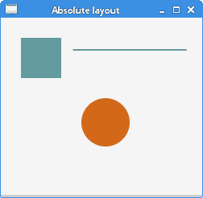
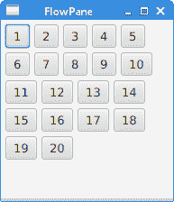
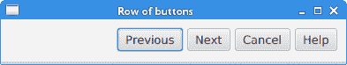
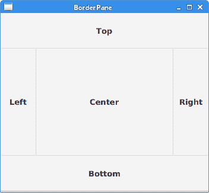
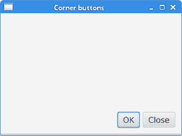
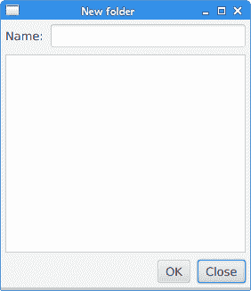
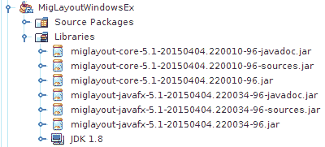
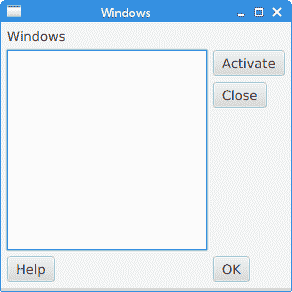

# JavaFX 布局窗格

> 原文： [http://zetcode.com/gui/javafx/layoutpanes/](http://zetcode.com/gui/javafx/layoutpanes/)

JavaFX 教程的这一部分涵盖了节点的布局管理。 我们提到了以下布局窗格：`FlowPane`，`HBox`，`BorderPane`，`AnchorPane`，`GridPane`和`MigPane`。 另外，我们展示了如何使用`Pane`在绝对坐标中定位节点。

布局窗格是用于在 JavaFX 应用的场景图中灵活，动态地排列 UI 控件的容器。 调整窗口大小时，布局窗格会自动调整其位置和大小。

JavaFX 具有以下内置布局窗格：

*   `FlowPane` –在环绕在窗格边界上的流中布置其子项。
*   `HBox` –将其内容节点水平排列在一行中。
*   `VBox` –将其内容节点垂直排列在单个列中。
*   `AnchorPane` –将节点锚定到窗格的顶部，底部，左侧或中心。
*   `BorderPane` –将其内容节点布置在顶部，底部，右侧，左侧或中央区域。
*   `StackPane` –将其内容节点放置在从后到前的单个堆栈中。
*   `TilePane` –将其内容节点放置在大小统​​一的布局单元或图块中。
*   `GridPane` –将其内容节点放置在行和列的网格中。

为了创建更复杂的布局，可以在 JavaFX 应用中嵌套不同的容器。 除了`GridPane`之外，内置的布局管理器是非常基本的，不适用于更复杂的应用。 更复杂的布局应使用`GridPane`或第三方`MigPane`。

## 绝对布局

`Pane`节点可用于在绝对坐标中定位节点。 复杂的布局应始终使用布局管理器创建； 绝对布局用于特定情况（例如，定位图或图像）。

`AbsoluteLayoutEx.java`

```java
package com.zetcode;

import javafx.application.Application;
import javafx.scene.Scene;
import javafx.scene.layout.Pane;
import javafx.scene.paint.Color;
import javafx.scene.shape.Circle;
import javafx.scene.shape.Line;
import javafx.scene.shape.Rectangle;
import javafx.stage.Stage;

/**
 * ZetCode JavaFX tutorial
 *
 * This program positions three shapes
 * using absolute coordinates.
 *
 * Author: Jan Bodnar
 * Website: zetcode.com
 * Last modified: June 2015
 */

public class AbsoluteLayoutEx extends Application {

    @Override
    public void start(Stage stage) {

        initUI(stage);
    }

    private void initUI(Stage stage) {

        Pane root = new Pane();

        Rectangle rect = new Rectangle(25, 25, 50, 50);
        rect.setFill(Color.CADETBLUE);

        Line line = new Line(90, 40, 230, 40);
        line.setStroke(Color.BLACK);

        Circle circle = new Circle(130, 130, 30);
        circle.setFill(Color.CHOCOLATE);

        root.getChildren().addAll(rect, line, circle);

        Scene scene = new Scene(root, 250, 220, Color.WHITESMOKE);

        stage.setTitle("Absolute layout");
        stage.setScene(scene);
        stage.show();
    }

    public static void main(String[] args) {
        launch(args);
    }
}

```

此示例显示了三种形状：矩形，直线和圆形。 使用绝对坐标定位形状。

```java
Pane root = new Pane();

```

实例化了`Pane`节点。 要在绝对坐标中定位节点，我们使用`Pane`节点。

```java
Rectangle rect = new Rectangle(25, 25, 50, 50);

```

创建一个`Rectangle`形状。 前两个参数是 x 和 y 坐标，后两个参数是矩形的宽度和高度。 左上角的矩形从其父节点的`x = 25`和`y = 25`开始。

```java
Line line = new Line(90, 40, 230, 40);
line.setStroke(Color.BLACK);

Circle circle = new Circle(130, 130, 30);
circle.setFill(Color.CHOCOLATE);

```

`Line`和`Circle`形状在其构造函数中采用绝对坐标值。 线的颜色通过`setStroke()`方法更改，圆内部的颜色通过`setFill()`方法更改。

```java
root.getChildren().addAll(rect, line, circle);

```

所有这三个形状都添加到根节点。



Figure: Absolute positioning

## `FlowPane`

`FlowPane`将节点放置在行或列中，当所有节点都无法显示时，将其包裹起来。 流窗格的默认方向为水平。 `FlowPane`的用法非常有限。

`FlowPaneEx.java`

```java
package com.zetcode;

import javafx.application.Application;
import javafx.geometry.Insets;
import javafx.geometry.Orientation;
import javafx.scene.Scene;
import javafx.scene.control.Button;
import javafx.scene.layout.FlowPane;
import javafx.stage.Stage;

/**
 * ZetCode JavaFX tutorial
 *
 * This program uses a FlowPane to position 
 * twenty buttons.
 *
 * Author: Jan Bodnar
 * Website: zetcode.com
 * Last modified: June 2015
 */

public class FlowPaneEx extends Application {

    @Override
    public void start(Stage stage) {

        initUI(stage);
    }

    private void initUI(Stage stage) {

        FlowPane root = new FlowPane(Orientation.HORIZONTAL, 5, 5);
        root.setPadding(new Insets(5));

        for (int i=1; i<=20; i++) {
            root.getChildren().add(new Button(String.valueOf(i)));
        }

        Scene scene = new Scene(root, 300, 250);

        stage.setTitle("FlowPane");
        stage.setScene(scene);
        stage.show();
    }

    public static void main(String[] args) {
        launch(args);
    }
}

```

在示例中，我们在`FlowPane`中放置了二十个按钮。 如果无法将所有按钮都显示在一行中，则将它们包装在其他行中。

```java
FlowPane root = new FlowPane(Orientation.HORIZONTAL, 5, 5);

```

将创建水平`FlowPane`。 第二个和第三个参数指定窗格中节点之间的水平和垂直间隙。

```java
root.setPadding(new Insets(5));

```

`setPadding()`方法在窗格周围设置一些空间。

```java
for (int i=1; i<=20; i++) {
    root.getChildren().add(new Button(String.valueOf(i)));
}

```

二十个按钮将添加到流窗格中。 这些按钮显示整数值。



Figure: FlowPane

## `HBox`

`HBox`将其子级布置在单个水平行中。 该窗格与其他布局管理器一起使用以创建布局。 它适合于进行基本布局。

`RowOfButtonsEx.java`

```java
package com.zetcode;

import javafx.application.Application;
import javafx.geometry.Insets;
import javafx.geometry.Pos;
import javafx.scene.Scene;
import javafx.scene.control.Button;
import javafx.scene.layout.HBox;
import javafx.stage.Stage;

/**
 * ZetCode JavaFX tutorial
 *
 * This program shows four buttons in 
 * a right-aligned, horizontal row with a HBox.
 * 
 * Author: Jan Bodnar
 * Website: zetcode.com
 * Last modified: June 2015
 */

public class RowOfButtonsEx extends Application {

    @Override
    public void start(Stage stage) {

        initUI(stage);
    }

    private void initUI(Stage stage) {

        HBox root = new HBox(5);
        root.setPadding(new Insets(10));
        root.setAlignment(Pos.BASELINE_RIGHT);

        Button prevBtn = new Button("Previous");
        Button nextBtn = new Button("Next");
        Button cancBtn = new Button("Cancel");
        Button helpBtn = new Button("Help");

        root.getChildren().addAll(prevBtn, nextBtn, cancBtn, helpBtn);

        Scene scene = new Scene(root);
        stage.setTitle("Row of buttons");
        stage.setScene(scene);
        stage.show();
    }

    public static void main(String[] args) {
        launch(args);
    }
}

```

该示例在一行中显示了四个按钮。 该行右对齐。 按钮之间有一些空间。

```java
HBox root = new HBox(5);

```

`HBox`窗格以一定的间距创建。

```java
root.setPadding(new Insets(10));

```

我们在`HBox`周围创建一些填充

```java
root.setAlignment(Pos.BASELINE_RIGHT);

```

`setAlignment()`方法将节点右对齐。

```java
root.getChildren().addAll(prevBtn, nextBtn, cancBtn, helpBtn);

```

这些按钮将添加到容器中。



Figure: A row of buttons created with a HBox

## `BorderPane`

`BorderPane`将子项放在顶部，左侧，右侧，底部和中央位置。 它可以用来创建经典外观的应用布局。

`BorderPaneEx.java`

```java
package com.zetcode;

import javafx.application.Application;
import javafx.geometry.Pos;
import javafx.scene.Scene;
import javafx.scene.control.Label;
import javafx.scene.layout.BorderPane;
import javafx.stage.Stage;

/**
 * ZetCode JavaFX tutorial
 *
 * This program places five labels into
 * the BorderPane's five areas.
 * 
 * Author: Jan Bodnar
 * Website: zetcode.com
 * Last modified: June 2015
 */

class MyLabel extends Label {

    public MyLabel(String text) {
        super(text);

        setAlignment(Pos.BASELINE_CENTER);
    }
}

public class BorderPaneEx extends Application {

    private BorderPane root;
    private final int SIZE = 60;

    @Override
    public void start(Stage stage) {

        initUI(stage);
    }

    private void initUI(Stage stage) {

        root = new BorderPane();

        root.setTop(getTopLabel());
        root.setBottom(getBottomLabel());
        root.setLeft(getLeftLabel());
        root.setRight(getRightLabel());
        root.setCenter(getCenterLabel());

        Scene scene = new Scene(root, 350, 300);

        stage.setTitle("BorderPane");
        stage.setScene(scene);
        stage.show();
    }

    private Label getTopLabel() {

        Label lbl = new MyLabel("Top");
        lbl.setPrefHeight(SIZE);
        lbl.prefWidthProperty().bind(root.widthProperty());
        lbl.setStyle("-fx-border-style: dotted; -fx-border-width: 0 0 1 0;"
                + "-fx-border-color: gray; -fx-font-weight: bold");        

        return lbl;
    }

    private Label getBottomLabel() {

        Label lbl = new MyLabel("Bottom");
        lbl.setPrefHeight(SIZE);
        lbl.prefWidthProperty().bind(root.widthProperty());
        lbl.setStyle("-fx-border-style: dotted; -fx-border-width: 1 0 0 0;"
                + "-fx-border-color: gray; -fx-font-weight: bold");

        return lbl;
    }

    private Label getLeftLabel() {

        Label lbl = new MyLabel("Left");
        lbl.setPrefWidth(SIZE);
        lbl.prefHeightProperty().bind(root.heightProperty().subtract(2*SIZE));
        lbl.setStyle("-fx-border-style: dotted; -fx-border-width: 0 1 0 0;"
                + "-fx-border-color: gray; -fx-font-weight: bold");

        return lbl;
    }

    private Label getRightLabel() {

        Label lbl = new MyLabel("Right");
        lbl.setPrefWidth(SIZE);
        lbl.prefHeightProperty().bind(root.heightProperty().subtract(2*SIZE));
        lbl.setStyle("-fx-border-style: dotted; -fx-border-width: 0 0 0 1;"
                + "-fx-border-color: gray; -fx-font-weight: bold");

        return lbl;
    }

    private Label getCenterLabel() {

        Label lbl = new MyLabel("Center");
        lbl.setStyle("-fx-font-weight: bold");
        lbl.prefHeightProperty().bind(root.heightProperty().subtract(2*SIZE));
        lbl.prefWidthProperty().bind(root.widthProperty().subtract(2*SIZE));

        return lbl;
    }    

    public static void main(String[] args) {
        launch(args);
    }
}

```

该示例将五个标签放置在五个`BorderPane's`区域中。

```java
root.setTop(getTopLabel());
root.setBottom(getBottomLabel());
root.setLeft(getLeftLabel());
root.setRight(getRightLabel());
root.setCenter(getCenterLabel());

```

使用`setTop()`，`setBottom()`，`setLeft()`，`setRight()`和`setCenter()`方法定位节点。

```java
Label lbl = new MyLabel("Top");
lbl.setPrefHeight(SIZE);

```

在这里，我们使用`setPrefHeight()`方法增加顶部标签的首选高度。 优选的高度是最初显示标签的高度。

```java
lbl.prefWidthProperty().bind(root.widthProperty());

```

`BorderPane`尊重其子级的首选大小。 如果是标签，则其大小足以显示其文本。 我们将标签的首选`width`属性绑定到窗格的相应属性。 这样，标签将从窗格的左到右放大。

```java
lbl.setStyle("-fx-border-style: dotted; -fx-border-width: 0 0 1 0;"
        + "-fx-border-color: gray; -fx-font-weight: bold");   

```

我们更改标签的样式以便清楚地看到其边界。



Figure: BorderPane

## `AnchorPane`

`AnchorPane`将子节点的边缘锚定到与锚定窗格的边缘偏移的位置。 如果锚定窗格设置了边框或填充，则将从这些插图的内部边缘开始测量偏移。 `AnchorPane`是一个简单的布局窗格，必须与其他布局窗格一起使用才能创建有意义的布局。

`CornerButtonsEx.java`

```java
package com.zetcode;

import javafx.application.Application;
import javafx.scene.Scene;
import javafx.scene.control.Button;
import javafx.scene.layout.AnchorPane;
import javafx.scene.layout.HBox;
import javafx.stage.Stage;

/**
 * ZetCode JavaFX tutorial
 *
 * This program shows two buttons in the
 * bottom-right corner of the window. It uses
 * an AnchorPane and an HBox.
 *
 * Author: Jan Bodnar
 * Website: zetcode.com
 * Last modified: June 2015
 */

public class CornerButtonsEx extends Application {

    @Override
    public void start(Stage stage) {

        initUI(stage);
    }

    private void initUI(Stage stage) {

        AnchorPane root = new AnchorPane();

        Button okBtn = new Button("OK");
        Button closeBtn = new Button("Close");
        HBox hbox = new HBox(5, okBtn, closeBtn);

        root.getChildren().addAll(hbox);

        AnchorPane.setRightAnchor(hbox, 10d);
        AnchorPane.setBottomAnchor(hbox, 10d);

        Scene scene = new Scene(root, 300, 200);

        stage.setTitle("Corner buttons");
        stage.setScene(scene);
        stage.show();
    }

    public static void main(String[] args) {
        launch(args);
    }
}

```

该示例使用`AnchorPane`和`HBox`将两个按钮放置在窗口的右下角。

```java
AnchorPane root = new AnchorPane();

```

`AnchorPane`是场景图的根节点。

```java
Button okBtn = new Button("OK");
Button closeBtn = new Button("Close");
HBox hbox = new HBox(5, okBtn, closeBtn);

```

这两个按钮位于`HBox`中。 我们使用一个构造函数，将直接放置按钮对象。

```java
root.getChildren().addAll(hbox);

```

`hbox`已添加到锚定窗格。

```java
AnchorPane.setRightAnchor(hbox, 10d);

```

`setRightAnchor()`方法将`hbox`锚定到窗格的右边缘。 第二个参数给出了相对于边缘的一些偏移。

```java
AnchorPane.setBottomAnchor(hbox, 10d);

```

`setBottomAnchor()`方法将`hbox`锚定到窗格的底部边缘。



Figure: Corner buttons

## `GridPane`

`GridPane`将其节点放入行和列的网格中。 节点可以跨越多行或多列。 `GridPane`是最灵活的内置布局窗格。

`setGridLinesVisible()`可以显示布局网格的线条，这使我们可以直观地调试布局。

`NewFolderEx.java`

```java
package com.zetcode;

import javafx.application.Application;
import javafx.geometry.HPos;
import javafx.geometry.Insets;
import javafx.scene.Scene;
import javafx.scene.control.Button;
import javafx.scene.control.Label;
import javafx.scene.control.ListView;
import javafx.scene.control.TextField;
import javafx.scene.layout.ColumnConstraints;
import javafx.scene.layout.GridPane;
import javafx.scene.layout.Priority;
import javafx.scene.layout.RowConstraints;
import javafx.stage.Stage;

/**
 * ZetCode JavaFX tutorial
 *
 * This program creates a NewFolder layout with 
 * a GridPane.
 *
 * Author: Jan Bodnar
 * Website: zetcode.com
 * Last modified: June 2015
 */

public class NewFolderEx extends Application {

    @Override
    public void start(Stage stage) {

        initUI(stage);
    }

    private void initUI(Stage stage) {

        GridPane root = new GridPane();
        root.setHgap(8);
        root.setVgap(8);
        root.setPadding(new Insets(5));

        ColumnConstraints cons1 = new ColumnConstraints();
        cons1.setHgrow(Priority.NEVER);
        root.getColumnConstraints().add(cons1);

        ColumnConstraints cons2 = new ColumnConstraints();
        cons2.setHgrow(Priority.ALWAYS);

        root.getColumnConstraints().addAll(cons1, cons2);

        RowConstraints rcons1 = new RowConstraints();
        rcons1.setVgrow(Priority.NEVER);

        RowConstraints rcons2 = new RowConstraints();
        rcons2.setVgrow(Priority.ALWAYS);  

        root.getRowConstraints().addAll(rcons1, rcons2);

        Label lbl = new Label("Name:");
        TextField field = new TextField();
        ListView view = new ListView();
        Button okBtn = new Button("OK");
        Button closeBtn = new Button("Close");

        GridPane.setHalignment(okBtn, HPos.RIGHT);

        root.add(lbl, 0, 0);
        root.add(field, 1, 0, 3, 1);
        root.add(view, 0, 1, 4, 2);
        root.add(okBtn, 2, 3);
        root.add(closeBtn, 3, 3);

        Scene scene = new Scene(root, 280, 300);

        stage.setTitle("New folder");
        stage.setScene(scene);
        stage.show();
    }

    public static void main(String[] args) {
        launch(args);
    }
}

```

此示例的布局由标签，文本字段，列表视图和两个按钮组成。

```java
GridPane root = new GridPane();

```

创建`GridPane`的实例。

```java
root.setHgap(8);
root.setVgap(8);

```

这两种方法在节点之间创建了水平和垂直间隙。

```java
ColumnConstraints cons1 = new ColumnConstraints();
cons1.setHgrow(Priority.NEVER);
root.getColumnConstraints().add(cons1);

ColumnConstraints cons2 = new ColumnConstraints();
cons2.setHgrow(Priority.ALWAYS);

root.getColumnConstraints().addAll(cons1, cons2);

```

在布局中，我们需要使第二列可扩展。 默认情况下，网格窗格以其首选大小显示其子级，并且在窗口放大时不会放大它们。 我们创建列约束，将第二列的水平增长优先级设置为`Priority.ALWAYS`。 （没有特定的方法可以执行此操作。）最后，这会使文本字段和列表视图控件随着窗口的放大而沿水平方向增长。

```java
RowConstraints rcons1 = new RowConstraints();
rcons1.setVgrow(Priority.NEVER);

RowConstraints rcons2 = new RowConstraints();
rcons2.setVgrow(Priority.ALWAYS);  

root.getRowConstraints().addAll(rcons1, rcons2);

```

以类似的方式，使第二行可增长。 通过使第二列和第二行可增长，列表视图将在两个方向上都增长，从而占用了大部分客户区。

```java
Label lbl = new Label("Name:");
TextField field = new TextField();
ListView view = new ListView();
Button okBtn = new Button("OK");
Button closeBtn = new Button("Close");

```

将创建五个控件。

```java
GridPane.setHalignment(okBtn, HPos.RIGHT);

```

`setHalignment()`方法使`okBtn`右对齐。

```java
root.add(lbl, 0, 0);

```

标签控件将添加到网格。 `add()`方法的前两个参数是列和行索引。 索引从零开始。

```java
root.add(field, 1, 0, 3, 1);

```

重载的`add()`方法还指定列和行跨度。 文本字段转到第二列和第一行。 它跨越三列和一行。



Figure: New folder

## `MigPane`

`MigPane`是一个非常强大的第三方布局管理器。 它使用`MigLayout`管理器，可用于 Swing，SWT 和 JavaFX。 强烈建议考虑这位管理器。



Figure: MigPane JARs

要使用`MigPane`，必须将 JAR 包含到项目库中。 用于源代码和 javadoc 的 JAR 是可选的。

`MigPane`使用字符串约束进行布局。 有四种约束：常规约束，列约束，行约束和控制约束。 `MigPane`中有几种布局模式。 网格模式是默认模式，并且是可用模式中最灵活的一种。

`MigLayoutWindowsEx.java`

```java
package com.zetcode;

import javafx.application.Application;
import javafx.scene.Scene;
import javafx.scene.control.Button;
import javafx.scene.control.Control;
import javafx.scene.control.Label;
import javafx.scene.control.ListView;
import javafx.stage.Stage;
import org.tbee.javafx.scene.layout.MigPane;

/**
 * ZetCode JavaFX tutorial
 *
 * This program creates a Windows layout with 
 * a MigPane.
 *
 * Author: Jan Bodnar
 * Website: zetcode.com
 * Last modified: June 2015
 */

public class MigLayoutWindowsEx extends Application {

    MigPane root;

    @Override
    public void start(Stage stage) {

        initUI(stage);
    }

    private void initUI(Stage stage) {

        root = new MigPane("", "[grow][]", "[][][grow][]");
        Scene scene = new Scene(root);

        Label lbl = new Label("Windows");
        Button actBtn = new Button("Activate");
        Button closeBtn = new Button("Close");
        Button okBtn = new Button("OK");
        Button helpBtn = new Button("Help");
        ListView listView = new ListView();

        createLayout(lbl, listView, actBtn, closeBtn, helpBtn, okBtn);

        stage.setTitle("Windows");
        stage.setScene(scene);
        stage.show();
    }

    private void createLayout(Control...arg) {

        root.add(arg[0], "wrap");
        root.add(arg[1], "w 200, h 200, span 2 2, grow");
        root.add(arg[2], "wrap");
        root.add(arg[3], "top, wrap");
        root.add(arg[4]);
        root.add(arg[5], "skip");    
    }

    public static void main(String[] args) {
        launch(args);
    }
}

```

该示例使用六个控件，四个按钮，一个标签和一个列表视图。

```java
root = new MigPane("", "[grow][]", "[][][grow][]");

```

`MigPane`构造函数的三个字符串指定常规约束，列约束和行约束。 `[grow][]`约束指定有两列，第一列是可增长的。 同样，`[][][grow][]`约束告诉`MigPane`有四行，第三行是可增长的。 如果将`debug`约束放入常规约束中，则可以直观地调试布局。

```java
createLayout(lbl, listView, actBtn, closeBtn, helpBtn, okBtn);

```

布局的创建委托给`createLayout()`方法。

```java
root.add(arg[0], "wrap");

```

标签控件进入第一行和第一列。 可以（但不是必需）明确指定单元格索引。 `wrap`约束开始一个新行。

```java
root.add(arg[1], "w 200, h 200, span 2 2, grow");

```

`w`和`h`约束指定列表视图控件的初始宽度和高度。 最佳实践是，只有布局管理器才能设置其组件的大小。 换句话说，直接在控件上调用方法行`setMinSize()`是一种不好的做法。 `span`约束使控件跨越两列和两行。 最后，`grow`约束使控件在调整窗口大小时向两个方向扩展。

```java
root.add(arg[2], "wrap");

```

第三个控件是“激活”按钮。 它在列表视图旁边。 放置此控件后，我们开始新的一行。

```java
root.add(arg[3], "top, wrap");

```

“关闭”按钮在列表视图旁边，在“激活”按钮下面。 `top`约束将按钮对齐到其单元格的顶部。

```java
root.add(arg[4]);

```

我们使列表视图跨两行。 将前一个按钮放入两行后，下一个按钮会自动进入列表视图下方。

```java
root.add(arg[5], "skip");  

```

最后一个按钮跳过一列。 因此它被放置在第三列和第四行。



Figure: Windows layout created with a MigPane

在 JavaFX 教程的这一部分中，我们提到了布局窗格。