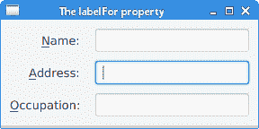
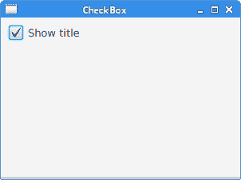
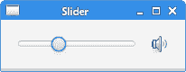
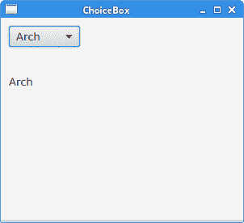

# 基本的 JavaFX 控件

> 原文： [http://zetcode.com/gui/javafx/controls/](http://zetcode.com/gui/javafx/controls/)

控件是应用的基本构建块。 `Control`是场景图中的一个可由用户操纵的节点。 它以对用户一致且可预测的方式支持常见的用户交互。 JavaFX 具有广泛的内置控件。 在本章中，我们涵盖五个控件：`Label`，`CheckBox`，`ChoiceBox`，`Slider`和`ProgressBar`。 还简要提到了`ImageView`和`TextField`控件。

## `Label`

`Label`是不可编辑的文本控件。 标签可以使用省略号或截断符来调整字符串的大小以使其适合。

`LabelEx.java`

```java
package com.zetcode;

import javafx.application.Application;
import javafx.geometry.Insets;
import javafx.scene.Scene;
import javafx.scene.control.Label;
import javafx.scene.layout.HBox;
import javafx.stage.Stage;

/**
 * ZetCode JavaFX tutorial
 *
 * This program shows lyrics in a Label
 * control.
 *
 * Author: Jan Bodnar 
 * Website: zetcode.com 
 * Last modified: June 2015
 */

public class LabelEx extends Application {

    String lyrics = "It's way too late to think of\n"
            + "Someone I would call now\n"
            + "And neon signs got tired\n"
            + "Red eye flights help the stars out\n"
            + "I'm safe in a corner\n"
            + "Just hours before me\n"
            + "\n"
            + "I'm waking with the roaches\n"
            + "The world has surrendered\n"
            + "I'm dating ancient ghosts\n"
            + "The ones I made friends with\n"
            + "The comfort of fireflies\n"
            + "Long gone before daylight\n"
            + "\n"
            + "And if I had one wishful field tonight\n"
            + "I'd ask for the sun to never rise\n"
            + "If God leant his voice for me to speak\n"
            + "I'd say go to bed, world\n"
            + "\n"
            + "I've always been too late\n"
            + "To see what's before me\n"
            + "And I know nothing sweeter than\n"
            + "Champaign from last New Years\n"
            + "Sweet music in my ears\n"
            + "And a night full of no fears\n"
            + "\n"
            + "But if I had one wishful field tonight\n"
            + "I'd ask for the sun to never rise\n"
            + "If God passed a mic to me to speak\n"
            + "I'd say stay in bed, world\n"
            + "Sleep in peace";

    @Override
    public void start(Stage stage) {

        initUI(stage);
    }

    private void initUI(Stage stage) {

        HBox root = new HBox();
        root.setPadding(new Insets(10));

        Label lbl = new Label(lyrics);
        root.getChildren().add(lbl);

        Scene scene = new Scene(root);

        stage.setTitle("No sleep");
        stage.setScene(scene);
        stage.show();
    }

    public static void main(String[] args) {
        launch(args);
    }
}

```

该示例显示了 Cardigans 的歌曲的歌词。

```java
String lyrics = "It's way too late to think of\n"
        + "Someone I would call now\n"
        + "And neon signs got tired\n"
        + "Red eye flights help the stars out\n"
...        

```

该字符串由多行文本组成。

```java
HBox root = new HBox();
root.setPadding(new Insets(10));

```

标签控件放置在`HBox`中。 我们在盒子周围放了一些填充物。

```java
Label lbl = new Label(lyrics);

```

创建一个`Label`控件。 它以字符串作为唯一参数。

```java
root.getChildren().add(lbl);

```

标签已添加到容器中。

## `labelFor`属性

`labelFor`属性指定在按下助记符时将键盘焦点发送到的节点。

`LabelForEx.java`

```java
package com.zetcode;

import javafx.application.Application;
import javafx.geometry.HPos;
import javafx.geometry.Insets;
import javafx.scene.Scene;
import javafx.scene.control.Label;
import javafx.scene.control.TextField;
import javafx.scene.layout.GridPane;
import javafx.stage.Stage;

/**
 * ZetCode JavaFX tutorial
 *
 * This program uses the labelFor property to 
 * send focus to a specified text field.
 *
 * Author: Jan Bodnar 
 * Website: zetcode.com 
 * Last modified: June 2015
 */

public class LabelForEx extends Application {

    @Override
    public void start(Stage stage) {

        initUI(stage);
    }

    private void initUI(Stage stage) {

        GridPane root = new GridPane();
        root.setVgap(10);
        root.setHgap(5);
        root.setPadding(new Insets(10));

        Label lbl1 = new Label("_Name:");
        Label lbl2 = new Label("_Address:");
        Label lbl3 = new Label("_Occupation:");

        TextField field1 = new TextField();
        TextField field2 = new TextField();
        TextField field3 = new TextField();

        lbl1.setLabelFor(field1);
        lbl1.setMnemonicParsing(true);
        lbl2.setLabelFor(field2);
        lbl2.setMnemonicParsing(true);
        lbl3.setLabelFor(field3);
        lbl3.setMnemonicParsing(true);

        root.add(lbl1, 0, 0);
        root.add(field1, 2, 0);
        root.add(lbl2, 0, 1);
        root.add(field2, 2, 1);
        root.add(lbl3, 0, 2);
        root.add(field3, 2, 2);        

        GridPane.setHalignment(lbl1, HPos.RIGHT);
        GridPane.setHalignment(lbl2, HPos.RIGHT);
        GridPane.setHalignment(lbl3, HPos.RIGHT);

        Scene scene = new Scene(root);

        stage.setTitle("TextField");
        stage.setScene(scene);
        stage.show();
    }

    public static void main(String[] args) {
        launch(args);
    }
}

```

该示例使用`labelFor`属性和助记符将焦点转移到指定的文本字段。

```java
GridPane root = new GridPane();
root.setVgap(10);
root.setHgap(5);
root.setPadding(new Insets(10));

```

我们的应用是一个典型的基于表单的程序。 `GridPane`非常适合此。 我们在控件周围以及控件之间设置了一些空间。

```java
Label lbl1 = new Label("_Name:");
Label lbl2 = new Label("_Address:");
Label lbl3 = new Label("_Occupation:");

```

创建了三个`Labels`。 下划线字符位于助记键之前。

```java
TextField field1 = new TextField();
TextField field2 = new TextField();
TextField field3 = new TextField();

```

`TextField`是用于编辑单行未格式化文本的控件。 每个文本字段都放置在一个标签控件旁边。

```java
lbl1.setLabelFor(field1);

```

`setLabelFor()`设置按下助记符时将焦点转移到的目标节点。

```java
lbl1.setMnemonicParsing(true);

```

默认情况下，未为标签设置助记符。 我们必须使用`setMnemonicParsing()`方法启用它们。



Figure: The labelFor property

在某些平台上，必须按无鼠标修饰符（通常为 `Alt` ）以显示下划线。 在图中，通过按 `Alt + A` 将焦点转移到中间文本字段。

## `CheckBox`

`CheckBox`是三态选择控制框，在选中时显示对勾或勾号。 默认情况下，控件具有两种状态：选中和未选中。 `setAllowIndeterminate()`使能第三种状态：不确定。

`CheckBoxEx.java`

```java
package com.zetcode;

import javafx.application.Application;
import javafx.event.ActionEvent;
import javafx.geometry.Insets;
import javafx.scene.Scene;
import javafx.scene.control.CheckBox;
import javafx.scene.layout.HBox;
import javafx.stage.Stage;

/**
 * ZetCode JavaFX tutorial
 *
 * This program presents the 
 * CheckBox control.
 *
 * Author: Jan Bodnar
 * Website: zetcode.com
 * Last modified: June 2015
 */

public class CheckBoxEx extends Application {

    @Override
    public void start(Stage stage) {

        initUI(stage);
    }

    private void initUI(Stage stage) {

        HBox root = new HBox();
        root.setPadding(new Insets(10, 0, 0, 10));

        CheckBox cbox = new CheckBox("Show title");
        cbox.setSelected(true);

        cbox.setOnAction((ActionEvent event) -> {
            if (cbox.isSelected()) {
                stage.setTitle("CheckBox");
            } else {
                stage.setTitle("");
            }
        });

        root.getChildren().add(cbox);

        Scene scene = new Scene(root, 300, 200);

        stage.setTitle("CheckBox");
        stage.setScene(scene);
        stage.show();
    }

    public static void main(String[] args) {
        launch(args);
    }
}

```

该示例根据是否选中该复选框来显示或隐藏窗口的标题。

```java
CheckBox cbox = new CheckBox("Show title");

```

创建一个`CheckBox`控件。 指定的文本为其标签。

```java
cbox.setSelected(true);

```

由于默认情况下窗口的标题是可见的，因此我们使用`setSelected()`方法检查控件。

```java
cbox.setOnAction((ActionEvent event) -> {
    if (cbox.isSelected()) {
        stage.setTitle("CheckBox");
    } else {
        stage.setTitle("");
    }
});

```

使用`setOnAction()`方法，设置复选框的操作，该操作在触发复选框时被调用。 我们用`isSelected()`方法确定其状态。 根据当前状态，我们使用`setTitle()`方法显示或隐藏窗口标题。



Figure: CheckBox

请注意复选框文本周围的蓝色矩形。 它表示此控件具有键盘焦点。 可以使用 `Space` 键选择和取消选中该复选框。

## 滑杆

`Slider`是一种控件，它使用户可以通过在有限间隔内滑动旋钮来以图形方式选择一个值。 滑块可以选择显示刻度线和标签，以指示不同的滑块位置值。

`SliderEx.java`

```java
package com.zetcode;

import javafx.application.Application;
import javafx.beans.value.ChangeListener;
import javafx.beans.value.ObservableValue;
import javafx.geometry.Insets;
import javafx.geometry.Pos;
import javafx.scene.Scene;
import javafx.scene.control.Slider;
import javafx.scene.image.Image;
import javafx.scene.image.ImageView;
import javafx.scene.layout.HBox;
import javafx.stage.Stage;

/**
 * ZetCode JavaFX tutorial
 *
 * This program uses a Slider control to 
 * manipulate the images of an ImageView.
 *
 * Author: Jan Bodnar 
 * Website: zetcode.com 
 * Last modified: June 2015
 */

public class SliderEx extends Application {

    private ImageView iview;
    private Image muteImg;
    private Image minImg;
    private Image maxImg;
    private Image medImg;

    @Override
    public void start(Stage stage) {

        initUI(stage);
    }

    private void initUI(Stage stage) {

        HBox root = new HBox(10);
        root.setAlignment(Pos.CENTER);
        root.setPadding(new Insets(15));

        loadImages();

        iview = new ImageView(muteImg);

        Slider slider = new Slider(0, 100, 0);
        slider.valueProperty().addListener(new MyChangeListener());

        Scene scene = new Scene(root);

        root.getChildren().addAll(slider, iview);

        stage.setTitle("Slider");
        stage.setScene(scene);
        stage.show();
    }

    private void loadImages() {

        muteImg = new Image("file:mute.png");
        minImg = new Image("file:min.png");
        maxImg = new Image("file:max.png");
        medImg = new Image("file:med.png");
    }

    private class MyChangeListener implements ChangeListener<Number> {

        @Override
        public void changed(ObservableValue<? extends Number> observable,
                Number oldValue, Number newValue) {

            Double value = newValue.doubleValue();

            if (value == 0) {
                iview.setImage(muteImg);
            } else if (value > 0 && value <= 30) {
                iview.setImage(minImg);
            } else if (value > 30 && value < 80) {
                iview.setImage(medImg);
            } else {
                iview.setImage(maxImg);
            }
        }
    }

    public static void main(String[] args) {
        launch(args);
    }
}

```

在代码示例中，我们显示了`Slider`和`ImageView`控件。 通过拖动滑块的旋钮，我们可以更改标签控件上的图像。

```java
root.setAlignment(Pos.CENTER);

```

滑块和图像视图在行中居中。

```java
iview = new ImageView(muteImg);

```

`ImageView`显示加载了`Image`类的图像。

```java
Slider slider = new Slider(0, 100, 0);

```

将使用指定的最小值，最大值和当前值创建一个`Slider`控件。

```java
slider.valueProperty().addListener(new MyChangeListener());

```

监听器已添加到滑块的值更改中。

```java
Double value = newValue.doubleValue();

if (value == 0) {
    iview.setImage(muteImg);
} else if (value > 0 && value <= 30) {
    iview.setImage(minImg);
} else if (value > 30 && value < 80) {
    iview.setImage(medImg);
} else {
    iview.setImage(maxImg);
}

```

基于滑块的当前值，我们将适当的图像设置为图像视图。

```java
private void loadImages() {

    muteImg = new Image("file:mute.png");
    minImg = new Image("file:min.png");
    maxImg = new Image("file:max.png");
    medImg = new Image("file:med.png");
}

```

`loadImages()`方法从磁盘加载图像。



Figure: Slider

## 选择框

`ChoiceBox`用于向用户显示一小组预定义的选项。 当用户单击该框时，将显示一个选择列表。 一次只能选择一个选项。 未显示此列表时，将显示当前选择的选项。 `ChoiceBox`项目选择由`SelectionModel`处理。

`ChoiceBoxEx.java`

```java
package com.zetcode;

import javafx.application.Application;
import javafx.beans.value.ObservableValue;
import javafx.collections.FXCollections;
import javafx.geometry.Insets;
import javafx.scene.Scene;
import javafx.scene.control.ChoiceBox;
import javafx.scene.control.Label;
import javafx.scene.control.SingleSelectionModel;
import javafx.scene.layout.VBox;
import javafx.stage.Stage;

/**
 * ZetCode JavaFX tutorial
 *
 * This program uses a ChoiceBox. The chosen
 * item is shown in a label.
 *
 * Author: Jan Bodnar 
 * Website: zetcode.com 
 * Last modified: June 2015
 */

public class ChoiceBoxEx extends Application {

    @Override
    public void start(Stage stage) {

        initUI(stage);
    }

    private void initUI(Stage stage) {

        VBox root = new VBox(35);
        root.setPadding(new Insets(10));

        Label lbl = new Label();

        ChoiceBox chbox = new ChoiceBox(FXCollections.observableArrayList(
                "Ubuntu", "Redhat", "Arch", "Debian", "Mint"));

        SingleSelectionModel model = chbox.getSelectionModel();

        model.selectedItemProperty().addListener((ObservableValue observable, 
                Object oldValue, Object newValue) -> {

            lbl.setText(newValue.toString());
        });

        root.getChildren().addAll(chbox, lbl);

        Scene scene = new Scene(root, 300, 250);

        stage.setTitle("ChoiceBox");
        stage.setScene(scene);
        stage.show();
    }

    public static void main(String[] args) {
        launch(args);
    }
}

```

在我们的示例中，我们有一个选择框和一个标签。 选择框包含一个字符串列表，这些字符串表示 Linux 发行版的名称。 从选择框中选择的项目显示在标签中。

```java
Label lbl = new Label();

```

此`Label`显示了从选择框中选择的当前项目。

```java
ChoiceBox chbox = new ChoiceBox(FXCollections.observableArrayList(
        "Ubuntu", "Redhat", "Arch", "Debian", "Mint"));

```

创建了`ChoiceBox`。 它以可观察的数组列表作为参数。

```java
SingleSelectionModel model = chbox.getSelectionModel();

model.selectedItemProperty().addListener((ObservableValue observable, 
        Object oldValue, Object newValue) -> {

    lbl.setText(newValue.toString());
});

```

要实现监听器，我们需要使用`getSelectionModel()`方法获得选择模型。 该模型包含可观察的`selectedItem`属性。 在处理程序方法内部，我们获取选定的值并将其设置为标签。



Figure: ChoiceBox

## 进度条

`ProgressBar`是一个控件，用于指示带有完成条的特定任务的处理。

`ProgressBarEx.java`

```java
package com.zetcode;

import javafx.animation.KeyFrame;
import javafx.animation.KeyValue;
import javafx.animation.Timeline;
import javafx.application.Application;
import javafx.event.ActionEvent;
import javafx.geometry.Insets;
import javafx.geometry.Pos;
import javafx.scene.Scene;
import javafx.scene.control.Button;
import javafx.scene.control.ProgressBar;
import javafx.scene.layout.HBox;
import javafx.stage.Stage;
import javafx.util.Duration;

/**
 * ZetCode JavaFX tutorial
 *
 * This program presents the ProgressBar control.
 *
 * Author: Jan Bodnar 
 * Website: zetcode.com 
 * Last modified: June 2015
 */

public class ProgressBarEx extends Application {

    @Override
    public void start(Stage stage) {

        initUI(stage);
    }

    private void initUI(Stage stage) {

        HBox root = new HBox(15);
        root.setAlignment(Pos.CENTER);
        root.setPadding(new Insets(10));

        ProgressBar pbar = new ProgressBar(0);
        pbar.setPrefWidth(150);

        KeyFrame frame1 = new KeyFrame(Duration.ZERO, 
                new KeyValue(pbar.progressProperty(), 0));

        KeyFrame frame2 = new KeyFrame(Duration.seconds(3), 
                new KeyValue(pbar.progressProperty(), 1));        

        Timeline task = new Timeline(frame1, frame2);

        Button btn = new Button("Start");
        btn.setOnAction((ActionEvent actionEvent) -> {
            task.playFromStart();
        });

        root.getChildren().addAll(pbar, btn);

        Scene scene = new Scene(root);

        stage.setTitle("ProgressBar");
        stage.setScene(scene);
        stage.show();
    }

    public static void main(String[] args) {
        launch(args);
    }
}

```

该示例由进度条和按钮组成。 该按钮将启动进度条，并对其进行动画处理几秒钟。

```java
ProgressBar pbar = new ProgressBar(0);

```

构造函数使用给定的进度值创建一个新的`ProgressBar`。

```java
KeyFrame frame1 = new KeyFrame(Duration.ZERO, 
        new KeyValue(pbar.progressProperty(), 0));

KeyFrame frame2 = new KeyFrame(Duration.seconds(3), 
        new KeyValue(pbar.progressProperty(), 1));        

Timeline task = new Timeline(frame1, frame2);

```

此代码创建一个简单的动画任务。 动画由两个帧组成。 动画属性定义为`KeyValues`。

```java
Button btn = new Button("Start");
btn.setOnAction((ActionEvent actionEvent) -> {
    task.playFromStart();
});

```

触发后，该按钮调用`playFromStart()`方法，该方法从初始位置开始向前播放动画。


Figure: ProgressBar

在 JavaFX 教程的这一部分中，我们介绍了基本的 JavaFX 控件。