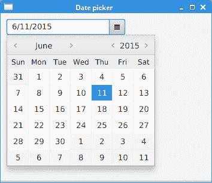
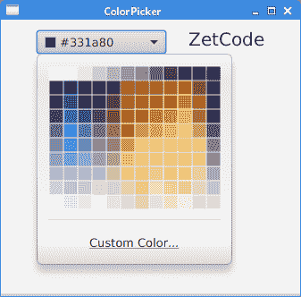
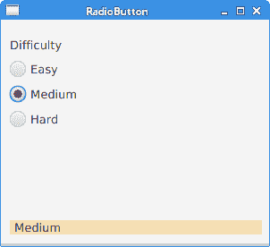
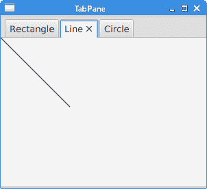

# 基本 JavaFX 控件 II

> 原文： [http://zetcode.com/gui/javafx/controlsII/](http://zetcode.com/gui/javafx/controlsII/)

在本章中，我们将继续介绍基本的 JavaFX 控件。 我们提出了`DatePicker`，`MenuBar`，`ColorPicker`，`RadioButton`和`TabPane`控件。

## 日期选择器

`DatePicker`是用于选择日期的控件。

`DatePickerEx.java`

```java
package com.zetcode;

import java.time.LocalDate;
import javafx.application.Application;
import javafx.geometry.Insets;
import javafx.scene.Scene;
import javafx.scene.control.DatePicker;
import javafx.scene.control.Label;
import javafx.scene.layout.VBox;
import javafx.stage.Stage;

/**
 * ZetCode JavaFX tutorial
 *
 * This program shows a date chosen from 
 * a DatePicker in a label.
 *
 * Author: Jan Bodnar 
 * Website: zetcode.com 
 * Last modified: June 2015
 */

public class DatePickerEx extends Application {

    @Override
    public void start(Stage stage) {

        initUI(stage);
    }

    private void initUI(Stage stage) {

        VBox root = new VBox(15);
        root.setPadding(new Insets(10));        

        Label lbl = new Label("...");

        DatePicker datePicker = new DatePicker();

        datePicker.setOnAction(e -> {
            LocalDate date = datePicker.getValue();
            lbl.setText(date.toString());
        });

        root.getChildren().addAll(datePicker, lbl);

        Scene scene = new Scene(root, 350, 200);

        stage.setTitle("Date picker");
        stage.setScene(scene);
        stage.show();        
    }

    public static void main(String[] args) {
        launch(args);
    }
}

```

该示例使用`DatePicker`控件选择和显示日期。 日期显示在标签控件中。

```java
DatePicker datePicker = new DatePicker();

```

创建一个`DatePicker`控件的实例。

```java
datePicker.setOnAction(e -> {
    LocalDate date = datePicker.getValue();
    lbl.setText(date.toString());
});

```

`getValue()`方法将选择的日期作为`LocalDate`返回。 所选日期通过`setText()`方法设置到标签控件。



Figure: DatePicker

## 菜单栏

`MenuBar`由`Menu`对象组成，这些对象包含`MenuItem`对象，即应用的命令。 传统上，它位于应用窗口的顶部。

`MenuBarEx.java`

```java
package com.zetcode;

import javafx.application.Application;
import javafx.application.Platform;
import javafx.event.ActionEvent;
import javafx.event.EventHandler;
import javafx.scene.Scene;
import javafx.scene.control.Alert;
import javafx.scene.control.Alert.AlertType;
import javafx.scene.control.Menu;
import javafx.scene.control.MenuBar;
import javafx.scene.control.MenuItem;
import javafx.scene.control.SeparatorMenuItem;
import javafx.scene.layout.HBox;
import javafx.stage.Stage;

/**
 * ZetCode JavaFX tutorial
 *
 * This program creates a MenuBar with one
 * menu and four menu items.
 *
 * Author: Jan Bodnar
 * Website: zetcode.com
 * Last modified: June 2015
 */

public class MenuBarEx extends Application {

    @Override
    public void start(Stage stage) {

        initUI(stage);
    }

    private void initUI(Stage stage) {

        HBox root = new HBox();

        MenuBar mbar = new MenuBar();
        mbar.prefWidthProperty().bind(stage.widthProperty());

        MyMenuHandler handler = new MyMenuHandler();

        Menu fileMenu = new Menu("File");
        mbar.getMenus().add(fileMenu);

        MenuItem nmi = new MenuItem("New");
        nmi.setOnAction(handler);
        fileMenu.getItems().add(nmi);

        MenuItem omi = new MenuItem("Open");
        omi.setOnAction(handler);
        fileMenu.getItems().add(omi);

        MenuItem smi = new MenuItem("Save");
        smi.setOnAction(handler);
        fileMenu.getItems().add(smi);

        fileMenu.getItems().add(new SeparatorMenuItem());

        MenuItem emi = new MenuItem("Exit");
        emi.setOnAction((ActionEvent event) -> {
            Platform.exit();
        });

        fileMenu.getItems().add(emi);

        root.getChildren().add(mbar);

        Scene scene = new Scene(root, 300, 250);

        stage.setTitle("MenuBar");
        stage.setScene(scene);
        stage.show();
    }

    private class MyMenuHandler implements EventHandler<ActionEvent> {

        @Override
        public void handle(ActionEvent event) {

            doShowMessageDialog(event);
        }

        private void doShowMessageDialog(ActionEvent event) {

            MenuItem mi = (MenuItem) event.getSource();
            String item = mi.getText();
            Alert alert = new Alert(AlertType.INFORMATION);
            alert.setTitle("Information dialog");
            alert.setHeaderText("Menu item selection information");
            alert.setContentText(item + " menu item selected");

            alert.showAndWait();
        }
    }

    public static void main(String[] args) {
        launch(args);
    }
}

```

该示例在菜单栏中包含一个菜单。 菜单包含四个菜单项和一个分隔符。

```java
MenuBar mbar = new MenuBar();
mbar.prefWidthProperty().bind(stage.widthProperty());

```

`MenuBar`控件已创建。 在水平框内，它足够大以显示其单个菜单。 通过将其绑定到舞台的`widthProperty`，菜单栏从左向右拉伸。

```java
MyMenuHandler handler = new MyMenuHandler();

```

将创建一个菜单处理程序。 它由三个菜单项共享。

```java
Menu fileMenu = new Menu("File");
mbar.getMenus().add(fileMenu);

```

文件`Menu`已创建并添加到菜单栏。

```java
MenuItem nmi = new MenuItem("New");
nmi.setOnAction(handler);
fileMenu.getItems().add(nmi);

```

新建`MenuItem`已创建并添加到“文件”菜单中。 菜单项的处理程序是通过`setOnAction()`方法设置的。

```java
fileMenu.getItems().add(new SeparatorMenuItem());

```

`SeparatorMenuItem`是水平分隔符，用于在视觉上分隔相关菜单项。

```java
emi.setOnAction((ActionEvent event) -> {
    Platform.exit();
});

```

退出菜单项通过`Platform.exit()`方法调用终止应用。

```java
private class MyMenuHandler implements EventHandler<ActionEvent> {

    @Override
    public void handle(ActionEvent event) {

        doShowMessageDialog(event);
    }
...
}

```

选择带有此处理程序的菜单项时，将调用`EventHandler's` `handle()`方法。 该方法调用`doShowMessageDialog()`方法，该方法显示一个消息对话框。

```java
private void doShowMessageDialog(ActionEvent event) {

    MenuItem mi = (MenuItem) event.getSource();
    String item = mi.getText();
    Alert alert = new Alert(AlertType.INFORMATION);
    alert.setTitle("Information dialog");
    alert.setHeaderText("Menu item selection information");
    alert.setContentText(item + " menu item selected");

    alert.showAndWait();
}

```

`doShowMessageDialog()`方法使用`Alert`控件创建一个信息对话框。 从事件源，我们确定菜单项的名称，该菜单项用于创建内容文本。


Figure: MenuBar

## 颜色选择器

`ColorPicker`是用于选择颜色值的内置对话框。 它允许用户从标准调色板中选择一种颜色或定义一种自定义颜色。

`ColorPickerEx.java`

```java
package com.zetcode;

import javafx.application.Application;
import javafx.event.ActionEvent;
import javafx.geometry.Insets;
import javafx.geometry.Pos;
import javafx.scene.Scene;
import javafx.scene.control.ColorPicker;
import javafx.scene.layout.HBox;
import javafx.scene.text.Font;
import javafx.scene.text.Text;
import javafx.stage.Stage;

/**
 * ZetCode JavaFX tutorial
 *
 * This program uses the ColorPicker 
 * dialog to choose a colour value.
 *
 * Author: Jan Bodnar 
 * Website: zetcode.com 
 * Last modified: June 2015
 */

public class ColorPickerEx extends Application {

    @Override
    public void start(Stage stage) {

        initUI(stage);
    }

    private void initUI(Stage stage) {

        HBox root = new HBox(25);
        root.setAlignment(Pos.BASELINE_CENTER);
        root.setPadding(new Insets(10));

        Text txt = new Text("ZetCode");

        Font font = Font.font(20);
        txt.setFont(font);

        ColorPicker cp = new ColorPicker();
        cp.setOnAction((ActionEvent event) -> {
            txt.setFill(cp.getValue());
        });

        root.getChildren().addAll(cp, txt);

        Scene scene = new Scene(root, 300, 250);

        stage.setTitle("ColorPicker");
        stage.setScene(scene);
        stage.show();
    }

    public static void main(String[] args) {
        launch(args);
    }
}

```

在示例中，我们有一个`ColorPicker`和一个`Text`控件。 从颜色选择器中选择的颜色用于设置文本控件的前景色。

```java
Text txt = new Text("ZetCode");

Font font = Font.font(20);
txt.setFont(font);

```

创建一个`Text`控件。 我们扩大其字体以获得更好的可见性。

```java
ColorPicker cp = new ColorPicker();
cp.setOnAction((ActionEvent event) -> {
    txt.setFill(cp.getValue());
});

```

创建`ColorPicker`并设置事件处理程序。 使用`ColorPicker's` `getValue()`方法检索当前选择的颜色。 使用`setFill()`方法可以更改文本控件的前景色。



Figure: ColorPicker

## `RadioButton`

`RadioButton`通常用于创建互斥的项目系列。 当放置在`ToggleGroup`中时，只能选择一个`RadioButton`。 选择`RadioButton`时，将发送`ActionEvent`。

`RadioButtonEx.java`

```java
package com.zetcode;

import javafx.application.Application;
import javafx.beans.value.ChangeListener;
import javafx.beans.value.ObservableValue;
import javafx.geometry.Insets;
import javafx.scene.Scene;
import javafx.scene.control.Label;
import javafx.scene.control.RadioButton;
import javafx.scene.control.Toggle;
import javafx.scene.control.ToggleGroup;
import javafx.scene.layout.AnchorPane;
import javafx.scene.layout.VBox;
import javafx.stage.Stage;

/**
 * ZetCode JavaFX tutorial
 *
 * This program presents the RadioButton
 * control.
 *
 * Author: Jan Bodnar 
 * Website: zetcode.com 
 * Last modified: June 2015
 */

public class RadioButtonEx extends Application {

    private final double BORDER = 10d;
    private Label lbl2;

    @Override
    public void start(Stage stage) {

        initUI(stage);
    }

    private void initUI(Stage stage) {

        AnchorPane root = new AnchorPane();

        VBox vbox = new VBox(10);
        vbox.setPadding(new Insets(10));

        Label lbl1 = new Label("Difficulty");

        lbl2 = new Label("");
        lbl2.setStyle("-fx-background-color:wheat; -fx-padding: 0 0 0 5");
        lbl2.prefWidthProperty().bind(stage.widthProperty().subtract(2*BORDER));

        ToggleGroup tg =  new ToggleGroup();
        tg.selectedToggleProperty().addListener(new MyToggleListener());

        RadioButton rb1 = new RadioButton("Easy");
        rb1.setToggleGroup(tg);
        rb1.setSelected(true);

        RadioButton rb2 = new RadioButton("Medium");
        rb2.setToggleGroup(tg);

        RadioButton rb3 = new RadioButton("Hard");
        rb3.setToggleGroup(tg);

        vbox.getChildren().addAll(lbl1, rb1, rb2, rb3);

        root.getChildren().addAll(vbox, lbl2);

        AnchorPane.setTopAnchor(vbox, BORDER);
        AnchorPane.setBottomAnchor(lbl2, BORDER);
        AnchorPane.setLeftAnchor(lbl2, BORDER);

        Scene scene = new Scene(root, 300, 250);

        stage.setTitle("RadioButton");
        stage.setScene(scene);
        stage.show();
    }

    private class MyToggleListener implements ChangeListener<Toggle> {

        @Override
        public void changed(ObservableValue<? extends Toggle> observable, 
                Toggle oldValue, Toggle newValue) {

            RadioButton rb = (RadioButton) newValue;
            String txt = rb.getText();
            lbl2.setText(txt);
        }
    }

    public static void main(String[] args) {
        launch(args);
    }
}

```

该示例具有三个单选按钮。 通过将它们放在切换组中，一次只能选择其中之一。

```java
Label lbl1 = new Label("Difficulty");

```

此标签提供对单选按钮的描述。

```java
lbl2 = new Label("");
lbl2.setStyle("-fx-background-color:wheat; -fx-padding: 0 0 0 5");
lbl2.prefWidthProperty().bind(stage.widthProperty().subtract(2*BORDER));    

```

该标签显示当前选中的单选按钮的文本标签。 其样式是使用`setStyle()`方法定制的。 标签将被放大以达到舞台宽度减去指定边框的宽度。

```java
ToggleGroup tg =  new ToggleGroup();
tg.selectedToggleProperty().addListener(new MyToggleListener());

```

创建`ToggleGroup`并将监听器添加到其`selectedToggleProperty`。

```java
RadioButton rb1 = new RadioButton("Easy");

```

创建一个`RadioButton`控件。

```java
rb1.setToggleGroup(tg);

```

`setToggleGroup()`方法将单选按钮设置为切换组。

```java
rb1.setSelected(true);

```

`setSelected()`选择单选按钮。

```java
private class MyToggleListener implements ChangeListener<Toggle> {

    @Override
    public void changed(ObservableValue<? extends Toggle> observable, 
            Toggle oldValue, Toggle newValue) {

        RadioButton rb = (RadioButton) newValue;
        String txt = rb.getText();
        lbl2.setText(txt);
    }
}

```

在监听器对象内部，我们使用`getText()`方法获取单选按钮的文本标签，并使用`setText()`方法将其设置为标签。



Figure: RadioButton

## `TabPane`

`TabPane`是允许在一组`Tabs`之间切换的控件。 一次只显示一个标签。 `TabPane`中的选项卡可以位于窗口的四个侧面中的任何一个。 默认面是顶面。

`TabPaneEx.java`

```java
package com.zetcode;

import javafx.application.Application;
import javafx.scene.Scene;
import javafx.scene.control.Tab;
import javafx.scene.control.TabPane;
import javafx.scene.layout.StackPane;
import javafx.scene.paint.Color;
import javafx.scene.shape.Circle;
import javafx.scene.shape.Line;
import javafx.scene.shape.Rectangle;
import javafx.stage.Stage;

/**
 * ZetCode JavaFX tutorial
 *
 * This program presents the TabPane control.
 *
 * Author: Jan Bodnar 
 * Website: zetcode.com 
 * Last modified: June 2015
 */

public class TabPaneEx extends Application {

    @Override
    public void start(Stage stage) {

        initUI(stage);
    }

    private void initUI(Stage stage) {

        StackPane root = new StackPane();

        TabPane tabPane = new TabPane();

        Tab tab1 = new Tab();
        tab1.setText("Rectangle");
        tab1.setContent(new Rectangle(100, 100, Color.LIGHTSTEELBLUE));

        Tab tab2 = new Tab();
        tab2.setText("Line");
        tab2.setContent(new Line(0, 0, 100, 100));  

        Tab tab3 = new Tab();
        tab3.setText("Circle");
        tab3.setContent(new Circle(0, 0, 50));         

        tabPane.getSelectionModel().select(1);
        tabPane.getTabs().addAll(tab1, tab2, tab3);

        root.getChildren().add(tabPane);

        Scene scene = new Scene(root, 300, 250);

        stage.setTitle("TabPane");
        stage.setScene(scene);
        stage.show();
    }

    public static void main(String[] args) {
        launch(args);
    }
}

```

该示例包含带有三个选项卡的`TabPane`控件。 每个选项卡均包含几何形状。 应用启动时，将选择第二个选项卡。

```java
TabPane tabPane = new TabPane();

```

创建一个`TabPane`控件。

```java
Tab tab1 = new Tab();
tab1.setText("Rectangle");
tab1.setContent(new Rectangle(100, 100, Color.LIGHTSTEELBLUE));

```

创建了`Tab`。 它的文本标签是用`setText()`方法设置的。 内容通过`setContent()`方法设置。

```java
tabPane.getSelectionModel().select(1);

```

`TabPane's`选择模型处理选项卡的选择。 模型的`select()`方法选择第二个选项卡。

```java
tabPane.getTabs().addAll(tab1, tab2, tab3);

```

选项卡将插入选项卡窗格。 使用`getTabs()`方法检索选项卡的内部列表。



Figure: TabPane

在本章中，我们将继续介绍基本的 JavaFX 控件。