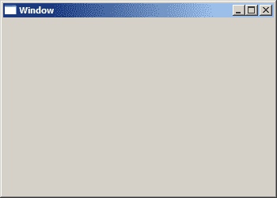

# Windows API 中的一个窗口

> 原文： [http://zetcode.com/gui/winapi/window/](http://zetcode.com/gui/winapi/window/)

窗口是应用显示输出并从用户接收输入的屏幕矩形区域。 一切都是 Windows 中的一个窗口。 至少从程序员的角度来看。 一个主窗口，一个按钮，一个静态文本甚至一个图标； 都是窗口。 静态文本只是窗口的一种特殊类型，桌面区域也是如此。

## `wWinMain()`函数

每个 Windows UI 应用必须至少具有两个函数：`WinMain`函数和窗口过程。`WinMain`函数是 Windows UI 应用的入口点。 它初始化应用，在屏幕上显示应用窗口，然后进入主循环。 在我们的示例中，我们使用`wWinMain()`函数原型，该原型用于创建 Unicode UI 程序。

```c
int WINAPI wWinMain(HINSTANCE hInstance, HINSTANCE hPrevInstance, 
    PWSTR pCmdLine, int nCmdShow);

```

`hInstance`是实例的句柄。 它是一个 32 位数字，用于标识我们在 OS 环境中的程序实例。 Windows 在程序开始执行时给出此数字。 `hPrevInstance`参数始终为`NULL`； 它是 16 位 Windows 的传统。 Windows 程序也可以从命令行启动。 给定的参数存储在`pCmdLine`参数中。 `nCmdShow`值指定窗口的显示方式：最小化，最大化或隐藏。

`wWinMain()`函数在收到`WM_QUIT`消息时终止。

## 注册窗口类

在创建窗口之前，我们必须在 Windows 中注册其类。 许多控件的窗口类已经注册。 因此，当我们创建按钮或静态文本时，我们不需要为其注册窗口类。 要注册窗口类，我们必须创建并填充`WNDCLASS`结构。 我们设置窗口样式，额外的分配字节，窗口类名称，程序实例的句柄，背景画笔，可选菜单名称，窗口过程，光标的句柄和图标。 然后调用`RegisterClassW()`函数。

## 创建一个窗口

通过调用`CreateWindowW()`函数创建窗口。

```c
HWND CreateWindowW(LPCWSTR lpClassName, LPCWSTR lpWindowName, 
  DWORD dwStyle, int x, int y, int nWidth, int nHeight, 
  HWND hWndParent, HMENU hMenu, HINSTANCE hInstance, LPVOID lpParam); 

```

`lpClassName`唯一标识窗口。 它是我们注册窗口的名称。 `lpWindowName`是窗口名称。 它的效果取决于上下文-它可以是父窗口中的窗口标题，也可以是子窗口中的标签（如按钮或静态文本）。 可以使用多种样式创建 Windows。 为此，我们有`dwStyle`参数。 `x`和`y`指定窗口的初始水平和垂直位置。 `nWidth`和`nHeight`指定窗口的宽度和高度。 `hWndParent`是父窗口的句柄。 对于没有父母的窗口，我们使用`NULL`。 对于父窗口，`hMenu`是菜单的可选句柄，对于子窗口，`hMenu`是控件标识符。 `hInstance`是程序实例的句柄。 `lpParam`是最后一个参数，它是在`WM_CREATE`消息期间传递到窗口的可选值。 `CreateWindowW()`函数将句柄返回到新创建的窗口。

## 消息内容

`WinMain()`函数创建一个消息循环。 在应用的生命周期中，这是一个无休止的循环。 消息循环是一种程序结构，它等待并分派程序中的事件或消息。 Windows 使用消息进行通信。消息是一个整数值，用于标识特定事件-单击按钮，调整窗口大小或关闭应用。 一次可以创建多个消息。 不能同时处理所有消息。 因此，它们存储在消息队列中。 消息进入消息队列并等待直到被处理。 `GetMessage()`函数从消息队列中检索消息。 `DispatchMessage()`函数将消息调度到窗口过程。 如果应用获得了字符输入，则在循环中包含`TranslateMessage()`函数。

## 窗口过程

```c
LRESULT CALLBACK WindowProc(HWND hwnd, UINT uMsg, WPARAM wParam, LPARAM lParam);

```

每个窗口都有一个关联的窗口过程。 它是接收消息的函数。 `hwnd`是要接收消息的窗口的句柄。 `uMsg`是消息。 `wParam`和`lParam`参数提供其他消息信息。 这些参数的值取决于消息类型。 消息来自用户或操作系统。 我们对消息做出反应，或者我们调用默认的窗口过程来提供默认的处理。 大多数消息发送到默认的窗口过程。 默认的窗口过程称为`DefWindowProcW()`。 使用与常规窗口过程相同的参数来调用它。

## 一个简单的窗口

以下示例显示了骨架 Windows 应用。

`simplewindow.c`

```c
#include <windows.h>

LRESULT CALLBACK WndProc(HWND, UINT, WPARAM, LPARAM);

int WINAPI wWinMain(HINSTANCE hInstance, HINSTANCE hPrevInstance, 
    PWSTR pCmdLine, int nCmdShow) {

    MSG  msg;    
    HWND hwnd;
    WNDCLASSW wc;

    wc.style         = CS_HREDRAW | CS_VREDRAW;
    wc.cbClsExtra    = 0;
    wc.cbWndExtra    = 0;
    wc.lpszClassName = L"Window";
    wc.hInstance     = hInstance;
    wc.hbrBackground = GetSysColorBrush(COLOR_3DFACE);
    wc.lpszMenuName  = NULL;
    wc.lpfnWndProc   = WndProc;
    wc.hCursor       = LoadCursor(NULL, IDC_ARROW);
    wc.hIcon         = LoadIcon(NULL, IDI_APPLICATION);

    RegisterClassW(&wc);
    hwnd = CreateWindowW(wc.lpszClassName, L"Window",
                WS_OVERLAPPEDWINDOW | WS_VISIBLE,
                100, 100, 350, 250, NULL, NULL, hInstance, NULL);  

    ShowWindow(hwnd, nCmdShow);
    UpdateWindow(hwnd);

    while (GetMessage(&msg, NULL, 0, 0)) {

        DispatchMessage(&msg);
    }

    return (int) msg.wParam;
}

LRESULT CALLBACK WndProc(HWND hwnd, UINT msg, 
    WPARAM wParam, LPARAM lParam) {

    switch(msg) {

      case WM_DESTROY:

          PostQuitMessage(0);
          break;
    }

    return DefWindowProcW(hwnd, msg, wParam, lParam);
}

```

我们将逐步解释示例代码。

```c
#include <windows.h>

```

这是 C 编程语言的头文件。 它包含 API 中的所有函数声明，所有公共宏和所有数据类型。 通过链接必要的库`kernel32.lib`，`user32.lib`和`gdi32.lib`并包含`<windows.h>`头文件，将 Windows API 添加到 C 编程项目中。

```c
wc.style = CS_HREDRAW | CS_VREDRAW;

```

我们在这里设置窗口样式。 `CS_HREDRAW`和`CS_VREDRAW`标志意味着只要对窗口的高度或宽度进行移动或大小调整，就会重新绘制整个窗口。

```c
wc.cbClsExtra    = 0;
wc.cbWndExtra    = 0;

```

在我们的示例中，我们不使用其他字节。 因此，我们将成员设置为零。 这两个属性最常见的用法是窗口子类化。

```c
wc.lpszClassName = L"Window";

```

Window 是此特定窗口类型的类名。 创建窗口时，我们将使用此类名称。 `L`字符在宽字符串之前。

```c
wc.hInstance = hInstance;

```

我们设置程序的实例。

```c
wc.hbrBackground = GetSysColorBrush(COLOR_3DFACE);

```

在这里，我们设置背景画笔。 它是用来绘制窗口客户区域的颜色。

```c
wc.lpszMenuName  = NULL;

```

在我们的示例中，我们不创建菜单。

```c
wc.lpfnWndProc = WndProc;

```

我们为窗口类提供了窗口过程。

```c
wc.hCursor = LoadCursor(NULL, IDC_ARROW);

```

我们为应用设置光标。 我们使用`LoadCursor()`函数从系统资源中加载光标。 `IDC_ARROW`是标准箭头光标的值。

```c
wc.hIcon   = LoadIcon(NULL, IDI_APPLICATION);

```

我们为应用设置图标。 使用`LoadIcon()`函数从系统资源中检索图标。 `IDI_APPLICATION`是默认应用图标的值。

```c
RegisterClassW(&wc);

```

我们向系统注册窗口类。

```c
ShowWindow(hwnd, nCmdShow);
UpdateWindow(hwnd);

```

这两行显示了屏幕上的窗口。 `nCmdShow`指定我们如何在屏幕上显示窗口。

```c
while (GetMessage(&msg, NULL, 0, 0)) {

  DispatchMessage(&msg);
}

```

这是消息循环。 我们使用`GetMessage()`函数从消息队列中接收消息，并使用`DispatchMessage()`函数将它们分发到窗口过程。

```c
return (int) msg.wParam;

```

在应用结束时，退出代码将返回到系统。

```c
switch(msg) {

  case WM_DESTROY:

    PostQuitMessage(0);
    break;
}

return DefWindowProcW(hwnd, msg, wParam, lParam);

```

在窗口过程中，我们对`WM_DESTROY`消息作出反应。 `PostQuitMessage()`将`WM_QUIT`消息发送到消息队列。 使用`DefWindowProcW()`函数将所有其他消息发送到默认处理。



图：窗口

在 Windows API 教程的这一部分中，我们创建了一个基本窗口。