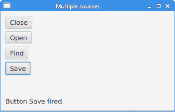
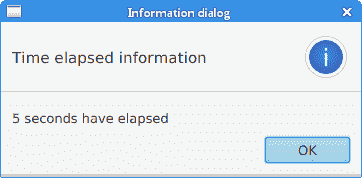
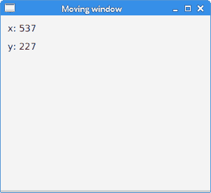

# JavaFX 事件

> 原文： [http://zetcode.com/gui/javafx/events/](http://zetcode.com/gui/javafx/events/)

GUI 应用是事件驱动的。 应用会对在其生命周期内生成的不同事件类型做出反应。 事件是由用户（单击鼠标），应用（计时器）或系统（时钟）生成的。

事件是有关更改的通知。 它将状态更改封装在事件源中。 应用中已注册的事件过滤器和事件处理程序将接收事件并提供响应。

JavaFX 中的每个事件都具有三个属性：

*   事件来源
*   事件目标
*   事件类型

事件源是状态更改的对象； 它产生事件。事件目标是事件的目的地。事件类型为相同`Event`类的事件提供了额外的分类。

事件源对象将处理事件的任务委托给事件处理程序。 当事件发生时，事件源创建一个事件对象，并将其发送到每个注册的处理程序。

## 事件处理程序

`EventHandler`处理特定类或类型的事件。 事件处理程序设置为事件源。 它具有`handle()`方法，在该方法中，我们将为响应生成的事件而调用的代码放入其中。

`EventHandlerEx.java`

```java
package com.zetcode;

import javafx.application.Application;
import javafx.application.Platform;
import javafx.event.ActionEvent;
import javafx.event.EventHandler;
import javafx.scene.Scene;
import javafx.scene.control.ContextMenu;
import javafx.scene.control.MenuItem;
import javafx.scene.input.MouseEvent;
import javafx.scene.layout.HBox;
import javafx.stage.Stage;

/**
 * ZetCode JavaFX tutorial
 *
 * This program uses two EventHandlers for
 * two different Events.
 *
 * Author: Jan Bodnar 
 * Website: zetcode.com 
 * Last modified: June 2015
 */

public class EventHandlerEx extends Application {

    @Override
    public void start(Stage stage) {

        initUI(stage);
    }

    private void initUI(Stage stage) {

        HBox root = new HBox();

        ContextMenu conMenu = new ContextMenu();
        MenuItem noopMi = new MenuItem("No op");
        MenuItem exitMi = new MenuItem("Exit");
        conMenu.getItems().addAll(noopMi, exitMi);

        exitMi.setOnAction(new EventHandler<ActionEvent>() {
            @Override
            public void handle(ActionEvent event) {
                Platform.exit();
            }
        });

        root.setOnMousePressed(new EventHandler<MouseEvent>() {
            @Override
            public void handle(MouseEvent event) {
                if (event.isSecondaryButtonDown()) {
                    conMenu.show(root, event.getScreenX(), 
                            event.getScreenY());
                }
            }
        });        

        Scene scene = new Scene(root, 300, 250);

        stage.setTitle("EventHandler");
        stage.setScene(scene);
        stage.show();
    }

    public static void main(String[] args) {
        launch(args);
    }
}

```

该示例将两个`EventHandlers`用于两个不同的`Events`。

```java
ContextMenu conMenu = new ContextMenu();

```

`ContextMenu`是一个包含菜单项列表的弹出控件。

```java
MenuItem noop = new MenuItem("No op");
MenuItem exit = new MenuItem("Exit");
conMenu.getItems().addAll(noop, exit);

```

将创建两个`MenuItems`并将其添加到上下文菜单。

```java
exitMi.setOnAction(new EventHandler<ActionEvent>() {
    @Override
    public void handle(ActionEvent event) {
        Platform.exit();
    }
});

```

使用`setOnAction()`方法，我们为`ActionEvent`设置了一个事件处理程序。 `EventHandler`的`handle()`方法以`Platform.exit()`方法退出应用。

```java
root.setOnMousePressed(new EventHandler<MouseEvent>() {
    @Override
    public void handle(MouseEvent event) {
        if (event.isSecondaryButtonDown()) {
            conMenu.show(root, event.getScreenX(), 
                    event.getScreenY());
        }
    }
});  

```

使用`setOnMousePressed()`方法，我们为`MouseEvent`设置了一个事件处理程序。 当我们单击第二个鼠标按钮（通常是右按钮）时，上下文菜单将显示在屏幕上。 它显示在鼠标单击的 x 和 y 坐标下方。

## 事件属性

以下程序探讨了`MouseEvent`的属性。 这是由于用户与鼠标交互而发生的事件。

`EventSourceEx.java`

```java
package com.zetcode;

import javafx.application.Application;
import javafx.event.EventHandler;
import javafx.scene.Scene;
import javafx.scene.input.MouseEvent;
import javafx.scene.layout.Pane;
import javafx.scene.shape.Rectangle;
import javafx.stage.Stage;

/**
 * ZetCode JavaFX tutorial
 *
 * This program explores the properties of 
 * an event.
 *
 * Author: Jan Bodnar 
 * Website: zetcode.com 
 * Last modified: June 2015
 */

public class EventSourceEx extends Application {

    @Override
    public void start(Stage stage) {

        initUI(stage);
    }

    private void initUI(Stage stage) {

        Pane root = new Pane();

        Rectangle rect = new Rectangle(30, 30, 80, 80);
        rect.setOnMouseClicked(new EventHandler<MouseEvent>() {

            @Override
            public void handle(MouseEvent e) {

                System.out.println(e.getSource());
                System.out.println(e.getTarget());
                System.out.println(e.getEventType());
                System.out.format("x:%f, y:%f%n", e.getSceneX(), e.getSceneY());
                System.out.format("x:%f, y:%f%n", e.getScreenX(), e.getScreenY());
            }
        });

        root.getChildren().addAll(rect);

        Scene scene = new Scene(root, 300, 250);

        stage.setTitle("Event properties");
        stage.setScene(scene);
        stage.show();
    }

    public static void main(String[] args) {
        launch(args);
    }
}

```

在示例中，我们有一个矩形。 我们将事件处理程序添加到鼠标单击的事件类型。

```java
rect.setOnMouseClicked(new EventHandler<MouseEvent>() {

    @Override
    public void handle(MouseEvent e) {

        ...
    }
});

```

`setOnMouseClicked()`将事件处理程序添加到鼠标单击的事件类型。 处理程序是一个匿名内部类。 当在矩形上检测到鼠标单击时，将调用其`handle()`方法。

```java
System.out.println(e.getSource());
System.out.println(e.getTarget());
System.out.println(e.getEventType());

```

这三个是通用属性，可用于所有事件。 `getSource()`方法返回最初发生事件的对象。 `getTarget()`方法返回此事件的事件目标。 在我们的例子中，事件源和事件目标是相同的-矩形。 `getEventType()`方法返回`MouseEvent`的事件类型。 在我们的情况下，它返回`MOUSE_CLICKED`值。

```java
System.out.format("x:%f, y:%f%n", e.getSceneX(), e.getSceneY());
System.out.format("x:%f, y:%f%n", e.getScreenX(), e.getScreenY());

```

这四个属性特定于此事件。 我们打印相对于场景和屏幕的鼠标单击的 x 和 y 坐标。

## Lambda 表达式

从 JDK 8 开始，可以使用 lambda 表达式替换匿名内部类。

```java
rect.setOnMouseClicked((MouseEvent e) -> {

    System.out.println(e.getSource());
    System.out.println(e.getTarget());
    System.out.println(e.getEventType());
    System.out.format("x:%f, y:%f%n", e.getSceneX(), e.getSceneY());
    System.out.format("x:%f, y:%f%n", e.getScreenX(), e.getScreenY());
});

```

这是使用 lambda 表达式重写的上一个示例中的事件处理代码。

## 通用处理程序

在下一个示例中，我们创建一个侦听所有类型事件的通用事件处理程序。

`GenericHandlerEx.java`

```java
package com.zetcode;

import javafx.application.Application;
import javafx.event.Event;
import javafx.event.EventHandler;
import javafx.event.EventType;
import javafx.scene.Scene;
import javafx.scene.control.Button;
import javafx.scene.layout.StackPane;
import javafx.stage.Stage;

/**
 * ZetCode JavaFX tutorial
 *
 * This program adds a generic event 
 * handler to a button control.
 *
 * Author: Jan Bodnar 
 * Website: zetcode.com 
 * Last modified: June 2015
 */

public class GenericHandlerEx extends Application {

    @Override
    public void start(Stage stage) {

        initUI(stage);
    }

    private void initUI(Stage stage) {

        StackPane root = new StackPane();

        Button btn = new Button("Button");
        btn.addEventHandler(EventType.ROOT, new GenericHandler());

        root.getChildren().add(btn);

        Scene scene = new Scene(root, 300, 250);

        stage.setTitle("Generic handler");
        stage.setScene(scene);
        stage.show();
    }

    public static void main(String[] args) {
        launch(args);
    }

    private class GenericHandler implements EventHandler<Event> {

        @Override
        public void handle(Event event) {
            System.out.println(event.getEventType());
        }
    }
}

```

本示例具有一个按钮控件。 通用处理程序已插入按钮。

```java
Button btn = new Button("Button");
btn.addEventHandler(EventType.ROOT, new GenericHandler());

```

`addEventHandler()`方法将事件处理程序注册到指定事件类型的按钮节点。 `EventType.ROOT`代表所有事件类型。

```java
private class GenericHandler implements EventHandler<Event> {

    @Override
    public void handle(Event event) {
        System.out.println(event.getEventType());
    }
}

```

处理程序使用其`handle()`方法将事件类型打印到控制台。

## 多种来源

可以将单个事件处理程序添加到多个源。 可以使用`getSource()`方法确定事件的来源。

`MultipleSourcesEx.java`

```java
package com.zetcode;

import javafx.application.Application;
import javafx.event.ActionEvent;
import javafx.event.EventHandler;
import javafx.scene.Scene;
import javafx.scene.control.Button;
import javafx.scene.control.Label;
import javafx.scene.layout.AnchorPane;
import javafx.scene.layout.VBox;
import javafx.stage.Stage;

/**
 * ZetCode JavaFX tutorial
 *
 * This program plugs an EventHandler to multiple
 * controls.
 *
 * Author: Jan Bodnar 
 * Website: zetcode.com 
 * Last modified: June 2015
 */

public class MultipleSourcesEx extends Application {

    private Label lbl;

    @Override
    public void start(Stage stage) {

        initUI(stage);
    }

    private void initUI(Stage stage) {

        AnchorPane root = new AnchorPane();

        VBox vbox = new VBox(5);

        Button btn1 = new Button("Close");
        Button btn2 = new Button("Open");
        Button btn3 = new Button("Find");
        Button btn4 = new Button("Save");

        MyButtonHandler mbh = new MyButtonHandler();

        btn1.setOnAction(mbh);
        btn2.setOnAction(mbh);
        btn3.setOnAction(mbh);
        btn4.setOnAction(mbh);

        vbox.getChildren().addAll(btn1, btn2, btn3, btn4);

        lbl = new Label("Ready");

        AnchorPane.setTopAnchor(vbox, 10d);
        AnchorPane.setLeftAnchor(vbox, 10d);
        AnchorPane.setBottomAnchor(lbl, 10d);
        AnchorPane.setLeftAnchor(lbl, 10d);

        root.getChildren().addAll(vbox, lbl);

        Scene scene = new Scene(root, 350, 200);

        stage.setTitle("Multiple sources");
        stage.setScene(scene);
        stage.show();
    }

    private class MyButtonHandler implements EventHandler<ActionEvent> {

        @Override
        public void handle(ActionEvent event) {

            Button btn = (Button) event.getSource();
            lbl.setText(String.format("Button %s fired", btn.getText()));
        }
    }

    public static void main(String[] args) {
        launch(args);
    }
}

```

该示例有四个按钮和一个标签。 一个事件处理程序将添加到所有四个按钮。 触发按钮的名称显示在标签中。

```java
Button btn1 = new Button("Close");
Button btn2 = new Button("Open");
Button btn3 = new Button("Find");
Button btn4 = new Button("Save");

```

这四个按钮将共享一个事件处理程序。

```java
MyButtonHandler mbh = new MyButtonHandler();

```

创建一个`MyButtonHandler`的实例。 它作为内部命名类实现。

```java
btn1.setOnAction(mbh);
btn2.setOnAction(mbh);
btn3.setOnAction(mbh);
btn4.setOnAction(mbh);

```

使用`setOnAction()`方法将处理程序添加到四个不同的按钮。

```java
private class MyButtonHandler implements EventHandler<ActionEvent> {

    @Override
    public void handle(ActionEvent event) {

        Button btn = (Button) event.getSource();
        lbl.setText(String.format("Button %s fired", btn.getText()));
    }
}

```

在`MyButtonHandler`的`handle()`方法内部，我们确定事件的来源并使用来源的文本标签构建消息。 该消息通过`setText()`方法设置为标签控件。



Figure: Multiple sources

## `java.util.Timer`

`java.util.Timer`计划任务以供将来在后台线程中执行。 `TimerTask`是可以计划为一次性执行或由计时器重复执行的任务。

`TimerEx.java`

```java
package com.zetcode;

import java.util.Timer;
import java.util.TimerTask;
import javafx.application.Application;
import javafx.application.Platform;
import javafx.geometry.Insets;
import javafx.scene.Scene;
import javafx.scene.control.Alert;
import javafx.scene.control.Button;
import javafx.scene.control.Spinner;
import javafx.scene.layout.HBox;
import javafx.stage.Stage;

/**
 * ZetCode JavaFX tutorial
 *
 * This program uses a java.util.Timer to 
 * schedule a task.
 *
 * Author: Jan Bodnar
 * Website: zetcode.com
 * Last modified: June 2015
 */

public class TimerEx extends Application {

    int delay = 0;

    @Override
    public void start(Stage stage) {

        initUI(stage);
    }

    private void initUI(Stage stage) {

        HBox root = new HBox(10);
        root.setPadding(new Insets(10));

        Timer timer = new java.util.Timer();

        Spinner spinner = new Spinner(1, 60, 5);
        spinner.setPrefWidth(80);        

        Button btn = new Button("Show message");
        btn.setOnAction(event -> {

            delay = (int) spinner.getValue();
            timer.schedule(new MyTimerTask(), delay*1000);
        });

        root.getChildren().addAll(btn, spinner);

        stage.setOnCloseRequest(event -> {
            timer.cancel();
        });

        Scene scene = new Scene(root);

        stage.setTitle("Timer");
        stage.setScene(scene);
        stage.show();
    }

    private class MyTimerTask extends TimerTask {

        @Override
        public void run() {

            Platform.runLater(() -> {
                Alert alert = new Alert(Alert.AlertType.INFORMATION);
                alert.setTitle("Information dialog");
                alert.setHeaderText("Time elapsed information");

                String contxt;

                if (delay == 1) {
                    contxt = "1 second has elapsed";
                } else {
                    contxt = String.format("%d seconds have elapsed", 
                            delay);
                }

                alert.setContentText(contxt);
                alert.showAndWait();
            });
        }
    }

    public static void main(String[] args) {
        launch(args);
    }
}

```

该示例有两个控件：一个按钮和一个微调器。 该按钮将启动计时器，延迟后将显示一个消息对话框。 延迟由微调控件选择。

```java
Timer timer = new java.util.Timer();

```

创建`java.util.Timer`的实例。

```java
Spinner spinner = new Spinner(1, 60, 5);

```

`Spinner`控件用于选择延迟量。 它的参数是最小值，最大值和当前值。 该值以毫秒为单位。

```java
btn.setOnAction(event -> {

    delay = (int) spinner.getValue();
    timer.schedule(new MyTimerTask(), delay*1000);
});

```

在按钮的事件处理程序中，我们使用`getValue()`方法获取微调框的当前值，并使用计时器的`schedule()`方法安排任务。

```java
stage.setOnCloseRequest(event -> {
    timer.cancel();
});

```

当使用计时器的`cancel()`方法终止应用时，我们将取消计时器。

```java
private class MyTimerTask extends TimerTask {

    @Override
    public void run() {

        Platform.runLater(() -> {
            Alert alert = new Alert(Alert.AlertType.INFORMATION);
            alert.setTitle("Information dialog");
            alert.setHeaderText("Time elapsed information");

            String contxt;

            if (delay == 1) {
                contxt = "1 second has elapsed";
            } else {
                contxt = String.format("%d seconds have elapsed", 
                        delay);
            }

            alert.setContentText(contxt);
            alert.showAndWait();
        });
    }
}

```

`runLater()`方法在 JavaFX 应用线程上执行任务。 我们显示一个消息对话框，通知您经过的时间。



Figure: Time elapsed

## 移动窗口

以下示例显示了应用窗口在屏幕上的位置。

`MovingWindowEx.java`

```java
package com.zetcode;

import javafx.application.Application;
import javafx.beans.value.ChangeListener;
import javafx.beans.value.ObservableValue;
import javafx.geometry.Insets;
import javafx.scene.Scene;
import javafx.scene.control.Label;
import javafx.scene.layout.VBox;
import javafx.stage.Stage;

/**
 * ZetCode JavaFX tutorial
 *
 * This program shows the screen coordinates
 * of the application window in two labels.
 *
 * Author: Jan Bodnar 
 * Website: zetcode.com 
 * Last modified: June 2015
 */

public class MovingWindowEx extends Application {

    int x = 0;
    int y = 0;
    Label lblx;
    Label lbly;

    @Override
    public void start(Stage stage) {

        initUI(stage);
    }

    private void initUI(Stage stage) {

        VBox root = new VBox(10);
        root.setPadding(new Insets(10));

        String txt1 = String.format("x: %d", x);
        lblx = new Label(txt1);

        String txt2 = String.format("y: %d", y);
        lbly = new Label(txt2);        

        root.getChildren().addAll(lblx, lbly);

        stage.xProperty().addListener(new ChangeListener<Number>() {

            @Override
            public void changed(ObservableValue<? extends Number> observable, 
                    Number oldValue, Number newValue) {

                doChange(newValue);
            }

            private void doChange(Number newValue) {

                x = newValue.intValue();
                updateXLabel();                
            }

        });

        stage.yProperty().addListener(new ChangeListener<Number>() {

            @Override
            public void changed(ObservableValue<? extends Number> observable, 
                    Number oldValue, Number newValue) {

                doChange(newValue);
            }

            private void doChange(Number newValue) {

                y = newValue.intValue();
                updateYLabel();                
            }

        });        

        Scene scene = new Scene(root, 300, 250);

        stage.setTitle("Moving window");
        stage.setScene(scene);
        stage.show();
    }

    private void updateXLabel() {

        String txt = String.format("x: %d", x);
        lblx.setText(txt);
    }

    private void updateYLabel() {

        String txt = String.format("y: %d", y);
        lbly.setText(txt);        
    }

    public static void main(String[] args) {
        launch(args);
    }
}

```

该示例显示了两个标签控件中的当前窗口坐标。 为了获得窗口位置，我们监听舞台的`xProperty`和`yProperty`的变化。

```java
String txt1 = String.format("x: %d", x);
lblx = new Label(txt1);

String txt2 = String.format("y: %d", y);
lbly = new Label(txt2);  

```

这两个标签显示了应用窗口左上角的 x 和 y 坐标。

```java
stage.xProperty().addListener(new ChangeListener<Number>() {

    @Override
    public void changed(ObservableValue<? extends Number> observable, 
            Number oldValue, Number newValue) {

        doChange(newValue);
    }

    private void doChange(Number newValue) {

        x = newValue.intValue();
        updateXLabel();                
    }

});

```

`xProperty`将舞台的水平位置存储在屏幕上。 我们添加一个`ChangeListener`来监听属性的更改。 每次修改属性时，我们都会检索新值并更新标签。



Figure: Moving a window

JavaFX 教程的这一部分专门讨论 JavaFX 事件。