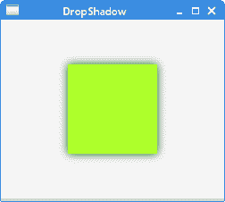
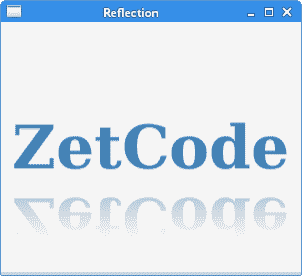
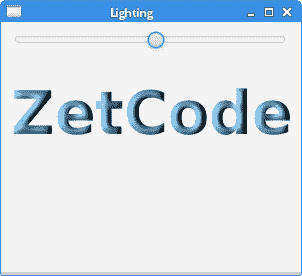
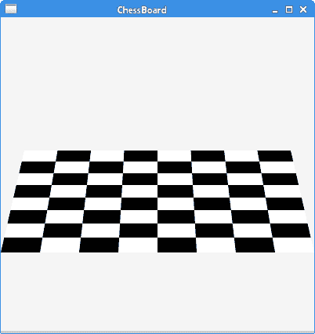
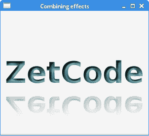

# JavaFX 效果

> 原文： [http://zetcode.com/gui/javafx/effects/](http://zetcode.com/gui/javafx/effects/)

JavaFX 包含`javafx.scene.effect`包，该包具有执行各种视觉效果的一组或类。 在本章中，我们创建`DropShadow`，`Reflection`，`Lighting`，`GaussianBlur`，`SepiaTone`和`PerspectiveTransform`效果。 我们还将展示如何组合多种效果。

通过`setEffect()`方法将效果应用于节点的`effectProperty`。

## 阴影

`DropShadow`是一种高级效果，可使用指定的颜色，半径和偏移量在内容后面渲染阴影。

`DropShadowEx.java`

```java
package com.zetcod;

import javafx.application.Application;
import javafx.scene.Scene;
import javafx.scene.effect.DropShadow;
import javafx.scene.layout.StackPane;
import javafx.scene.paint.Color;
import javafx.scene.shape.Rectangle;
import javafx.stage.Stage;

/**
 * ZetCode JavaFX tutorial
 *
 * This program applies a DropShadow effect
 * on a Rectangle.
 *
 * Author: Jan Bodnar
 * Website: zetcode.com
 * Last modified: June 2015
 */

public class DropShadowEx extends Application {

    @Override
    public void start(Stage stage) {

        initUI(stage);
    }

    private void initUI(Stage stage) {

        StackPane root = new StackPane();

        Rectangle rect = new Rectangle(0, 0, 100, 100);
        rect.setFill(Color.GREENYELLOW);

        DropShadow ds = new DropShadow(15, Color.DARKGREEN);

        rect.setEffect(ds);

        root.getChildren().add(rect);

        Scene scene = new Scene(root, 250, 200, Color.WHITESMOKE);

        stage.setTitle("DropShadow");
        stage.setScene(scene);
        stage.show();
    }

    public static void main(String[] args) {
        launch(args);
    }
}

```

该示例在矩形周围创建阴影。

```java
Rectangle rect = new Rectangle(0, 0, 100, 100);
rect.setFill(Color.GREENYELLOW);

```

构造一个绿色黄色矩形。

```java
DropShadow ds = new DropShadow(15, Color.DARKGREEN);

```

创建`DropShadow`效果。 构造器接受半径和颜色。

```java
rect.setEffect(ds);

```

通过`setEffect()`方法应用效果。



图：`DropShadow`

## 反射

`Reflection`是一种将输入的反射版本呈现在实际输入内容之下的效果。

`ReflectionEx.java`

```java
package com.zetcode;

import javafx.application.Application;
import javafx.scene.Scene;
import javafx.scene.effect.Reflection;
import javafx.scene.layout.StackPane;
import javafx.scene.paint.Color;
import javafx.scene.text.Font;
import javafx.scene.text.FontWeight;
import javafx.scene.text.Text;
import javafx.stage.Stage;

/**
 * ZetCode JavaFX tutorial
 *
 * This program applies a Reflection effect
 * on a Text node.
 *
 * Author: Jan Bodnar
 * Website: zetcode.com
 * Last modified: June 2015
 */

public class ReflectionEx extends Application {

    @Override
    public void start(Stage stage) {

        initUI(stage);
    }

    private void initUI(Stage stage) {

        StackPane root = new StackPane();

        Text text = new Text();
        text.setText("ZetCode");
        text.setFill(Color.STEELBLUE);
        text.setFont(Font.font("Serif", FontWeight.BOLD, 60));

        Reflection ref = new Reflection();
        text.setEffect(ref);

        root.getChildren().add(text);        

        Scene scene = new Scene(root, 300, 250, Color.WHITESMOKE);

        stage.setTitle("Reflection");
        stage.setScene(scene);
        stage.show();
    }

    public static void main(String[] args) {
        launch(args);
    }
}

```

本示例在`Text`节点上应用`Reflection`效果。

```java
Text text = new Text();
text.setText("ZetCode");
text.setFill(Color.STEELBLUE);
text.setFont(Font.font("Serif", FontWeight.BOLD, 60));

```

创建一个`Text`控件。 它的油漆是`STEELBLUE`。 字体变为粗体和放大。

```java
Reflection ref = new Reflection();
text.setEffect(ref);

```

将创建默认的`Reflection`并将其应用于文本控件。



图：反射

## 灯光

`Lighting`模拟照在给定内容上的光源，该光源可用于为平面对象提供更逼真的三维外观。 `Light`源的`setAzimuth()`方法设置方位角-光源的方向角。

`LightingEx.java`

```java
package com.zetcode;

import javafx.application.Application;
import javafx.beans.property.DoubleProperty;
import javafx.beans.property.SimpleDoubleProperty;
import javafx.geometry.Insets;
import javafx.scene.Scene;
import javafx.scene.control.Slider;
import javafx.scene.effect.Light;
import javafx.scene.effect.Lighting;
import javafx.scene.layout.VBox;
import javafx.scene.paint.Color;
import javafx.scene.text.Font;
import javafx.scene.text.FontWeight;
import javafx.scene.text.Text;
import javafx.stage.Stage;

/**
 * ZetCode JavaFX tutorial
 *
 * This program applies a Lighting effect on 
 * a Text control. The azimuth of the light is 
 * controlled by a Slider.
 *
 * Author: Jan Bodnar
 * Website: zetcode.com
 * Last modified: June 2015
 */

public class LightingEx extends Application {

    @Override
    public void start(Stage stage) {

        initUI(stage);
    }

    private void initUI(Stage stage) {

        VBox root = new VBox(30);
        root.setPadding(new Insets(10));

        DoubleProperty azimuth = new SimpleDoubleProperty(0);        

        Light.Distant light = new Light.Distant();
        light.setAzimuth(0);

        Lighting lighting = new Lighting(light);
        lighting.setSurfaceScale(5.0);

        Text text = new Text();
        text.setText("ZetCode");
        text.setFill(Color.LIGHTSKYBLUE);
        text.setFont(Font.font(null, FontWeight.BOLD, 60));

        Slider slider = new Slider(1, 360, 0);
        azimuth.bind(slider.valueProperty());        

        slider.valueProperty().addListener(event -> {
            light.setAzimuth(azimuth.get());
            lighting.setLight(light);
            text.setEffect(lighting);
        });        

        text.setEffect(lighting);

        root.getChildren().addAll(slider, text);

        Scene scene = new Scene(root, 300, 250, Color.WHITESMOKE);

        stage.setTitle("Lighting");
        stage.setScene(scene);
        stage.show();
    }

    public static void main(String[] args) {
        launch(args);
    }
}

```

本示例对`Text`控件应用`Lighting`效果。 光的方位角由`Slider`控制。

```java
Light.Distant light = new Light.Distant();
light.setAzimuth(0);

```

创建一个`Light`源。

```java
Lighting lighting = new Lighting(light);

```

该行使用指定的光源创建`Lighting`的新实例。

```java
Text text = new Text();
text.setText("ZetCode");
text.setFill(Color.LIGHTSKYBLUE);
text.setFont(Font.font(null, FontWeight.BOLD, 60));

```

这是在其上设置了`Lighting`效果的`Text`控件。

```java
Slider slider = new Slider(1, 360, 0);
azimuth.bind(slider.valueProperty());        

slider.valueProperty().addListener(event -> {
    light.setAzimuth(azimuth.get());
    lighting.setLight(light);
    text.setEffect(lighting);
});  

```

`Slider`控件管理光源的方位角。



图：`Lighting`

## 高斯模糊

`GaussianBlur`是使用具有可配置半径的高斯卷积核的模糊效果。

`GaussianBlurEx.java`

```java
package com.zetcode;

import javafx.application.Application;
import static javafx.application.Application.launch;
import javafx.beans.property.DoubleProperty;
import javafx.beans.property.SimpleDoubleProperty;
import javafx.geometry.Insets;
import javafx.scene.Scene;
import javafx.scene.control.Slider;
import javafx.scene.effect.GaussianBlur;
import javafx.scene.layout.VBox;
import javafx.scene.paint.Color;
import javafx.scene.text.Font;
import javafx.scene.text.Text;
import javafx.stage.Stage;

/**
 * ZetCode JavaFX tutorial
 *
 * This program applies a GaussianBlur effect on 
 * a Text control. The radius of the blur is 
 * controlled by a Slider.
 *
 * Author: Jan Bodnar
 * Website: zetcode.com
 * Last modified: June 2015
 */

public class GaussianBlurEx extends Application {

    @Override
    public void start(Stage stage) {

        initUI(stage);
    }

    private void initUI(Stage stage) {

        VBox root = new VBox(30);
        root.setPadding(new Insets(10));

        DoubleProperty radius = new SimpleDoubleProperty(0);

        Text blurredText = new Text("Inception");
        blurredText.setFont(Font.font(38));        

        Slider slider = new Slider(1, 20, 1);
        radius.bind(slider.valueProperty());        

        slider.valueProperty().addListener(event -> {
            blurredText.setEffect(new GaussianBlur(radius.get()));
        });

        root.getChildren().addAll(slider, blurredText);

        Scene scene = new Scene(root, 300, 250, Color.WHITESMOKE);

        stage.setTitle("Blur effect");
        stage.setScene(scene);
        stage.show();
    }

    public static void main(String[] args) {
        launch(args);
    }
}

```

本示例对`Text`控件应用`GaussianBlur`效果。 模糊的半径由`Slider`控制。

```java
Text blurredText = new Text("Inception");
blurredText.setFont(Font.font(38)); 

```

模糊效果将应用于此文本控件。

```java
Slider slider = new Slider(1, 20, 1);
radius.bind(slider.valueProperty());        

slider.valueProperty().addListener(event -> {
    blurredText.setEffect(new GaussianBlur(radius.get()));
});

```

`Slider`控件管理`GaussianBlur`效果的`radius`属性。


图：`GaussianBlur`

## 棕褐色调

`SepiaTone`是产生棕褐色调效果的滤镜，类似于古董照片。

`SepiaToneEx.java`

```java
package com.zetcode;

import javafx.application.Application;
import javafx.beans.binding.Bindings;
import javafx.scene.CacheHint;
import javafx.scene.Scene;
import javafx.scene.effect.ColorAdjust;
import javafx.scene.effect.Effect;
import javafx.scene.effect.SepiaTone;
import javafx.scene.image.Image;
import javafx.scene.image.ImageView;
import javafx.scene.layout.StackPane;
import javafx.scene.paint.Color;
import javafx.stage.Stage;

/**
 * ZetCode JavaFX tutorial
 *
 * This program applies a SepiaTone effect
 * on an Image when a mouse pointer is over
 * the image.
 *
 * Author: Jan Bodnar
 * Website: zetcode.com
 * Last modified: June 2015
 */

public class SepiaToneEx extends Application {

    @Override
    public void start(Stage stage) {

        initUI(stage);
    }

    private void initUI(Stage stage) {

        StackPane root = new StackPane();

        Image image = new Image("file:mushroom.png");

        ImageView iw = new ImageView(image);

        SepiaTone sepia = new SepiaTone();
        iw.effectProperty().bind(
                Bindings
                    .when(iw.hoverProperty())
                        .then((Effect) sepia)
                        .otherwise((Effect) null)
        );

        iw.setCache(true);
        iw.setCacheHint(CacheHint.SPEED);  

        root.getChildren().add(iw);

        Scene scene = new Scene(root);

        stage.setTitle("SepiaTone");
        scene.setFill(Color.WHITESMOKE);
        stage.setScene(scene);
        stage.show();
    }

    public static void main(String[] args) {
        launch(args);
    }
}

```

当鼠标指针悬停在图像上时，该示例在`Image`上应用`SepiaTone`效果。

```java
Image image = new Image("file:mushroom.png");
ImageView iw = new ImageView(image);

```

我们从磁盘加载`Image`并创建一个`ImageView`控件。

```java
SepiaTone sepia = new SepiaTone();
iw.effectProperty().bind(
        Bindings
            .when(iw.hoverProperty())
                .then((Effect) sepia)
                .otherwise((Effect) null)
);

```

当鼠标指针位于`ImageView`控件的边界上时，将设置`SepiaTone`效果。

```java
iw.setCache(true);
iw.setCacheHint(CacheHint.SPEED);  

```

出于性能原因，将缓存节点渲染。

## 透视变换

`PerspectiveTransform`提供输入内容的非仿射变换。 它通常用于在二维内容上创建三维效果。

`PerspectiveEx.java`

```java
package com.zetcode;

import javafx.application.Application;
import javafx.scene.Scene;
import javafx.scene.effect.PerspectiveTransform;
import javafx.scene.layout.Pane;
import javafx.scene.layout.StackPane;
import javafx.scene.paint.Color;
import javafx.scene.shape.Rectangle;
import javafx.stage.Stage;

/**
 * ZetCode JavaFX tutorial
 *
 * This program creates a chessboard 
 * with a PerspectiveTransform effect.
 *
 * Author: Jan Bodnar
 * Website: zetcode.com
 * Last modified: June 2015
 */

public class PerspectiveEx extends Application {

    private final int SIZE = 50;

    @Override
    public void start(Stage stage) {

        initUI(stage);
    }

    private void initUI(Stage stage) {

        StackPane root = new StackPane();

        Pane board = new Pane();

        for (int row = 0; row < 8; row++) {
            for (int col = 0; col < 8; col++) {

                Rectangle r = new Rectangle(col * SIZE, row*SIZE, 
                        SIZE, SIZE);

                if ((col+row) % 2 == 0) {
                    r.setFill(Color.WHITE);
                } else {
                    r.setFill(Color.BLACK);
                }

                board.getChildren().add(r);
            }
        }

        PerspectiveTransform e = new PerspectiveTransform();
        e.setUlx(30);     // Upper-left point
        e.setUly(170);
        e.setUrx(370);    // Upper-right point
        e.setUry(170);
        e.setLlx(0);      // Lower-left point
        e.setLly(300); 
        e.setLrx(400);    // Lower-right point
        e.setLry(300);
        board.setEffect(e);

        root.getChildren().add(board);

        Scene scene = new Scene(root, Color.WHITESMOKE);

        stage.setTitle("ChessBoard");
        stage.setScene(scene);
        stage.show();
    }

    public static void main(String[] args) {
        launch(args);
    }
}

```

该示例形成具有`PerspectiveTransform`效果的棋盘。

```java
for (int row = 0; row < 8; row++) {
    for (int col = 0; col < 8; col++) {

        Rectangle r = new Rectangle(col * SIZE, row*SIZE, 
                SIZE, SIZE);

        if ((col+row) % 2 == 0) {
            r.setFill(Color.WHITE);
        } else {
            r.setFill(Color.BLACK);
        }

        board.getChildren().add(r);
    }
}

```

此代码产生 64 个矩形。 矩形具有黑色和白色。

```java
PerspectiveTransform e = new PerspectiveTransform();
e.setUlx(30);     // Upper-left point
e.setUly(170);
e.setUrx(370);    // Upper-right point
e.setUry(170);
e.setLlx(0);      // Lower-left point
e.setLly(300); 
e.setLrx(400);    // Lower-right point
e.setLry(300);
board.setEffect(e);

```

实例化一个`PerspectiveTransform`并将其应用于该节点。 我们提供四个角点的 x 和 y 坐标。 这些点形成一个矩形，在其中渲染效果。



图：`Chessboard`

## 组合效果

可以组合效果。 如果已经设置了一种效果，则`setEffect()`方法将替换一种效果。 为了组合多种效果，我们使用`Effect`的`setInput()`方法。

`CombiningEffectsEx.java`

```java
package com.zetcode;

import javafx.application.Application;
import javafx.scene.Scene;
import javafx.scene.effect.Light;
import javafx.scene.effect.Lighting;
import javafx.scene.effect.Reflection;
import javafx.scene.layout.StackPane;
import javafx.scene.paint.Color;
import javafx.scene.text.Font;
import javafx.scene.text.FontWeight;
import javafx.scene.text.Text;
import javafx.stage.Stage;

/**
 * ZetCode JavaFX tutorial
 *
 * This program combines a Reflection effect 
 * with a Lighting effect on a Text node.
 *
 * Author: Jan Bodnar
 * Website: zetcode.com
 * Last modified: June 2015
 */

public class CombiningEffectsEx extends Application {

    @Override
    public void start(Stage stage) {

        initUI(stage);
    }

    private void initUI(Stage stage) {

        StackPane root = new StackPane();

        Light.Distant light = new Light.Distant();
        light.setAzimuth(50);

        Lighting lighting = new Lighting();
        lighting.setLight(light);
        lighting.setSurfaceScale(5);

        Text text = new Text();
        text.setText("ZetCode");
        text.setFill(Color.CADETBLUE);
        text.setFont(Font.font(null, FontWeight.BOLD, 60));

        Reflection ref = new Reflection();
        ref.setInput(lighting);
        text.setEffect(ref);

        root.getChildren().add(text);

        Scene scene = new Scene(root, 300, 250, Color.WHITESMOKE);

        stage.setTitle("Combining effects");
        stage.setScene(scene);
        stage.show();
    }

    public static void main(String[] args) {
        launch(args);
    }
}

```

该示例程序在`Text`节点上结合了`Reflection`效果和`Lighting`效果。

```java
Light.Distant light = new Light.Distant();
light.setAzimuth(50);

Lighting lighting = new Lighting();
lighting.setLight(light);
lighting.setSurfaceScale(5.0);

```

这些行创建`Lighting`效果。

```java
Text text = new Text();
text.setText("ZetCode");
text.setFill(Color.CADETBLUE);
text.setFont(Font.font(null, FontWeight.BOLD, 60));

```

创建一个`Text`控件。 字体是放大和粗体。 文本的颜色是`CADETBLUE`。

```java
Reflection ref = new Reflection();
ref.setInput(lighting);

```

构造了`Reflection`效果。 使用`setInput()`方法将其与照明效果结合在一起。

```java
text.setEffect(ref);

```

效果的最终组合通过`setEffect()`方法应用于节点。



图：组合效果

在本章中，我们创建了几种视觉效果。